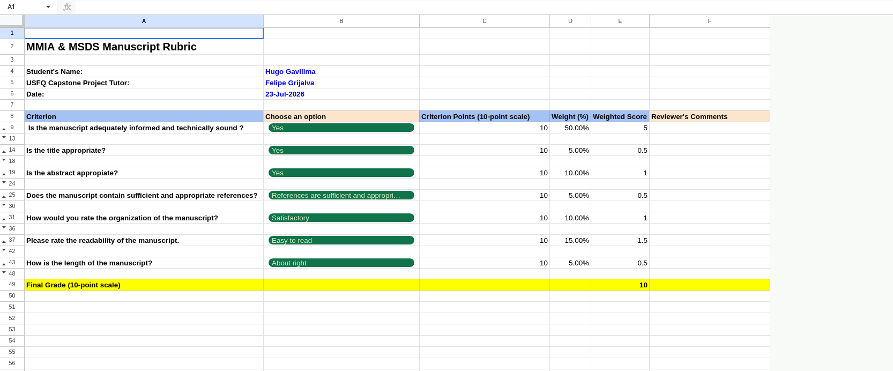

El título de tu proyecto de overleaf debe seguir el formato Banner ID - Nombre Completo - Título de tu trabajo de titulación. Si el título es demasiado extenso, pueden colocar un título reducido.
Por ejemplo

00344276 - Pablo Daniel Arias Marín - Hybrid Graph Neural Network Architecture for Accelerated Hydrogen Catalyst Discovery

Recomendaciones para el abstract
https://www.linkedin.com/posts/md-rashad_i-highly-recommend-this-to-phd-students-and-share-7376365084274601984-kJww/?utm_source=share&utm_medium=member_ios&rcm=ACoAAAcCyEwBq5mjDo0jyrsKwk5F40ztlSCtv8s

1. **Introducción (Introduction):** Contexto del problema, motivas (por qué? para qué?). El último párrafo normalmente resume el objetivo general de su proyecto.
2. **Estado del arte (Prior works):** Buscar trabajos parecidos en google scholar. Trata de resaltar por qué tu trabajo es diferente de los anteriores. Usar referencias en formato IEEE.
3. **Theoretical Background (marco teórico, opcional):** no 50 páginas!!!!!!!!!! resumido, muy resumido. No cosas obvias ni generales (no mencionen x ej qué es kfold cv, ). Asuman que la audiencia son personas técnicas conocedoras de IA, DS.
4. **Materiales y Metodología (Materials and Methods):** Hacer un `diagrama de bloques` que nace del pipeline. En el diagrama no debe estar kfold-cv. La idea de la metodología es transmitir cómo reproducir tus experimentos. No se menciona código fuente (`agnóstico del código)`. Describir el dataset (EDA, distribución, ejemplos). Describes los experimentos que hiciste. Experimental Setup: hiperparámetros fijos, hiperparámetros variables (los optimizados), configuraciones de los clasificadores / clusterizadores / modelos, kfold, división de datos, métricas usadas.  Eventualmente mencionan el framework de ML usado (e.g, pytorch 1.8, etc.) y el hardware donde ejecutaron (e.g., A100 de 80 gb). Al final de la metodología, reporten el link a github de su repo.
5. **Resultados y Discusión (Results and Discussion):** Aquí pones figuras, tablas etc.. y discutes tus observaciones. Realizar un análisis.
6. **Conclusiones:** principales hallazgos
7. **Referencias** IEEE (bibtex)

bibliografia en bibtex
https://www.overleaf.com/learn/latex/Bibliography_management_with_bibtex

Se recomienda usar generadores de tablas
https://www.tablesgenerator.com/

### Sobre las Imágenes

Se prefiere formatos vectoriales como EPS (soportado por latex), PDF (soportado por latex) o SVG (no soportado por latex) para figuras como plots, diagramas de bloque. Nunca exportes este tipo de figuras como JPG.

Para fotografías, utilizar formato PNG a 600 DPI de calidad.

Software para gráficos vectoriales:

1. Dia Diagram Editor http://dia-installer.de (free)
2. Plataformas Online como Miro  https://miro.com/  o similares. Con el correo institucional de la usfq puedes solicitar una licencia de Miro.

Herramienta para generar gráficos de arquitecturas de redes neuronales
https://github.com/alexlenail/NN-SVG

ejemplo de paper de machine learning:
https://www.overleaf.com/project/615cf23bbb378264399dbdd6

rubrica de evealuacion
