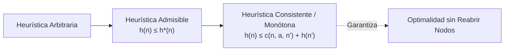
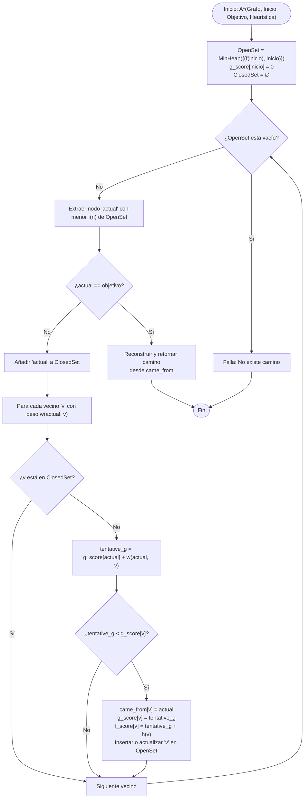

# Algoritmo de Búsqueda A* (A-Star)

El algoritmo **A\*** (Hart, Nilsson & Raphael, 1968) es uno de los algoritmos de búsqueda heurística e informada más eficientes y ampliamente utilizados para resolver el problema del camino más corto (*Shortest Path Problem*) sobre grafos ponderados dirigidos o no dirigidos.

Extiende y optimiza el [[Algoritmo Dijkstra]] incorporando una función heurística que guía la exploración hacia el nodo objetivo, reduciendo drásticamente el espacio de búsqueda evaluado.

---

## 1. Definición Formal y Función de Evaluación

Dado un grafo ponderado $G = (V, E)$ con una función de costos en las aristas $c: E \to \mathbb{R}^+$, un nodo origen $s \in V$ y un conjunto de nodos objetivo $T \subseteq V$, el algoritmo evalúa cada nodo $n \in V$ mediante una función de prioridad $f(n)$:

$$f(n) = g(n) + h(n)$$

Donde:
* **$g(n)$ (Costo Real Acumulado):** Costo exacto del camino mínimo conocido desde el nodo inicial $s$ hasta el nodo actual $n$:
  $$g(n) = \min_{\pi \in \Pi(s, n)} \sum_{e \in \pi} c(e)$$
* **$h(n)$ (Función Heurística):** Estimación arbitraria o matemática del costo mínimo restante desde el nodo actual $n$ hasta el objetivo $t \in T$.
* **$f(n)$ (Costo Total Estimado):** Proyección del costo total de un camino que pasa por $n$ partiendo de $s$ y terminando en el objetivo $t$.

> [!info] Dijkstra como caso particular de A*
> Si $h(n) = 0$ para todo $n \in V$, entonces $f(n) = g(n)$, convirtiendo A* exactamente en el [[Algoritmo Dijkstra]]. A* puede entenderse como una búsqueda de Dijkstra guiada por un gradiente de atracción hacia el destino.

---

## 2. Propiedades Matemáticas de la Heurística

La corrección, completitud y eficiencia de A* dependen estrictamente de las garantías matemáticas de la función heurística $h(n)$.



### 2.1 Admisibilidad ($h(n) \le h^*(n)$)
Una heurística es **admisible** si nunca sobreestima el costo real para alcanzar el nodo objetivo más cercano. Denotando por $h^*(n)$ el costo óptimo real desde $n$ hasta $t$:

$$\forall n \in V, \quad 0 \le h(n) \le h^*(n) \quad \text{y} \quad h(t) = 0 \text{ para } t \in T$$

> [!important] Teorema de Optimalidad con Admisibilidad
> Si la función heurística $h(n)$ es admisible, A* ejecutado sobre un árbol o con reapertura de nodos en grafos (*Graph Search* con revisión de estados) **garantiza encontrar la solución óptima** (el camino de costo mínimo).

### 2.2 Consistencia o Monotonía (Desigualdad Triangular)
Una heurística es **consistente** (o monótona) si, para todo par de nodos $n, n'$ conectados por una arista con acción/costo $c(n, a, n')$, la estimación cumple con la desigualdad triangular:

$$h(n) \le c(n, a, n') + h(n')$$
$$h(t) = 0, \quad \forall t \in T$$

**Consecuencias de la Consistencia:**
1. **$f(n)$ es monótonamente no decreciente** a lo largo de cualquier camino:
   $$f(n') = g(n') + h(n') = g(n) + c(n, a, n') + h(n') \ge g(n) + h(n) = f(n)$$
2. **Sin reapertura de nodos:** Cuando un nodo $n$ es extraído del conjunto abierto (*Open Set*) y marcado como cerrado (*Closed Set*), el camino encontrado hasta $n$ ya es estrictamente óptimo ($g(n) = g^*(n)$). Esto evita reprocesar nodos, reduciendo drásticamente la complejidad práctica.
3. Toda heurística consistente es necesariamente admisible:
   $$\text{Consistencia} \implies \text{Admisibilidad}$$

### 2.3 Dominancia Heurística
Dadas dos heurísticas admisibles $h_1$ y $h_2$, se dice que **$h_2$ domina a $h_1$** si:

$$\forall n \in V, \quad h_2(n) \ge h_1(n)$$

Una heurística más informada (más cercana a $h^*(n)$) podará más ramas del espacio de estados y nunca expandirá más nodos que una heurística dominada.

---

## 3. Teorema de Optimalidad y Completitud

### Completitud
A* es **completo** (si existe una solución finita, la encontrará) bajo dos condiciones estándar:
1. El factor de ramificación del grafo es finito ($b < \infty$).
2. Todos los costos de las aristas están acotados inferiormente por una constante estrictamente positiva:
   $$\exists \epsilon > 0 \quad \text{tal que} \quad \forall e \in E, \; c(e) \ge \epsilon$$
   Esto previene bucles infinitos con costo acumulado convergente (por ejemplo, infinitos pasos sumando $\frac{1}{2^k}$).

### Demostración de Optimalidad (Esquema por Contradicción)
Supongamos que A* termina devolviendo un nodo objetivo subóptimo $t_{sub}$ con costo $f(t_{sub}) = g(t_{sub}) > C^*$, donde $C^*$ es el costo del camino óptimo.

1. Sea $n$ un nodo no expandido perteneciente al camino óptimo que se encuentra en el *Open Set*.
2. Por la admisibilidad de $h$:
   $$f(n) = g(n) + h(n) \le g(n) + h^*(n) = C^*$$
3. Dado que $C^* < g(t_{sub}) = f(t_{sub})$:
   $$f(n) \le C^* < f(t_{sub})$$
4. Como A* siempre extrae de la cola de prioridad el nodo con el menor $f$, el algoritmo necesariamente seleccionará y expandirá $n$ antes que extraer $t_{sub}$.
5. Por lo tanto, ningún nodo objetivo subóptimo puede ser extraído antes de que se complete el camino óptimo. $\blacksquare$

---

## 4. Estructuras de Datos Fundamentales

A* mantiene dos conjuntos disjuntos durante la exploración:

| Estructura | Nombre Canónico | Implementación Óptima | Propósito / Complejidad |
| :--- | :--- | :--- | :--- |
| **Open Set** | Conjunto Abierto / Frontera | Montículo Binario Min-Heap (`heapq`) o Fibonacci Heap | Almacena nodos descubiertos pendientes de evaluación ordenados por $f(n)$. Extracción del mínimo en $\mathcal{O}(\log |V|)$. |
| **Closed Set** | Conjunto Cerrado | Tabla Hash (`set` o `dict`) | Almacena nodos ya evaluados cuyo costo óptimo $g(n)$ ya se determinó. Búsqueda e inserción en tiempo promedio $\mathcal{O}(1)$. |
| **g_score map** | Mapa de Distancias | Tabla Hash / Diccionario | Mapea $u \mapsto g(u)$, la distancia mínima provisional descubierta desde el origen. |
| **came_from** | Mapa de Precedencia | Tabla Hash / Diccionario | Almacena el puntero al padre de cada nodo para la reconstrucción del camino óptimo. |

---

## 5. Diagrama de Flujo de A*



---

## 6. Métricas Heurísticas Comunes en Espacios Cartesianos

En entornos de mallas de navegación y cuadrículas:

1. **Distancia Manhattan ($L_1$ Norm):**
   $$h(n) = |x_n - x_{target}| + |y_n - y_{target}|$$
   *Uso:* Movimiento restringido a 4 direcciones cardinales (Norte, Sur, Este, Oeste).

2. **Distancia Euclidiana ($L_2$ Norm):**
   $$h(n) = \sqrt{(x_n - x_{target})^2 + (y_n - y_{target})^2}$$
   *Uso:* Movimiento en cualquier ángulo / continuo (espacio métrico real).

3. **Distancia Diagonal / Chebyshev u Octile ($L_\infty$ o variantes):**
   $$h_{octile}(n) = \max(\Delta x, \Delta y) + (\sqrt{2} - 1)\min(\Delta x, \Delta y)$$
   *Uso:* Movimiento en 8 direcciones sobre rejillas (cardinal + diagonal).

---

## 7. Implementación Canónica en Python (Tipado Estricto)

```python
from __future__ import annotations
import heapq
from typing import Callable, Dict, List, Optional, Tuple, TypeVar

T = TypeVar("T")  # Identificador de nodo genérico (str, int, tuple, etc.)

class WeightedGraph:
    """Representación de grafo ponderado mediante lista de adyacencia."""
    def __init__(self) -> None:
        self.adj: Dict[T, List[Tuple[T, float]]] = {}

    def add_edge(self, u: T, v: T, weight: float, bidirectional: bool = True) -> None:
        if u not in self.adj:
            self.adj[u] = []
        if v not in self.adj:
            self.adj[v] = []
        self.adj[u].append((v, weight))
        if bidirectional:
            self.adj[v].append((u, weight))

    def neighbors(self, node: T) -> List[Tuple[T, float]]:
        return self.adj.get(node, [])


def reconstruct_path(came_from: Dict[T, T], current: T) -> List[T]:
    """Reconstruye el camino desde el nodo inicial hasta el objetivo."""
    path = [current]
    while current in came_from:
        current = came_from[current]
        path.append(current)
    path.reverse()
    return path


def a_star_search(
    graph: WeightedGraph,
    start: T,
    goal: T,
    heuristic: Callable[[T, T], float]
) -> Optional[Tuple[List[T], float]]:
    """
    Ejecuta el algoritmo A* sobre un grafo ponderado.
    
    :param graph: Instancia de WeightedGraph.
    :param start: Nodo inicial.
    :param goal: Nodo destino.
    :param heuristic: Función h(n, goal) -> float.
    :return: Tupla con (camino, costo_total) o None si no hay ruta.
    """
    # OpenSet almacenado como min-heap: (f_score, counter, node)
    counter = 0  # Desempate determinista para heapq
    open_heap: List[Tuple[float, int, T]] = []
    heapq.heappush(open_heap, (heuristic(start, goal), counter, start))
    
    # Nodos abiertos para consulta O(1)
    open_set_tracker: Dict[T, float] = {start: heuristic(start, goal)}
    closed_set: set[T] = set()

    came_from: Dict[T, T] = {}
    g_score: Dict[T, float] = {start: 0.0}

    while open_heap:
        current_f, _, current = heapq.heappop(open_heap)

        if current == goal:
            return reconstruct_path(came_from, current), g_score[current]

        # Si el nodo ya fue cerrado o extraemos una copia desactualizada del heap
        if current in closed_set:
            continue

        closed_set.add(current)
        if current in open_set_tracker:
            del open_set_tracker[current]

        for neighbor, weight in graph.neighbors(current):
            if neighbor in closed_set:
                continue

            tentative_g = g_score[current] + weight

            if tentative_g < g_score.get(neighbor, float("inf")):
                came_from[neighbor] = current
                g_score[neighbor] = tentative_g
                f_score = tentative_g + heuristic(neighbor, goal)

                counter += 1
                heapq.heappush(open_heap, (f_score, counter, neighbor))
                open_set_tracker[neighbor] = f_score

    return None  # No se encontró camino
```

---

## 8. Casos de Uso en la Industria

1. **Videojuegos y Motores Gráficos:**
   - Navegación sobre *Navigation Meshes* (NavMeshes) en motores como Unreal Engine o Unity.
   - Búsqueda de rutas para NPCs sobre rejillas de baldosas o grafos espaciales jerárquicos (*Hierarchical Pathfinding - HPA\**).
2. **Robótica Móvil y Vehículos Autónomos:**
   - Planificación de trayectorias cinemáticas (*Motion Planning*) evitando colisiones con obstáculos estáticos y dinámicos (*D\* Lite*).
3. **Logística y Sistemas de Navegación GPS:**
   - Planificación de rutas viales (Google Maps, OpenStreetMap) combinado con técnicas de preprocesamiento (*Contraction Hierarchies*).

---

## 9. Complejidad Temporal y Espacial

| Parámetro | Caso Peor | Observaciones |
| :--- | :--- | :--- |
| **Tiempo** | $\mathcal{O}(b^d)$ | Donde $b$ es el factor de ramificación y $d$ la profundidad de la solución. Si $h(n)$ es perfecta ($h = h^*$), la complejidad se colapsa a $\mathcal{O}(d)$. |
| **Espacio** | $\mathcal{O}(b^d)$ | A* debe conservar todos los nodos generados en el *Open Set* y *Closed Set* en memoria RAM (principal cuello de botella). Variantes como IDA\* (*Iterative Deepening A\**) o SMA\* (*Simplified Memory Bounded A\**) resuelven esta limitación. |

---

## Enlaces Relacionados
- [[Algoritmo Dijkstra]] — Algoritmo de caminos mínimos sin componente heurístico ($h=0$).
- [[Arboles de Expansion Minima (Kruskal y Prim)]] — Árboles generadores de costo mínimo en grafos conexos.
- [[Complejidad Computacional (Big-O, P vs NP)]] — Teoría de complejidad de problemas de búsqueda y optimización.
- [[Grafo Dijkstra corrida de escritorio.excalidraw]] — Visualización de exploración de caminos mínimos.
