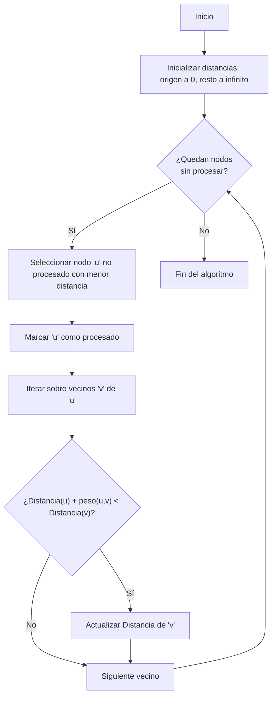

El algoritmo de Dijkstra se utiliza para encontrar la ruta más corta porque busca el menor costo acumulado, no solo el menor número de segmentos o saltos. Si un grafo tiene pesos en las aristas, significa que representa un costo, tiempo o distancia entre los nodos.

> [!info] Explicación
> El algoritmo de Dijkstra es un algoritmo fundamental en la teoría de grafos. Sirve para encontrar el camino más corto desde un nodo origen hacia todos los demás nodos en un grafo ponderado. Es muy utilizado en redes de computadoras (como el protocolo OSPF) y en aplicaciones de mapas para calcular la ruta más óptima.

## Pasos del algoritmo
1. **Inicialización**: Se establece la tabla de costos donde la distancia al nodo origen es 0 y al resto de los nodos es infinita.
2. **Selección**: Se selecciona el nodo no procesado con el costo (distancia acumulada) más bajo.
3. **Actualización**: Se analizan los vecinos del nodo seleccionado y se actualizan sus costos en la tabla si la nueva ruta es más corta que la registrada previamente.
4. **Iteración**: Se marca el nodo actual como procesado y se repite el proceso hasta que todos los nodos hayan sido evaluados.
5. **Ruta final**: Se calcula y reconstruye la ruta más corta final.

> [!info] Explicación
> **Detalle de los pasos:**
> 1. Se inicializan todos los nodos con una distancia "infinita", excepto el de inicio (distancia 0).
> 2. Se visita el nodo no procesado con la menor distancia acumulada.
> 3. Se analizan sus vecinos y se actualiza su distancia si la nueva ruta es más corta.
> 4. Se marca el nodo actual como procesado.

### Características y limitaciones
- El algoritmo BFS (Breadth-First Search) no toma en cuenta los pesos, solo busca la ruta con menos saltos entre nodos. En contraste, con Dijkstra buscamos la ruta con el menor peso total acumulado.
- Dijkstra se utiliza generalmente en grafos ponderados dirigidos o no dirigidos. Es importante destacar que no funciona correctamente si el grafo contiene aristas con pesos negativos.

> [!info] Explicación
> **Dijkstra vs BFS:** Mientras que BFS trata todas las aristas por igual encontrando el camino con menos "saltos", Dijkstra considera aristas con distintos pesos.
> **Importante:** Dijkstra no funciona si hay aristas con pesos negativos.

### Tabla de costos
1. Se crea una tabla que almacena el costo de llegar a cada nodo. El "costo" de un nodo es la suma de los pesos requeridos para alcanzarlo desde el nodo origen.
2. Esta tabla se va actualizando a medida que se exploran los vecinos, manteniendo siempre el costo mínimo conocido.

> [!info] Explicación
> La tabla de costos normalmente se apoya en una "cola de prioridad" para extraer eficientemente el nodo con el costo más bajo.

Para ver la ejecución paso a paso:
[[Grafo Dijkstra corrida de escritorio.excalidraw]]

Relacionado con: [[grafos corrida de escritorio BFS Y DFS.excalidraw]]
