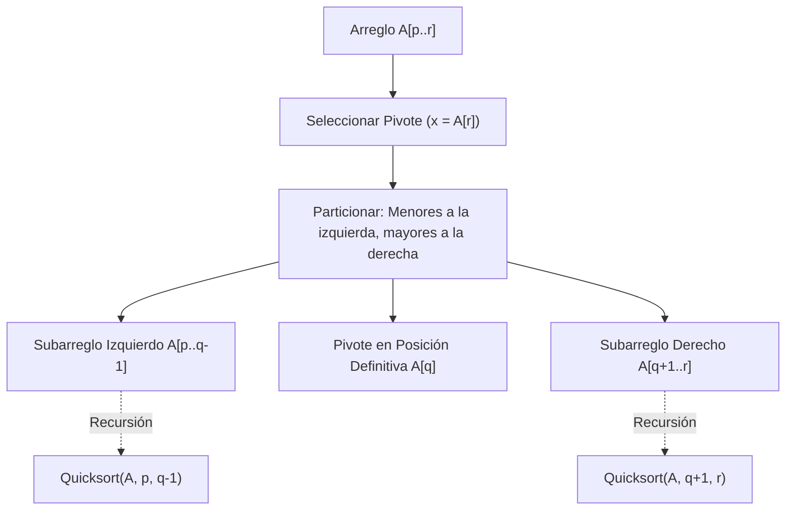
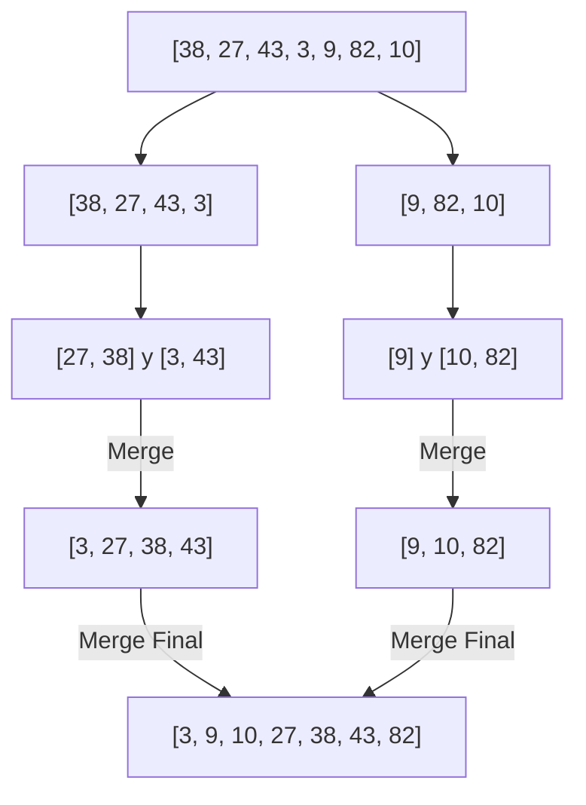
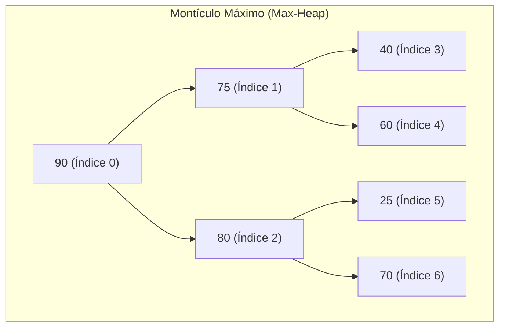

# Algoritmos de Ordenamiento Clásicos ($\mathcal{O}(n \log n)$)

El problema del ordenamiento consiste en permutar una secuencia de $n$ elementos $\langle a_1, a_2, \dots, a_n \rangle$ para obtener una secuencia $\langle a'_1, a'_2, \dots, a'_n \rangle$ tal que $a'_1 \le a'_2 \le \dots \le a'_n$, bajo un orden total definido.

Dentro de los algoritmos de ordenamiento basados en comparaciones, la trinidad fundamental de complejidad asintótica $\mathcal{O}(n \log n)$ la componen **Quicksort**, **Mergesort** y **Heapsort**. Cada uno ilustra un paradigma algorítmico y trade-offs de ingeniería distintos (tiempo, memoria auxiliar, estabilidad y jerarquía de memoria caché).

> [!info] 💡 ¿Cómo entender esto desde cero? (Guía para novatos de pregrado)
> - **¿Por qué no basta con Bubble Sort ($O(n^2)$)?** Si tienes 1 millón de registros, un algoritmo de $O(n^2)$ tarda unos 11 días de CPU. Un algoritmo de $O(n \log n)$ tarda apenas 0.02 segundos.
> - **Quicksort (El rebelde veloz in-place):** Elige un pivote y manda los pequeños a la izquierda y los grandes a la derecha. En promedio vuela porque aprovecha al máximo la memoria caché de la CPU, pero si tienes mala suerte con el pivote puede degradarse a $O(n^2)$.
> - **Mergesort (El disciplinado y confiable):** Corta el arreglo por la mitad recursivamente hasta que quedan elementos sueltos, y luego los une ordenadamente. Tarda EXACTAMENTE $O(n \log n)$ siempre y preserva el orden relativo de elementos iguales (es estable), pero necesita el doble de memoria RAM auxiliar ($O(n)$).
> - **Heapsort (El ahorrador estricto):** Convierte el arreglo en un montículo binario (árbol donde el padre siempre es mayor que los hijos). Es determinista $O(n \log n)$ y no gasta ni un solo byte de memoria extra ($O(1)$), pero da saltos bruscos en memoria que hacen sufrir a la memoria caché.

---

## 1. Teorema del Límite Inferior para Ordenamiento por Comparación

> [!important] Teorema del Límite Inferior ($\Omega(n \log n)$)
> Cualquier algoritmo determinista o aleatorizado que ordene un conjunto de $n$ elementos realizando únicamente **comparaciones binarias** ($a_i \le a_j$) requiere en el peor caso al menos $\Omega(n \log n)$ operaciones.

### Demostración mediante Árboles de Decisión
1. Todo algoritmo de comparación puede modelarse como un **árbol de decisión binario** donde:
   - Cada nodo interno representa una comparación $a_i \le a_j$.
   - Cada rama representa el resultado verdadero (izquierda) o falso (derecha).
   - Cada hoja representa una de las posibles permutaciones de los $n$ elementos.
2. Un arreglo de $n$ elementos distintos tiene exactamente $n!$ permutaciones posibles. Para que el algoritmo sea correcto, el árbol debe contener al menos $n!$ hojas:
   $$L \ge n!$$
3. Un árbol binario de altura $h$ tiene a lo sumo $2^h$ hojas:
   $$2^h \ge L \ge n! \implies h \ge \log_2(n!)$$
4. Aplicando la **Aproximación de Stirling** ($\ln(n!) = n \ln n - n + \mathcal{O}(\log n)$):
   $$h \ge \sum_{k=1}^n \log_2 k \ge \sum_{k=n/2}^n \log_2(n/2) = \frac{n}{2} (\log_2 n - 1) = \Omega(n \log n)$$
Por consiguiente, Quicksort, Mergesort y Heapsort son **asintóticamente óptimos** en la clase de ordenamiento por comparación.

---

## 2. Quicksort (Tony Hoare, 1961)

Quicksort aplica el paradigma **Divide and Conquer** (*Divide y Vencerás*). A diferencia de Mergesort, todo el trabajo computacional se realiza en la fase de división (*Partition*), mientras que la fase de combinación es trivial.



### 2.1 Esquemas de Partición: Lomuto vs. Hoare
1. **Partición de Lomuto:**
   - Selecciona el último elemento como pivote. Mantiene un índice $i$ para la frontera de elementos menores.
   - Fácil de implementar, pero realiza aproximadamente el triple de intercambios (*swaps*) que Hoare y degrada a $\mathcal{O}(n^2)$ cuando todos los elementos son idénticos.
2. **Partición de Hoare:**
   - Utiliza dos punteros que avanzan desde los extremos hacia el centro hasta encontrar elementos fuera de lugar y los intercambia.
   - Realiza en promedio un tercio de los intercambios de Lomuto y maneja eficientemente arreglos con elementos repetidos.

### 2.2 Selección del Pivote y Análisis de Complejidad
* **Caso Mejor ($\mathcal{O}(n \log n)$):** El pivote divide el arreglo exactamente en dos mitades de tamaño $\lfloor n/2 \rfloor$:
  $$T(n) = 2T(n/2) + \Theta(n) \implies T(n) = \Theta(n \log n)$$
* **Caso Peor ($\mathcal{O}(n^2)$):** Ocurre cuando el arreglo ya está ordenado (o en orden inverso) y se elige el primer o último elemento como pivote, produciendo subproblemas de tamaño $0$ y $n-1$:
  $$T(n) = T(n-1) + T(0) + \Theta(n) = \sum_{k=1}^n \Theta(k) = \Theta(n^2)$$
* **Caso Promedio ($\mathcal{O}(n \log n)$):** Con particiones balanceadas estadísticamente (por ejemplo 9:1 o 99:1), la profundidad del árbol sigue siendo $\mathcal{O}(\log n)$, logrando un rendimiento promedio de $\approx 1.39 n \log_2 n$.

### 2.3 Mitigación y Variantes de Producción
* **Pivote Aleatorio o Mediana de Tres:** Seleccionar $\text{mediana}(A[low], A[mid], A[high])$ elimina la vulnerabilidad ante entradas ya ordenadas.
* **IntroSort (David Musser, 1997):** Comienza con Quicksort; si la profundidad de la recursión supera $2 \lfloor \log_2 n \rfloor$, conmuta a **Heapsort** para garantizar cota peor $\mathcal{O}(n \log n)$. Utilizado en `std::sort` de C++ (libstdc++ / libc++).
* **Dual-Pivot Quicksort (Yaroslavskiy, 2009):** Particiona en 3 regiones usando 2 pivotes; reduce lecturas de memoria y es el algoritmo por defecto para tipos primitivos en Java (`Arrays.sort`).

---

## 3. Mergesort (John von Neumann, 1945)

Mergesort es el ejemplo arquetípico de **Divide and Conquer**: divide recursivamente la secuencia en dos mitades, las ordena independientemente y luego combina (*merge*) las dos secuencias ordenadas en tiempo lineal.



### 3.1 Ecuación de Recurrencia y Garantía Determinista
El proceso de división toma tiempo $\mathcal{O}(1)$, y la mezcla de dos subarreglos ordenados de tamaño total $n$ toma $\mathcal{O}(n)$:

$$T(n) = 2T\left(\frac{n}{2}\right) + \Theta(n)$$

Por el Teorema Maestro (Caso 2: $a=2, b=2 \implies f(n) = \Theta(n^{\log_2 2}) = \Theta(n)$):

$$T(n) = \Theta(n \log n) \quad \text{en el Mejor, Promedio y Peor Caso}$$

### 3.2 Estabilidad y Memoria Auxiliar
* **Estabilidad:** Mergesort es **estable**. Si dos elementos tienen la misma clave ($A[i] = A[j]$ con $i < j$), la condición de mezcla estricta `if left[i] <= right[j]:` garantiza que el elemento de la izquierda sea insertado primero en el arreglo de salida.
* **Memoria Auxiliar $\mathcal{O}(n)$:** La operación de mezcla sobre arreglos contiguos requiere un búfer auxiliar para no sobreescribir elementos antes de compararlos.
* **Listas Enlazadas:** Sobre listas enlazadas, Mergesort puede implementarse **in-place** ($\mathcal{O}(1)$ memoria auxiliar) modificando punteros sin copiar nodos.

### 3.3 Aplicación en Big Data: Ordenamiento Externo (*External Merge Sort*)
Cuando los datos exceden la memoria RAM física (véase [[Caracteristicas del big data]]), Mergesort es la técnica de elección:
1. **Fase de Generación de Runs:** Se leen bloques de datos que caben en RAM, se ordenan internamente y se escriben en disco como *runs* ordenados temporales.
2. **Fase K-Way Merge:** Se mantienen punteros a cada *run* en disco y, mediante un Min-Heap de tamaño $K$, se realiza una mezcla múltiple escribiendo secuencialmente el resultado en almacenamiento secundario.

---

## 4. Heapsort (J. W. J. Williams, 1964)

Heapsort utiliza la estructura de datos **Montículo Binario** (*Binary Max-Heap*), un árbol binario casi completo que satisface la propiedad de orden de montículo: para todo nodo $i$ distinto de la raíz:

$$A[\text{parent}(i)] \ge A[i]$$

Representado en un arreglo lineal indexado en 0:
* $\text{parent}(i) = \lfloor (i - 1) / 2 \rfloor$
* $\text{left}(i) = 2i + 1$
* $\text{right}(i) = 2i + 2$



### 4.1 Fase 1: Construcción del Heap (*Build Max Heap*) en $\mathcal{O}(n)$
Contrario a la intuición de insertar $n$ elementos en $\mathcal{O}(n \log n)$, la construcción de abajo hacia arriba (*bottom-up*) ejecuta `max_heapify` desde el último nodo no hoja ($\lfloor n/2 \rfloor - 1$) hasta la raíz en tiempo **lineal estricto**:

$$T(n) = \sum_{h=0}^{\lfloor \log_2 n \rfloor} \left\lceil \frac{n}{2^{h+1}} \right\rceil \mathcal{O}(h) \le \frac{n}{2} c \sum_{h=0}^{\infty} \frac{h}{2^h}$$

Dado que la serie geométrica-aritmética converge:
$$\sum_{h=0}^{\infty} \frac{h}{2^h} = \frac{1/2}{(1 - 1/2)^2} = 2$$

Por lo tanto:
$$T(n) \le \frac{n}{2} c (2) = \mathcal{O}(n)$$

### 4.2 Fase 2: Extracción Sucesiva del Máximo en $\mathcal{O}(n \log n)$
1. Se intercambia la raíz $A[0]$ (máximo global) con el último elemento $A[n-1]$.
2. Se reduce el tamaño virtual del montículo en 1.
3. Se restaura la propiedad de heap invocando `max_heapify(A, 0, heap_size)`.
4. Repitiendo este proceso $n-1$ veces, el arreglo queda ordenado de menor a mayor en tiempo:
   $$\sum_{i=1}^{n-1} \mathcal{O}(\log i) = \Theta(n \log n)$$

### 4.3 Inestabilidad y Caché Misses
* **Inestabilidad:** Los saltos de largo alcance al intercambiar la raíz con hojas distantes rompen el orden relativo de claves duplicadas.
* **Localidad de Referencia Pobre:** Los accesos a hijos en índices $2i + 1$ y $2i + 2$ provocan saltos de memoria no continuos que generan constantes fallos de caché L1/L2/L3 (*Cache Misses*), haciendo que en la práctica Heapsort sea 2 a 3 veces más lento que Quicksort para datos en memoria RAM.

---

## 5. Tabla Comparativa Exhaustiva

| Criterio | Quicksort | Mergesort | Heapsort |
| :--- | :--- | :--- | :--- |
| **Tiempo Mejor** | $\mathcal{O}(n \log n)$ | $\mathcal{O}(n \log n)$ | $\mathcal{O}(n \log n)$ |
| **Tiempo Promedio** | $\mathcal{O}(n \log n)$ | $\mathcal{O}(n \log n)$ | $\mathcal{O}(n \log n)$ |
| **Tiempo Peor** | $\mathcal{O}(n^2)$ *(mitigable)* | $\mathcal{O}(n \log n)$ *(garantizado)* | $\mathcal{O}(n \log n)$ *(garantizado)* |
| **Memoria Auxiliar** | $\mathcal{O}(\log n)$ *(pila recursiva)* | $\mathcal{O}(n)$ *(en arrays)* / $\mathcal{O}(1)$ *(listas)* | $\mathcal{O}(1)$ *(in-place estricto)* |
| **Estabilidad** | **No** | **Sí** | **No** |
| **In-Place** | Sí | No (requiere búfer externo) | Sí |
| **Localidad de Caché** | **Excelente** (acceso secuencial) | Buena | **Pobre** (saltos de potencias de 2) |
| **Uso Principal** | Ordenamiento en RAM de propósito general | Datos en disco (Big Data), estabilidad | Sistemas de tiempo real y memoria crítica |

---

## 6. Implementaciones en Python Tipado

### 6.1 Quicksort (Partición de Hoare con Mediana de Tres)

```python
from typing import List, TypeVar

T = TypeVar("T")

def quicksort(arr: List[T]) -> None:
    """Ordena el arreglo in-place usando Quicksort con partición de Hoare."""
    def _quicksort(low: int, high: int) -> None:
        if low < high:
            pivot_idx = _partition(low, high)
            _quicksort(low, pivot_idx)
            _quicksort(pivot_idx + 1, high)

    def _partition(low: int, high: int) -> int:
        mid = (low + high) // 2
        # Mediana de tres para evitar degradación a O(n^2)
        if arr[high] < arr[low]:
            arr[low], arr[high] = arr[high], arr[low]
        if arr[mid] < arr[low]:
            arr[low], arr[mid] = arr[mid], arr[low]
        if arr[high] < arr[mid]:
            arr[mid], arr[high] = arr[high], arr[mid]

        pivot = arr[mid]
        i = low - 1
        j = high + 1
        while True:
            i += 1
            while arr[i] < pivot:
                i += 1
            j -= 1
            while arr[j] > pivot:
                j -= 1
            if i >= j:
                return j
            arr[i], arr[j] = arr[j], arr[i]

    _quicksort(0, len(arr) - 1)
```

### 6.2 Mergesort (Estable)

```python
from typing import List, TypeVar

T = TypeVar("T")

def mergesort(arr: List[T]) -> List[T]:
    """Retorna una nueva lista ordenada de forma estable usando Mergesort."""
    if len(arr) <= 1:
        return arr

    mid = len(arr) // 2
    left = mergesort(arr[:mid])
    right = mergesort(arr[mid:])

    return _merge(left, right)

def _merge(left: List[T], right: List[T]) -> List[T]:
    merged: List[T] = []
    i = j = 0
    while i < len(left) and j < len(right):
        # El '<=' garantiza estabilidad
        if left[i] <= right[j]:
            merged.append(left[i])
            i += 1
        else:
            merged.append(right[j])
            j += 1

    merged.extend(left[i:])
    merged.extend(right[j:])
    return merged
```

### 6.3 Heapsort (In-Place $\mathcal{O}(1)$ Espacio Auxiliar)

```python
from typing import List, TypeVar

T = TypeVar("T")

def heapsort(arr: List[T]) -> None:
    """Ordena el arreglo in-place usando Heapsort."""
    n = len(arr)

    def _heapify(heap_size: int, root_idx: int) -> None:
        largest = root_idx
        left = 2 * root_idx + 1
        right = 2 * root_idx + 2

        if left < heap_size and arr[left] > arr[largest]:
            largest = left
        if right < heap_size and arr[right] > arr[largest]:
            largest = right

        if largest != root_idx:
            arr[root_idx], arr[largest] = arr[largest], arr[root_idx]
            _heapify(heap_size, largest)

    # Paso 1: Construcción del Max-Heap en O(n)
    for i in range(n // 2 - 1, -1, -1):
        _heapify(n, i)

    # Paso 2: Extracción ordenada del máximo en O(n log n)
    for i in range(n - 1, 0, -1):
        arr[0], arr[i] = arr[i], arr[0]  # Mover la raíz actual al final
        _heapify(i, 0)                  # Restaurar el heap en el subarreglo reducido
```

---

## Enlaces Relacionados
- [[Complejidad Computacional (Big-O, P vs NP)]] — Clases de complejidad y notación asintótica.
- [[Caracteristicas del big data]] — Aplicación de algoritmos de ordenamiento externo K-way merge sobre terabytes de datos.
- [[Algoritmo Dijkstra]] — Utilización de montículos binarios (Min-Heaps) como cola de prioridad.
- [[Programacion Dinamica]] — Comparativa de paradigmas algorítmicos frente a Divide and Conquer.
