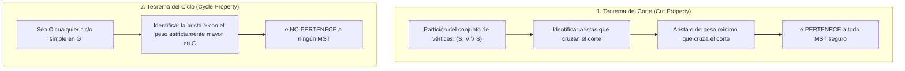
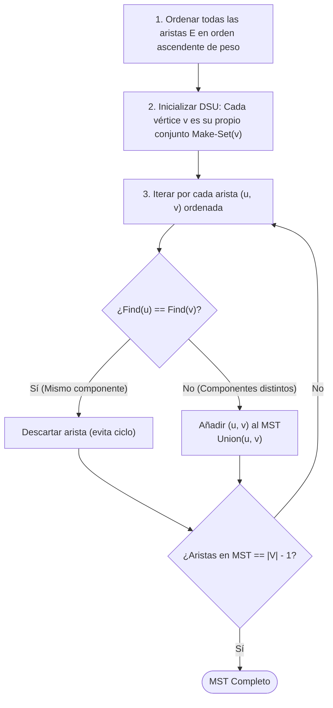
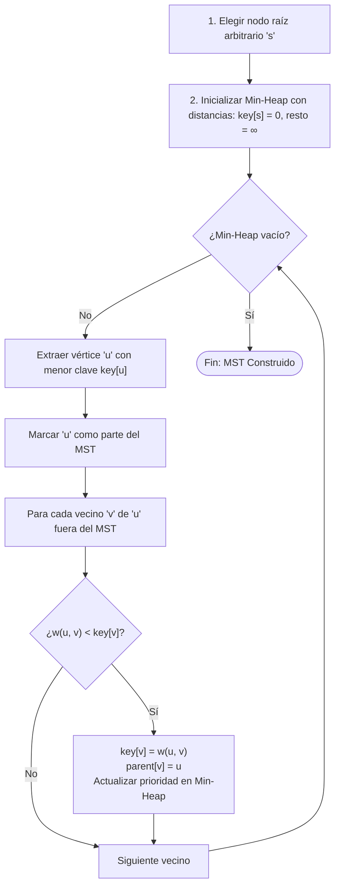

# Árboles de Expansión Mínima (*Minimum Spanning Tree - MST*)

Dado un grafo no dirigido y conexo $G = (V, E)$ donde cada arista $e = (u, v) \in E$ posee un peso escalar o costo $w(e) \in \mathbb{R}$, un **Árbol de Expansión Mínima (MST)** es un subgrafo acíclico $T = (V, E_T)$ con $E_T \subseteq E$ que conecta (spans) a todos los vértices de $V$ minimizando la suma total de las ponderaciones:

$$w(T) = \sum_{e \in E_T} w(e)$$

### Propiedades Topológicas Fundamentales
1. **Número de aristas:** Si $|V| = n$, todo árbol generador contiene exactamente $|E_T| = n - 1$ aristas.
2. **Aciclicidad y Conexidad:** La eliminación de cualquier arista de $T$ desconecta el grafo en dos componentes; la adición de cualquier arista $e \notin E_T$ crea un ciclo simple único.
3. **Unicidad:** Si todos los pesos de las aristas son estrictamente distintos, el MST de $G$ es **único**. Si existen pesos repetidos, pueden existir múltiples árboles generadores con el mismo costo mínimo global.

> [!info] Conexión con Redes y el Mundo Real
> En ingeniería de redes de computadoras, el principio del árbol generador es la base operativa de protocolos de capa de enlace como **STP (Spanning Tree Protocol)** para evitar tormentas de difusión (*broadcast storms*). Véase [[STP (Protocolo de árbol de extensión)]]. Asimismo, ambos algoritmos aplican el paradigma voraz analizado en [[Algoritmo voraz aproximacion .excalidraw]].

---

## 1. Fundamentos Matemáticos: Teorema del Corte y Teorema del Ciclo

Ambos algoritmos (Kruskal y Prim) pertenecen a la familia de algoritmos voraces (*Greedy*) y su correctitud reposa sobre dos propiedades matemáticas duales:



### 1.1 Teorema del Corte (*Cut Property*)
Sea $S \subset V$ un subconjunto no vacío de vértices y sea $(S, V \setminus S)$ un corte en $G$. Una arista cruza el corte si uno de sus extremos está en $S$ y el otro en $V \setminus S$.

> [!important] Enunciado del Teorema del Corte
> Si $e = (u, v)$ es la arista de **peso estrictamente mínimo** que cruza el corte $(S, V \setminus S)$, entonces $e$ pertenece a todo Árbol de Expansión Mínima de $G$.

#### Demostración (Técnica de Intercambio / *Exchange Argument*)
1. Supongamos por contradicción que existe un MST $T^*$ que no incluye la arista $e = (u, v)$.
2. Dado que $T^*$ conecta todos los vértices, debe existir un camino simple $P$ en $T^*$ entre $u$ y $v$.
3. Puesto que $u \in S$ y $v \in V \setminus S$, el camino $P$ debe cruzar el corte $(S, V \setminus S)$ al menos una vez a través de otra arista $e' = (x, y) \neq e$.
4. Al añadir $e$ a $T^*$, se genera un ciclo que contiene tanto a $e$ como a $e'$.
5. Si removemos $e'$ y conservamos $e$, formamos un nuevo árbol generador $T' = (T^* \setminus \{e'\}) \cup \{e\}$.
6. El peso del nuevo árbol es:
   $$w(T') = w(T^*) - w(e') + w(e)$$
7. Por definición, $e$ es la arista de costo mínimo que cruza el corte, por lo que $w(e) \le w(e')$. Si $w(e) < w(e')$, entonces $w(T') < w(T^*)$, lo cual contradice que $T^*$ era de peso mínimo. $\blacksquare$

### 1.2 Teorema del Ciclo (*Cycle Property*)
Para cualquier ciclo simple $C \subseteq E$, si $e$ es la arista con el peso estrictamente más grande en $C$, entonces $e$ no puede pertenecer a ningún MST. Si estuviera en el MST, romperla desconectaría el árbol en dos componentes que pueden reconectarse con una arista más liviana del mismo ciclo.

---

## 2. Algoritmo de Kruskal (Joseph Kruskal, 1956)

Kruskal adopta una perspectiva **centrada en las aristas** (*Edge-centric*). Construye el MST agregando secuencialmente la arista más liviana disponible que no genere un ciclo, uniendo componentes conexas independientes como un bosque que converge a un único árbol.



### 2.1 Estructura de Datos DSU (*Disjoint Set Union* / Union-Find)
Para verificar en tiempo casi instantáneo si dos vértices pertenecen a la misma componente conexa y evitar ciclos:
* **Compresión de Caminos (*Path Compression*):** Al buscar la raíz de un conjunto con `find(x)`, se aplanan los punteros de todos los nodos visitados directamente a la raíz.
* **Unión por Rango (*Union by Rank*):** Al unir dos árboles, el árbol de menor profundidad se cuelga de la raíz del árbol de mayor profundidad.

> [!tip] Complejidad de Ackermann Inversa
> Con ambas optimizaciones, cualquier secuencia de $m$ operaciones sobre $n$ elementos toma tiempo $\mathcal{O}(m \cdot \alpha(n))$, donde $\alpha$ es la función inversa de Ackermann ($\alpha(n) \le 4$ para cualquier número imaginable en el universo físico, comportándose como $\mathcal{O}(1)$ constante en la práctica).

### 2.2 Complejidad de Kruskal
1. Ordenar $E$ aristas: $\mathcal{O}(E \log E)$.
   Dado que $E \le V^2$, $\log E \le 2 \log V$, luego $\mathcal{O}(E \log E) = \mathcal{O}(E \log V)$.
2. Operaciones DSU: $2E$ operaciones `find` y $V-1$ operaciones `union` en $\mathcal{O}(E \cdot \alpha(V))$.
3. **Complejidad Total:**
   $$\mathcal{O}(E \log V)$$
*Ideal para grafos dispersos (*sparse graphs*, donde $E \ll V^2$).*

---

## 3. Algoritmo de Prim (Robert Prim, 1957; Vojtěch Jarník, 1930)

Prim adopta una perspectiva **centrada en los vértices** (*Vertex-centric*). A partir de un vértice inicial arbitrario, hace crecer un único árbol conectado agregando iterativamente la arista más liviana que conecte el árbol actual con un nodo exterior.



### 3.1 Similitud y Diferencia con Dijkstra
Prim y Dijkstra comparten una estructura de control prácticamente idéntica con cola de prioridad, pero difieren en la clave de relajación:

| Algoritmo | Condición de Relajación | Objetivo Matemático |
| :--- | :--- | :--- |
| **[[Algoritmo Dijkstra]]** | `dist[v] > dist[u] + weight(u, v)` | Minimizar costo **acumulado desde la raíz** hacia $v$. |
| **Algoritmo de Prim** | `key[v] > weight(u, v)` | Minimizar el costo de la **arista individual de conexión** al árbol. |

### 3.2 Complejidad de Prim según la Estructura de Datos
* **Con Arreglo Lineal:** $\mathcal{O}(V^2 + E) = \mathcal{O}(V^2)$ (óptimo para grafos completamente densos donde $E \approx V^2$).
* **Con Min-Heap Binario:** $\mathcal{O}((V + E) \log V) = \mathcal{O}(E \log V)$.
* **Con Fibonacci Heap:** $\mathcal{O}(E + V \log V)$ (debido a que la operación `decrease_key` toma amortizado $\mathcal{O}(1)$).

---

## 4. Comparación Exhaustiva: Kruskal vs. Prim

| Criterio | Algoritmo de Kruskal | Algoritmo de Prim |
| :--- | :--- | :--- |
| **Filosofía** | Aristas globales (unión de componentes) | Vértices locales (crecimiento continuo) |
| **Estructura Clave** | Disjoint Set Union (DSU) | Cola de Prioridad (Min-Heap) |
| **Complejidad (Heap Binario)** | $\mathcal{O}(E \log V)$ | $\mathcal{O}(E \log V)$ |
| **Complejidad (Heap Fibonacci)**| $\mathcal{O}(E \log V)$ | $\mathcal{O}(E + V \log V)$ |
| **Eficiencia en Grafos Dispersos** | **Superior** (pocos enlaces que ordenar) | Aceptable |
| **Eficiencia en Grafos Densos** | Inferior ($E \log E$ domina) | **Superior** ($\mathcal{O}(V^2)$ con matriz o $\mathcal{O}(E)$ con Fibonacci) |
| **Manejo de Grafos Desconexos** | Genera naturalmente un Bosque de Expansión Mínima (*MSF*) | Requiere reiniciarse por cada componente |

---

## 5. Implementación en Python Tipado

### 5.1 Algoritmo de Kruskal con DSU Optimizado

```python
from typing import List, Tuple

class DisjointSetUnion:
    def __init__(self, n: int) -> None:
        self.parent = list(range(n))
        self.rank = [0] * n

    def find(self, i: int) -> int:
        if self.parent[i] != i:
            self.parent[i] = self.find(self.parent[i])  # Compresión de caminos
        return self.parent[i]

    def union(self, root_x: int, root_y: int) -> bool:
        if root_x == root_y:
            return False
        # Unión por rango
        if self.rank[root_x] < self.rank[root_y]:
            self.parent[root_x] = root_y
        elif self.rank[root_x] > self.rank[root_y]:
            self.parent[root_y] = root_x
        else:
            self.parent[root_y] = root_x
            self.rank[root_x] += 1
        return True


def kruskal(num_nodes: int, edges: List[Tuple[float, int, int]]) -> Tuple[List[Tuple[int, int, float]], float]:
    """
    Ejecuta el algoritmo de Kruskal.
    :param edges: Lista de tuplas (peso, u, v).
    :return: (lista de aristas del MST, peso_total).
    """
    # 1. Ordenar aristas por peso
    sorted_edges = sorted(edges, key=lambda item: item[0])
    dsu = DisjointSetUnion(num_nodes)
    mst: List[Tuple[int, int, float]] = []
    total_weight = 0.0

    for weight, u, v in sorted_edges:
        root_u = dsu.find(u)
        root_v = dsu.find(v)
        if root_u != root_v:
            dsu.union(root_u, root_v)
            mst.append((u, v, weight))
            total_weight += weight
            if len(mst) == num_nodes - 1:
                break

    return mst, total_weight
```

### 5.2 Algoritmo de Prim con `heapq`

```python
import heapq
from typing import Dict, List, Tuple

def prim(num_nodes: int, adj: Dict[int, List[Tuple[int, float]]], start: int = 0) -> Tuple[List[Tuple[int, int, float]], float]:
    """
    Ejecuta el algoritmo de Prim sobre un grafo conexo ponderado.
    :param adj: Lista de adyacencia {u: [(v, peso), ...]}.
    :return: (aristas del MST, peso_total).
    """
    visited = [False] * num_nodes
    min_heap: List[Tuple[float, int, int]] = [(0.0, start, -1)]  # (peso, nodo_actual, nodo_origen)
    mst: List[Tuple[int, int, float]] = []
    total_weight = 0.0

    while min_heap and len(mst) < num_nodes - 1:
        weight, u, parent = heapq.heappop(min_heap)

        if visited[u]:
            continue

        visited[u] = True
        if parent != -1:
            mst.append((parent, u, weight))
            total_weight += weight

        for neighbor, edge_weight in adj.get(u, []):
            if not visited[neighbor]:
                heapq.heappush(min_heap, (edge_weight, neighbor, u))

    return mst, total_weight
```

---

## Enlaces Relacionados
- [[Algoritmo Dijkstra]] — Algoritmo de caminos mínimos con estructura de cola de prioridad similar a Prim.
- [[STP (Protocolo de árbol de extensión)]] — Aplicación práctica del cálculo de árboles generadores en conmutación de Capa 2.
- [[Algoritmo voraz aproximacion .excalidraw]] — Estudio de la técnica Greedy en el problema de cobertura de conjuntos (*Set Cover*).
- [[Complejidad Computacional (Big-O, P vs NP)]] — Análisis asintótico y clasificación de problemas tratables vs NP-Hard.
