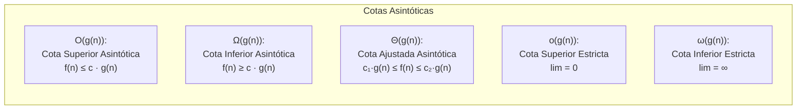
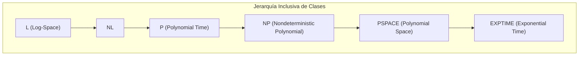
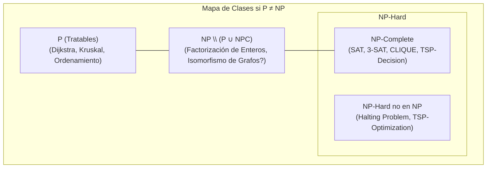
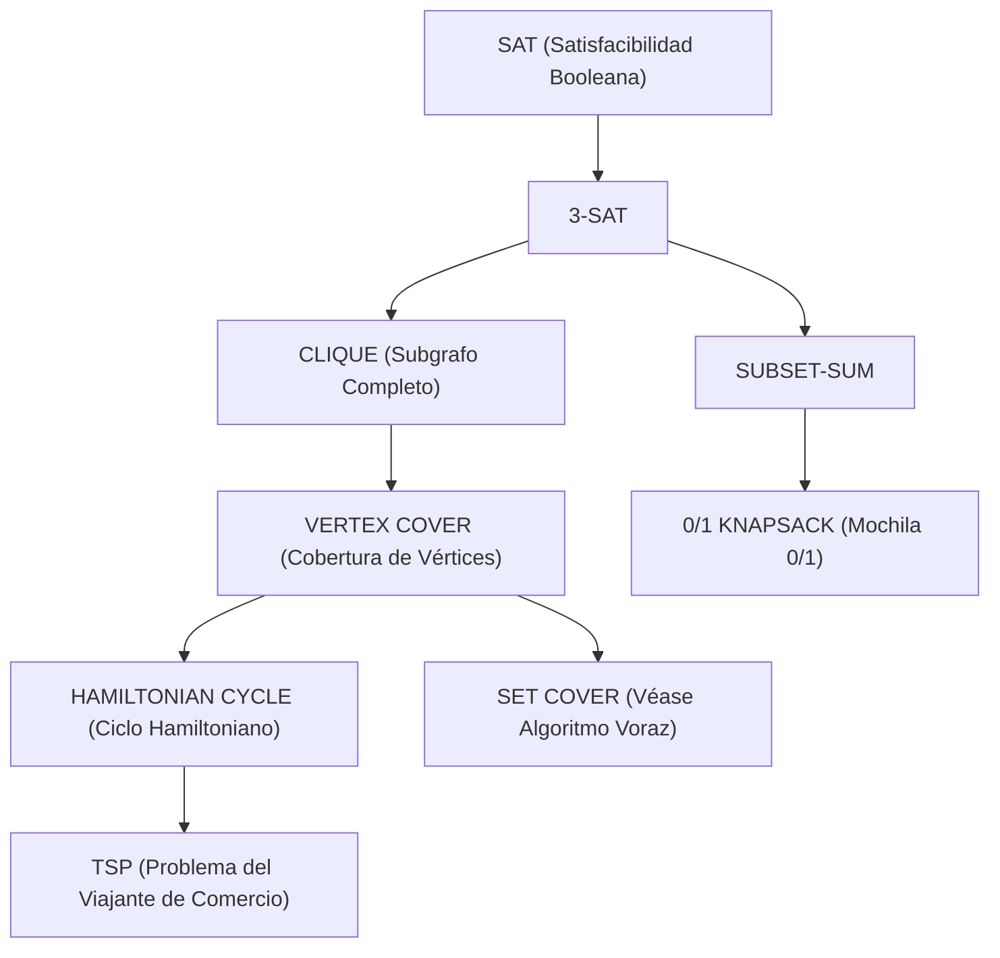

# Teoría de la Complejidad Computacional y Notación Asintótica

La **Teoría de la Complejidad Computacional** es la rama fundamental de la informática teórica que clasifica los problemas matemáticos y algorítmicos según el consumo intrínseco de recursos computacionales (tiempo de ejecución y memoria espacial) requeridos para resolverlos en un modelo formal de computación, típicamente la **Máquina de Turing (TM)**.

---

## 1. Análisis Asintótico y Notaciones Matemáticas Formales

El análisis asintótico describe el comportamiento de una función temporal $T(n)$ a medida que el tamaño de la entrada $n$ tiende al infinito ($n \to \infty$), abstrayéndose de constantes multiplicativas del hardware y términos de orden inferior.

### 1.1 Cota Superior Asintótica: Notación $\mathcal{O}$ (*Big-O*)
Define el **techo asintótico** del crecimiento de una función:

$$\mathcal{O}(g(n)) = \left\{ f(n) : \exists \, c > 0, \, n_0 > 0 \quad \text{tal que} \quad 0 \le f(n) \le c \cdot g(n), \; \forall n \ge n_0 \right\}$$

En términos de cálculo de límites:
$$\limsup_{n \to \infty} \frac{f(n)}{g(n)} < \infty$$

### 1.2 Cota Inferior Asintótica: Notación $\Omega$ (*Big-Omega*)
Define el **piso asintótico** o límite inferior de dificultad:

$$\Omega(g(n)) = \left\{ f(n) : \exists \, c > 0, \, n_0 > 0 \quad \text{tal que} \quad 0 \le c \cdot g(n) \le f(n), \; \forall n \ge n_0 \right\}$$

En términos de cálculo de límites:
$$\liminf_{n \to \infty} \frac{f(n)}{g(n)} > 0$$

*Ejemplo:* Como se demostró en [[Algoritmos de Ordenamiento (Quicksort, Mergesort, Heapsort)]], cualquier ordenamiento basado en comparaciones requiere $\Omega(n \log n)$ operaciones.

### 1.3 Cota Ajustada Asintótica: Notación $\Theta$ (*Big-Theta*)
Acota la función por arriba y por abajo con la misma razón de crecimiento:

$$\Theta(g(n)) = \left\{ f(n) : \exists \, c_1 > 0, \, c_2 > 0, \, n_0 > 0 \quad \text{tal que} \quad 0 \le c_1 \cdot g(n) \le f(n) \le c_2 \cdot g(n), \; \forall n \ge n_0 \right\}$$

$$f(n) = \Theta(g(n)) \iff f(n) \in \mathcal{O}(g(n)) \;\land\; f(n) \in \Omega(g(n))$$

En términos de cálculo de límites:
$$\lim_{n \to \infty} \frac{f(n)}{g(n)} = L, \quad \text{donde } 0 < L < \infty$$

### 1.4 Cotas Estrictas: $o$ (*Little-o*) y $\omega$ (*Little-omega*)
* **Cota superior no ajustada ($o$):** $f(n)$ crece asintóticamente mucho más lento que $g(n)$:
  $$f(n) \in o(g(n)) \iff \lim_{n \to \infty} \frac{f(n)}{g(n)} = 0$$
* **Cota inferior no ajustada ($\omega$):** $f(n)$ crece asintóticamente mucho más rápido que $g(n)$:
  $$f(n) \in \omega(g(n)) \iff \lim_{n \to \infty} \frac{f(n)}{g(n)} = \infty$$

---

## 2. Jerarquía de Complejidad Temporal y Definiciones de Máquinas de Turing

Un **problema de decisión** es un lenguaje formal $L \subseteq \Sigma^*$ donde cada entrada $x$ requiere una respuesta binaria $\text{SÍ} \; (x \in L)$ o $\text{NO} \; (x \notin L)$.

### 2.1 Clase P (*Polynomial Time*)
Es el conjunto de problemas de decisión que pueden ser decididos por una **Máquina de Turing Determinista (DTM)** en tiempo polinomial:

$$\text{P} = \bigcup_{k \ge 1} \text{DTIME}(n^k)$$

*Criterio de Cobham-Edmonds:* Se considera informalmente como el conjunto de problemas **"tratables" o computacionalmente eficientes**.
*Ejemplos:*
- Caminos mínimos con [[Algoritmo Dijkstra]] o Bellman-Ford: $\mathcal{O}(V \log V + E) \in \text{P}$.
- Árbol de expansión mínima con [[Arboles de Expansion Minima (Kruskal y Prim)]]: $\mathcal{O}(E \log V) \in \text{P}$.
- Conectividad y flujo máximo en grafos.

### 2.2 Clase NP (*Nondeterministic Polynomial Time*)
Existen dos definiciones formalmente equivalentes:

1. **Definición por Verificación (Certificados Polinomiales):**
   Un lenguaje $L \in \text{NP}$ si existe un algoritmo verificador determinista $V(x, w)$ en tiempo polinomial y una constante $k$ tal que:
   $$x \in L \iff \exists w \in \Sigma^* \quad \text{con } |w| \le |x|^k \quad \text{tal que } V(x, w) = 1$$
   *Donde $w$ se denomina **certificado** o testigo (ejemplo: una asignación de variables booleanas o una permutación de vértices).*

2. **Definición por Máquina de Turing No Determinista (NTM):**
   $$\text{NP} = \bigcup_{k \ge 1} \text{NTIME}(n^k)$$
   Una NTM puede explorar simultáneamente todas las ramas posibles de cómputo y acepta si al menos una rama finaliza en un estado de aceptación.

> [!important] Relación Inmediata
> $$\text{P} \subseteq \text{NP}$$
> Cualquier problema resoluble en tiempo polinomial puede verificarse trivialmente en tiempo polinomial ignorando el certificado y resolviéndolo directamente.

---

## 3. NP-Hard, NP-Complete y Reducciones Polinomiales

### 3.1 Reducción en Tiempo Polinomial de Karp ($\le_P$)
Un lenguaje $L_1$ es reducible en tiempo polinomial a $L_2$ (notado $L_1 \le_P L_2$) si existe una función computable en tiempo polinomial $f: \Sigma^* \to \Sigma^*$ tal que para toda cadena $x$:

$$x \in L_1 \iff f(x) \in L_2$$

*Propiedad Fundamental:* Si $L_1 \le_P L_2$ y $L_2 \in \text{P}$, entonces $L_1 \in \text{P}$.

### 3.2 Definiciones Formales
* **NP-Hard:** Un problema $L$ es NP-Hard si para todo $L' \in \text{NP}$, se cumple $L' \le_P L$. (Es al menos tan difícil como cualquier problema en NP).
* **NP-Complete (NPC):** Un problema $L$ es NP-Completo si:
  1. $L \in \text{NP}$ (Es verificable en tiempo polinomial).
  2. $L \in \text{NP-Hard}$ (Todo problema en NP se reduce a él).

---

## 4. El Teorema Bisagra de Cook-Levin (1971)

Antes de 1971, no se sabía si existía algún problema NP-Completo, ya que para demostrarlo era necesario reducir **infinitos problemas de NP** a uno solo.

> [!important] Teorema de Cook-Levin (Stephen Cook, Leonid Levin)
> El problema de la Satisfacibilidad Booleana (**SAT**) es **NP-Completo**.

### Idea Matemática de la Demostración
Cook y Levin demostraron que cualquier computación de una Máquina de Turing No Determinista arbitraria $M$ que decide un lenguaje $L \in \text{NP}$ en tiempo $p(n)$ sobre una entrada $x$ puede **codificarse como una fórmula lógica proposicional booleana** $\Phi_{M, x}$ en Forma Normal Conjuntiva (CNF):
- Se definen variables booleanas que describen el estado de la máquina, la posición del cabezal y el contenido de la cinta en cada instante $t \in [0, p(n)]$.
- La fórmula impone cláusulas lógicas que validan:
  1. Que el estado inicial coincida con la entrada $x$.
  2. Que cada transición entre $t$ y $t+1$ cumpla las reglas de la función de transición de $M$.
  3. Que al final se alcance un estado de aceptación.
- La fórmula $\Phi_{M, x}$ tiene tamaño polinomial $\mathcal{O}(p(n)^2)$ y es **satisfacible si y solo si** $M$ acepta $x$.
Por lo tanto, cualquier problema en NP se traduce directamente en una instancia de SAT.

---

## 5. El Árbol de Reducciones de Karp (1972)

Una vez demostrado que SAT es NP-Completo, para demostrar que un nuevo problema $X \in \text{NP}$ es NP-Completo, solo se requiere demostrar que un problema NPC ya conocido se reduce a él: $\text{SAT} \le_P X$.

* **3-SAT $\to$ CLIQUE:** Se construyen grupos de 3 literales por cláusula y se conectan vértices si no son contradictorios entre distintas cláusulas.
* **CLIQUE $\to$ VERTEX COVER:** El grafo complemento $\overline{G}$ tiene una cobertura de tamaño $|V| - k$ si y solo si $G$ tiene un clique de tamaño $k$.
* **SUBSET-SUM $\to$ KNAPSACK:** Caso especial de la mochila donde el valor de cada elemento es idéntico a su peso. Como se discutió en [[Programacion Dinamica]], la resolución con PD tiene tiempo $\mathcal{O}(nW)$ que es pseudopolinomial, confirmando que la mochila es NP-Completo débil.

---

## 6. El Gran Dilema del Milenio: ¿P = NP o P $\ne$ NP?

Formulado por el Instituto Clay de Matemáticas como uno de los 7 Problemas del Milenio (con un premio de 1 millón de dólares).

| Escenario | Si P = NP | Si P $\neq$ NP (Consenso de la Comunidad) |
| :--- | :--- | :--- |
| **Criptografía** | **Colapso total** de la criptografía de clave pública (RSA, ECC, Diffie-Hellman), firmas digitales y blockchains. Todo secreto protegido por funciones unidireccionales sería descifrable en tiempo polinomial. | La seguridad moderna se mantiene sólida. Existen funciones unidireccionales (*One-Way Functions*). |
| **Optimización Industrial** | Soluciones perfectas instantáneas para logística global (TSP), diseño de microchips, plegamiento de proteínas y calendarización. | Se requiere recurrir a heurísticas (como [[Algoritmo A-Estrella (A-Star)]]) y algoritmos de aproximación voraces (como en [[Algoritmo voraz aproximacion .excalidraw]]). |
| **Matemáticas** | La verificación de una demostración es equivalente a encontrarla: las computadoras podrían demostrar automáticamente cualquier teorema matemático de longitud razonable. | La creatividad matemática y la búsqueda de soluciones sigue siendo intrínsecamente más difícil que la mera verificación. |

### ¿Por qué es tan difícil demostrar $P \ne NP$? (Las Tres Barreras)
1. **Barrera de Relativización (Baker, Gill, Solovay, 1975):** Existen oráculos $A$ y $B$ tales que $\text{P}^A = \text{NP}^A$ y $\text{P}^B \neq \text{NP}^B$. Ninguna técnica de diagonalización estándar puede resolver el dilema.
2. **Barrera de Pruebas Naturales (*Natural Proofs*, Razborov, Rudich, 1997):** Demostrar límites inferiores en complejidad de circuitos con métodos combinatorios usuales rompería la existencia de generadores de números pseudoaleatorios fuertes.
3. **Barrera de Algebrización (Aaronson, Wigderson, 2008):** Técnicas algebraicas avanzadas también son insuficientes para separar clases donde intervienen extensiones de polinomios.

---

## Enlaces Relacionados
- [[Programacion Dinamica]] — Solución pseudopolinomial a problemas NP-Completos (Mochila 0/1).
- [[Algoritmo voraz aproximacion .excalidraw]] — Algoritmos voraces de aproximación para el problema NP-Completo Set Cover.
- [[Algoritmos de Ordenamiento (Quicksort, Mergesort, Heapsort)]] — Cota inferior $\Omega(n \log n)$ demostrada mediante árboles de decisión.
- [[Algoritmo Dijkstra]] — Problema resoluble en tiempo polinomial P ($\mathcal{O}(E + V \log V)$).
- [[Algoritmo A-Estrella (A-Star)]] — Búsqueda heurística informada para mitigar el crecimiento exponencial en grafos masivos.
