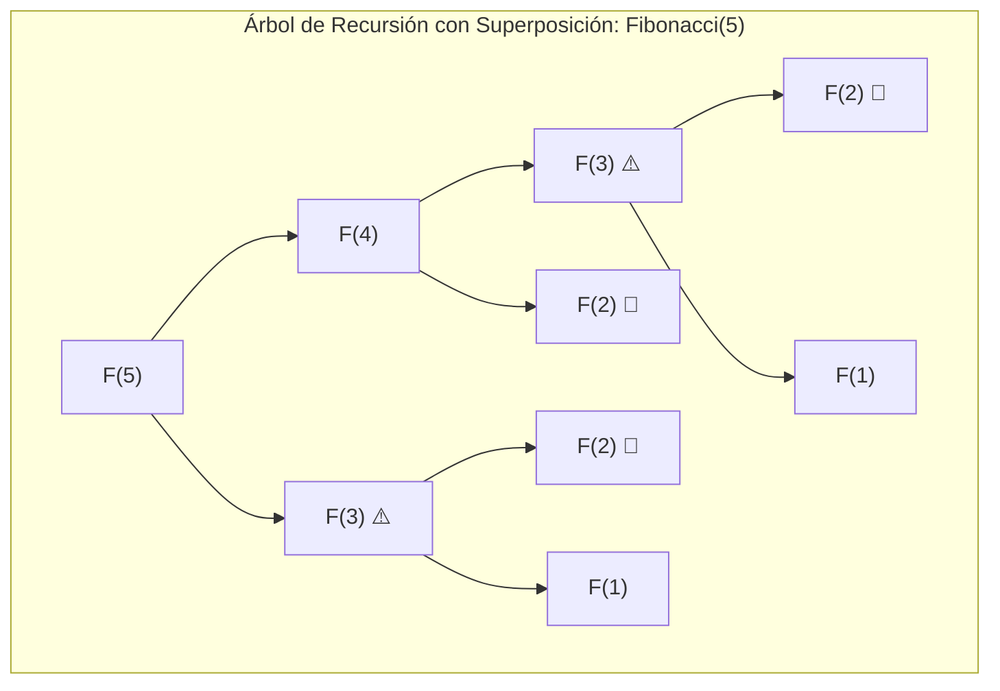
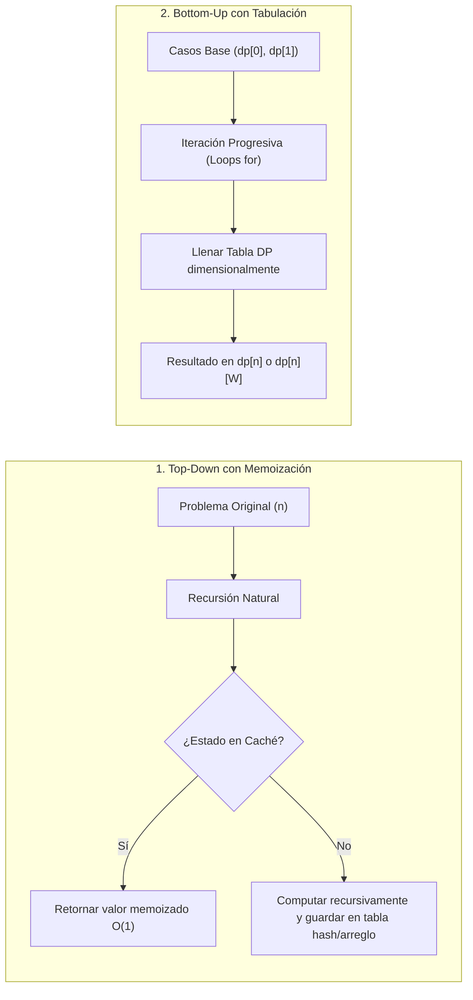

# Programación Dinámica (*Dynamic Programming*)

La **Programación Dinámica (PD)** es un paradigma de diseño algorítmico y optimización matemática introducido por **Richard Bellman** en la década de 1950. Se aplica a problemas de optimización combinatoria y toma de decisiones secuenciales donde una solución recursiva ingenua incurre en una explosión combinatoria exponencial debido al recálculo repetitivo de los mismos subproblemas.

> [!info] 💡 ¿Cómo entender esto desde cero? (Guía para novatos de pregrado)
> - **Analogía de recordar en un papel:**
>   - Si alguien te pregunta: "¿Cuánto es $1 + 1 + 1 + 1$?", cuentas y respondes "4".
>   - Si de inmediato agrega "$+ 1$" al final, ¿vuelves a sumar todos los unos desde cero? ¡No! Simplemente tomas el resultado anterior ("4") y le sumas 1 para obtener "5".
>   - **Eso es Programación Dinámica:** Guardar en memoria los resultados de subproblemas ya resueltos (en una tabla o arreglo) para no volver a calcularlos jamás.
> - **Las dos formas de resolver:**
>   - **Top-Down (Memoización):** Piensas recursivamente desde el problema grande hacia abajo, pero guardas cada respuesta en un diccionario caché.
>   - **Bottom-Up (Tabulación):** Empiezas por los casos base más pequeños (la base de una tabla) y vas llenando la tabla paso a paso hacia arriba con bucles simples.

---

## 1. Fundamentos Matemáticos: El Principio de Optimalidad de Bellman

Para que un problema sea abordable mediante Programación Dinámica, debe satisfacer dos propiedades formales indispensables:

### 1.1 Subestructura Óptima (*Optimal Substructure*)
Una solución global óptima al problema está compuesta por soluciones óptimas a sus subproblemas constitutivos.

> [!important] Principio de Optimalidad de Bellman (1957)
> *"En una secuencia de decisiones óptima, toda subsecuencia de decisiones que comience en cualquier estado intermedio debe ser a su vez óptima respecto al estado resultante de la decisión previa."*

Matemáticamente, si el estado del sistema en la etapa $t$ es $s_t$ y la decisión tomada es $a_t \in \mathcal{A}(s_t)$, la función de valor óptimo $V(s)$ satisface la **Ecuación de Bellman**:

$$V(s_t) = \max_{a_t \in \mathcal{A}(s_t)} \Big\{ R(s_t, a_t) + \gamma V(s_{t+1}) \Big\}$$

Donde $R(s_t, a_t)$ es la recompensa inmediata y $\gamma$ un factor de descuento (en optimización algorítmica discreta, usualmente $\gamma = 1$).

### 1.2 Superposición de Subproblemas (*Overlapping Subproblems*)
El espacio de subproblemas debe ser **pequeño y discreto**, de modo que un algoritmo recursivo evalúe los mismos subproblemas una y otra vez en lugar de generar nuevos subproblemas independientes.

* *Divide and Conquer:* Los subproblemas son disjuntos (ej. Mergesort divide el arreglo en mitades independientes).
* *Programación Dinámica:* Los subproblemas se solapan masivamente (ej. cálculo de la serie de Fibonacci: $F(5)$ necesita $F(4)$ y $F(3)$, mientras que $F(4)$ necesita $F(3)$ y $F(2)$; $F(3)$ se recalcula repetidamente).



---

## 2. Paradigmas de Implementación: Top-Down vs. Bottom-Up



| Criterio | Top-Down (Memoización) | Bottom-Up (Tabulación) |
| :--- | :--- | :--- |
| **Control de Flujo** | Recursivo (pila de llamadas del sistema) | Iterativo (bucles `for` explícitos) |
| **Estados Evaluados** | Solo los estados estrictamente necesarios (*On-Demand*) | Todos los subproblemas del espacio de estados |
| **Overhead** | Sobrecarga de frames en la pila de recursión (riesgo de *Stack Overflow*) | Cero sobrecarga de pila; ejecución lineal y predecible |
| **Optimización de Espacio** | Difícil (requiere toda la tabla/árbol en memoria) | **Trivial** (técnica de ventana deslizante / reducción dimensional) |

---

## 3. Problemas Clásicos Resueltos en Profundidad

### 3.1 El Problema de la Mochila 0/1 (*0/1 Knapsack Problem*)

> [!note] Conexión con los apuntes del vault
> Véase el ejercicio gráfico detallado en [[programaciondinamica.excalidraw]] y su render en `programaciondinamica.excalidraw.png`, donde se evalúan los artículos *Guitar ($1500, 1kg)*, *Stereo ($3000, 4kg)*, *Laptop ($2000, 3kg)* e *iPhone ($2000, 1kg)* con capacidades $1 \dots 4$.

#### Definición Formal
Dados $n$ elementos, cada uno con peso $w_i \in \mathbb{Z}^+$ y valor $v_i \in \mathbb{R}^+$, y una capacidad máxima de mochila $W \in \mathbb{Z}^+$, seleccionar un subconjunto de elementos para maximizar el valor total sin exceder $W$:

$$\max \sum_{i=1}^n v_i x_i \quad \text{sujeto a} \quad \sum_{i=1}^n w_i x_i \le W, \quad x_i \in \{0, 1\}$$

#### Ecuación de Recurrencia
Sea $DP[i][w]$ el valor máximo obtenible considerando los primeros $i$ elementos con un límite de peso $w$:

$$DP[i][w] = \begin{cases} 
0 & \text{si } i = 0 \text{ ó } w = 0 \\
DP[i-1][w] & \text{si } w_i > w \quad \text{(No cabe)} \\
\max\Big(DP[i-1][w], \; v_i + DP[i-1][w - w_i]\Big) & \text{si } w_i \le w \quad \text{(Excluir vs Incluir)}
\end{cases}$$

#### Implementación Python con Reducción Espacial ($\mathcal{O}(W)$)
Como la fila $i$ solo depende de la fila $i-1$, podemos reducir la memoria de $\mathcal{O}(n W)$ a un arreglo unidimensional de tamaño $W + 1$ iterando el peso en orden **decreciente**:

```python
from typing import List, Tuple

def knapsack_01(weights: List[int], values: List[int], capacity: int) -> int:
    """
    Resuelve el problema de la mochila 0/1 en O(n * W) tiempo y O(W) espacio auxiliar.
    """
    n = len(weights)
    dp = [0] * (capacity + 1)

    for i in range(n):
        w_i, v_i = weights[i], values[i]
        # Iterar hacia atrás para no reutilizar el mismo elemento dos veces
        for w in range(capacity, w_i - 1, -1):
            dp[w] = max(dp[w], dp[w - w_i] + v_i)

    return dp[capacity]
```

---

### 3.2 Subsecuencia Común Más Larga (*Longest Common Subsequence - LCS*)

> [!note] Conexión con los apuntes del vault
> En [[Subcadena-subsecuencia.excalidraw]], se analiza la matriz bidimensional de comparación entre las cadenas `"clues"` y `"blue"`.

#### Definición Formal
Dadas dos cadenas $X = \langle x_1, x_2, \dots, x_m \rangle$ e $Y = \langle y_1, y_2, \dots, y_n \rangle$, encontrar la longitud de la subsecuencia más larga presente en ambas en el mismo orden relativo (no necesariamente contigua).

#### Ecuación de Recurrencia
Sea $L[i][j]$ la longitud del LCS para los prefijos $X[1..i]$ e $Y[1..j]$:

$$L[i][j] = \begin{cases}
0 & \text{si } i = 0 \text{ ó } j = 0 \\
L[i-1][j-1] + 1 & \text{si } X[i] = Y[j] \\
\max\big(L[i-1][j], \; L[i][j-1]\big) & \text{si } X[i] \neq Y[j]
\end{cases}$$

#### Implementación Python y Reconstrucción de la Solución

```python
from typing import Tuple

def lcs(x: str, y: str) -> Tuple[int, str]:
    """Retorna la longitud y la cadena de la Subsecuencia Común Más Larga."""
    m, n = len(x), len(y)
    dp = [[0] * (n + 1) for _ in range(m + 1)]

    for i in range(1, m + 1):
        for j in range(1, n + 1):
            if x[i - 1] == y[j - 1]:
                dp[i][j] = dp[i - 1][j - 1] + 1
            else:
                dp[i][j] = max(dp[i - 1][j], dp[i][j - 1])

    # Reconstrucción de la subsecuencia óptima mediante Backtracking
    lcs_chars = []
    i, j = m, n
    while i > 0 and j > 0:
        if x[i - 1] == y[j - 1]:
            lcs_chars.append(x[i - 1])
            i -= 1
            j -= 1
        elif dp[i - 1][j] >= dp[i][j - 1]:
            i -= 1
        else:
            j -= 1

    return dp[m][n], "".join(reversed(lcs_chars))
```

---

### 3.3 Problema del Cambio de Monedas (*Coin Change Problem*)

#### Definición Formal
Dado un conjunto de denominaciones de monedas $C = \{c_1, c_2, \dots, c_k\}$ con suministro ilimitado y un monto objetivo $A$, determinar el **número mínimo de monedas** necesarias para sumar exactamente $A$.

#### Ecuación de Recurrencia
Sea $DP[a]$ el número mínimo de monedas para formar la cantidad $a$:

$$DP[a] = \begin{cases}
0 & \text{si } a = 0 \\
\min_{c \in C, \, c \le a} \Big( DP[a - c] + 1 \Big) & \text{si } a > 0
\end{cases}$$

Si para algún monto no existe combinación válida, $DP[a] = \infty$.

#### Implementación Python Bottom-Up

```python
from typing import List

def coin_change_min(coins: List[int], amount: int) -> int:
    """Calcula el número mínimo de monedas para sumar 'amount'."""
    # Inicializar con infinito representativo
    dp = [float("inf")] * (amount + 1)
    dp[0] = 0

    for a in range(1, amount + 1):
        for c in coins:
            if c <= a:
                dp[a] = min(dp[a], dp[a - c] + 1)

    return int(dp[amount]) if dp[amount] != float("inf") else -1
```

---

### 3.4 Distancia de Levenshtein (Edición de Cadenas)

La Distancia de Levenshtein cuantifica la similitud entre dos cadenas midiendo el número mínimo de operaciones elementales requeridas para transformar $s_1$ en $s_2$:
1. **Inserción** de un carácter (costo 1).
2. **Eliminación** de un carácter (costo 1).
3. **Sustitución** de un carácter por otro (costo 1 si difieren, 0 si son idénticos).

#### Ecuación de Recurrencia
Sea $D[i][j]$ la distancia entre el prefijo $s_1[1..i]$ y $s_2[1..j]$:

$$D[i][j] = \begin{cases}
i & \text{si } j = 0 \quad \text{(eliminar todos los caracteres)} \\
j & \text{si } i = 0 \quad \text{(insertar todos los caracteres)} \\
\min \begin{cases}
D[i-1][j] + 1 & \text{(Eliminación)} \\
D[i][j-1] + 1 & \text{(Inserción)} \\
D[i-1][j-1] + \mathbb{I}(s_1[i] \ne s_2[j]) & \text{(Sustitución)}
\end{cases} & \text{si } i, j > 0
\end{cases}$$

#### Implementación Python con Optimización Espacial $\mathcal{O}(\min(m, n))$

```python
def levenshtein_distance(s1: str, s2: str) -> int:
    """Calcula la distancia de edición mínima en O(m * n) tiempo y O(n) espacio."""
    if len(s1) < len(s2):
        s1, s2 = s2, s1  # Asegurar que s2 sea la más corta

    m, n = len(s1), len(s2)
    previous_row = list(range(n + 1))

    for i in range(1, m + 1):
        current_row = [i] + [0] * n
        for j in range(1, n + 1):
            cost_substitution = 0 if s1[i - 1] == s2[j - 1] else 1
            current_row[j] = min(
                previous_row[j] + 1,                     # Eliminación
                current_row[j - 1] + 1,                   # Inserción
                previous_row[j - 1] + cost_substitution  # Sustitución
            )
        previous_row = current_row

    return previous_row[n]
```

---

## 4. Clasificación de Complejidad: Pseudopolinomialidad

> [!warning] La Mochila 0/1 es NP-Completo (Débil)
> Aunque la complejidad temporal del algoritmo de la mochila es $\mathcal{O}(n W)$, **no es un algoritmo polinomial**, sino **pseudopolinomial**.
> El tamaño de la entrada en bits para el número $W$ es $L = \lceil \log_2 W \rceil$. Por tanto, el tiempo es exponencial respecto al tamaño de la representación de la entrada: $\mathcal{O}(n \cdot 2^L)$.
> Para más detalle de esta distinción teórica, véase [[Complejidad Computacional (Big-O, P vs NP)]].

---

## Enlaces Relacionados
- [[programaciondinamica.excalidraw]] — Visualización de la corrida de escritorio del problema de la mochila.
- [[Subcadena-subsecuencia.excalidraw]] — Corrida gráfica de subcadenas y subsecuencias comunes.
- [[Complejidad Computacional (Big-O, P vs NP)]] — Problemas NP-completos y tiempo pseudopolinomial.
- [[Algoritmo Dijkstra]] — Dijkstra como instancia de programación dinámica con ordenamiento topológico implícito sobre distancias mínimas.
- [[Algoritmos de Ordenamiento (Quicksort, Mergesort, Heapsort)]] — Comparativa de paradigmas Divide and Conquer vs Programación Dinámica.
