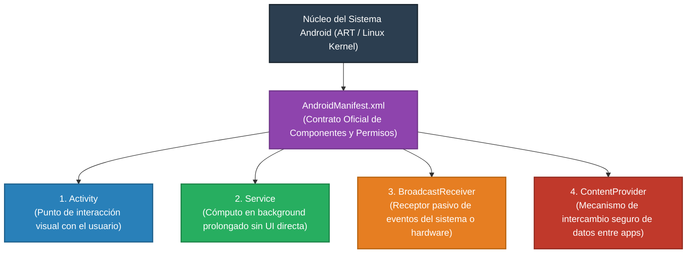
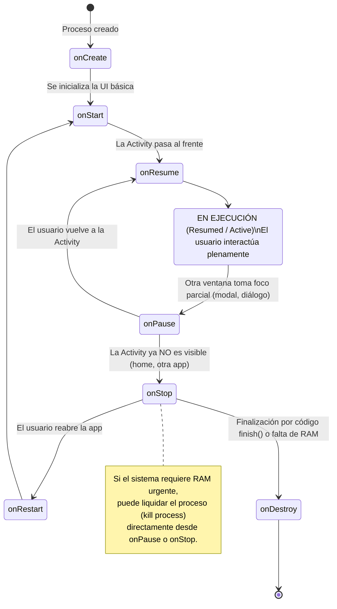
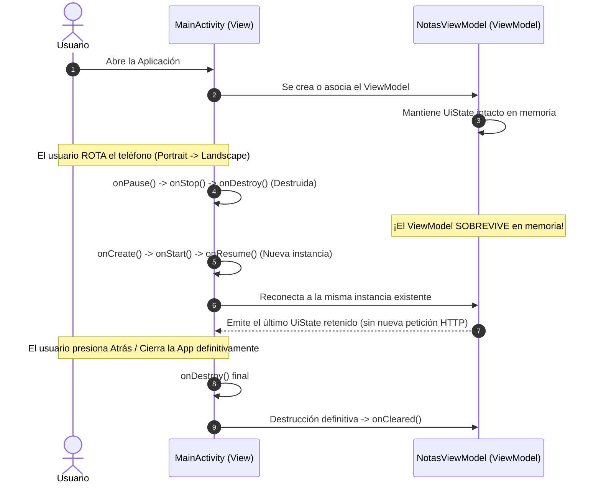
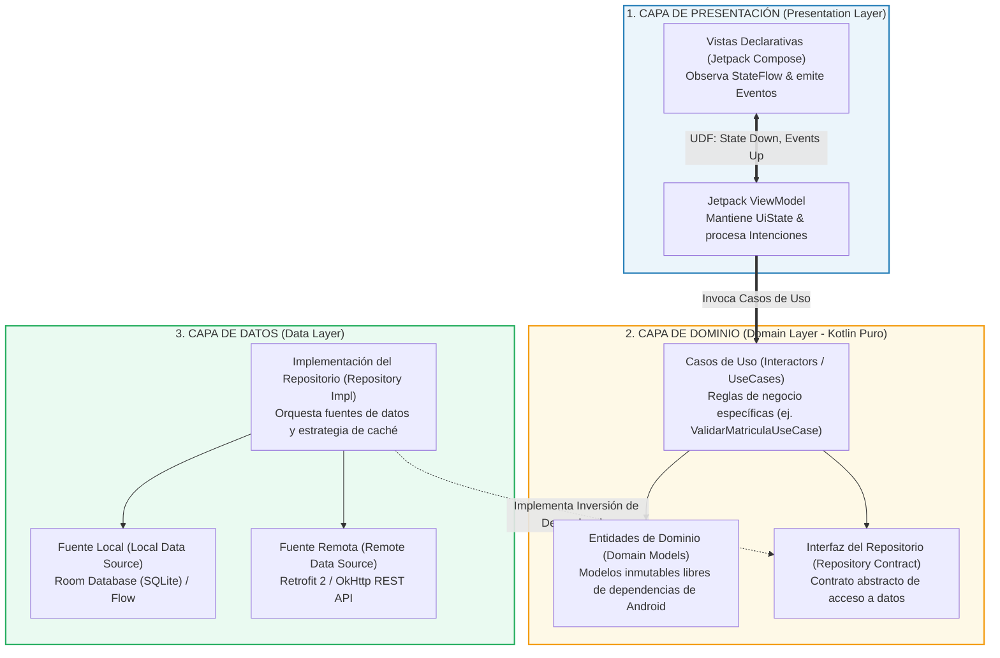
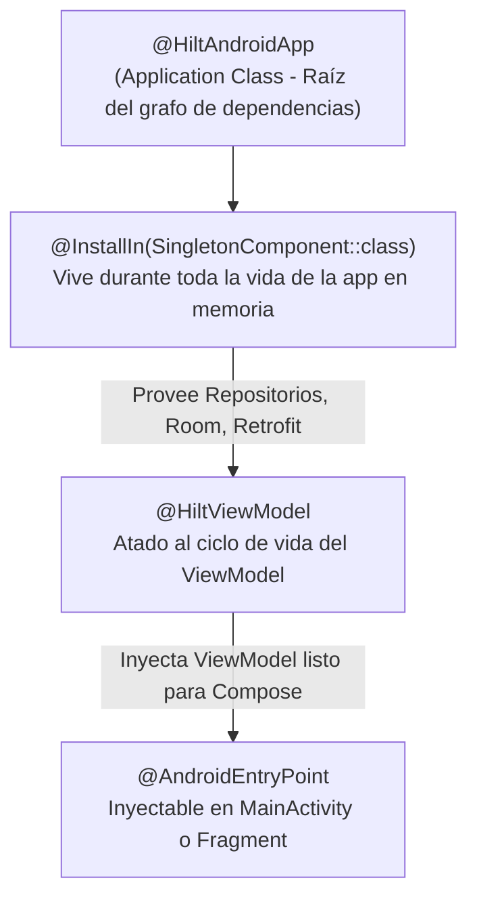
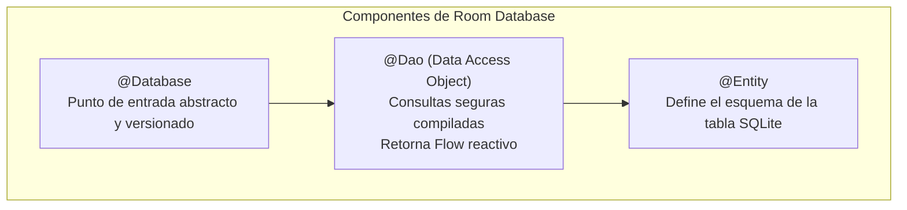

# Arquitectura Android Moderna: Clean Architecture, MVVM, Ciclo de Vida y UDF

> [!info] 💡 ¿Cómo entender esto desde cero? (Guía para novatos de pregrado)
> En el desarrollo de software tradicional de escritorio o consola, el programa arranca en un método `main()` secuencial y finaliza cuando el usuario decide salir. En un sistema operativo móvil como Android, esto **no funciona así**:
> 
> Tu aplicación corre en un dispositivo restringido en recursos donde el usuario puede recibir una llamada entrante en cualquier milisegundo, rotar el teléfono 90 grados, o minimizar la app para enviar un mensaje. Si no organizas tu código mediante una **arquitectura desacoplada**, el sistema operativo destruirá tus datos, congelará la pantalla o colapsará la aplicación. 
> 
> En esta nota abordamos la arquitectura oficial recomendada por Google: la combinación concéntrica de **Clean Architecture**, el patrón de presentación **MVVM (Model-View-ViewModel)** con **Flujo Unidireccional de Datos (UDF)**, la inyección de dependencias con **Hilt**, y la persistencia resiliente con **Room Database** y **Retrofit**.

---

## 1. Los 4 Pilares Fundamentales del Sistema Operativo Android y el `AndroidManifest.xml`

A diferencia de un ejecutable clásico que posee un único punto de entrada, una aplicación Android es una colección de componentes modulares registrados en el archivo manifiesto (`AndroidManifest.xml`), que el sistema operativo puede instanciar de forma independiente según las intenciones (*Intents*) del sistema o de otras apps:



### 1.1. Descripción Formal de los 4 Componentes
1. **`Activity`:** Representa una ventana visual enfocada en la pantalla con la cual el usuario interactúa (por ejemplo, la pantalla de Login o la lista de productos). En la arquitectura moderna de una sola actividad (*Single-Activity Architecture*), existe únicamente una `MainActivity` que hospeda los árboles visuales de Jetpack Compose mediante navegación interna.
2. **`Service`:** Componente sin interfaz gráfica diseñado para ejecutar operaciones continuas en segundo plano, tales como reproducir música en streaming, sincronizar datos con el servidor o registrar la posición del GPS en una ruta de entrenamiento.
3. **`BroadcastReceiver`:** Componente reactivo que escucha transmisiones de eventos globales generadas por el sistema operativo o aplicaciones externas (por ejemplo: `ACTION_BATTERY_LOW`, `BOOT_COMPLETED` o cambio en el estado de conectividad a Wi-Fi).
4. **`ContentProvider`:** Administra el acceso controlado a un repositorio central de datos para compartirlo con otras aplicaciones (por ejemplo, el proveedor nativo de la Libreta de Contactos de Android o la Galería Multimedia mediante `MediaStore`).

---

## 2. El Ciclo de Vida de una `Activity` y el Problema de la Rotación

El ciclo de vida de un `Activity` es una máquina de estados finitos gestionada enteramente por el runtime de Android. La aplicación no controla cuándo se destruye o se crea una pantalla; es el sistema quien lo orquesta en respuesta a las acciones del usuario y la presión de memoria RAM.

### 2.1. Diagrama de Transición de Estados del Ciclo de Vida



### 2.2. Explicación de los Métodos del Ciclo de Vida
* **`onCreate()`:** Se ejecuta una sola vez al instanciar la actividad. Aquí se configuran las dependencias iniciales y se define el contenido visual mediante `setContent { ... }` en Jetpack Compose.
* **`onStart()`:** La actividad se vuelve visible en la pantalla para el usuario, pero aún no tiene el foco de interacción (por ejemplo, está detrás de un cuadro de diálogo transparente).
* **`onResume()`:** La actividad pasa al primer plano activo (*foreground*). En este estado, los eventos de pantalla táctil y sensores se procesan a máxima frecuencia.
* **`onPause()`:** La actividad pierde el foco de primer plano pero sigue parcialmente visible. Es el momento de pausar animaciones o liberar recursos de hardware de alta tasa de refresco.
* **`onStop()`:** La actividad deja de ser completamente visible para el usuario porque otra pantalla la cubre al 100%. Las operaciones pesadas de cómputo deben pausarse.
* **`onDestroy()`:** Invocado antes de que la actividad sea purgada de la memoria RAM.
* **`onRestart()`:** Invocado cuando una actividad en estado detenido (`onStop`) vuelve a la vida visible antes de pasar por `onStart()`.

### 2.3. El Desafío Ingenieril: Destrucción por Cambio de Configuración (*Configuration Changes*)
Cuando el usuario rota el dispositivo físico de posición vertical (*Portrait*) a horizontal (*Landscape*), el sistema operativo Android ejecuta por diseño una secuencia brutal:
1. Destruye la `Activity` invocando `onPause() -> onStop() -> onDestroy()`.
2. Vuelve a crear una nueva instancia de la `Activity` invocando `onCreate() -> onStart() -> onResume()`.

> [!important] ¿Por qué Android destruye la Activity al rotar?
> Para recargar los recursos adecuados de diseño (dimensiones `layout-land`, strings localizados, densidades de pantalla) correspondientes a la nueva orientación física.

### 2.4. La Solución Arquitectural: El Ciclo de Vida del `ViewModel`
Si almacenabas las variables de tu negocio (como el carrito de compras o la lista de estudiantes descargada de la red) dentro de la `Activity`, la rotación borraba todo de la memoria, forzando una costosa y frustrante recarga de red.

El **`ViewModel` de Android Jetpack** fue diseñado para desacoplar el estado de la UI del ciclo de vida visual de la `Activity`:



---

## 3. Arquitectura Limpia (*Clean Architecture*) en Android

La separación de responsabilidades en capas concéntricas garantiza que la lógica del negocio de tu aplicación sea independiente de la interfaz gráfica, del motor de base de datos o de los frameworks del sistema operativo.

### 3.1. Diagrama Canónico de Capas
En la siguiente ilustración del vault se sintetiza la estructura de tres capas estándar de la industria:

![[android-clean-architecture.png]]

### 3.2. Desglose Exhaustivo de las Tres Capas



#### 1. Capa de Presentación (*Presentation Layer*)
* **Rol:** Dibujar la interfaz visual e interactuar con el usuario.
* **Componentes:**
  * **Jetpack Compose:** Funciones `@Composable` que renderizan el árbol de nodos gráficos a partir de un estado inmutable.
  * **ViewModel:** Transforma los datos de los casos de uso en estados consumibles por la UI (`StateFlow<UiState>`) y atiende los eventos del usuario (toques en botones, formularios).
* **Dependencias:** Conoce únicamente la Capa de Dominio. **Jamás** invoca directamente a la base de datos Room o al cliente Retrofit.

#### 2. Capa de Dominio (*Domain Layer*)
* **Rol:** El núcleo intelectual de la aplicación. Contiene las reglas puras del negocio.
* **Regla Sagrada:** Debe ser **Kotlin puro**. No debe importar ningún paquete `android.*`. Esto permite ejecutar pruebas unitarias a la velocidad de la luz en la JVM sin levantar emuladores.
* **Componentes:**
  * **Entidades (*Entities*):** Modelos de negocio inmutables (ej. `Estudiante(val codigo: String, val estadoAcademico: Estado)`).
  * **Casos de Uso (*Use Cases / Interactors*):** Clases de una sola responsabilidad ejecutable mediante el operador `invoke()` (ej. `ObtenerHistorialAcademicoUseCase`).
  * **Interfaces de Repositorio:** Contratos abstractos que definen qué datos necesita el negocio sin detallar cómo se obtienen (`interface EstudianteRepository`).

#### 3. Capa de Datos (*Data Layer*)
* **Rol:** Proveer datos a la aplicación consumiendo fuentes de almacenamiento persistente o red.
* **Componentes:**
  * **Implementación del Repositorio:** Implementa la interfaz definida en el Dominio. Aplica la heurística de sincronización (por ejemplo, buscar primero en caché SQLite y, si expiró, consultar la API REST).
  * **Data Sources Locales:** Base de datos **Room**, `DataStore` (claves/valores encriptados).
  * **Data Sources Remotos:** Interfaces de **Retrofit**, WebSockets o Firebase.
  * **Mappers:** Funciones de extensión que transforman DTOs de red (`EstudianteDto`) y Entidades de Base de Datos (`EstudianteEntity`) en Entidades de Dominio puras (`Estudiante`).

---

## 4. Patrón MVVM y Flujo Unidireccional de Datos (*Unidirectional Data Flow - UDF*)

El mayor error en arquitecturas móviles antiguas era el flujo bidireccional caótico: una vista modificaba directamente una variable de base de datos, y un callback de red manipulaba elementos visuales desfasados.

En la arquitectura moderna se impone el **Flujo Unidireccional de Datos (UDF)**:

```mermaid
flowchart LR
    UI["Vista (Jetpack Compose)"]
    VM["ViewModel"]

    UI ==>|1. Eventos del Usuario hacia arriba<br/>(onBuscarClick, onTextoChanged)| VM
    VM ==>|2. Estado Inmutable hacia abajo<br/>(StateFlow &lt;UiState&gt;)| UI

    style UI fill:#3498db,stroke:#2980b9,stroke-width:2px,color:#fff
    style VM fill:#9b59b6,stroke:#8e44ad,stroke-width:2px,color:#fff
```

### 4.1. Reglas del Flujo Unidireccional
1. **El Estado fluye hacia abajo (*State Down*):** El `ViewModel` es el único dueño de la verdad. Emite una instantánea inmutable (`StateFlow<CatalogoUiState>`). La interfaz gráfica es una espectadora pasiva que se limita a dibujar lo que el estado indica.
2. **Los Eventos fluyen hacia arriba (*Events Up*):** Cuando el usuario interactúa (hace clic en un botón, escribe en un campo de texto), la vista no altera sus propias variables; delega la intención al `ViewModel` mediante una llamada a método (`viewModel.alHacerClicEnMatricular(idMateria)`).

---

## 5. UI Moderna Declarativa con Jetpack Compose vs XML Tradicional

### 5.1. El Cambio de Paradigma: Imperativo vs Declarativo

Durante más de 12 años, Android utilizó un paradigma **imperativo** basado en archivos XML:
* En XML se declaraban árboles estáticos de etiquetas (`<TextView>`, `<Button>`, `<RecyclerView>`).
* En Kotlin/Java se obtenía el puntero a la vista mediante `findViewById<TextView>(R.id.txtNombre)`.
* Para actualizar el texto, el programador debía mutar el objeto en tiempo de ejecución: `txtNombre.text = "Nuevo Nombre"`. Esto causaba inconsistencias cuando múltiples callbacks asíncronos mutaban vistas en órdenes imprevistos.

**Jetpack Compose** revoluciona Android adoptando el paradigma **declarativo**, idéntico conceptualmente a React o Flutter:

$$\text{UI} = f(\text{State})$$

> [!definition] Principio Declarativo de Compose
> La interfaz gráfica no se muta; se **regenera** automáticamente como resultado de evaluar una función pura $f$ sobre el estado actual. Si el estado cambia, Compose recalcula la función y repinta únicamente los nodos visuales afectados en un proceso denominado **Recomposición**.

```kotlin
// Paradigma Declarativo: La UI describe cómo debe lucir según el estado
@Composable
fun TarjetaEstudiante(nombre: String, promedio: Double, esMatriculado: Boolean) {
    Card(
        modifier = Modifier
            .fillMaxWidth()
            .padding(16.dp),
        colors = CardDefaults.cardColors(
            containerColor = if (esMatriculado) MaterialTheme.colorScheme.primaryContainer 
                             else MaterialTheme.colorScheme.errorContainer
        )
    ) {
        Column(modifier = Modifier.padding(16.dp)) {
            Text(text = nombre, style = MaterialTheme.typography.titleLarge)
            Spacer(modifier = Modifier.height(8.dp))
            Text(text = "Promedio acumulado: $promedio", style = MaterialTheme.typography.bodyMedium)
        }
    }
}
```

### 5.2. Recomposición Inteligente y Mecanismo de *Skipping*
El compilador de Compose etiqueta los parámetros de las funciones `@Composable` como **estables** o **inestables**:
* Si el estado que entra a una función `@Composable` no ha mutado respecto al frame anterior, el motor de Compose **se salta (*skips*) la ejecución** de esa función y de todos sus hijos visuales, garantizando un rendimiento constante de 60 o 120 FPS sin caída de frames.

### 5.3. Gestión del Estado en Compose: `remember`, `rememberSaveable` y `mutableStateOf`
* **`mutableStateOf(valor)`:** Crea una variable observable por el runtime de Compose. Cualquier lectura de su `.value` suscribe al componente a la recomposición cuando el valor cambia.
* **`remember { ... }`:** Permite que una variable sobreviva a las recomposiciones ordinarias del árbol gráfico. Sin `remember`, la variable se reasignaría a su valor inicial en cada cuadro repintado.
* **`rememberSaveable { ... }`:** Permite que el valor sobreviva no solo a recomposiciones, sino también a la **destrucción de la Activity por rotación de pantalla** o muerte temporal del proceso mediante el mecanismo de `SavedStateHandle`.

```kotlin
@Composable
fun ContadorAsistencia() {
    // Sobrevive a la rotación de pantalla del dispositivo
    var conteo by rememberSaveable { mutableStateOf(0) }

    Button(onClick = { conteo++ }) {
        Text("Estudiantes presentes: $conteo")
    }
}
```

### 5.4. Componentes Fundamentales de Layout en Compose
* **`Column`:** Apila elementos verticalmente (análogo a un `LinearLayout` vertical).
* **`Row`:** Alinea elementos horizontalmente (análogo a un `LinearLayout` horizontal).
* **`Box`:** Superpone elementos uno encima del otro según su eje Z (análogo a un `FrameLayout`).
* **`LazyColumn`:** El equivalente moderno y reactivo del antiguo `RecyclerView`. Carga y recicla en memoria **únicamente los elementos visibles en la pantalla**, permitiendo desplazar listas infinitas de 500,000 registros sin saturar la memoria RAM.
* **`Scaffold`:** Contenedor de estructura visual de Material Design 3 que reserva y coordina automáticamente los espacios para `topBar`, `bottomBar`, `floatingActionButton` y `snackbarHost`.

```kotlin
@Composable
fun PantallaListaEstudiantes(
    estudiantes: List<Estudiante>,
    onEstudianteClick: (String) -> Unit
) {
    Scaffold(
        topBar = {
            TopAppBar(title = { Text("Facultad de Sistemas EPN") })
        }
    ) { paddingValues ->
        // LazyColumn recicla componentes de forma ultra eficiente
        LazyColumn(
            modifier = Modifier
                .fillMaxSize()
                .padding(paddingValues),
            contentPadding = PaddingValues(16.dp),
            verticalArrangement = Arrangement.spacedBy(8.dp)
        ) {
            items(
                items = estudiantes,
                key = { estudiante -> estudiante.codigo } // Llave única para skipping óptimo
            ) { estudiante ->
                TarjetaEstudianteItem(
                    estudiante = estudiante,
                    onClick = { onEstudianteClick(estudiante.codigo) }
                )
            }
        }
    }
}
```

---

## 6. Inyección de Dependencias con Hilt (Dagger para Android)

> [!definition] ¿Por qué Inyectar Dependencias?
> Si una clase `EstudianteViewModel` instancia directamente a su repositorio dentro de su código (`val repo = EstudianteRepositoryImpl()`), queda **fuertemente acoplada**. No podrás escribir una prueba unitaria que simule el servidor sin hacer llamadas HTTP reales a internet. 
> 
> La Inyección de Dependencias (**DI**) invierte el control: las dependencias requeridas se proporcionan desde el exterior, permitiendo reemplazar componentes reales por dobles de prueba (*Mocks/Fakes*).

### 6.1. Hilt: El Estándar Oficial de Google
Hilt es una capa idiomática sobre **Dagger 2** que integra la inyección de dependencias directamente con el ciclo de vida de los componentes de Android.



### 6.2. Anotaciones Clave de Hilt en Código Real
1. **`@HiltAndroidApp`:** Se coloca en la clase personalizada `Application`. Inicializa la generación de código del árbol de dependencias en tiempo de compilación.
2. **`@AndroidEntryPoint`:** Marca un componente de Android (`Activity`, `Service`, `Fragment`) para que pueda recibir dependencias inyectadas.
3. **`@HiltViewModel`:** Marca un `ViewModel` para que Hilt lo instancie automáticamente con sus dependencias resueltas.
4. **`@Inject constructor(...)`:** Indica al compilador cómo construir una clase inyectando los parámetros requeridos.
5. **`@Module` y `@InstallIn(SingletonComponent::class)`:** Declara un módulo contenedor de proveedores para dependencias de interfaces o librerías externas que no poseen constructor accesible (como instancias de Retrofit o Room).

```kotlin
// Módulo de configuración de dependencias de red y persistencia
@Module
@InstallIn(SingletonComponent::class)
object RedModulo {

    @Provides
    @Singleton
    fun proveerRetrofit(okHttpClient: OkHttpClient): Retrofit {
        return Retrofit.Builder()
            .baseUrl("https://api.epn.edu.ec/v1/")
            .client(okHttpClient)
            .addConverterFactory(Json.asConverterFactory("application/json".toMediaType()))
            .build()
    }

    @Provides
    @Singleton
    fun proveerEstudianteApi(retrofit: Retrofit): EstudianteApiService {
        return retrofit.create(EstudianteApiService::class.java)
    }
}

// Inyección limpia en un ViewModel
@HiltViewModel
class EstudianteViewModel @Inject constructor(
    private val obtenerEstudiantesUseCase: ObtenerEstudiantesUseCase
) : ViewModel() {
    // ViewModel completamente desacoplado y 100% testeable con pruebas unitarias
}
```

---

## 7. Persistencia Local con Room Database (Arquitectura *Offline-First*)

SQLite es el motor de base de datos relacional nativo embebido en todos los dispositivos Android desde la versión 1.0. Sin embargo, escribir consultas SQL crudas con `Cursor` y `SQLiteOpenHelper` era propenso a errores tipográficos y obligaba a parsear columnas manualmente.

**Room** es el Object-Relational Mapping (ORM) oficial de Android Jetpack que provee una capa de abstracción robusta con **verificación de sintaxis SQL en tiempo de compilación**.



### 7.1. Componentes de Room

#### 1. `@Entity` (Entidad de Base de Datos)
```kotlin
@Entity(tableName = "estudiantes")
data class EstudianteEntity(
    @PrimaryKey
    @ColumnInfo(name = "codigo_estudiante")
    val codigo: String,
    
    @ColumnInfo(name = "nombre_completo")
    val nombre: String,
    
    @ColumnInfo(name = "promedio_acumulado")
    val promedio: Double,
    
    @ColumnInfo(name = "fecha_actualizacion")
    val timestamp: Long = System.currentTimeMillis()
)
```

#### 2. `@Dao` (Data Access Object)
El DAO define las operaciones de lectura y escritura. Lo más potente de Room es su soporte nativo para **Kotlin Coroutines** (`suspend`) y flujos reactivos (**`Flow`**). Si la tabla en SQLite cambia, Room emite automáticamente la nueva lista de datos a través del `Flow`:

```kotlin
@Dao
interface EstudianteDao {
    // Consulta reactiva: emite una nueva lista cada vez que la base de datos se actualice
    @Query("SELECT * FROM estudiantes ORDER BY promedio_acumulado DESC")
    fun observarTodosLosEstudiantes(): Flow<List<EstudianteEntity>>

    @Insert(onConflict = OnConflictStrategy.REPLACE)
    suspend fun insertarEstudiantes(estudiantes: List<EstudianteEntity>)

    @Query("DELETE FROM estudiantes")
    suspend fun vaciarTabla()
}
```

#### 3. Estrategia de Caché: "Arquitectura Offline-First"
En una aplicación profesional, la interfaz de usuario **nunca consume directamente de la red**. La **única fuente de la verdad (*Single Source of Truth - SSOT*)** es la base de datos local Room:

```mermaid
sequenceDiagram
    autonumber
    participant UI as UI (Compose)
    participant Repo as Repositorio
    participant DB as Room SQLite Local (SSOT)
    participant API as Retrofit REST Remoto

    UI->>Repo: Solicita observarEstudiantes()
    Repo->>DB: Abre suscripción continua a Flow<List<EstudianteEntity>>
    DB-->>UI: Emite inmediatamente datos en caché local (¡UI instantánea sin spinner!)
    
    Repo->>API: Ejecuta sincronización en segundo plano (Dispatchers.IO)
    alt Conexión Exitosa
        API-->>Repo: Retorna HTTP 200 OK con JSON fresco
        Repo->>DB: Guarda nuevos datos con OnConflictStrategy.REPLACE
        DB-->>UI: El Flow de Room detecta el cambio y re-emite a la UI de forma reactiva
    else Sin Conexión a Internet
        API-->>Repo: Lanza IOException
        Repo-->>UI: Emite advertencia no bloqueante; los datos cacheados permanecen intactos
    end
```

---

## 8. Conectividad de Red con Retrofit 2 y OkHttp

Retrofit (desarrollado por Square) transforma una API HTTP REST en una interfaz declarativa de Kotlin.

```kotlin
// 1. DTO (Data Transfer Object) inmutable anotado para serialización
@Serializable
data class EstudianteDto(
    @SerialName("student_id") val codigo: String,
    @SerialName("full_name") val nombre: String,
    @SerialName("gpa") val promedio: Double
) {
    // Mapeo a Entidad de Dominio
    fun aModeloDominio(): Estudiante = Estudiante(
        codigo = this.codigo,
        nombre = this.nombre,
        promedio = this.promedio
    )
}

// 2. Interfaz declarativa de Retrofit con funciones suspend
interface EstudianteApiService {
    @GET("estudiantes/matriculados")
    suspend fun obtenerEstudiantes(
        @Query("facultad") facultad: String = "Sistemas"
    ): Response<List<EstudianteDto>>
}

// 3. Configuración de cliente OkHttp con Interceptores de autenticación y logging
fun crearOkHttpClient(): OkHttpClient {
    return OkHttpClient.Builder()
        .addInterceptor { chain ->
            // Inyección automática del token JWT en la cabecera de todas las peticiones
            val request = chain.request().newBuilder()
                .addHeader("Authorization", "Bearer eyJhbGciOiJIUzI1...")
                .addHeader("Accept", "application/json")
                .build()
            chain.proceed(request)
        }
        .addInterceptor(HttpLoggingInterceptor().apply {
            level = HttpLoggingInterceptor.Level.BODY // Registra cuerpo de peticiones para depuración
        })
        .connectTimeout(15, TimeUnit.SECONDS)
        .readTimeout(15, TimeUnit.SECONDS)
        .build()
}
```

---

## 9. Síntesis Integradora para la Asignatura ISWD713

| Capa | Tecnología Principal | Responsabilidad Central | ¿Depende de Android? |
| :--- | :--- | :--- | :--- |
| **Presentación** | Jetpack Compose + ViewModel | Renderizar $UI = f(State)$ y capturar intenciones UDF | Sí (`androidx.*`) |
| **Dominio** | UseCases + Entidades | Ejecutar reglas de negocio puras | **NO (100% Kotlin Puro)** |
| **Datos** | Room + Retrofit + OkHttp | Coordinar caché offline y sincronización con API REST | Sí (`Room`, SQLite, OkHttp) |
| **Soporte Transversal**| Hilt (Dagger) | Inyección de dependencias desacopladas y testeables | Sí (`dagger.hilt.*`) |
