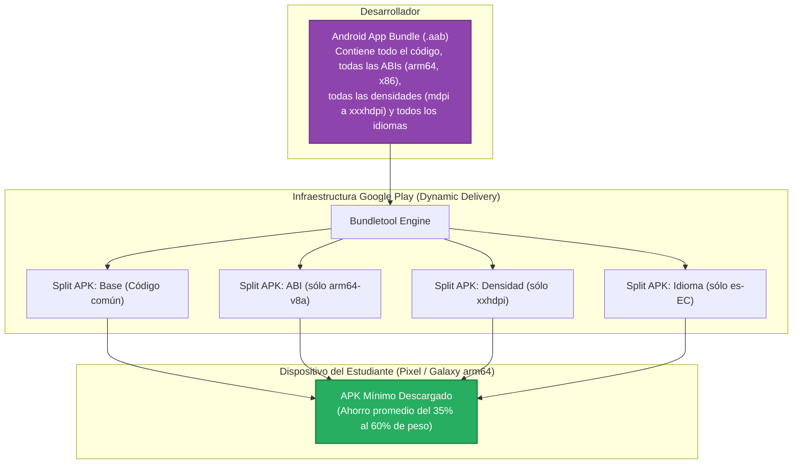
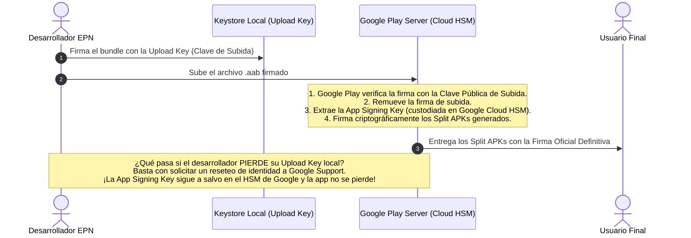
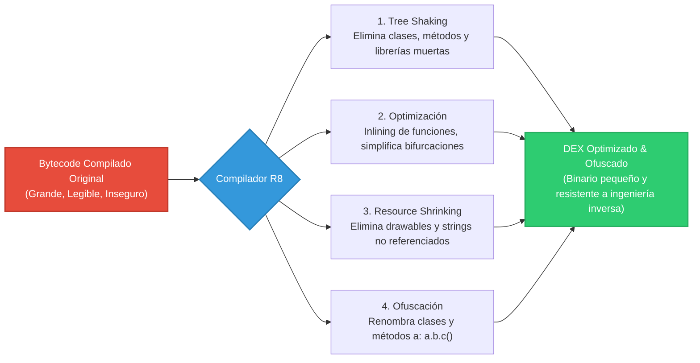

# Distribución, Empaquetado, Optimización y Seguridad en el Ecosistema Android

> [!info] 💡 ¿Cómo entender esto desde cero? (Guía para novatos de pregrado)
> Escribir código limpio y una arquitectura impecable es solo la mitad del trabajo de un ingeniero de software móvil. Una vez que tu app compila localmente, debes enfrentarte al mundo real:
> 
> ¿Cómo se empaqueta tu aplicación para que no pese 150 MB innecesariamente? ¿Cómo evitas que un atacante descargue tu app, la descompile con un clic y robe tus algoritmos propietarios o tokens de API? ¿Cómo aseguras que el usuario no descargue un binario adulterado por ciberdelincuentes?
> 
> En esta nota analizamos la fase de **DevOps móvil y Seguridad Defensiva**: desde la transición del viejo formato **APK** al estándar **Android App Bundle (AAB)**, la criptografía de firmas con **Play App Signing**, la ofuscación matemática con el compilador **R8**, el sistema de **permisos en tiempo de ejecución**, hasta el despliegue industrial mediante **Google Play Console**.

---

## 1. Empaquetado y Formatos de Entrega: APK vs AAB

### 1.1. El Formato Tradicional: APK (*Android Package Kit*)
Históricamente, el resultado del proceso de compilación de Android era un archivo con extensión `.apk`. Un APK es esencialmente un archivo comprimido en formato ZIP que contiene:
* `classes.dex`: El código Kotlin/Java compilado a bytecode Dalvik/ART.
* `resources.arsc`: La tabla de recursos binarios precompilados.
* `res/`: Diseños XML, cadenas de texto, layouts compilados e imágenes.
* `lib/`: Bibliotecas nativas en C/C++ compiladas (`.so`) para todas las arquitecturas de procesador soportadas (`arm64-v8a`, `armeabi-v7a`, `x86`, `x86_64`).
* `assets/`: Fuentes tipográficas, modelos de Machine Learning (TensorFlow Lite) o archivos estáticos.
* `AndroidManifest.xml`: El manifiesto binario procesado.
* `META-INF/`: Certificados y firmas criptográficas del archivo.

#### La Ineficiencia del APK Monolítico (*Fat APK*)
En el modelo clásico de APK, el archivo descargado por el usuario final contenía **absolutamente todos los recursos y arquitecturas**. 
Si un usuario tenía un teléfono moderno con procesador ARM de 64 bits (`arm64-v8a`) y pantalla Full HD (`xxhdpi`), descargaba de forma obligatoria e inútil las librerías para procesadores Intel x86 y los recursos gráficos para pantallas de baja densidad (`mdpi`, `hdpi`). Esto inflaba el tamaño de descarga hasta en un **200% o 300%**, penalizando severamente a usuarios con conexiones móviles limitadas en países en desarrollo.

---

### 1.2. El Estándar Moderno: AAB (*Android App Bundle*) y *Dynamic Delivery*

A partir de agosto de 2021, Google Play decretó el fin del APK como formato de subida y convirtió en **obligatorio** el **Android App Bundle (`.aab`)**.



> [!definition] ¿Cómo funciona Dynamic Delivery y Split APKs?
> El desarrollador genera un único archivo `.aab` y lo sube a Google Play Console. El motor de Google denominado **`bundletool`** procesa el bundle y genera en el servidor una constelación de **Split APKs** (APKs divididos). 
> 
> Cuando el usuario entra a la tienda desde un smartphone específico, Google Play detecta las características de hardware de ese equipo (CPU, resolución de pantalla, idioma) y ensambla al vuelo un paquete mínimo personalizado. El usuario jamás descarga un solo byte que su hardware no vaya a utilizar.

---

## 2. Firma Criptográfica de Aplicaciones y *Play App Signing*

En Android, **ninguna aplicación puede instalarse ni ejecutarse si no está firmada digitalmente** mediante criptografía asimétrica. La firma garantiza dos propiedades de seguridad informática:
1. **Autenticidad:** Asegura que la aplicación proviene legítimamente del autor declarado.
2. **Integridad:** Asegura que ningún byte del código binario fue alterado, infectado o parcheado por un intermediario malicioso (mitigando ataques *Man-In-The-Middle* y troyanización).

### 2.1. El Almacén de Claves (*Keystore*) y la Pesadilla Histórica
Tradicionalmente, el desarrollador generaba un almacén criptográfico local (`.jks` o `.keystore` con formato PKCS12) con una validez mínima de 25 años.

```bash
# Comando de terminal para generar un Keystore local seguro con keytool
keytool -genkey -v -keystore epn_release_key.jks \
    -alias epn_app_alias \
    -keyalg RSA -keysize 4096 -validity 10000 \
    -storetype PKCS12
```

> [!caution] ⚠️ El Desastre de la Pérdida de la Clave Privada Tradicional
> En el modelo anterior, si el ingeniero de software perdía el archivo `release_key.jks` o la contraseña de cifrado, **era criptográficamente imposible actualizar la aplicación en Google Play**. La app quedaba huérfana de por vida; los usuarios existentes nunca recibirían parches de seguridad y la empresa se veía forzada a crear una app nueva en la tienda con un nuevo `package name`, perdiendo millones de descargas y valoraciones acumuladas.

### 2.2. La Solución: *Play App Signing* (Modelo de Doble Clave)

Google Play implementó un esquema de custodia asimétrica de doble clave que elimina por completo este riesgo operacional:



* **Clave de Subida (*Upload Key*):** Es la clave que conserva el desarrollador en su máquina o sistema CI/CD. Sirve únicamente para identificarse ante los servidores de Google al subir el binario. Si se pierde o se compromete, Google puede revocarla y autorizar una nueva sin afectar la aplicación en producción.
* **Clave de Firma de la App (*App Signing Key*):** Es la clave maestra real con la que se distribuyen los APKs a los dispositivos de los usuarios. Reside permanentemente cifrada en módulos de seguridad de hardware (**Google Cloud Hardware Security Modules - HSM**) con certificación FIPS 140-2 Nivel 3.

---

## 3. Optimización, Minificación y Ofuscación con R8 y ProGuard

### 3.1. La Vulnerabilidad Intrínseca del Bytecode: La Ingeniería Inversa con Jadx
El código compilado de Kotlin y Java no produce lenguaje máquina de CPU directo, sino un **bytecode estructurado** de alto nivel para Dalvik/ART. Este bytecode conserva:
* Nombres de clases, interfaces, métodos y atributos.
* Firmas de tipos completas.
* Nombres de variables y números de línea de código.

Si descargas cualquier APK no protegido de internet y lo arrastras a la herramienta de código abierto **Jadx-GUI**, el descompilador reconstruirá en cuestión de segundos el código fuente original en un 95% de fidelidad, exponiendo endpoints privados, algoritmos de cálculo de préstamos, validaciones de licencias y modelos de datos.

### 3.2. El Compilador R8: Los 4 Mecanismos de Optimización Defensiva

Google reemplazó la antigua herramienta ProGuard con **R8**, un optimizador y ofuscador integrado directamente en el compilador de Android (*D8/R8 Pipeline*). R8 ejecuta cuatro tareas esenciales:



1. **Eliminación de Código Muerto (*Tree Shaking*):** R8 analiza el grafo de llamadas desde los puntos de entrada oficiales (`Activity`, `Service`). Si importaste una biblioteca de 15,000 métodos pero solo usas 3 funciones, R8 descarta los otros 14,997 métodos del binario final, evitando el infame límite histórico de 65K métodos (*64K Dex Reference Limit*).
2. **Optimización de Código:** Reordena instrucciones, realiza *inlining* de funciones pequeñas (elimina la sobrecarga de llamada a la pila) y simplifica jerarquías de clases eliminando clases intermedias que no agregan comportamiento.
3. **Reducción de Recursos (*Resource Shrinking*):** Analiza qué recursos visuales (`.png`, `.xml`) no son llamados en ningún punto del código y los reemplaza por entradas binarias vacías de 1 byte en el archivo empaquetado.
4. **Ofuscación de Símbolos:** Renombra clases, variables y métodos significativos (`val saldoBancario: Double`, `fun autenticarUsuario()`) a nombres cortos y carentes de semántica como `a.b.c()`, `var a: Double`. Un analista forense que intente descompilar el APK encontrará un laberinto indescifrable.

### 3.3. Configuración en Gradle (`build.gradle.kts`)
```kotlin
android {
    buildTypes {
        release {
            isMinifyEnabled = true      // Activa R8 (Tree shaking, optimización y ofuscación)
            isShrinkResources = true    // Elimina recursos estáticos no utilizados
            proguardFiles(
                getDefaultProguardFile("proguard-android-optimize.txt"),
                "proguard-rules.pro"
            )
            signingConfig = signingConfigs.getByName("release")
        }
    }
}
```

### 3.4. Reglas ProGuard y la Regla `@Keep` para DTOs Serializables

> [!important] El Peligro de la Ofuscación sobre Motores de Serialización JSON
> Si un convertidor de JSON como **Moshi**, **Gson** o **KotlinX Serialization** intenta deserializar el texto `{"full_name": "Juan Perez"}` en la clase `data class UsuarioDto(val full_name: String)`, pero R8 ofuscó la clase transformándola en `data class a(val b: String)`, el motor de reflexión no encontrará el campo `full_name`. El resultado en producción será que todos los datos llegarán como `null` o la aplicación colapsará.

Para evitar esto, se configuran reglas en `proguard-rules.pro` o se utiliza la anotación `@Keep`:

```kotlin
import androidx.annotation.Keep
import kotlinx.serialization.Serializable
import kotlinx.serialization.SerialName

// La anotación @Keep instruye a R8 para NO renombrar ni eliminar esta clase
@Keep
@Serializable
data class TransaccionDto(
    @SerialName("transaccion_id") val id: String,
    @SerialName("monto_usd") val monto: Double
)
```

En el archivo `proguard-rules.pro`:
```proguard
# Preservar todos los modelos del paquete de datos de red
-keep class ec.edu.epn.moviles.data.remote.model.** { *; }

# Preservar atributos de depuración necesarios para Crashlytics (líneas de error)
-keepattributes SourceFile,LineNumberTable
```

---

## 4. Seguridad de la Plataforma y Permisos en Tiempo de Ejecución (*Runtime Permissions*)

El modelo de seguridad de Android se basa en un esquema de **Sandbox (Caja de Arena)** a nivel del kernel de Linux. Cada aplicación se ejecuta con su propio UID (*User Identifier*) de Linux independiente, lo que impide que un proceso acceda a la memoria o archivos privados de otra app instalada.

Sin embargo, cuando una aplicación requiere acceder a datos privados del usuario o hardware sensitivo, debe someterse al sistema de **Permisos**.

### 4.1. Permisos Normales vs Permisos Peligrosos (*Dangerous Permissions*)

| Categoría | Nivel de Riesgo | Ejemplos | Comportamiento en Android |
| :--- | :--- | :--- | :--- |
| **Normales** (*Install-Time*) | Mínimo impacto a la privacidad | `ACCESS_NETWORK_STATE`, `INTERNET`, `VIBRATE` | Se conceden automáticamente al instalar la app sin consultar al usuario. |
| **Peligrosos** (*Runtime Permissions*) | Alto impacto en privacidad y hardware | `CAMERA`, `ACCESS_FINE_LOCATION`, `RECORD_AUDIO`, `READ_MEDIA_IMAGES` | Deben ser solicitados explícitamente en tiempo de ejecución mientras el usuario navega. |

### 4.2. Flujo Canónico de Solicitud de Permisos en Jetpack Compose

A partir de Android 6.0 (API 23), declarar el permiso en el `AndroidManifest.xml` **no es suficiente**. El sistema exige solicitar la autorización en tiempo de ejecución, con la posibilidad de que el usuario rechace o marque *"No volver a preguntar"*.

```xml
<!-- AndroidManifest.xml -->
<manifest xmlns:android="http://schemas.android.com/apk/res/android">
    <uses-permission android:name="android.permission.INTERNET" />
    <uses-permission android:name="android.permission.CAMERA" />
    <uses-permission android:name="android.permission.ACCESS_FINE_LOCATION" />
</manifest>
```

```kotlin
// Implementación moderna en Jetpack Compose
@Composable
fun PantallaEscanerCredencial() {
    val context = LocalContext.current
    var tienePermisoCamara by remember {
        mutableStateOf(
            ContextCompat.checkSelfPermission(
                context, 
                Manifest.permission.CAMERA
            ) == PackageManager.PERMISSION_GRANTED
        )
    }

    // Launcher reactivo de permisos de AndroidX Activity Contracts
    val lanzadorPermisos = rememberLauncherForActivityResult(
        contract = ActivityResultContracts.RequestPermission()
    ) { esConcedido ->
        tienePermisoCamara = esConcedido
    }

    Column(
        modifier = Modifier.fillMaxSize().padding(16.dp),
        horizontalAlignment = Alignment.CenterHorizontally,
        verticalArrangement = Arrangement.Center
    ) {
        if (tienePermisoCamara) {
            Text("✅ Sensor de Cámara Activado - Listo para escanear código QR")
            VistaCamaraPreview()
        } else {
            Text("Se requiere autorización para utilizar la cámara institucional")
            Spacer(modifier = Modifier.height(12.dp))
            Button(onClick = {
                lanzadorPermisos.launch(Manifest.permission.CAMERA)
            }) {
                Text("Conceder Permiso de Cámara")
            }
        }
    }
}
```

---

## 5. Ciclo de Publicación en Google Play Console

Llevar una aplicación desde el entorno de desarrollo local hasta millones de usuarios globales requiere seguir un riguroso proceso de integración continua (*CI/CD*) y pruebas escalonadas en **Google Play Console**.

```mermaid
flowchart LR
    Dev["Build AAB Firmado"] --> Internal["1. Pista Interna<br/>(Hasta 100 testers)<br/>Disponibilidad inmediata"]
    Internal --> Closed["2. Pista Cerrada (Alpha)<br/>Requisito: 20 testers activos<br/>por 14 días continuos"]
    Closed --> Open["3. Pista Abierta (Beta)<br/>Acceso público general con cupos"]
    Open --> Staged["4. Despliegue Escalonado<br/>(Staged Rollout)"]
    
    subgraph StagedRollout ["Fases de Despliegue Progresivo"]
        Staged --> P10["10% de Usuarios<br/>(Monitorear Crashlytics)"]
        P10 --> P20["20% de Usuarios"]
        P20 --> P50["50% de Usuarios"]
        P50 --> P100["100% Producción Total"]
    end

    style Dev fill:#34495e,stroke:#2c3e50,stroke-width:2px,color:#fff
    style Internal fill:#3498db,stroke:#2980b9,stroke-width:2px,color:#fff
    style Closed fill:#f39c12,stroke:#d35400,stroke-width:2px,color:#fff
    style Open fill:#9b59b6,stroke:#8e44ad,stroke-width:2px,color:#fff
    style P100 fill:#2ecc71,stroke:#27ae60,stroke-width:2px,color:#fff
```



### 5.1. Jerarquía de Pistas de Prueba (*Release Tracks*)
1. **Pista Interna (*Internal Testing*):** Dirigida a desarrolladores y QA interno (hasta 100 usuarios por lista de correos). Las actualizaciones están disponibles en cuestión de 5 a 10 minutos sin revisión humana de Google.
2. **Pista Cerrada (*Closed Testing / Alpha*):**
   > [!important] Requisito Oficial de Google para Cuentas Personales Nuevas
   > Desde finales de 2023, Google exige que toda cuenta personal nueva de desarrollador reclute al menos **20 evaluadores (testers)** que permanezcan suscritos a la pista cerrada de forma continua durante un período mínimo de **14 días** antes de poder solicitar la habilitación del botón de Producción. Esto garantiza que las apps no se lancen con bugs fatales.
3. **Pista Abierta (*Open Testing / Beta*):** Cualquier usuario de Google Play puede unirse voluntariamente a la prueba desde la ficha de la tienda sin invitación previa.
4. **Pista de Producción:** El canal oficial donde la aplicación queda disponible para el público general.

### 5.2. Despliegue Progresivo / Escalonado (*Staged Rollout*)

> [!definition] ¿Por qué Jamás Desplegar al 100% en el Primer Minuto?
> Imagina que compilas una nueva versión con un fallo inadvertido que solo ocurre en dispositivos Xiaomi con Android 14. Si lanzas la actualización al 100% de tus 500,000 usuarios, en 30 minutos recibirás 40,000 quejas, tu calificación bajará de 4.8 a 1.2 estrellas y revertir el error tardará días.

El **Despliegue Escalonado** permite liberar la actualización a un porcentaje controlado:
1. **Día 1:** Se libera al **10%** de la base instalada.
2. **Monitoreo con Firebase Crashlytics:** El equipo de ingeniería supervisa métricas de estabilidad: tasa libre de fallos (*Crash-Free Users* debe ser $\ge 99.5\%$) y métricas de rendimiento (*Android Vitals*: ANR rate $< 0.47\%$).
3. **Día 2:** Si las métricas son estables, se incrementa al **20%** o **50%**.
4. **Día 3:** Si se detecta un pico de fallos inesperados, se **pausa el despliegue de inmediato**, protegiendo al 80% o 90% restante de los usuarios mientras se publica un parche *Hotfix*.
5. **Día 4:** Conclusión exitosa al **100%**.

### 5.3. Sección de Seguridad de los Datos (*Data Safety Section*) y Privacidad
Google Play exige una declaración jurada exhaustiva antes de aprobar cualquier lanzamiento:
* **Recolección de Datos:** Qué datos específicos recopila la app (identificadores personales, ubicación, datos financieros, registros de fallos de telemetría).
* **Compartición con Terceros:** Si los datos se transfieren a redes de anuncios (AdMob) o herramientas de análisis (Google Analytics).
* **Cifrado en Tránsito:** Garantizar que todas las comunicaciones de red viajan exclusivamente bajo túneles seguros **HTTPS / TLS 1.3**.
* **Mecanismo de Eliminación de Cuenta:** Es obligatorio proporcionar a los usuarios una URL o botón dentro de la app para solicitar la eliminación irrevocable de su cuenta y sus datos personales de las bases de datos del servidor.
