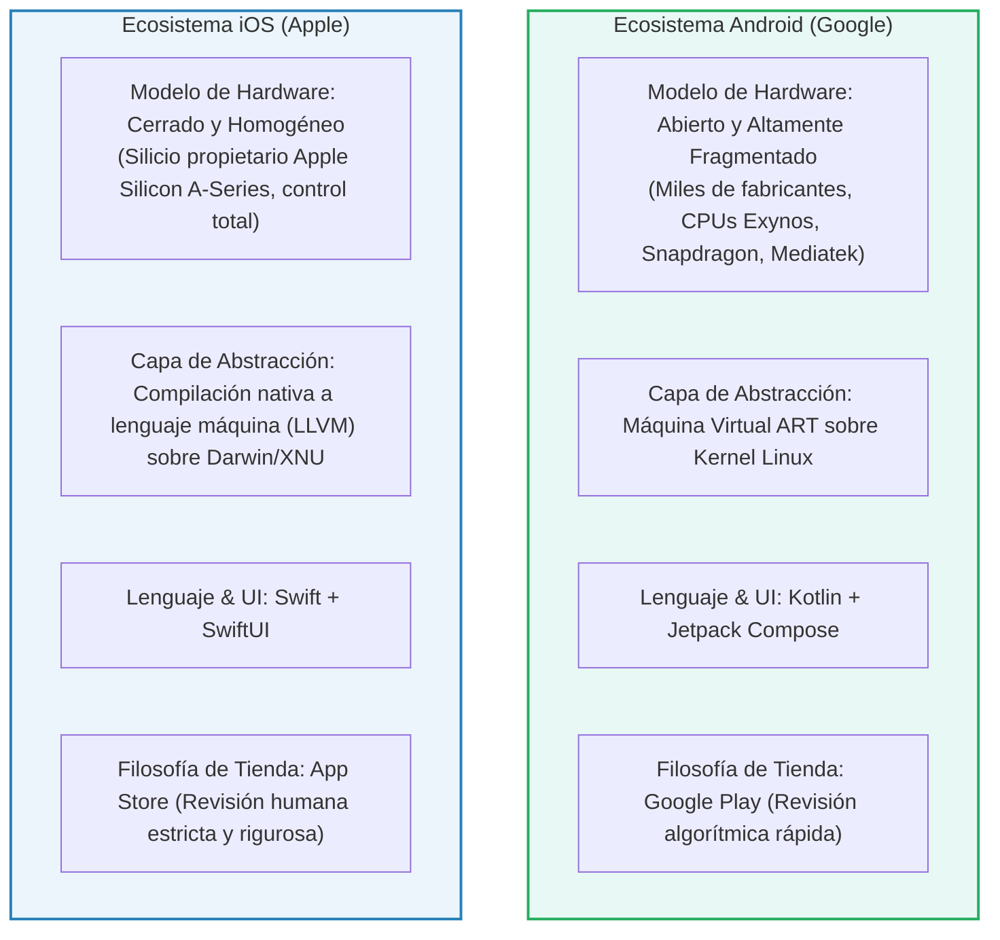
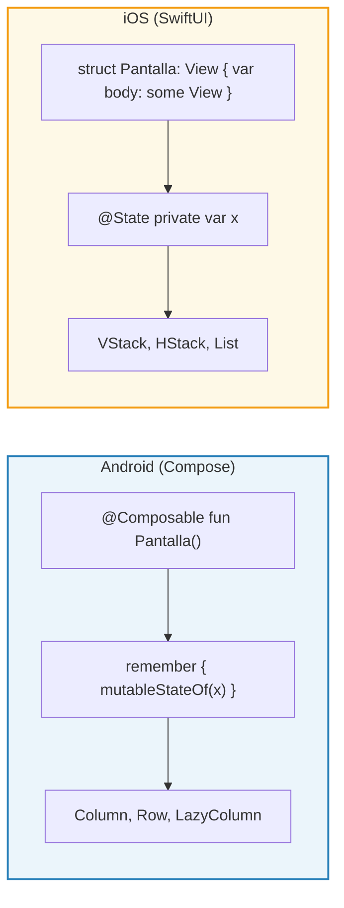
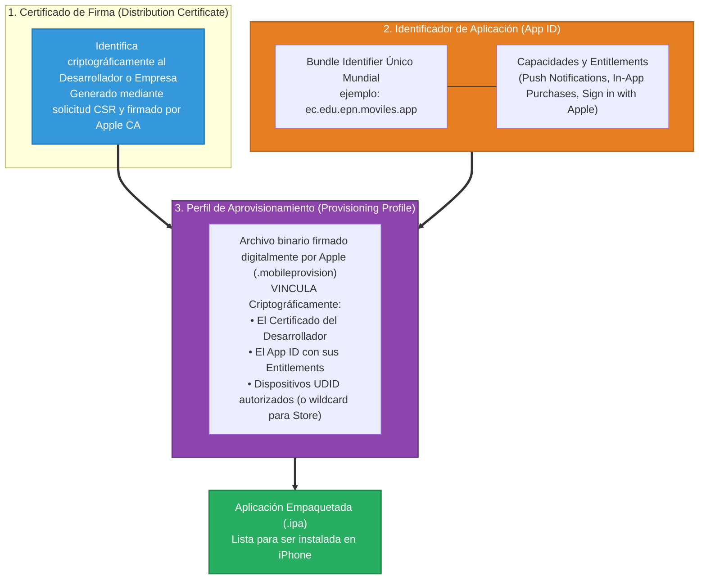
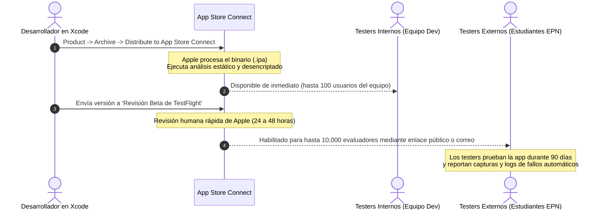

# Fundamentos Esenciales de Desarrollo y Distribución para iOS (Swift y SwiftUI)

> [!info] 💡 ¿Cómo entender esto desde cero? (Guía para novatos de pregrado)
> Un verdadero ingeniero de software móvil de la Escuela Politécnica Nacional no puede limitar su visión a una sola plataforma. Aunque Android domine en cuota de mercado en volumen en América Latina, **iOS (Apple)** concentra los mayores estándares de optimización de hardware/software y un ecosistema comercial de alto valor adquisitivo.
> 
> La gran sorpresa para un estudiante que ya aprendió Kotlin y Jetpack Compose es que **Swift y SwiftUI son conceptualmente gemelos**: ambos lenguajes fueron diseñados con tipado estático, inferencia moderna, seguridad contra nulos y UI puramente reactiva ($UI = f(State)$).
> 
> En esta nota abordamos la arquitectura integral de iOS: la sintaxis de **Swift**, el diseño de interfaces declarativas con **SwiftUI**, la persistencia con **SwiftData**, la concurrencia con `@MainActor`, y el riguroso ecosistema de certificación y distribución a través de **Xcode**, **TestFlight** y **App Store Connect**.

---

## 1. Visión Panorámica Comparativa: Ecosistema Android vs Ecosistema iOS

Para un arquitecto de software móvil, las diferencias entre Android e iOS no son meras preferencias estéticas; se trata de dos filosofías de ingeniería de sistemas radicalmente distintas:



### Tabla Comparativa de Ingeniería

| Dimensión de Ingeniería | Ecosistema Android | Ecosistema iOS |
| :--- | :--- | :--- |
| **Lenguaje Oficial** | Kotlin (compila a Bytecode JVM / DEX) | Swift (compila a lenguaje máquina nativo con LLVM) |
| **Paradigma de UI** | Jetpack Compose (`@Composable`) | SwiftUI (`protocol View { var body: some View }`) |
| **Gestión de Memoria** | Recolector de Basura (*Tracing Garbage Collector* en ART) | Conteo Automático de Referencias (*ARC - Automatic Reference Counting*) en tiempo de compilación |
| **Base de Datos Estándar** | Room Database (capa sobre SQLite) | SwiftData / CoreData (capa sobre SQLite) |
| **IDE Oficial** | Android Studio (JetBrains / IntelliJ IDEA) | Xcode (propietario de Apple, requiere macOS) |
| **Distribución Beta** | Google Play Console (Pistas Interna y Cerrada) | Apple TestFlight (hasta 10,000 evaluadores externos) |

---

## 2. El Lenguaje Swift para Estudiantes de Ingeniería

Lanzado por Apple en 2014 para reemplazar al arcaico y verboso Objective-C, **Swift** es un lenguaje compilado, multicomponente, fuertemente tipado y centrado en la seguridad de memoria.

### 2.1. Inmutabilidad y Tipado Estático: `let` vs `var`
Al igual que en Kotlin con `val` y `var`, Swift promueve la inmutabilidad:
* **`let`:** Declara una constante inmutable. Una vez asignada en memoria, no puede alterarse.
* **`var`:** Declara una variable mutable.

```swift
// Inferencia estática de tipos
let institucion = "Escuela Politécnica Nacional" // String inmutable
var promedioSemestre = 15.8                       // Double mutable
promedioSemestre = 16.2                           // Totalmente válido

// institucion = "Otra" // ERROR DE COMPILACIÓN: Cannot assign to value: 'institucion' is a 'let' constant
```

### 2.2. Seguridad contra Nulos: Opcionales (*Optionals*)
En Swift, ningún tipo estándar puede almacenar `nil` (el análogo a `null`). Si una variable puede carecer de valor, debe declararse explícitamente como un **Opcional** añadiendo el signo `?`.

Para acceder de forma segura al valor contenido dentro de la envoltura opcional (*unwrap*), Swift proporciona tres mecanismos fundamentales:

```swift
var codigoEstudiante: String? = "2024A102"

// 1. Desenpaquetado seguro con 'if let'
if let codigoSeguro = codigoEstudiante {
    print("Código verificado: \(codigoSeguro)")
} else {
    print("El estudiante no posee código asignado")
}

// 2. Salida temprana con 'guard let' (Mecanismo idiomático preferido en funciones)
func matricularMateria(codigo: String?) {
    guard let codigoValido = codigo else {
        print("Operación cancelada: código inválido")
        return // Exige abandonar el ámbito inmediatamente
    }
    // A partir de aquí, codigoValido es de tipo String garantizado (no opcional)
    print("Matriculando al estudiante: \(codigoValido)")
}

// 3. Operador de Coalescencia Nula (??) idéntico al operador Elvis ?: de Kotlin
let displayCodigo = codigoEstudiante ?? "SIN_CODIGO_TEMPORAL"
```

### 2.3. Tipos por Valor (`struct`) vs Tipos por Referencia (`class`)

> [!important] ¿Por qué SwiftUI se construye sobre `struct` y no sobre `class`?
> En Java y C#, casi todo es una clase instanciada en la memoria dinámica (*Heap*), lo que requiere gestión continua del Garbage Collector y genera fragmentación de memoria.
> 
> En Swift:
> * **`struct` (Tipo por Valor):** Se aloja directamente en la memoria rápida de la pila (**Stack**). Cuando se pasa a otra función o variable, se copia por valor. Son inmutables por defecto, ultra livianos y no requieren recolección de basura.
> * **`class` (Tipo por Referencia):** Se aloja en el *Heap*. Múltiples variables apuntan al mismo bloque de memoria. Se gestionan mediante **ARC (Automatic Reference Counting)**.
> 
> Toda vista en **SwiftUI es un `struct`**, lo que permite crear, destruir y recalcular millones de vistas por segundo sin impactar la memoria del iPhone.

```swift
// Struct (Copia por valor en Stack)
struct AlumnoModel {
    var calificacion: Double
}

var alumnoA = AlumnoModel(calificacion: 15.0)
var alumnoB = alumnoA // ¡Se copia el valor de forma independiente!
alumnoB.calificacion = 20.0
print(alumnoA.calificacion) // Imprime 15.0 (No fue afectado)

// Class (Puntero por referencia en Heap)
class SesionUsuario {
    var token: String = "token_inicial"
}

let sesion1 = SesionUsuario()
let sesion2 = sesion1 // Ambas referencias apuntan a la misma dirección física
sesion2.token = "token_modificado"
print(sesion1.token) // Imprime "token_modificado"
```

### 2.4. Protocolos (`protocol`) y Extensiones (`extension`)
* Un **`protocol`** equivale a una `interface` de Java o Kotlin; define un contrato que cualquier estructura o clase puede satisfacer.
* Una **`extension`** permite añadir métodos y propiedades calculadas a tipos existentes (idéntico en propósito a las funciones de extensión de Kotlin).

```swift
// Definición de contrato
protocol IdentificableAcademico {
    var codigoUnico: String { get }
    func emitirCertificado() -> String
}

// Extensión de un tipo nativo del lenguaje
extension Double {
    var aFormatoMonedaUSD: String {
        return String(format: "$%.2f USD", self)
    }
}
let balance = 45.50
print(balance.aFormatoMonedaUSD) // "$45.50 USD"
```

---

## 3. UI Declarativa con SwiftUI

### 3.1. Equivalencia Conceptual Directa con Jetpack Compose

$$\text{UI} = f(\text{State})$$

Tanto Compose como SwiftUI eliminan la manipulación imperativa del árbol de vistas. Si el estado cambia, la interfaz se recalcula de forma declarativa.



### 3.2. Anatomía de una Vista en SwiftUI: El Protocolo `View` y `some View`

```swift
import SwiftUI

struct TarjetaEstudianteView: View {
    let nombre: String
    let promedio: Double
    
    // El tipo opaco 'some View' le indica al compilador que la propiedad retorna
    // una estructura que satisface el protocolo View, sin obligar al desarrollador
    // a escribir el tipo genérico exacto y complejo resultante del layout
    var body: some View {
        VStack(alignment: .leading, spacing: 8) {
            Text(nombre)
                .font(.headline)
                .foregroundColor(.primary)
            
            Text("Promedio: \(promedio, specifier: "%.2f")")
                .font(.subheadline)
                .foregroundColor(.secondary)
        }
        .padding()
        .background(Color(.systemBackground))
        .cornerRadius(12)
        .shadow(radius: 4)
    }
}
```

### 3.3. Propiedades Envolventes de Estado (*Property Wrappers*)

SwiftUI utiliza anotaciones especiales llamadas *Property Wrappers* para conectar los datos reactivos con la interfaz:

1. **`@State`:** Administra el estado interno privado y efímero de una sola vista (por ejemplo, el texto de un campo de formulario o un booleano para abrir un modal).
2. **`@Binding`:** Crea un enlace de dos vías (*Two-Way Binding*) entre una vista hija y una variable `@State` que reside en una vista padre. Permite que la hija lea y modifique el valor del padre.
3. **`@StateObject` y `@ObservedObject`:** Se utilizaban históricamente para conectar vistas con clases `ViewModel` que heredaban de `ObservableObject`.
4. **La Macro `@Observable` (Estándar Moderno de Swift 5.9+ / iOS 17+):** Revoluciona la gestión de estado. Cualquier clase anotada con `@Observable` rastrea automáticamente qué propiedades lee cada vista en pantalla, recomponiendo **únicamente** la vista específica cuando esa propiedad cambia de valor, sin la sobrecarga manual de `@Published`.

```swift
import SwiftUI
import Observation

// 1. Definición del ViewModel con el moderno Framework de Observación
@Observable
class MatriculaViewModel {
    var materiasSeleccionadas: [String] = []
    var estaProcesando: Bool = false
    
    func agregarMateria(_ nombre: String) {
        materiasSeleccionadas.append(nombre)
    }
}

// 2. Consumo en la Vista de SwiftUI
struct PantallaMatriculaView: View {
    // Instanciación directa del ViewModel reactivo
    @State private var viewModel = MatriculaViewModel()
    @State private var textoNuevaMateria: String = ""

    var body: some View {
        NavigationStack {
            VStack {
                HStack {
                    // El signo $ genera un Binding bidireccional hacia la variable @State
                    TextField("Nueva Asignatura EPN", text: $textoNuevaMateria)
                        .textFieldStyle(.roundedBorder)
                    
                    Button("Agregar") {
                        if !textoNuevaMateria.isEmpty {
                            viewModel.agregarMateria(textoNuevaMateria)
                            textoNuevaMateria = ""
                        }
                    }
                    .buttonStyle(.borderedProminent)
                }
                .padding()

                // List: El equivalente a LazyColumn de Android Compose
                List(viewModel.materiasSeleccionadas, id: \.self) { materia in
                    HStack {
                        Image(systemName: "book.closed.fill")
                            .foregroundColor(.blue)
                        Text(materia)
                    }
                }
            }
            .navigationTitle("Matrícula ISWD713")
        }
    }
}
```

### 3.4. Contenedores de Diseño Fundamentales
* **`VStack`:** Alinea elementos verticalmente.
* **`HStack`:** Alinea elementos horizontalmente.
* **`ZStack`:** Superpone elementos a lo largo del eje Z (profundidad).
* **`List`:** Lista con reciclaje de celdas ultra rápido para conjuntos de datos grandes (equivalente al `LazyColumn` de Compose).
* **`NavigationStack`:** Contenedor de navegación por pila con barra de títulos superior y transiciones nativas de empuje (*Push/Pop*).

---

## 4. Persistencia de Datos en iOS: De CoreData a SwiftData

Históricamente, Apple utilizó **`CoreData`** desde 2005 (un framework complejo basado en archivos de modelo XML `.xcdatamodeld` y clases autogeneradas sobre SQLite).

A partir de iOS 17 (2023), Apple introdujo **`SwiftData`**, el equivalente nativo moderno de **Room de Android**, totalmente integrado con la sintaxis de macros de Swift:

```swift
import SwiftData
import Foundation

// Definición de la entidad persistente con la macro @Model
@Model
final class EstudianteEntity {
    @Attribute(.unique) var codigo: String
    var nombre: String
    var promedio: Double
    var fechaRegistro: Date
    
    init(codigo: String, nombre: String, promedio: Double) {
        self.codigo = codigo
        self.nombre = nombre
        self.promedio = promedio
        self.fechaRegistro = Date()
    }
}
```

En la vista de SwiftUI, consultar la base de datos es totalmente declarativo mediante la macro **`@Query`**:
```swift
struct ListaEstudiantesSwiftDataView: View {
    // Consulta reactiva ordenada: si la base SQLite cambia, la lista se actualiza sola
    @Query(sort: \EstudianteEntity.promedio, order: .reverse) 
    private var estudiantes: [EstudianteEntity]
    
    @Environment(\.modelContext) private var modelContext

    var body: some View {
        List(estudiantes) { estudiante in
            Text("\(estudiante.nombre) - \(estudiante.promedio, specifier: "%.1f")")
        }
    }
}
```

---

## 5. Concurrencia Moderna en Swift: `async / await` y el `@MainActor`

Al igual que en Android, el sistema operativo iOS posee un hilo principal (**Main Thread**) responsable de procesar eventos táctiles y dibujar la pantalla a 60/120 Hz (*ProMotion*). Bloquear este hilo genera pérdida de cuadros (*Jank*) o la muerte de la aplicación por el mecanismo del sistema conocido como *Watchdog*.

Swift cuenta con un modelo de concurrencia estructurada de primera clase:

```swift
class ServicioRedAcademico {
    // Función asíncrona no bloqueante
    func descargarCatalogo(idFacultad: Int) async throws -> [String] {
        guard let url = URL(string: "https://api.epn.edu.ec/facultad/\(idFacultad)") else {
            throw URLError(.badURL)
        }
        
        // Invocación asíncrona no bloqueante de URLSession
        let (data, _) = try await URLSession.shared.data(from: url)
        let materias = try JSONDecoder().decode([String].self, from: data)
        return materias
    }
}

// Decorador @MainActor: Garantiza matemáticamente en compilación que
// cualquier mutación de propiedades ocurra estrictamente en el Main Thread
@Observable
@MainActor
class CatalogoViewModel {
    var listaMaterias: [String] = []
    var errorCarga: String?
    
    private let servicio = ServicioRedAcademico()

    func cargarDatos() {
        // Bloque Task: Puente entre el mundo síncrono de SwiftUI y el código asíncrono
        Task {
            do {
                self.listaMaterias = try await servicio.descargarCatalogo(idFacultad: 1)
            } catch {
                self.errorCarga = error.localizedDescription
            }
        }
    }
}
```

---

## 6. Ecosistema, Firma y Distribución en iOS

Distribuir una aplicación para iOS es un proceso considerablemente más estructurado y controlado que en Android.

### 6.1. Requisitos de Infraestructura y el Apple Developer Program
1. **Hardware y Software:** Se requiere obligatoriamente una computadora Mac física con procesador Apple Silicon ejecutando **macOS** y el entorno de desarrollo oficial **Xcode**.
2. **Apple Developer Program:** Para compilar en dispositivos físicos reales sin restricciones temporales de 7 días y publicar en la tienda, es obligatorio pagar una suscripción anual de **$99 USD/año** (o $299 USD para el programa Enterprise).

### 6.2. La Tríada de Seguridad Criptográfica de Apple

En iOS es imposible instalar un binario si no cumple con la **Tríada de Aprovisionamiento**:



1. **Certificado de Firma (*Certificate*):** Certificado X.509 emitido por la Autoridad Certificadora de Apple. Asocia la identidad legal del desarrollador con un par de claves asimétricas RSA/ECC.
2. **App ID (*Bundle Identifier*):** Cadena en notación de dominio inverso (ej. `ec.edu.epn.moviles`) que identifica inequívocamente a la app en el sistema operativo.
3. **Perfil de Aprovisionamiento (*Provisioning Profile*):** El elemento clave de Apple. Es un archivo firmado digitalmente que amarra el Certificado, el App ID y los permisos del sistema (*Entitlements*). El kernel de iOS no permitirá que el binario arranque si el perfil no coincide byte a byte.

---

### 6.3. Pruebas Beta Industriales con Apple TestFlight

Antes de exponer una aplicación al público general, el equipo de ingeniería utiliza **TestFlight**:



* **Capacidad:** Permite distribuir versiones beta hasta a **10,000 evaluadores externos** mediante un enlace público de invitación o lista de correos.
* **Vigencia:** Cada compilación (*build*) tiene una vigencia exacta de **90 días**, transcurridos los cuales expira automáticamente, forzando un ciclo continuo de integración y entrega.
* **Captura de Fallos:** Si la app sufre un crash, TestFlight remite automáticamente el reporte desofuscado (*symbolicated crash log*) directamente al panel de Xcode del desarrollador.

---

### 6.4. Proceso de Revisión y Publicación en App Store Connect

A diferencia de la mayoría de tiendas de software donde la aprobación es algorítmica, Apple mantiene un riguroso proceso de **Revisión Humana (*App Store Review*)**. Un equipo de ingenieros de Apple en Cupertino descarga físicamente tu app en dispositivos reales y prueba todos los flujos de negocio antes de autorizarla.

#### Los 3 Motivos de Rechazo Más Comunes en Proyectos Universitarios y Profesionales
1. **Guideline 2.1 - App Completeness:** La app contiene botones ficticios que no hacen nada, textos de relleno (*"Lorem Ipsum"*), enlaces rotos o colapsa al presionar una opción en el iPad o en modo oscuro.
2. **Guideline 4.2 - Minimum Functionality:** La aplicación se limita a ser una envoltura (*wrapper*) web de un sitio existente o carece de valor agregado nativo propio de un dispositivo móvil.
3. **Guideline 5.1 - Data Privacy & Account Deletion:** Si la aplicación permite a los usuarios registrarse o iniciar sesión, **es obligatorio por normativa de Apple incluir un botón visible para solicitar el borrado permanente e irreversible de la cuenta** directamente desde la interfaz móvil.

Una vez superada la revisión, el estado de la aplicación pasa a **"Ready for Sale"** y se replica en los servidores globales de la App Store en más de 175 países.
