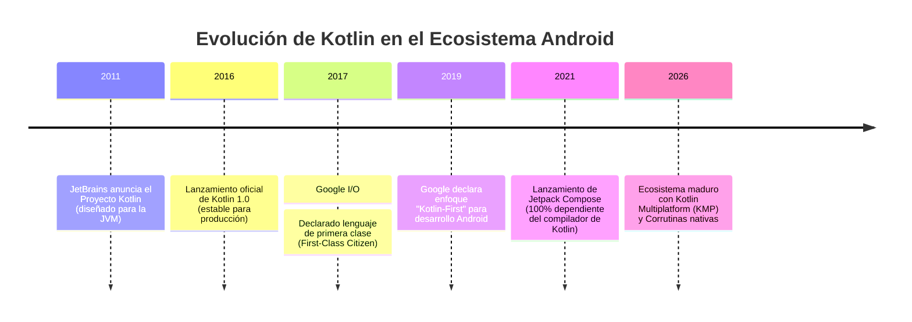
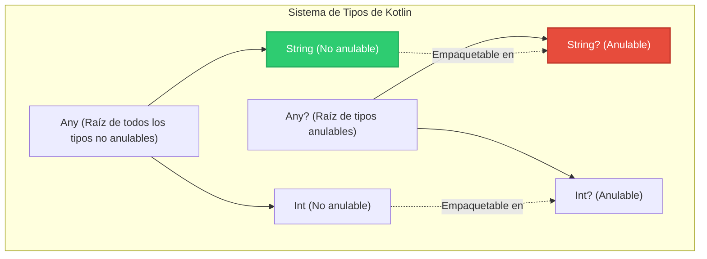
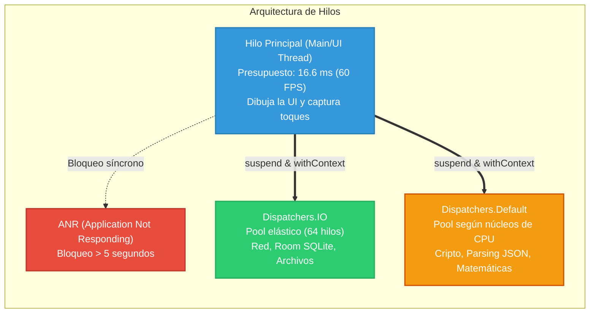
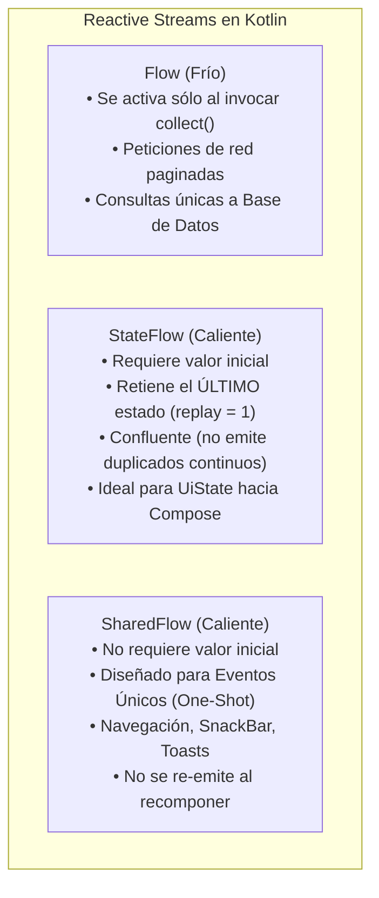

# Programación en Kotlin para Android: Fundamentos, Seguridad y Concurrencia

> [!info] 💡 ¿Cómo entender esto desde cero? (Guía para novatos de pregrado)
> Imagina que estás construyendo una aplicación móvil de misión crítica. En los inicios de Android, programar en Java requería escribir cientos de líneas de código repetitivo (*boilerplate*), y el más mínimo descuido con una variable sin inicializar provocaba el colapso instantáneo de la app mediante el temido `NullPointerException`. 
> 
> **Kotlin** no es simplemente una "versión corta" de Java; es un lenguaje moderno diseñado específicamente para eliminar de raíz los errores más comunes de la industria del software. En esta nota abordamos desde los ladrillos elementales (inmutabilidad y tipado) hasta los conceptos avanzados de **seguridad contra nulos**, **modelado de estados con clases selladas** y **concurrencia reactiva no bloqueante mediante Corrutinas y Flows**.

---

## 1. Contexto Histórico: ¿Por qué Google adoptó Kotlin como Lenguaje Oficial?

Durante casi una década (2008–2017), el ecosistema Android estuvo anclado a **Java** (específicamente versiones compatibles con Java 6 y 7 en dispositivos legados). Esto generó tres problemas estructurales graves para la ingeniería de software móvil:

1. **Verbosidad Extrema y Fricción de Mantenimiento:** Tareas cotidianas como crear un modelo de datos (*POJO*) exigían decenas de líneas de métodos accesores (`getters`/`setters`), `equals()`, `hashCode()` y constructores redundantes.
2. **El "Error del Billón de Dólares":** Tony Hoare (creador de la referencia nula en 1965) denominó a `null` su mayor equivocación. En Java, cualquier referencia a objeto puede ser nula en cualquier momento, delegando al programador la carga mental de validar `if (obj != null)` en cada capa. En Android, esto se traducía en caídas (*crashes*) constantes en producción.
3. **Falta de Funcionalidades Modernas:** La adopción de programación funcional, expresiones lambda, inmutabilidad por defecto e inferencia de tipos avanzaba con extrema lentitud debido a restricciones de compatibilidad del runtime de Android (Dalvik/ART).



### 1.1. Interoperabilidad al 100% con Java
Kotlin se compila directamente a **bytecode de la JVM** (`.class`). Por tanto, una clase escrita en Kotlin puede invocar código Java y viceversa sin penalización de rendimiento ni adaptadores intermedios. Los equipos de ingeniería pudieron migrar bases de código millonarias archivo por archivo de forma incremental.

---

## 2. Sintaxis y Fundamentos para Novatos

### 2.1. Inmutabilidad por Diseño: `val` vs `var`

En ingeniería de software moderna, la **mutabilidad incontrolada** es la principal fuente de condiciones de carrera (*race conditions*) y efectos secundarios no deseados (*side effects*). Kotlin impone una distinción léxica fundamental:

* **`val` (Value):** Define una referencia de solo lectura (**inmutable**). Una vez asignado el valor, no puede reasignarse. Equivale a `final` en Java o `const` en punteros de C++. Debe ser la opción predeterminada en el 95% del código.
* **`var` (Variable):** Define una referencia reasignable (**mutable**). Se reserva estrictamente para acumuladores, contadores o estados locales transitorios.

```kotlin
// Declaración con inferencia de tipos estática
val nombreUniversidad: String = "Escuela Politécnica Nacional" // Explícito
val codigoMateria = "ISWD713"                                // Inferencia automática (String)
val creditos = 4                                             // Inferencia automática (Int)

var estudiantesMatriculados = 35
estudiantesMatriculados = 36 // Válido: es mutable

// nombreUniversidad = "Otra" // ERROR DE COMPILACIÓN: Val cannot be reassigned
```

> [!important] Inferencia Estática de Tipos vs Tipado Dinámico
> No confundas Kotlin con JavaScript o Python. Kotlin es **estáticamente tipado**. El compilador infiere el tipo exacto en tiempo de compilación; una variable declarada como `val x = 10` es irreversiblemente un `Int` y nunca podrá contener un texto.

### 2.2. Tipos Primitivos en el Bytecode de la JVM
A diferencia de Java, en Kotlin **no existen palabras clave primitivas en minúscula** (`int`, `boolean`, `double`). Todo se escribe con tipos de objeto en mayúscula: `Int`, `Boolean`, `Double`, `Float`, `Long`, `Byte`.

Sin embargo, a nivel de compilación, el compilador de Kotlin es sumamente inteligente:
* Si la variable no puede ser nula (`Int`), el compilador genera un tipo primitivo crudo de Java (`int`) de 32 bits en el bytecode para máxima velocidad de ejecución y nulo consumo de memoria de cabecera de objeto (*zero allocation overhead*).
* Si la variable es anulable (`Int?`), el compilador la empaqueta automáticamente (*boxing*) en `java.lang.Integer`.

### 2.3. Plantillas de Texto (*String Templates*)
Se eliminó la concatenación engorrosa mediante el operador `+`. Kotlin permite interpolar variables y expresiones complejas usando el prefijo `$`:

```kotlin
val materia = "Aplicaciones Móviles"
val notaPrimerBimestre = 8.5
val notaSegundoBimestre = 7.0

// Interpolación simple de variables ($variable) y expresiones (${expresion})
val reporte = "Materia: $materia | Promedio: ${(notaPrimerBimestre + notaSegundoBimestre) / 2}"
println(reporte) // Materia: Aplicaciones Móviles | Promedio: 7.75
```

### 2.4. Estructuras de Control como Expresiones: `if` y `when`

En Kotlin, tanto `if` como `when` son **expresiones**, lo que significa que **retornan un valor**. Esto elimina la necesidad del operador ternario `condicion ? valor1 : valor2` de C++/Java.

#### `if` como Expresión
```kotlin
val calificacion = 14.5
// El resultado de la rama evaluada se asigna directamente a la variable inmutable
val estadoEstudiante = if (calificacion >= 14.0) {
    "Aprobado Directo"
} else if (calificacion >= 9.0) {
    "Examen Supletorio"
} else {
    "Reprobado"
}
```

#### `when` como Reemplazo de Alta Potencia de `switch`
La estructura `when` de Kotlin evalúa argumentos contra cualquier condición (no solo enteros o constantes de enumeración):

```kotlin
fun clasificarDispositivo(anchoDp: Int, nivelBateria: Int): String {
    return when (anchoDp) {
        in 0..599 -> "Smartphone Vertical (Compact)"
        in 600..839 -> "Tablet Pequeña o Teléfono Plegable desplegado"
        in 840..Int.MAX_VALUE -> "Tablet de Pantalla Completa o Desktop"
        else -> "Resolución Inválida"
    }
}

// when sin argumento: evalúa expresiones booleanas arbitrarias
fun evaluarRendimiento(fps: Double, frameDropCount: Int): String = when {
    fps >= 59.0 && frameDropCount == 0 -> "Rendimiento Perfecto (60 FPS estables)"
    fps >= 45.0 -> "Jank Moderado: Optimizar dibujo de vistas"
    else -> "Alerta Crítica: Bloqueo potencial del Main Thread"
}
```

---

## 3. Seguridad contra Nulos (*Null Safety*): El Fin de `NullPointerException`

El sistema de tipos de Kotlin separa explícitamente las referencias que **pueden admitir nulo** de aquellas que **tienen garantizado por el compilador que nunca serán nulas**.



### 3.1. Tipos No Anulables vs Anulables
Por defecto, todo tipo en Kotlin es **no anulable**:

```kotlin
var nombreSeguro: String = "Alejandro"
// nombreSeguro = null // ERROR DE COMPILACIÓN: Null can not be a value of a non-null type String

var nombreOpcional: String? = "Alejandro"
nombreOpcional = null // Totalmente válido: el símbolo ? habilita la anulabilidad
```

### 3.2. Operador de Llamada Segura (`?.`)
Si una variable puede ser nula, el compilador bloquea el acceso directo a sus miembros (`nombreOpcional.length` no compila). Se debe usar el operador de navegación segura `?.`, el cual evalúa el miembro solo si la referencia no es nula; de lo contrario, retorna inmediatamente `null`:

```kotlin
val longitud: Int? = nombreOpcional?.length
```

### 3.3. Operador Elvis (`?:`) para Valores por Defecto
El operador Elvis (llamado así por el peinado de Elvis Presley `?:`) provee un valor alternativo de respaldo si la expresión izquierda resulta ser `null`:

```kotlin
val nombreUsuario: String? = obtenerNombreDesdeServidor()

// Si nombreUsuario es null, asigna "Invitado EPN"
val displayUsuario: String = nombreUsuario ?: "Invitado EPN"

// Patrón canónico de escape temprano (Early Return):
fun procesarIdentificacion(token: String?) {
    val tokenValido = token ?: throw IllegalArgumentException("El token no puede ser nulo")
    // A partir de aquí, tokenValido es de tipo String (no anulable garantizado)
}
```

### 3.4. Aserción No Nula (`!!`): El Antipatrón Peligroso
El operador `!!` le dice al compilador: *"Obliga a tratar esta variable como no nula; juro que no es null y, si lo es, acepto que el programa colapse"*.

```kotlin
val idDispositivo: String? = null
// val longitudId = idDispositivo!!.length // LANZA: NullPointerException instantáneo
```

> [!caution] ⚠️ Regla de Oro en Producción
> El operador `!!` está prácticamente **prohibido** en bases de código profesionales de Android. Su uso anula toda la protección del compilador de Kotlin y reinstaura los crashes aleatorios. Si requieres verificar nulidad, usa llamadas seguras, operadores Elvis o el operador de ámbito `let`.

### 3.5. Idioma Canónico: Operador `?.let { ... }`
En Android se interactúa constantemente con datos externos que pueden ser nulos. La combinación `?.let` garantiza que un bloque de código solo se ejecutará cuando la variable sea estrictamente no nula:

```kotlin
val urlAvatar: String? = usuario.avatarUrl

urlAvatar?.let { urlSegura ->
    // Este bloque sólo se ejecuta si urlAvatar != null
    // Dentro del bloque, 'urlSegura' es de tipo String (no anulable)
    cargarImagenConGlide(url = urlSegura)
}
```

---

## 4. Programación Orientada a Objetos en Kotlin

### 4.1. Constructores Primarios, Secundarios e `init`

En Kotlin, la definición de la clase y su constructor primario se fusionan elegantemente en la cabecera:

```kotlin
class Estudiante(
    val id: String,                  // Propiedad inmutable pública
    var nombre: String,              // Propiedad mutable pública
    promedioInicial: Double          // Parámetro de constructor (no propiedad)
) {
    var promedio: Double = promedioInicial
        private set // El promedio solo se puede modificar internamente

    // Bloque de inicialización que se ejecuta inmediatamente tras el constructor primario
    init {
        require(id.isNotBlank()) { "El ID del estudiante no puede estar vacío" }
        require(promedioInicial in 0.0..20.0) { "La escala EPN es de 0 a 20 puntos" }
    }

    // Constructor secundario (debe delegar explícitamente en el primario mediante 'this')
    constructor(id: String, nombre: String) : this(id, nombre, promedioInicial = 0.0)
}
```

### 4.2. `data class`: El Fin del Código Basura
Una `data class` está diseñada exclusivamente para transportar datos inmutables. Con solo añadir la palabra reservada `data`, el compilador autogenera en el bytecode:
1. `equals()` y `hashCode()` basados en las propiedades del constructor.
2. `toString()` legible formateado con los campos (`EstudianteDto(id=1, nombre=Juan)`).
3. Funciones `component1()`, `component2()`, ..., `componentN()` para desestructuración de tuplas.
4. Función `copy()` para clonar objetos modificando únicamente los campos deseados (pilar fundamental de la arquitectura de estado inmutable en Android).

```kotlin
data class UsuarioDto(
    val id: Long,
    val username: String,
    val email: String,
    val esAdmin: Boolean = false
)

fun demostracionDataClass() {
    val u1 = UsuarioDto(1L, "alech", "alech@epn.edu.ec")
    
    // 1. Inmutabilidad y clonación con modificación parcial (copy)
    val u2 = u1.copy(esAdmin = true)
    
    // 2. Comparación estructural profunda (equals)
    println(u1 == u2) // false (compara valores, no punteros de memoria como Java)
    
    // 3. Desestructuración de campos
    val (identificador, nombreUsuario) = u1
    println("ID: $identificador, User: $nombreUsuario")
}
```

### 4.3. Modelado Exhaustivo de Jerarquías: `sealed class` y `sealed interface`

> [!definition] ¿Qué es una Clase Sellada?
> Una `sealed class` o `sealed interface` representa una jerarquía restringida donde todas las subclases directas son conocidas en **tiempo de compilación**. No se pueden crear nuevas subclases fuera del módulo/archivo donde fue declarada.

En Android moderno, las clases selladas son el mecanismo estándar de la industria para modelar el **Estado de la Interfaz de Usuario (UiState)**:

```kotlin
sealed interface UiState<out T> {
    data object Idle : UiState<Nothing>
    data object Loading : UiState<Nothing>
    data class Success<T>(val data: T) : UiState<T>
    data class Error(val mensaje: String, val throwable: Throwable? = null) : UiState<Nothing>
}
```

#### Consumo Exhaustivo con `when` (Sin Cláusula `else`)
Cuando evalúas una `sealed class` en un `when`, el compilador sabe exactamente cuáles son todos los casos posibles. **No se necesita rama `else`**. Si mañana un ingeniero añade un nuevo estado `Empty` a la interfaz y olvida actualizar la UI, el código **no compilará**, previniendo estados no controlados en tiempo de ejecución:

```kotlin
fun renderizarPantalla(state: UiState<List<Estudiante>>) {
    when (state) {
        is UiState.Idle -> mostrarPantallaInicial()
        is UiState.Loading -> mostrarIndicadorCarga(visible = true)
        is UiState.Success -> {
            mostrarIndicadorCarga(visible = false)
            dibujarListaEstudiantes(state.data) // Smart cast automático a Success
        }
        is UiState.Error -> {
            mostrarIndicadorCarga(visible = false)
            mostrarAlertaError(state.mensaje)
        }
    }
}
```

### 4.4. `object` (Singleton) y `companion object` (Miembros Estáticos)
* **`object`:** Declara e instiga un patrón **Singleton** en una sola línea. Es inherentemente seguro contra múltiples hilos (*thread-safe*) y se inicializa de forma perezosa (*lazy*) al ser invocado por primera vez.
* **`companion object`:** Kotlin no tiene la palabra clave `static`. Cualquier método o constante que pertenezca a la clase y no a las instancias se ubica dentro de un `companion object`.

```kotlin
// 1. Singleton Global
object GestorSesion {
    var tokenJwt: String? = null
    fun estaAutenticado(): Boolean = tokenJwt != null
}

// 2. Companion Object (Fábricas y Constantes)
class Cifrador private constructor() {
    companion object {
        const val ALGORITMO = "AES/GCM/NoPadding"
        
        fun crearInstancia(): Cifrador {
            return Cifrador()
        }
    }
}
// Invocación directa similar a static de Java:
val algoritmo = Cifrador.ALGORITMO
```

---

## 5. Funciones, Expresiones Lambda y Funciones de Extensión

### 5.1. Funciones de Extensión: Extender sin Heredar
¿Cuántas veces has deseado que la clase `Context` o `View` de Android tuviera un método para mostrar un Toast o esconder el teclado sin tener que crear una clase utilitaria monstruosa `ContextUtils.java`?

Las **funciones de extensión** permiten añadir métodos a clases existentes de bibliotecas de terceros o del SDK de Android sin modificar su código fuente ni heredar de ellas:

```kotlin
import android.content.Context
import android.view.View
import android.widget.Toast

// Extensión sobre la clase Context del SDK de Android
fun Context.mostrarToast(mensaje: String, duracion: Int = Toast.LENGTH_SHORT) {
    Toast.makeText(this, mensaje, duracion).show()
}

// Extensión sobre View para manipular visibilidad reactiva
fun View.desvanecerSi(condicion: Boolean) {
    this.visibility = if (condicion) View.GONE else View.VISIBLE
}

// Uso natural y limpio en un Activity o Composable:
// context.mostrarToast("¡Conexión establecida con éxito!")
```

> [!important] ¿Cómo funcionan bajo el capó?
> Las funciones de extensión **no modifican la clase real**. El compilador genera un método estático estricto donde el objeto receptor (`this`) se pasa como el primer parámetro: `public static void mostrarToast(Context $this, String mensaje)`.

### 5.2. Funciones de Orden Superior y Sintaxis *Trailing Lambda*
Una función de orden superior es aquella que recibe otra función como parámetro o retorna una función. Si el último parámetro de una función es una lambda, Kotlin permite extraerla fuera de los paréntesis (*Trailing Lambda*):

```kotlin
// Definición de función de orden superior
fun ejecutarTransaccionConReintentos(
    intentos: Int,
    operacion: () -> Boolean
): Boolean {
    for (i in 1..intentos) {
        if (operacion()) return true
    }
    return false
}

// Invocación con sintaxis de trailing lambda:
val exito = ejecutarTransaccionConReintentos(3) {
    // La lambda se escribe limpiamente fuera de los paréntesis ()
    enviarPaqueteRed()
}
```

---

## 6. Concurrencia Asíncrona con Kotlin Coroutines

En los sistemas operativos móviles, la gestión del tiempo de cómputo es el factor determinante entre una aplicación fluida y una app inutilizable.



### 6.1. El Hilo Principal y el Error ANR (*Application Not Responding*)
Android renderiza la interfaz gráfica a **60 fotogramas por segundo (FPS)**, lo que significa que el hilo principal (`Main Thread`) tiene una ventana máxima de **16.6 milisegundos** por fotograma para calcular el diseño y dibujar los píxeles. Si el desarrollador ejecuta una consulta a base de datos o una petición HTTP de forma síncrona en el hilo principal:
1. El hilo principal se congela (*UI freezing/jank*).
2. Los eventos de toque del usuario se encolan sin respuesta.
3. Tras **5 segundos de bloqueo**, el sistema operativo Android mata el proceso y despliega el diálogo fatal: **ANR (Application Not Responding)**.

### 6.2. Funciones de Suspensión (`suspend fun`): Pausas No Bloqueantes
Una corrutina es un hilo liviano que puede suspenderse sin bloquear el hilo real subyacente. Cuando una función se declara con `suspend`, el compilador la transforma en una máquina de estados finitos (*Continuation Passing Style - CPS*).

```kotlin
// La palabra clave 'suspend' indica que la función puede pausar su ejecución
// liberando el hilo actual hasta que el resultado esté disponible
suspend fun autenticarEstudiante(codigo: String, contrasenia: String): UsuarioDto {
    // withContext conmuta la corrutina al hilo de IO de manera transparente
    return withContext(Dispatchers.IO) {
        val respuesta = clienteRetrofit.login(codigo, contrasenia)
        respuesta.aModeloDominio()
    }
}
```

### 6.3. Despachadores de Corrutinas (*Dispatchers*)
Indican en qué hilo o grupo de hilos (*Thread Pool*) se ejecutará la corrutina:
* **`Dispatchers.Main`:** Optimizado para interactuar con la interfaz gráfica, actualizar estados de Compose y registrar toques.
* **`Dispatchers.IO`:** Optimizado para operaciones bloqueantes de entrada/salida (consultas a Room SQLite, lectura/escritura de archivos en disco, llamadas de red HTTP con Retrofit). Utiliza un pool elástico de hasta 64 hilos.
* **`Dispatchers.Default`:** Optimizado para tareas computacionalmente intensivas que consumen ciclos de procesador (ordenamiento de 100,000 elementos, cálculo matricial, compresión de imágenes, deserialización masiva de JSON). Su pool de hilos se dimensiona según el número de núcleos físicos de la CPU del dispositivo.

### 6.4. Constructores de Corrutinas: `launch` vs `async`
* **`launch`:** Patrón *"dispara y olvida"* (*fire-and-forget*). Inicia una corrutina que no retorna un resultado computado. Retorna una instancia de `Job`, la cual permite cancelar la tarea.
* **`async / await`:** Permite concurrencia descompuesta. Inicia una corrutina que calculará un valor y retorna un `Deferred<T>` (equivalente a un `Future` o `Promise`). Se invoca `.await()` para suspender hasta obtener el resultado.

```kotlin
// Ejecución paralela de dos peticiones de red
suspend fun cargarDashboard(idUsuario: Long): DashboardData = coroutineScope {
    // Se lanzan ambas peticiones simultáneamente en paralelo
    val deferredPerfil = async(Dispatchers.IO) { api.obtenerPerfil(idUsuario) }
    val deferredMaterias = async(Dispatchers.IO) { api.obtenerMaterias(idUsuario) }

    // Se espera la resolución de ambos sin bloquear hilos
    val perfil = deferredPerfil.await()
    val materias = deferredMaterias.await()

    DashboardData(perfil, materias)
}
```

### 6.5. Ámbitos Estructurados (*Structured Concurrency*)
En Android nunca se debe usar `GlobalScope` porque sus corrutinas viven mientras el proceso viva, causando fugas de memoria gigantescas (*memory leaks*) si la pantalla se cierra.

Se utilizan ámbitos atados al ciclo de vida del framework:
* **`viewModelScope`:** Atado al ciclo de vida del `ViewModel`. Cuando el usuario sale de la pantalla y el `ViewModel` se destruye (`onCleared`), todas las corrutinas de red o cómputo activas se cancelan automáticamente en cascada.
* **`lifecycleScope`:** Atado a componentes visuales (`Activity`, `Fragment`).

---

## 7. Flujos Reactivos de Datos: `Flow`, `StateFlow` y `SharedFlow`



### 7.1. `Flow` Frío (*Cold Stream*)
Un `Flow` tradicional es pasivo. La fuente emisora no genera ningún dato hasta que un consumidor invoca la función colectora terminal `collect()`. Si existen 3 colectores independientes, el flujo ejecuta el bloque emisor 3 veces por separado.

```kotlin
// Emisor frío
fun emitirCalificacionesTiempoReal(): Flow<Int> = flow {
    for (i in 1..5) {
        delay(1000) // Simula espera de red
        emit(i * 4) // Emite datos a los observadores
    }
}
```

### 7.2. `StateFlow`: El Motor del Estado en Compose
Un `StateFlow` es un flujo **caliente** (*Hot Stream*) diseñado específicamente para arquitecturas UI modernas. Sus características son:
1. **Siempre contiene un valor actual:** Requiere un valor por defecto en su constructor (`MutableStateFlow(UiState.Loading)`).
2. **Buffer de Retención (Replay = 1):** Todo nuevo observador que se suscriba recibe de inmediato el último estado emitido, resolviendo el problema de rotación de pantalla.
3. **Confluencia:** Si se emite el mismo valor dos veces consecutivas (`A -> A`), el flujo descarta la segunda emisión para evitar recomposiciones innecesarias de la interfaz.

```kotlin
class NotasViewModel : ViewModel() {
    // 1. Fuente de verdad mutable encapsulada de manera privada
    private val _uiState = MutableStateFlow<UiState<List<String>>>(UiState.Loading)
    
    // 2. Exposición pública inmutable para la vista (Compose)
    val uiState: StateFlow<UiState<List<String>>> = _uiState.asStateFlow()

    fun cargarNotas() {
        viewModelScope.launch {
            _uiState.value = UiState.Loading
            try {
                val notas = repositorio.obtenerNotasRemotas()
                _uiState.value = UiState.Success(notas)
            } catch (e: Exception) {
                _uiState.value = UiState.Error("Fallo al conectar con el servidor EPN: ${e.message}")
            }
        }
    }
}
```

### 7.3. `SharedFlow`: Eventos de Una Sola Vez (*One-Shot Events*)
¿Qué sucede si necesitas mostrar un `Toast` que diga *"Error de autenticación"* o ejecutar una orden de navegación a otra pantalla?
* Si usas `StateFlow`, cuando la pantalla rota, el nuevo Activity se suscribe y vuelve a recibir el último valor (*Error*), mostrando el `Toast` por segunda vez de forma errónea.
* Para esto se utiliza **`SharedFlow`**: un flujo caliente sin retención obligatoria, diseñado para eventos efímeros que se consumen una única vez.

```kotlin
sealed interface EventoUI {
    data class MostrarSnackBar(val texto: String) : EventoUI
    data object NavegarHaciaDashboard : EventoUI
}

class LoginViewModel : ViewModel() {
    private val _eventos = MutableSharedFlow<EventoUI>()
    val eventos: SharedFlow<EventoUI> = _eventos.asSharedFlow()

    fun ejecutarLogin() {
        viewModelScope.launch {
            // Emitimos un evento transitorio
            _eventos.emit(EventoUI.MostrarSnackBar("Credenciales incorrectas"))
        }
    }
}
```

---

## 8. Resumen de Buenas Prácticas para el Estudiante de Pregrado

1. **Usa `val` por defecto.** Considera `var` como una excepción justificada.
2. **Huye de `!!` en código de producción.** Aprovecha la seguridad de nulos con `?.`, `?:` y `?.let`.
3. **Modela el estado de tu interfaz con `sealed interface` o `sealed class`.** Te otorgará verificación en compilación exhaustiva sin necesidad de bloques `else`.
4. **Respeta los `Dispatchers`.** Jamás accedas a la base de datos Room o invoques Retrofit en `Dispatchers.Main`. Conmuta de forma limpia con `withContext(Dispatchers.IO)`.
5. **Ata todas las corrutinas a ciclos de vida.** Usa `viewModelScope` en la capa de presentación y jamás recurras a `GlobalScope`.
