# Arquitectura de Computadores (Microarquitectura, Jerarquía de Memoria, Buses y GPU)

> [!info] 💡 ¿Qué es la Arquitectura de Computadores y por qué es la médula espinal de la Informática?
> La **Arquitectura de Computadores** es la disciplina que define la estructura conceptual, la organización funcional y la implementación en hardware de los sistemas computacionales. Abarca desde la interfaz visible para el programador (**ISA - *Instruction Set Architecture***, como x86-64, ARM o RISC-V) hasta la microarquitectura interna (**camino de datos, pipelines superescalares, jerarquía de cachés, unidades de manejo de memoria MMU, buses punto a punto como PCIe y procesadores paralelos masivos como la GPU**).
> Comprender la arquitectura permite escribir software de alto rendimiento, optimizar la concurrencia, diseñar sistemas operativos seguros y aprovechar la aceleración por hardware contemporánea.

---

## 🗺️ Mapa de Contenidos de la Materia (MOC)

```mermaid
graph TD
    AC["Arquitectura de Computadores"]

    AC --> CPU["1. Microarquitectura de CPU y Pipelines"]
    AC --> MEM["2. Jerarquía de Memoria y Caché"]
    AC --> VM["3. Memoria Virtual y Hardware MMU"]
    AC --> BUS["4. Interconexión, Buses y Entrada/Salida"]
    AC --> GPU["5. Aceleradores Gráficos y Paralelos (GPU)"]

    CPU --> C1["[[Pipeline de Instrucciones y Riesgos (Hazards)|Pipelines, Riesgos (RAW/WAR/WAW) y Predicción]]"]
    CPU --> C2["Arquitecturas Von Neumann vs Harvard Modificada"]
    CPU --> C3["Filosofías ISA: CISC (x86) vs RISC (ARM, RISC-V)"]

    MEM --> M1["[[Funcionamiento del Sistema de Memoria|Tecnologías de Memoria (SRAM, DRAM, ROM, Flash)]]"]
    MEM --> M2["[[Principios de funcionamiento|Principios y Mapeo de Caché (Directo, Asociativo, K-Way)]]"]
    MEM --> M3["[[Jerarquia de Memoria y Memoria Cache|AMAT, Políticas de Escritura y Coherencia MESI/MOESI]]"]
    MEM --> M4["[[ejercicios memoria cache.excalidraw|Ejercicios Prácticos de Caché]]"]

    VM --> V1["[[Memoria Virtual, Paginacion y Arquitectura de la MMU|Paginación, Tablas Multinivel (PML4) y TLB]]"]
    VM --> V2["[[Memoria Virtual, Paginacion y Arquitectura de la MMU#6. La Excepción de Hardware: Ciclo de Vida de un Fallo de Página (Page Fault)|Manejo de Fallos de Página (#PF) y Cachés VIPT]]"]

    BUS --> B1["[[Buses, Interconexion y Comunicacion de Entrada-Salida (DMA e Interrupciones)|Buses del Sistema (Datos, Direcciones, Control)]]"]
    BUS --> B2["[[Buses, Interconexion y Comunicacion de Entrada-Salida (DMA e Interrupciones)#2. Evolución Arquitectónica de la Tarjeta Madre: De North/Southbridge al SoC Moderno|Evolución: North/Southbridge a PCH y SoC]]"]
    BUS --> B3["[[Buses, Interconexion y Comunicacion de Entrada-Salida (DMA e Interrupciones)#3. El Estándar PCIe (PCI Express): Arquitectura por Capas y Paquetes|El Bus PCIe (Carriles, TLP, Ancho de Banda)]]"]
    BUS --> B4["[[Buses, Interconexion y Comunicacion de Entrada-Salida (DMA e Interrupciones)#4. Métodos de Comunicación de Entrada/Salida|Métodos de E/S: Polling, Interrupciones (APIC) y DMA]]"]

    GPU --> G1["[[Arquitectura de GPU y Aceleradores Hardware en el Computador|Arquitectura de GPU: Filosofía Latencia vs Throughput]]"]
    GPU --> G2["[[Arquitectura de GPU y Aceleradores Hardware en el Computador#2. Anatomía Interna de una GPU Moderna|Streaming Multiprocessors, Warps y SIMT]]"]
    GPU --> G3["[[Arquitectura de GPU y Aceleradores Hardware en el Computador#5. Arquitectura de Memoria Unificada (UMA): El Enfoque SoC de Apple Silicon y APUs|Memoria Unificada (UMA), PCIe BAR y DirectStorage]]"]
```

---

## 📚 Estructura Temática y Guía de Estudio

### 1. El Procesador Central (CPU) y el Ciclo de Instrucción
- **Arquitectura Von Neumann vs. Harvard:** En el modelo clásico de Von Neumann, las instrucciones y los datos comparten el mismo bus físico hacia la memoria principal (lo que genera el *cuello de botella de Von Neumann*). Las CPUs contemporáneas adoptan una **arquitectura Harvard Modificada**: separan físicamente las cachés de nivel 1 en **L1i (Instrucciones)** y **L1d (Datos)** para permitir búsquedas simultáneas sin contención en el pipeline, pero unifican el bus a partir de L2/L3 y memoria DRAM.
- **[[Pipeline de Instrucciones y Riesgos (Hazards)]]:** El pipeline segmenta la ejecución de instrucciones en etapas (Fetch, Decode, Execute, Memory, Write-Back). Se estudian los riesgos estructurales, de datos (*RAW, WAR, WAW*) resueltos mediante cortocircuito (*Data Forwarding*) y renombre de registros, y los riesgos de control mitigados con unidades de predicción de saltos branch predictors (estática vs dinámica con saturación de 2 bits y TAGE).
- **CISC vs. RISC:** Análisis de arquitecturas con instrucciones complejas decodificadas internamente a micro-operaciones $\mu\text{ops}$ (Intel/AMD x86-64) frente a arquitecturas con formato ortogonal simple de carga y almacenamiento (*Load-Store*, ARM64, RISC-V).

### 2. La Jerarquía de Memoria y Memoria Caché
- **[[Funcionamiento del Sistema de Memoria]]:** Métodos de acceso a memoria (secuencial, directo, aleatorio y asociativo); física de celdas de almacenamiento (condensadores en DRAM vs flip-flops en SRAM); memorias no volátiles (ROM, Flash EEPROM).
- **[[Principios de funcionamiento]]:** Principio de localidad de referencia (temporal y espacial); organización del bus de caché; funciones de correspondencia (*Direct Mapping*, *Fully Associative*, *Set-Associative*); descomposición de direcciones en bits de Etiqueta (*Tag*), Conjunto/Línea (*Set/Index*) y Palabra (*Offset*).
- **[[Jerarquia de Memoria y Memoria Cache]]:** Formulación del Tiempo Medio de Acceso a Memoria (**AMAT**); políticas de escritura (*Write-Through* vs *Write-Back* con *Write-Allocate*); políticas de reemplazo (*LRU, FIFO, LFU, Random*); **Coherencia de Caché multinúcleo con protocolo MESI y MOESI**; el problema del **Falso Compartir (*False Sharing*)** y su mitigación con alineamiento de 64 bytes; taxonomía de las 4 Cs de fallos (Compulsory, Capacity, Conflict, Coherence).

### 3. Memoria Virtual y la Unidad de Manejo de Memoria (MMU)
- **[[Memoria Virtual, Paginacion y Arquitectura de la MMU]]:** La ilusión de espacio de memoria aislado por proceso; descomposición de direcciones virtuales en Número de Página Virtual (VPN) y Desplazamiento (*Offset*); arquitectura de la **MMU** y la caché de traducción ultrarrápida **TLB (*Translation Lookaside Buffer*)**; tablas de páginas jerárquicas multinivel (esquema PML4 de 4 niveles en x86-64 y páginas gigantes de 2 MiB / 1 GiB); anatomía de las entradas de tabla de páginas (PTE: bits Presente, Read/Write, User/Supervisor, Accessed, Dirty, Execute-Disable XD/NX); ciclo de interrupción por hardware de **Fallo de Página (*Page Fault #PF*)**; y coordinación de la MMU con cachés indexadas virtualmente y etiquetadas físicamente (**VIPT**).

### 4. Interconexión, Buses del Sistema y Entrada/Salida (E/S)
- **[[Buses, Interconexion y Comunicacion de Entrada-Salida (DMA e Interrupciones)]]:** Las tres líneas fundamentales del bus (Datos, Direcciones, Control); evolución histórica desde la arquitectura de doble puente (*Northbridge / Southbridge*) con Front-Side Bus hacia el controlador de memoria integrado (**IMC**) en la CPU, enlaces punto a punto ultrarrápidos (**PCIe, UPI, Infinity Fabric**) y concentrador PCH / SoC; análisis en profundidad del bus **PCI Express (PCIe)** por capas (Transacción TLP, Enlace de datos DLLP, Física diferencial) y evolución de rendimiento; métodos de comunicación: la ineficiencia de la **E/S Programada (*Polling*)**, la reactividad de la **E/S Dirigida por Interrupciones** mediante controladores **APIC** y rutinas de servicio (ISR), y la autonomía del **Acceso Directo a Memoria (DMA)** con modos de robo de ciclo, ráfaga y *Scatter-Gather*; espacios de direccionamiento **MMIO** (*Memory-Mapped I/O*) vs **PMIO** (*Port-Mapped I/O*).

### 5. Arquitectura de GPU y Aceleradores Hardware
- **[[Arquitectura de GPU y Aceleradores Hardware en el Computador]]:** Divergencia conceptual: CPU (optimizada para mínima latencia mediante grandes cachés y predicción especulativa) vs GPU (optimizada para máximo *throughput* agregado mediante miles de ALUs paralelas); anatomía del *Streaming Multiprocessor* (SM) con núcleos FP32, INT32, Tensor Cores y RT Cores; modelo de ejecución **SIMT (*Single Instruction, Multiple Threads*)** organizado en **Warps de 32 hilos**; cuellos de botella de **Divergencia de Warps** y pérdida de **Coalescencia de Memoria**; interconexión con el sistema anfitrión vía bus PCIe con **Resizable BAR** y tecnologías de descompresión directa (**DirectStorage**); y la revolución de la **Arquitectura de Memoria Unificada (UMA)** en procesadores SoC (Apple Silicon, APUs).

---

## 🔗 Vinculación con otras materias del plan de estudios

- **[[Sistemas Operativos/Gestion de Memoria y Memoria Virtual|Sistemas Operativos]]:** La MMU, el TLB y las interrupciones #PF son la base de hardware sobre la cual el kernel implementa el planificador de CPU, la memoria virtual por demanda y la protección de memoria (Ring 0 vs Ring 3).
- **[[Fases del Compilador y Analisis Lexico|Compiladores]]:** Asignación de registros mediante grafos de coloración, optimización de bucles para maximizar aciertos de caché L1 (recorrido de matrices por filas vs columnas) y generación de código de máquina según el repertorio de instrucciones (ISA).
- **[[Multiprocesamiento/Arquitectura de GPU y Programacion Heterogenea con NVIDIA CUDA|Multiprocesamiento]]:** Jerarquía de memorias NUMA, coherencia de caché entre sockets, programación de kernels CUDA paralelos sobre mallas de bloques y warps.
- **[[computacion grafica/Computacion Grafica|Computación Gráfica]]:** Pipeline gráfico programable acelerado en silicio (Vertex/Fragment Shaders), rasterización por hardware y framebuffers en VRAM.
