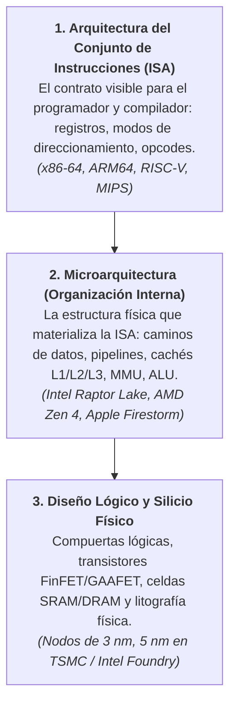
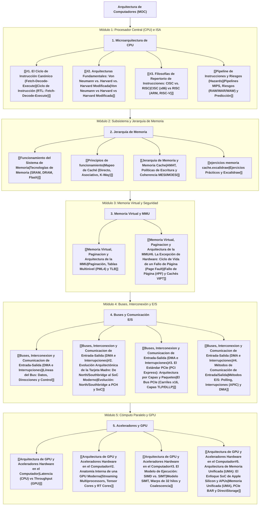
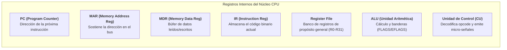
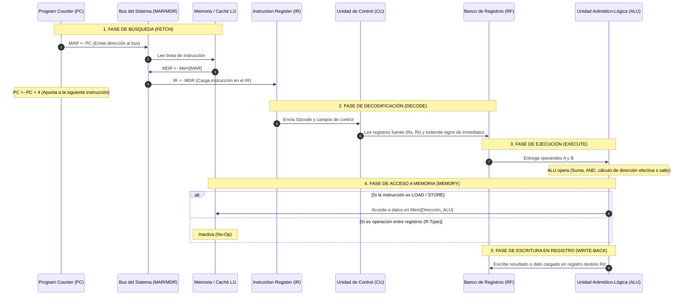
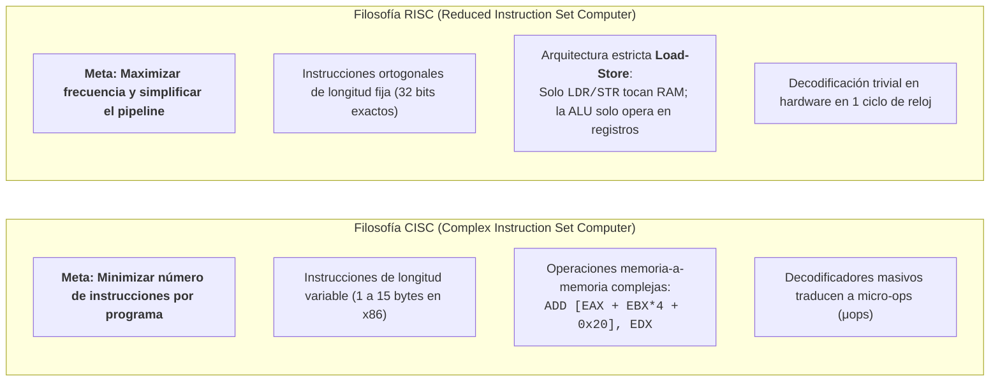
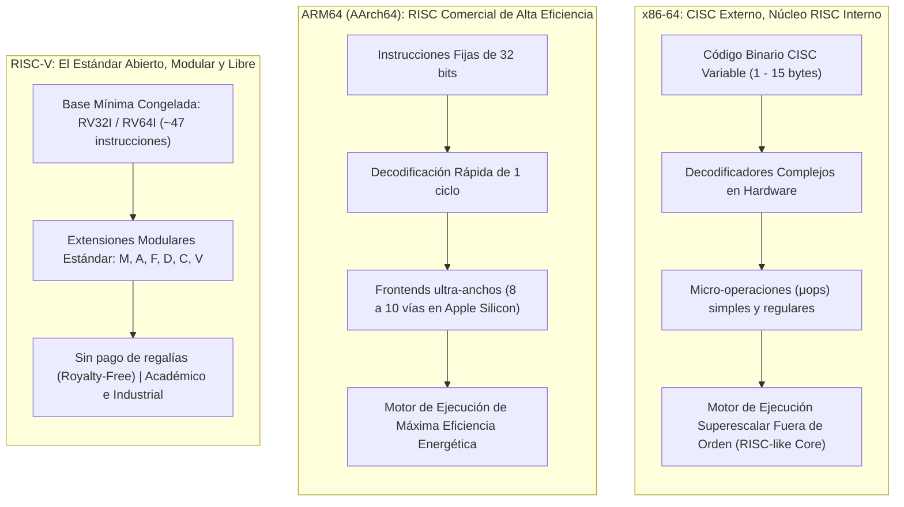

# Arquitectura de Computadores (Microarquitectura, Jerarquía de Memoria, Buses y GPU)

La **Arquitectura de Computadores** es la ciencia y disciplina de la ingeniería que define la estructura conceptual, la organización funcional y la implementación en hardware de los sistemas computacionales. Abarca el puente completo que traduce el software abstracto en estados electromagnéticos físicos a través de tres niveles fundamentales de abstracción:



> [!info] 💡 ¿Por qué esta materia es la médula espinal de las Ciencias de la Computación?
> Un ingeniero que desconoce la arquitectura de hardware asume que la memoria es un arreglo plano e infinito y que todas las instrucciones tardan lo mismo. El ingeniero que comprende la microarquitectura escribe código con **localidad de referencia espacial y temporal**, evita los **riesgos de pipeline y fallos de predicción de saltos**, comprende el coste real de los **fallos de página (#PF)**, optimiza la concurrencia eliminando el **falso compartir (*False Sharing*)** y aprovecha la aceleración masiva del silicio heterogéneo (**GPUs, Tensor Cores y Memoria Unificada**).

---

## 🗺️ Mapa de Aprendizaje Integral de la Materia (MOC)

El plan de estudios de Arquitectura de Computadores recorre la evolución del procesamiento de datos, desde la ejecución elemental de una instrucción de máquina hasta la computación paralela heterogénea en centros de datos:



---

## 📚 Módulo 1: Microarquitectura del Procesador (CPU), Ciclo de Instrucción e ISA

### 1. El Ciclo de Instrucción Canónico (Fetch-Decode-Execute)

En el corazón de todo procesador secuencial, la ejecución de un programa consiste en la repetición ininterrumpida del **Ciclo de Instrucción**. Para coordinar este flujo, la CPU implementa una serie de registros internos dedicados en el camino de datos (*datapath*):



#### Fases del Ciclo y Microoperaciones (RTL - Register Transfer Language)



1. **Búsqueda (*Instruction Fetch - IF*):**
   - El valor del **Program Counter (PC)** se transfiere al **Memory Address Register (MAR)**: $\text{MAR} \leftarrow \text{PC}$.
   - Se activa la línea de lectura del bus de control; la memoria (o caché L1i) deposita la instrucción en el **Memory Data Register (MDR)**: $\text{MDR} \leftarrow \text{Mem}[\text{MAR}]$.
   - La instrucción pasa al **Instruction Register (IR)**: $\text{IR} \leftarrow \text{MDR}$.
   - El PC se actualiza para apuntar a la siguiente palabra contigua: $\text{PC} \leftarrow \text{PC} + 4$ (en instrucciones de 32 bits).
2. **Decodificación (*Instruction Decode - ID*):**
   - La **Unidad de Control (CU)** descompone los bits del IR, identificando el código de operación (*Opcode*) y el formato de la instrucción.
   - Se leen en paralelo los operandos desde los registros fuente ($R_s, R_t$) en el banco de registros. Si la instrucción utiliza un valor inmediato, la unidad de extensión de signo lo expande a 32 o 64 bits.
3. **Ejecución (*Execute - EX*):**
   - La **ALU** ejecuta la operación aritmética o lógica solicitada (ej. suma, resta, desplazamiento).
   - En instrucciones de acceso a memoria (`load`/`store`), la ALU calcula la **dirección de memoria efectiva** sumando el registro base y el desplazamiento ($\text{Dirección} = R_{\text{base}} + \text{Offset}$).
   - En instrucciones de salto condicional (`branch`), la ALU evalúa la condición de comparación y calcula el destino relativo del salto.
4. **Acceso a Memoria (*Memory Access - MEM*):**
   - Si la instrucción es un `LOAD`, la dirección calculada se envía a la caché de datos (L1d) para leer el dato y colocarlo en el MDR.
   - Si es un `STORE`, el dato contenido en el registro fuente se escribe en la dirección de memoria destino.
   - Si la instrucción es puramente aritmética entre registros (`ADD R1, R2, R3`), esta fase no realiza ninguna transferencia a memoria.
5. **Post-escritura (*Write-Back - WB*):**
   - El resultado de la operación de la ALU o el dato traído desde la memoria se almacena definitivamente en el registro destino ($R_d$) dentro del banco de registros, quedando disponible para las siguientes instrucciones.

> [!tip] 🔗 Continuación del Pipeline Segmentado
> Para ver cómo este ciclo se superpone en el tiempo mediante técnicas de segmentación (*Pipelining* de 5 etapas) y cómo se resuelven los conflictos de dependencia, estudia la nota especializada:
> ➡️ **[[Pipeline de Instrucciones y Riesgos (Hazards)]]**

---

### 2. Arquitecturas Fundamentales: Von Neumann vs. Harvard vs. Harvard Modificada

La forma en que un procesador se conecta físicamente con la memoria para acceder a programas y datos define su arquitectura primordial:

```mermaid
flowchart TD
    subgraph Von_Neumann ["1. Arquitectura Von Neumann (Princeton)"]
        CPU1["CPU (Control + Datapath)"] <-->|<b>Un solo bus compartido</b><br>(Datos e Instrucciones compiten)| Mem1["Memoria Principal Unificada<br>(Programa + Datos en el mismo espacio)"]
    end

    subgraph Harvard_Pura ["2. Arquitectura Harvard Pura (DSPs / Microcontroladores)"]
        CPU2["CPU"] <-->|Bus de Instrucciones| Rom2["Memoria de Programa (ROM/Flash)"]
        CPU2 <-->|Bus de Datos Independiente| Ram2["Memoria de Datos (SRAM)"]
    end

    subgraph Harvard_Modificada ["3. Arquitectura Harvard Modificada (CPUs Modernas: x86, ARM, RISC-V)"]
        direction TB
        CPU3["Núcleo CPU (Pipeline de Ejecución)"]
        subgraph L1_Split ["Cachés L1 Separadas (Harvard en Silicio Interno)"]
            L1i["Caché L1i (Instrucciones)"]
            L1d["Caché L1d (Datos)"]
        end
        CPU3 <-->|Bus Fetch| L1i
        CPU3 <-->|Bus Mem| L1d
        L1i & L1d <--> L2["Caché L2 Unificada (Von Neumann a partir de L2/RAM)"]
        L2 <--> RAM3["Memoria Principal DRAM Unificada"]
    end
```

#### Comparativa Arquitectónica Rigurosa

| Característica | Von Neumann Clásica | Harvard Pura | Harvard Modificada (Moderna) |
| :--- | :--- | :--- | :--- |
| **Buses Físicos** | Un único bus de datos y un bus de direcciones | Dos pares de buses totalmente independientes | Dos buses independientes en L1; unificado en L2/L3/DRAM |
| **Espacio de Direccionamiento** | Unificado (código y datos residen en la misma memoria) | Separado (dirección 0x100 en código es distinta a 0x100 en datos) | Unificado para el software y sistema operativo |
| **Cuello de Botella de Von Neumann** | **Severo:** No puede leer una instrucción y un dato a la vez | **Inexistente:** Búsqueda y acceso a datos ocurren simultáneamente | **Resuelto en el Pipeline:** L1i y L1d operan en paralelo cada ciclo |
| **Flexibilidad de Memoria** | Máxima (la RAM se reparte libremente entre código y variables) | Rígida (si sobra memoria de programa, no se puede usar para datos) | Máxima (toda la RAM es gestionada dinámicamente por la MMU) |
| **Código Auto-modificable / JIT** | Soportado de forma natural | Imposible físicamente por hardware | Soportado mediante sincronización de caché (`clflush` / `isb`) |
| **Áreas de Aplicación Típica** | Primeras computadoras (ENIAC post-1948, IAS) | DSPs de audio/radar, microcontroladores simples (PIC, AVR) | **Todas las CPUs modernas:** Intel Core, AMD Ryzen, Apple Silicon, RISC-V |

---

### 3. Filosofías de Repertorio de Instrucciones: CISC vs. RISC

La **ISA (*Instruction Set Architecture*)** es el límite que separa el software del hardware. La contienda histórica entre dos escuelas de diseño moldeó toda la computación moderna:



#### La Tríada Contemporánea: x86-64 vs. ARM64 vs. RISC-V



| Criterio | x86-64 (AMD64 / Intel 64) | ARM64 (AArch64) | RISC-V (RV64GC) |
| :--- | :--- | :--- | :--- |
| **Filosofía Base** | CISC clásico con microarquitectura interna tipo RISC | RISC puro altamente optimizado | RISC modular de código abierto |
| **Longitud de Instrucción** | Variable (1 a 15 bytes) | Fija (32 bits; modo Thumb alternativo) | Regular de 32 bits (16 bits con extensión C) |
| **Registros de Propósito General** | 16 registros (`RAX`, `RBX`, ..., `R15`) | **32 registros** (`X0` a `X30`, `SP`) | **32 registros** (`x0` a `x31`, `x0` cableado a cero) |
| **Acceso a Memoria** | Memoria-a-Registro y Memoria-a-Memoria | Estrictamente **Load-Store** | Estrictamente **Load-Store** |
| **Modelo de Licenciamiento** | Propietario cerrado (Intel / AMD bajo patentes cruzadas) | Propietario bajo licencia comercial (Arm Ltd.) | **Estándar Abierto y Libre (*Royalty-Free*)** |
| **Dominio de Mercado** | Servidores tradicionales, computadoras de escritorio y laptops gamer | Smartphones, tablets, Apple Silicon, servidores cloud (AWS Graviton) | Microcontroladores, aceleradores de IA, sistemas embebidos y soberanía de chips |

> [!important] 📌 ¿Por qué RISC-V está revolucionando la academia y la industria?
> Diseñado en UC Berkeley por Hennessy y Patterson, **RISC-V** no es un chip, sino una **especificación abierta**. Elimina la dependencia de licencias millonarias y permite diseñar procesadores a la medida: una empresa o universidad puede tomar el núcleo base de números enteros (RV64I) y añadir únicamente las extensiones que necesita (ej. extensión vectorial `V` para modelos de lenguaje o extensiones criptográficas `K`), creando aceleradores de silicio personalizados sin sobrecarga.

---

## 📚 Módulo 2: La Jerarquía de Memoria y Memoria Caché

El rendimiento de un computador contemporáneo no está limitado por la velocidad de la ALU, sino por la **pared de la memoria (*Memory Wall*)**: la DRAM es órdenes de magnitud más lenta que los transistores del procesador.

1. **[[Funcionamiento del Sistema de Memoria]]:**
   - Métodos de acceso físico: secuencial, directo, aleatorio y asociativo.
   - Física de celdas de memoria: condensadores dinámicos que requieren refresco continuo (**DRAM**) vs flip-flops biestables con 6 transistores rápidos (**SRAM**).
   - Memorias no volátiles: ROM, EEPROM y celdas Flash NAND con puertas flotantes.
2. **[[Principios de funcionamiento]]:**
   - Fundamentos del principio de **Localidad de Referencia**:
     - *Localidad Temporal:* Si se accede a una dirección, es probable que se vuelva a acceder pronto (bucles, variables contadoras).
     - *Localidad Espacial:* Si se accede a una dirección, es probable que se acceda a las direcciones vecinas (recorrido secuencial de arreglos e instrucciones continuas).
   - Mapeo de Caché:
     - Mapeo Directo (*Direct Mapped*): 1 línea por conjunto.
     - Totalmente Asociativo (*Fully Associative*): La dirección puede residir en cualquier línea.
     - Asociativo por Conjuntos de $K$ Vías (*K-Way Set Associative*): El balance óptimo entre coste de hardware y reducción de conflictos.
   - Descomposición de la dirección en bits: **Etiqueta (*Tag*)**, **Conjunto/Línea (*Index/Set*)** y **Desplazamiento (*Offset*)**.
3. **[[Jerarquia de Memoria y Memoria Cache]]:**
   - Formulación del **Tiempo Medio de Acceso a Memoria (AMAT - *Average Memory Access Time*)**:
     $$\text{AMAT} = \text{Tiempo Hit} + \text{Tasa de Fallos} \times \text{Penalización por Fallo}$$
   - Políticas de escritura: *Write-Through* vs *Write-Back* con bit de modificación (*Dirty Bit*), y *Write-Allocate* vs *No-Write-Allocate*.
   - Políticas de reemplazo en fallos: **LRU (*Least Recently Used*)**, FIFO, Pseudo-LRU.
   - **Coherencia de Caché Multinúcleo:** Protocolos de espionaje del bus (*Snooping*) **MESI** (*Modified, Exclusive, Shared, Invalid*) y **MOESI** (*Owner*).
   - El peligro del **Falso Compartir (*False Sharing*)**: dos hilos en núcleos distintos escriben en variables adyacentes que caen en la misma línea de caché de 64 bytes, invalidándose mutuamente y destruyendo el rendimiento.
   - Taxonomía de las 4 Cs de fallos: *Compulsory* (arranque en frío), *Capacity* (tamaño del caché), *Conflict* (colisión de índice) y *Coherence* (invalidación por otro núcleo).
4. **Ejercicios Prácticos y Modelos Gráficos en Excalidraw:**
   - **[[ejercicios memoria cache.excalidraw|Ejercicios Prácticos de Memoria Caché]]**
   - **[[Ejercicio Correspondencia directa.excalidraw|Esquema Visual de Correspondencia Directa]]**
   - **[[funcion asociativa.excalidraw|Esquema Visual de Función Asociativa]]**

---

## 📚 Módulo 3: Memoria Virtual y la Unidad de Manejo de Memoria (MMU)

La memoria virtual proporciona a cada proceso la ilusión de disponer de un espacio de direcciones de memoria contiguo, gigantesco y totalmente aislado de los demás programas.

1. **[[Memoria Virtual, Paginacion y Arquitectura de la MMU]]:**
   - El puente conceptual: Espacio de Direcciones Virtuales (**VPN + Offset**) traducido a Espacio de Direcciones Físicas (**PFN + Offset**).
   - La arquitectura de la **MMU (*Memory Management Unit*)** y el **TLB (*Translation Lookaside Buffer*)**: caché asociativa de traducciones virtuales-a-físicas con tasas de acierto > 99%.
   - **Tablas de Páginas Jerárquicas Multinivel:** El esquema **PML4** de 4 niveles en x86-64 (CR3 $\rightarrow$ PML4 $\rightarrow$ PDPT $\rightarrow$ PD $\rightarrow$ PT) y soporte de **Páginas Gigantes (*Huge Pages*)** de 2 MiB y 1 GiB para eliminar sobrecarga de TLB en bases de datos y cómputo de alto rendimiento.
   - Anatomía de las entradas de tabla de páginas (**PTE**): bits de Presente ($P$), Lectura/Escritura ($R/W$), Usuario/Supervisor ($U/S$), Accedido ($A$), Sucio ($D$) y bit de no-ejecución (**NX / XD**) para mitigar vulnerabilidades de seguridad (*Buffer Overflow*).
   - **[[Memoria Virtual, Paginacion y Arquitectura de la MMU#6. La Excepción de Hardware: Ciclo de Vida de un Fallo de Página (Page Fault)|El Ciclo de Interrupción por Fallo de Página (#PF)]]**: Interrupción síncrona de hardware, cambio de contexto a Ring 0, rescate del marco desde almacenamiento secundario por el sistema operativo y reanudación transparente de la instrucción abortada.
   - Coordinación de la MMU con la Memoria Caché: Arquitectura **VIPT (*Virtually Indexed, Physically Tagged*)** para permitir indexar la caché L1 en paralelo con la traducción del TLB.

---

## 📚 Módulo 4: Buses, Interconexión y Comunicación de Entrada/Salida (E/S)

Ningún procesador opera en aislamiento: debe coordinarse con almacenamiento, red y periféricos.

1. **[[Buses, Interconexion y Comunicacion de Entrada-Salida (DMA e Interrupciones)]]:**
   - Estructura eléctrica de un bus clásico: líneas de **Datos**, líneas de **Direcciones** y líneas de **Control** (Read/Write, Clock, Reset, Interrupción).
   - **[[Buses, Interconexion y Comunicacion de Entrada-Salida (DMA e Interrupciones)#2. Evolución Arquitectónica de la Tarjeta Madre: De North/Southbridge al SoC Moderno|Evolución Histórica de la Placa Base]]**: Transición desde el bus compartido Front-Side Bus (FSB) y la arquitectura de doble puente (*Northbridge / Southbridge*) hacia la integración del controlador de memoria (**IMC**) dentro de la CPU y concentradores PCH / SoC mediante enlaces punto a punto dedicados.
   - **[[Buses, Interconexion y Comunicacion de Entrada-Salida (DMA e Interrupciones)#3. El Estándar PCIe (PCI Express): Arquitectura por Capas y Paquetes|El Bus PCI Express (PCIe)]]**: Arquitectura serie punto a punto por carriles ($\times 1, \times 4, \times 8, \times 16$). Modelo de red por capas: Capa de Transacción (paquetes **TLP** con control de créditos de flujo), Capa de Enlace de Datos (**DLLP** con verificación de errores CRC y retransmisión ACK/NAK) y Capa Física diferencial LVDS. Anchos de banda desde PCIe 3.0 hasta PCIe 6.0 con modulación PAM4.
   - **[[Buses, Interconexion y Comunicacion de Entrada-Salida (DMA e Interrupciones)#4. Métodos de Comunicación de Entrada/Salida|Técnicas de Gestión de Entrada/Salida]]**:
     - *Polling (E/S Programada):* La CPU malgasta ciclos en un bucle infinito preguntando por el estado del periférico.
     - *E/S Dirigida por Interrupciones:* Los periféricos despiertan al procesador mediante controladores avanzados **APIC** y líneas MSI-X, ejecutando una Rutina de Servicio de Interrupción (ISR).
     - *Acceso Directo a Memoria (DMA):* El controlador de DMA transfiere bloques enteros entre memoria y periféricos sin intervención de la CPU utilizando modos de robo de ciclo, ráfaga y listas enlazadas en memoria (*Scatter-Gather DMA*).
   - **Mapeo de Dispositivos:** **MMIO (*Memory-Mapped I/O*)** mapeando registros de dispositivos en el mismo mapa físico de memoria vs **PMIO (*Port-Mapped I/O*)** con espacio de direcciones separado e instrucciones dedicadas (`IN`/`OUT`).

---

## 📚 Módulo 5: Arquitectura de GPU y Aceleradores Hardware

El surgimiento del aprendizaje profundo y la computación científica ha desplazado el centro de gravedad del silicio hacia el cómputo masivamente paralelo.

1. **[[Arquitectura de GPU y Aceleradores Hardware en el Computador]]:**
   - **Latencia vs. Throughput:** Mientras la CPU sacrifica silicio para que un solo hilo responda en nanosegundos (grandes cachés SRAM, ejecución fuera de orden y predicción especulativa), la GPU sacrifica control para empaquetar miles de ALUs en silicio, logrando un rendimiento aritmético masivo mediante **ocultación de latencia (*Latency Hiding*)** y conmutación de contexto en hardware en cero ciclos.
   - **[[Arquitectura de GPU y Aceleradores Hardware en el Computador#2. Anatomía Interna de una GPU Moderna|Microarquitectura del Streaming Multiprocessor (SM)]]**: Banco de registros masivo (64K a 128K registros por SM), memoria compartida scratchpad ultraveloz, núcleos **FP32** e **INT32** concurrentes, **Tensor Cores** para multiplicación matricial denso-mixta acelerada ($D = A \times B + C$ en FP16/BF16/FP8/FP4) y **RT Cores** para recorrido en hardware de jerarquías de volúmenes envolventes (BVH).
   - **[[Arquitectura de GPU y Aceleradores Hardware en el Computador#3. El Modelo de Ejecución: SIMD vs. SIMT|El Modelo SIMT (Single Instruction, Multiple Threads)]]**: Organización de 32 hilos en **Warps**, ejecución sincronizada en *Lock-Step* compartiendo el Program Counter, y los dos grandes cuellos de botella:
     - *Divergencia de Ramas (Branch Divergence):* La bifurcación `if/else` enmascara hilos y serializa la ejecución en el tiempo, reduciendo el rendimiento a la mitad.
     - *Pérdida de Coalescencia de Memoria:* Accesos continuos fusionan 32 solicitudes en 1 sola transacción de 128 bytes (100% de eficiencia); accesos dispersos forzan 32 transacciones independientes (3.125% de eficiencia).
   - **Interconexión Host-Device:** El cuello de botella del bus PCIe frente a la VRAM (31.5 GB/s vs 1.000+ GB/s), la solución de **Resizable BAR** (mapeo del 100% de la VRAM en 64 bits eliminando la ventana restrictiva de 256 MiB) y **DirectStorage / RTX IO** con descompresión paralela en GPU.
   - **[[Arquitectura de GPU y Aceleradores Hardware en el Computador#5. Arquitectura de Memoria Unificada (UMA): El Enfoque SoC de Apple Silicon y APUs|Arquitectura de Memoria Unificada (UMA)]]**: El modelo SoC de Apple Silicon (M-Max / M-Ultra) con bus de 512-1024 bits y anchos de banda de 400 a 800+ GB/s, eliminando la necesidad de copias PCIe (*Zero-Copy*) y permitiendo ejecutar modelos masivos de IA de 70B+ parámetros íntegramente en memoria unificada compartida.

---

## 🔗 Vinculación con otras materias del plan de estudios

- **[[Sistemas Operativos/Gestion de Memoria y Memoria Virtual|Sistemas Operativos]]:** La MMU, el TLB y las interrupciones de excepción por fallo de página (#PF) son los cimientos físicos sobre los cuales el kernel implementa la memoria virtual por demanda, la paginación con algoritmos de reemplazo y los niveles de protección de privilegios por hardware (Ring 0 Kernel vs Ring 3 Usuario).
- **[[Compiladores/Fases del Compilador y Analisis Lexico|Compiladores]]:** El backend del compilador realiza la asignación de registros mediante coloración de grafos sobre el repertorio ISA del procesador, programa la reorganización de instrucciones para evitar bloqueos por dependencias RAW en el pipeline y optimiza los bucles de código para maximizar los aciertos en la memoria caché L1.
- **[[Multiprocesamiento/Arquitectura de GPU y Programacion Heterogenea con NVIDIA CUDA|Multiprocesamiento]]:** Cómputo paralelo a escala, topologías de memoria NUMA (*Non-Uniform Memory Access*), coherencia de caché entre zócalos múltiples y programación de kernels masivos en CUDA sobre mallas de bloques, warps y memoria compartida.
- **[[computacion grafica/Computacion Grafica|Computación Gráfica]]:** El pipeline gráfico configurable acelerado en silicio (Vertex Shaders, Fragment/Pixel Shaders), rasterización en hardware, búferes de profundidad Z-buffer y framebuffers alojados en la memoria de video VRAM.
