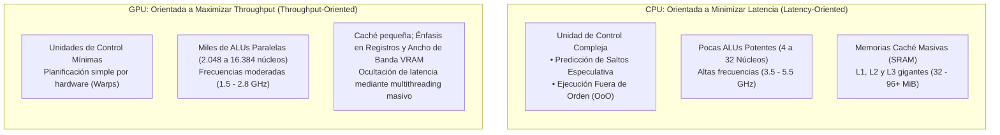
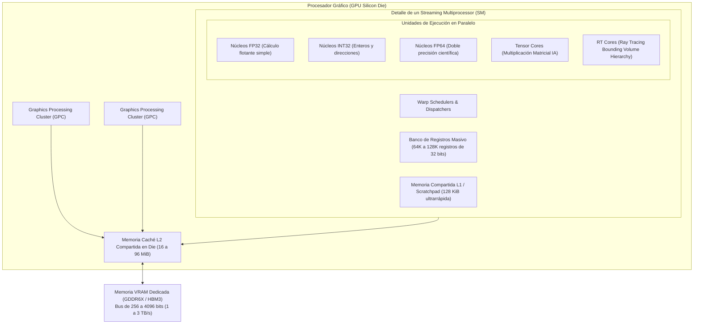
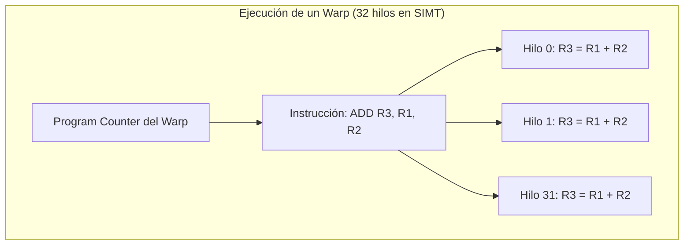
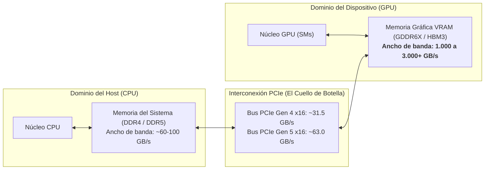
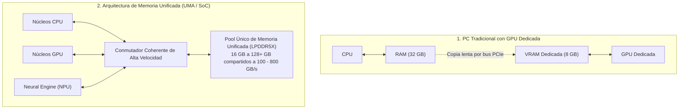

# Arquitectura de GPU y Aceleradores Hardware en el Computador

La **Unidad de Procesamiento Gráfico (GPU - *Graphics Processing Unit*)** ha evolucionado desde sus orígenes como un coprocesador especializado de función fija para acelerar primitivas de dibujo 2D/3D hacia un **acelerador de cálculo paralelo masivo y programable** de propósito general (**GPGPU**).

Dentro de la arquitectura global del computador contemporáneo, la GPU constituye el motor por excelencia para cargas de trabajo dominadas por el paralelismo masivo de datos: renderizado tridimensional en tiempo real, entrenamiento e inferencia de modelos de **Inteligencia Artificial y Deep Learning**, simulación de dinámicas moleculares, criptografía y procesamiento de señales.

> [!info] 💡 ¿Cómo entender esto desde cero? (Guía para novatos de pregrado)
> Imagina que debes transportar **100.000 ladrillos** al otro lado de la ciudad:
> - La **CPU** es un equipo de **8 pilotos de Fórmula 1 en autos hiper veloces**:
>   - Cada piloto es un genio capaz de resolver ecuaciones dificilísimas, cambiar de ruta en milisegundos si hay tráfico (**predicción de saltos**) y conducir a 350 km/h (**latencia ultra baja**). Pero cada auto solo puede llevar 2 ladrillos en el asiento del copiloto.
> - La **GPU** es un convoy de **5.000 ciclistas con mochilas**:
>   - Los ciclistas no son pilotos de carreras; van a 20 km/h y todos deben seguir exactamente el mismo semáforo y la misma avenida al unísono (**SIMD / SIMT**).
>   - Sin embargo, cada ciclista lleva 20 ladrillos en su mochila. En un solo viaje conjunto, el convoy transporta **100.000 ladrillos de golpe** (**Throughput masivo**).
> - **El Computador Moderno es un Sistema Heterogéneo:** La CPU es el estratega que coordina, toma decisiones lógicas y gestiona el sistema operativo; la GPU es el ejército masivo de fuerza bruta matemática que tritura matrices de píxeles o pesos neuronales.

---

## 1. Divergencia Filosófica de Diseño: CPU vs. GPU

El uso del área de silicio (*Die Area*) en una CPU y en una GPU responde a dos metas de optimización totalmente opuestas:

| Dimensión Arquitectónica | CPU (Central Processing Unit) | GPU (Graphics Processing Unit) |
| :--- | :--- | :--- |
| **Meta Principal** | Minimizar la **latencia** de un solo hilo de ejecución | Maximizar el **rendimiento agregado (*throughput*)** |
| **Cantidad de Núcleos** | Pocos (4 a 64 núcleos de alto rendimiento) | Miles (2.048 a 18.432 núcleos simples) |
| **Frecuencia de Reloj** | Muy alta (3.5 a 5.8 GHz) | Moderada (1.5 a 2.8 GHz) |
| **Predicción de Saltos** | Extremadamente sofisticada (redes neuronales en chip, TAGE) | Inexistente o mínima (se ejecutan ambas ramas si divergen) |
| **Ejecución Fuera de Orden** | Complejísima (Out-of-Order speculative execution) | Estrictamente en orden (In-Order) por Warp |
| **Estrategia ante Latencia de Memoria** | Grandes memorias caché (L1/L2/L3) para evitar ir a la RAM | Conmutación instantánea a otro hilo/Warp listo en 0 ciclos |
| **Ancho de Banda de Memoria** | 50 a 150 GB/s (DDR4 / DDR5 multicanal) | **1.000 a 3.300+ GB/s** (GDDR6X, HBM2e, HBM3) |

---

## 2. Anatomía Interna de una GPU Moderna

A nivel físico, una GPU contemporánea (como las arquitecturas NVIDIA Ada Lovelace / Blackwell o AMD RDNA / CDNA) se organiza de forma modular y jerárquica:

### 2.1 El Streaming Multiprocessor (SM) / Compute Unit (CU)
El SM (en NVIDIA) o Compute Unit (en AMD) es el bloque de construcción fundamental de la GPU. Una GPU moderna alberga entre 60 y 140 SMs idénticos. Cada SM contiene:
1. **Unidades de Ejecución (ALUs / Cores):**
   - **FP32 Cores:** Ejecutan sumas y multiplicaciones de punto flotante de 32 bits (`a * b + c` mediante *Fused Multiply-Add* o FMA).
   - **INT32 Cores:** Operaciones con enteros y cálculo de punteros a memoria.
   - **Tensor Cores:** Silicio especializado diseñado para calcular operaciones matriciales fundamentales en redes neuronales: $D = A \times B + C$ sobre matrices de precisión mixta (FP16, BF16, FP8, INT8) en un solo ciclo de reloj.
   - **RT Cores:** Aceleradores por hardware para el trazado de rayos (*Ray Tracing*), calculando automáticamente la intersección de rayos ópticos con las cajas delimitadoras de la jerarquía de volúmenes (*BVH Traversal*) sin consumir ciclos de los núcleos FP32.
2. **Banco de Registros Masivo (*Register File*):**
   - Mientras una CPU x86-64 posee unas pocas docenas de registros por núcleo, un SM de GPU contiene entre **65.536 y 131.072 registros físicos de 32 bits**.
   - Esto permite que miles de hilos concurrentes mantengan todas sus variables en registros de hardware sin necesidad de expulsarlas a memoria al alternar entre hilos (**conmutación de contexto en cero ciclos de penalización**).
3. **Memoria Compartida / Caché L1 (*Shared Memory*):**
   - Memoria SRAM en chip de latencia extremadamente baja (comparable a L1) gobernada explícitamente por el programador (*Software-Managed Scratchpad*). Permite que los hilos de un mismo bloque colaboren e intercambien datos sin salir a la VRAM externa.

---

## 3. El Modelo de Ejecución: SIMD vs. SIMT

A diferencia del paradigma **SIMD** tradicional de las CPUs (donde una instrucción vectorial como AVX-512 opera sobre un único vector largo empaquetado en un registro de 512 bits):

La GPU implementa el paradigma **SIMT (Single Instruction, Multiple Threads)**:
- El programador escribe el código como si fuera para un hilo secuencial escalar independiente.
- El hardware de la GPU agrupa dinámicamente estos hilos en conjuntos indivisibles de **32 hilos llamados Warps** (en NVIDIA) o **Wavefronts de 32/64 hilos** (en AMD).
- Todos los 32 hilos de un Warp ejecutan exactamente la **misma instrucción de máquina en el mismo ciclo de reloj**, pero cada hilo opera sobre sus propios datos y sus propios registros (*Thread ID* único).

### 3.1 El Cuello de Botella: Divergencia de Warps (Branch Divergence)
¿Qué ocurre si el código de un shader o kernel contiene una sentencia condicional `if (condición) { Camino A } else { Camino B }`?
- Si los 32 hilos del Warp evalúan la condición como verdadera, todos ejecutan el Camino A a toda velocidad.
- Si algunos hilos toman el `if` y otros el `else`, **el Warp se divide (*Divergencia*)**:
  1. El hardware enmascara (*mask off*) a los hilos del `else` y ejecuta el Camino A con los hilos restantes.
  2. Luego, el hardware enmascara a los hilos del `if` y ejecuta el Camino B.
  3. Finalmente, los 32 hilos convergen de nuevo.
- **Impacto:** La divergencia degrada el rendimiento de la GPU a la mitad o peor, ya que la ejecución de ramas disjuntas se serializa temporalmente.

### 3.2 Coalescencia de Memoria (Memory Coalescing)
Cuando los 32 hilos de un Warp emiten una instrucción de lectura a la VRAM (`LD`):
- Si los 32 hilos acceden a direcciones contiguas de memoria (por ejemplo, el hilo $k$ accede al índice $k$ de un vector), el controlador de memoria fusiona las 32 peticiones en **una única transacción de memoria física de 128 bytes**.
- Si los accesos son dispersos o aleatorios (*strided / unaligned access*), el hardware se ve forzado a emitir 32 transacciones independientes, desperdiciando el 95% del ancho de banda del bus.

---

## 4. Comunicación de la GPU con el Computador: El Bus PCIe y Resizable BAR

Una GPU dedicada (**dGPU**) no está soldada directamente junto a la CPU, sino conectada físicamente a través de una ranura **PCIe $\times 16$** en la tarjeta madre.

### 4.1 La Gran Brecha de Velocidad (El "Embudo" PCIe)
- La GPU puede leer de su propia memoria VRAM a tasas superiores a **$1.000\text{ GB/s}$** ($1\text{ TB/s}$).
- Sin embargo, para transferir texturas, modelos geométricos o pesos de una red neuronal desde la RAM del sistema hacia la VRAM, los datos deben viajar por el bus PCIe a tan solo **$31.5\text{ GB/s}$** (PCIe 4.0) o **$63\text{ GB/s}$** (PCIe 5.0).
- Por esta razón, los motores de videojuegos y los frameworks de IA precargan todos los datos pesados en la VRAM de forma anticipada antes de iniciar la computación intensiva.

### 4.2 Resizable BAR (Smart Access Memory - SAM)
- Históricamente, el estándar PCIe de 32 bits limitaba la ventana de memoria de la GPU accesible directamente por la CPU a bloques pequeños de **256 MiB** mediante el registro de dirección base (**BAR - *Base Address Register***).
- Si la CPU necesitaba transferir un búfer de 4 GiB, debía fragmentarlo en decenas de transferencias secuenciales de 256 MiB.
- **Resizable BAR (ReBAR):** Extiende la especificación PCIe para permitir que la CPU mapee **todo el contenido de la VRAM (ej. 16 GB o 24 GB) como un único rango continuo de memoria**, permitiendo transferencias simultáneas y reduciendo dramáticamente la sobrecarga del controlador gráfico.

### 4.3 DirectStorage y Descompresión por GPU
En arquitecturas tradicionales, cargar un juego o un modelo masivo implicaba:
`SSD NVMe -> RAM del Sistema (CPU) -> CPU descomprime el archivo comprimido -> RAM -> Bus PCIe -> VRAM de la GPU`.
La CPU pasaba segundos enteros saturada al 100% solo descomprimiendo paquetes LZ4 o Zstandard.

Con tecnologías modernas como **DirectStorage / RTX IO**:
- El archivo empaquetado viaja directamente desde el SSD NVMe hacia la VRAM vía DMA por el bus PCIe.
- **Los núcleos de cómputo de la GPU realizan la descompresión en paralelo a cientos de gigabytes por segundo**, liberando por completo a la CPU y reduciendo los tiempos de carga a milisegundos.

---

## 5. Arquitectura de Memoria Unificada (UMA): El Enfoque SoC de Apple Silicon y APUs

Frente al modelo tradicional de PC (donde CPU y GPU tienen chips de memoria separados y deben copiarse datos a través de PCIe), los procesadores modernos integrados en silicio unificado (**SoC - *System on Chip***, como **Apple Silicon M-Series** o las APUs de AMD) implementan una **Arquitectura de Memoria Unificada (UMA - *Unified Memory Architecture*)**.

### Ventajas Radicales de la Memoria Unificada:
1. **Cero Copias (*Zero-Copy Memory*):** La CPU y la GPU comparten el mismo espacio físico de direcciones. Cuando la CPU termina de procesar un fotograma o generar un vector de embeddings, no copia nada a través de PCIe; simplemente **le pasa un puntero de memoria a la GPU**. La GPU lee el dato de forma instantánea.
2. **Capacidad Masiva de VRAM para Inteligencia Artificial:**
   - En una tarjeta gráfica convencional para PC, la VRAM está limitada al tamaño físico soldado en la tarjeta (típicamente 8, 12, 16 o 24 GB). Correr un modelo de lenguaje (LLM) de 70 mil millones de parámetros requiere más de 40 GB de VRAM, requiriendo tarjetas para centros de datos de miles de dólares.
   - En una arquitectura UMA con 64 GB o 128 GB de memoria unificada, la GPU puede asignar casi toda esa memoria como VRAM, permitiendo ejecutar modelos de IA masivos de forma local en computadoras portátiles o de escritorio compactas.
