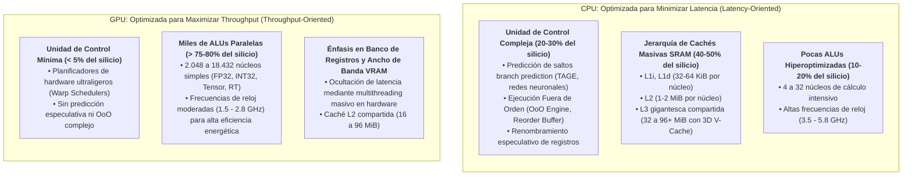
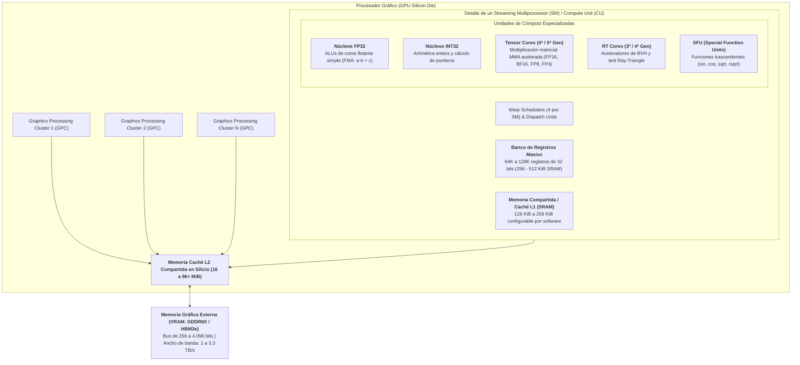
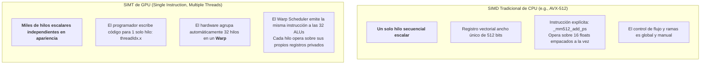
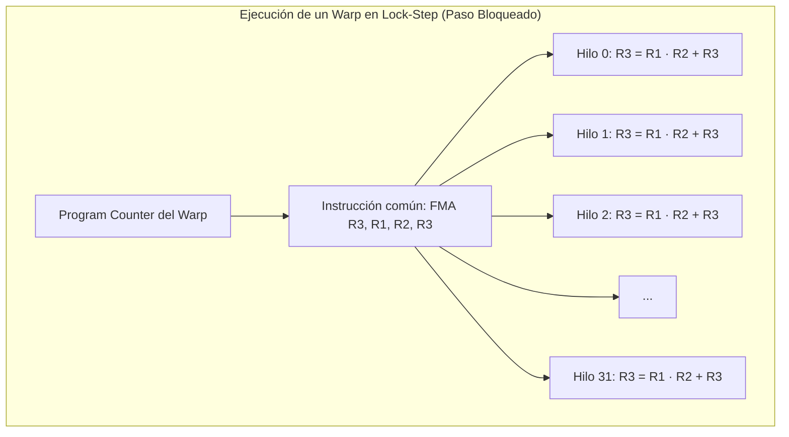
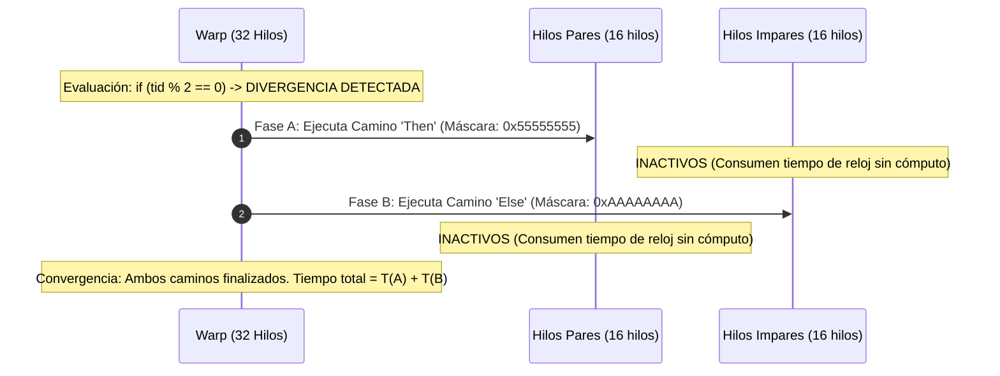
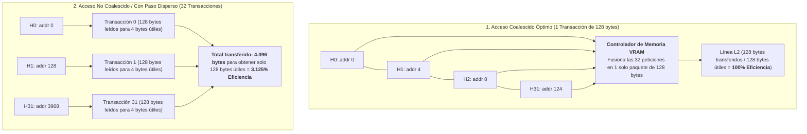
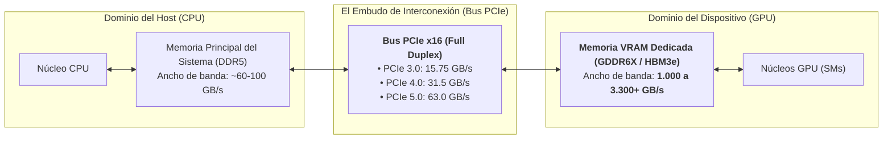
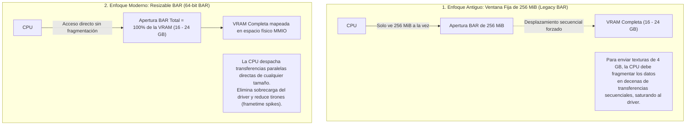
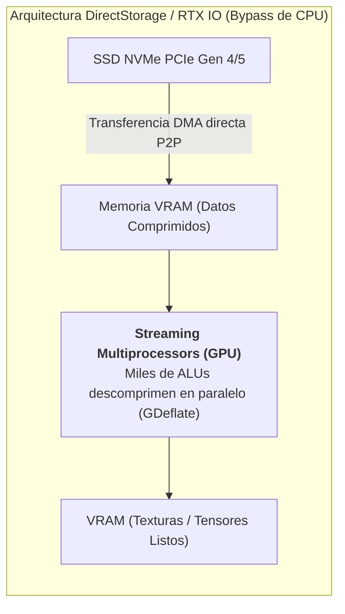
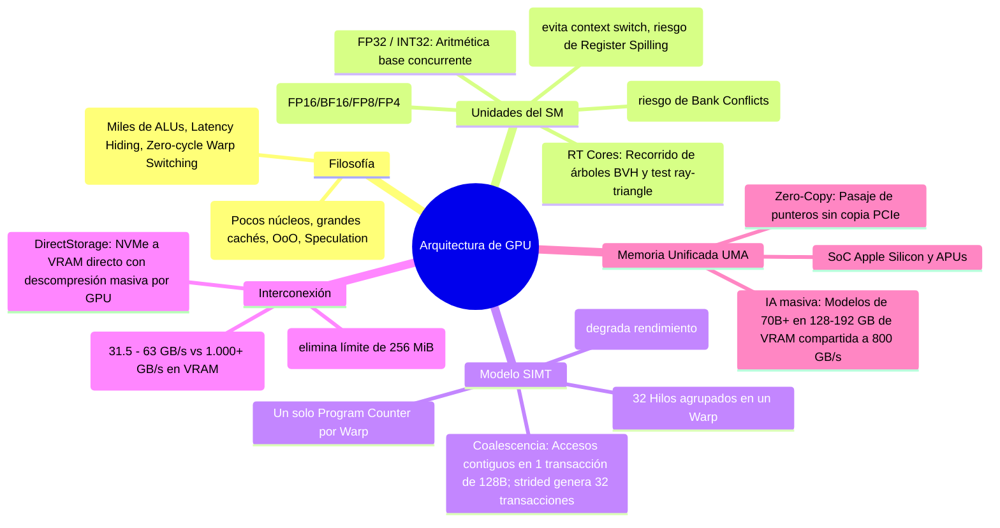

# Arquitectura de GPU y Aceleradores Hardware en el Computador

La **Unidad de Procesamiento Gráfico (GPU - *Graphics Processing Unit*)** ha transitado una de las metamorfosis arquitectónicas más profundas de la computación moderna: nació como un coprocesador de función fija en silicio dedicado a acelerar primitivas de rasterización geométrica 2D/3D (líneas, polígonos y sombreado elemental) y se ha transformado en un **acelerador masivo de cálculo paralelo y programable de propósito general (**GPGPU**)**.

Dentro de la arquitectura de sistemas contemporánea, el computador no es una máquina homogénea gobernada únicamente por la CPU, sino un **sistema heterogéneo**. En este ecosistema, la CPU asume el rol de **host** (orquestador de control, sistema operativo y cómputo secuencial con baja latencia) y la GPU asume el rol de **device** (motor de cómputo aritmético intensivo con alto rendimiento de procesamiento o *throughput*).

Hoy en día, las GPUs sustentan los pilares de la computación científica y la industria digital:
1. Renderizado fotorrealista en tiempo real (*Ray Tracing* acelerado por hardware).
2. Entrenamiento e inferencia de modelos de **Inteligencia Artificial y Deep Learning** (Transformers, Redes Convolucionales, Modelos de Difusión).
3. Simulación física y dinámica molecular (ecuaciones diferenciales parciales, mecánica de fluidos).
4. Criptografía, compresión masiva de datos y procesamiento de señales.

> [!info] 💡 ¿Cómo entender esto desde cero? (Guía Pedagógica para Estudiantes de Pregrado)
> Imagina que el sistema debe transportar **100.000 ladrillos** desde un extremo de la ciudad al otro:
> - **La CPU es un equipo de 8 pilotos de Fórmula 1 en autos hiperdeportivos:**
>   - Cada auto es una máquina de ingeniería asombrosa: corre a 350 km/h (**frecuencia de reloj de 5 GHz**), cuenta con un copiloto con GPS predictivo que se anticipa al tráfico (**predicción de saltos**) y un sistema de suspensión que reordena las piezas en el camino (**ejecución fuera de orden / OoO**).
>   - Su meta es la **mínima latencia**: si le pides llevar un único ladrillo urgente, lo entrega en milisegundos.
>   - Sin embargo, cada auto solo puede cargar **2 ladrillos en el asiento del copiloto**. Mover 100.000 ladrillos le requerirá miles de viajes de ida y vuelta.
> - **La GPU es un convoy coordinado de 5.000 ciclistas con mochilas de carga:**
>   - Ningún ciclista puede correr a 350 km/h; van a un paso moderado de 20 km/h (**frecuencia de reloj de 1.5 a 2.5 GHz**). No tienen copiloto inteligente ni pueden improvisar rutas: todos deben seguir al unísono el mismo semáforo y pedalear por la misma avenida (**paradigma SIMD / SIMT**).
>   - Pero cada ciclista lleva 20 ladrillos en su mochila. En un solo trayecto conjunto, el convoy entrega **100.000 ladrillos de un solo golpe** (**Throughput agregado masivo**).
> - **Conclusión de Diseño:** Para tareas secuenciales llenas de decisiones lógicas (`if/else`, llamadas al sistema operativo, bases de datos), la CPU es insuperable. Para tareas de álgebra lineal masiva (multiplicación de matrices de píxeles o pesos neuronales), la GPU ofrece órdenes de magnitud mayor eficiencia energética y velocidad.

---

## 1. Divergencia Filosófica de Diseño: Latencia vs. Throughput

El uso del área de silicio (*Die Area*) en una CPU y en una GPU responde a dos objetivos de optimización matemáticamente contrapuestos:

$$\text{Latencia} = \text{Tiempo requerido para completar una sola instrucción o tarea (segundos / tarea)}$$

$$\text{Throughput} = \frac{\text{Número total de tareas completadas}}{\text{Unidad de tiempo}} \quad \left(\frac{\text{Operaciones}}{\text{segundo}} \text{ o FLOPs}\right)$$

Por la **Ley de Little** ($N = \lambda \times W$), para sostener un alto rendimiento (*Throughput* $\lambda$), un sistema con alta latencia de memoria ($W$) necesita un grado colosal de concurrencia ($N$, miles de hilos en vuelo).



### Tabla Comparativa de Arquitectura Microestructural

| Parámetro de Diseño | CPU (Central Processing Unit) | GPU (Graphics Processing Unit) |
| :--- | :--- | :--- |
| **Meta Principal** | Minimizar la **latencia** de un solo hilo de ejecución | Maximizar el **rendimiento (*throughput*) agregado** |
| **Número de Núcleos** | Pocos (4 a 64 núcleos de alto rendimiento) | Miles (2.048 a 18.432 unidades aritméticas) |
| **Frecuencia de Reloj** | Muy alta (3.5 a 5.8 GHz) | Moderada (1.5 a 2.8 GHz) |
| **Predicción de Saltos** | Sofisticadísima (predictores neuronales TAGE en chip) | Nula o elemental (ambas ramas se evalúan si divergen) |
| **Ejecución de Instrucciones** | Fuera de orden especulativa (*Out-of-Order / OoO*) | Estrictamente en orden (*In-Order*) por cada Warp |
| **Estrategia ante Latencia de Memoria** | Enormes cachés L1/L2/L3 para **evitar** ir a DRAM | **Ocultación de latencia (*Latency Hiding*)**: conmutación instantánea de Warps en 0 ciclos |
| **Tamaño del Banco de Registros** | Decenas a centenas de registros por núcleo (1 a 2 KiB) | **65.536 a 131.072 registros de 32 bits** por SM (256 a 512 KiB por SM) |
| **Ancho de Banda de Memoria** | 50 a 150 GB/s (DDR4 / DDR5 multicanal) | **1.000 a 3.300+ GB/s** (GDDR6X, HBM2e, HBM3e) |

---

## 2. Anatomía Interna de una GPU Moderna

A nivel de silicio, una GPU contemporánea (como NVIDIA Ada Lovelace / Blackwell o AMD RDNA / CDNA) se organiza de manera estrictamente jerárquica y modular:



### 2.1 El Streaming Multiprocessor (SM) / Compute Unit (CU)
El **SM** (nomenclatura de NVIDIA) o **Compute Unit / WGP** (en AMD) es la unidad de cómputo fundamental y autosuficiente de la GPU. Una GPU moderna de gama alta alberga entre 60 y 140 SMs idénticos. Cada SM contiene:

#### 1. Unidades de Ejecución Especializadas (ALUs y Cores)
- **Núcleos FP32 (Single Precision):** Ejecutan operaciones de coma flotante estándar IEEE 754 de 32 bits. La instrucción básica reina es el **FMA (*Fused Multiply-Add*)**: $R = A \times B + C$, calculada en un solo ciclo con un solo redondeo final.
- **Núcleos INT32:** Desde la microarquitectura NVIDIA Turing/Volta, las ALUs enteras están desacopladas físicamente de las de coma flotante. Esto permite que una instrucción entera (cálculo del índice de un arreglo o puntero de memoria) y una instrucción matemática FP32 se ejecuten en **paralelo en el mismo ciclo de reloj**, sin quitarse ciclos mutuamente.
- **Tensor Cores (El Motor de la Inteligencia Artificial):**
  - Son coprocesadores de cálculo matricial denso integrados directamente en el SM.
  - Ejecutan la operación fundamental de **Multiplicación y Acumulación Matricial (*Matrix Multiply-Accumulate / MMA*)**:
    $$D = A \times B + C$$
  - Mientras una ALU FP32 tradicional tarda decenas de ciclos en multiplicar dos vectores elemento por elemento, un Tensor Core calcula el producto de matrices enteras (ej. $16 \times 16$) en **un único ciclo de reloj**.
  - **Formatos de Precisión Mixta:** Soportan tipos de datos adaptados al Machine Learning:
    - **FP16 / BF16 (Brain Floating Point):** BF16 mantiene el rango dinámico de FP32 (8 bits de exponente) con menor mantisa (7 bits), evitando el desbordamiento numérico (*underflow/overflow*) durante el entrenamiento de redes neuronales profundas.
    - **FP8 y FP4:** Introducidos en arquitecturas Hopper, Ada Lovelace y Blackwell. Al reducir la representación a 8 o 4 bits, duplican y cuadruplican el rendimiento de cálculo (TFLOPS) y reducen el tráfico de memoria a la mitad, permitiendo ejecutar modelos de lenguaje (LLMs) colosales con una fracción del consumo energético.
- **RT Cores (*Ray Tracing Cores*):**
  - En gráficos 3D, calcular la trayectoria de millones de rayos de luz contra millones de triángulos geométricos mediante software provocaría una divergencia de ramas inmanejable en los núcleos FP32.
  - El RT Core es una unidad ASIC de función fija dedicada exclusivamente a:
    1. Recorrer en hardware la estructura de árbol de cajas delimitadoras jerárquicas (**BVH - *Bounding Volume Hierarchy Traversal***).
    2. Probar matemáticamente la intersección rayo-caja y rayo-triángulo (algoritmo Möller-Trumbore).
  - Los núcleos FP32 quedan libres para sombreado (*shading*) e iluminación mientras el RT Core resuelve la física óptica en segundo plano.

#### 2. Banco de Registros Masivo y Ocultación de Latencia (*Latency Hiding*)
- Una CPU típica x86-64 posee un banco de registros de solo 16 registros visibles (más unas docenas físicos para renombrado especulativo).
- Un SM de GPU contiene entre **65.536 y 131.072 registros de 32 bits** físicos (256 a 512 KiB de SRAM ultrarrápida por SM).
- **¿Por qué tantos registros?**
  Para lograr **conmutación de contexto en cero ciclos (*Zero-Cycle Context Switching*)**.
  En una CPU, cambiar de un hilo a otro requiere guardar los registros en memoria RAM o caché (una costosa operación del sistema operativo de cientos de ciclos). En la GPU, **todos los hilos activos tienen sus registros asignados permanentemente en el banco físico**.
  Cuando el Warp actual emite una lectura a la VRAM (que tarda 200 a 400 ciclos de reloj), el planificador (*Warp Scheduler*) simplemente conmuta en el ciclo siguiente a otro Warp cuyos operandos ya están en registros listos para operar. **La latencia de la memoria no se evita; se oculta manteniendo las ALUs ocupadas el 100% del tiempo**.

#### 3. Presión de Registros y Ocupación (*Hardware Occupancy*)
La **ocupación** es la métrica reina de eficiencia en un SM:

$$\text{Ocupación} = \frac{\text{Número de Warps Activos concurrentes en el SM}}{\text{Número Máximo de Warps soportados por el hardware}}$$

- Si un programador escribe un kernel CUDA donde cada hilo utiliza solo 32 registros, el SM puede albergar el máximo posible de hilos (ej. 2.048 hilos / 64 warps = 100% de ocupación).
- Si el kernel es demasiado complejo y cada hilo exige 128 registros, el banco de registros se agota rápidamente: el hardware solo podrá alojar 512 hilos concurrentes (25% de ocupación). El SM pierde capacidad para ocultar latencias.
- Si el código exige más registros de los físicamente disponibles, el compilador recurre al **derrame de registros (*Register Spilling*)**, enviando variables a la memoria local en la VRAM externa, lo que desploma el rendimiento de manera catastrófica.

#### 4. Memoria Compartida (*Shared Memory* / L1 Scratchpad)
- Es un bloque de memoria SRAM en chip (128 a 256 KiB) con un ancho de banda gigantesco (comparable al de la caché L1, superior a 15 TB/s agregado en el chip) y latencia mínima (~20 ciclos).
- A diferencia de la caché de la CPU (que es transparente y administrada automáticamente por hardware), la **memoria compartida es gestionada explícitamente por el programador** (`__shared__` en CUDA).
- Permite que los hilos de un mismo bloque cooperen: cargan un bloque de matriz desde la VRAM a la memoria compartida de forma colectiva y luego lo reutilizan cientos de veces sin volver a tocar la lenta VRAM externa (*Tiling Algorithm*).
- **Conflictos de Bancos (*Bank Conflicts*):** La memoria compartida se divide en 32 bancos independientes de 4 bytes. Si múltiples hilos de un Warp intentan acceder simultáneamente a diferentes direcciones que caen en el mismo banco, el hardware debe **serializar** los accesos, degradando el ancho de banda proporcionalmente.

---

## 3. El Modelo de Ejecución: SIMD vs. SIMT

Es común confundir el modelo vectorial de las CPUs con el modelo de las GPUs. La distinción arquitectónica es sustancial:



### 3.1 Anatomía de un Warp
- El **Warp** (en NVIDIA, 32 hilos) o **Wavefront** (en AMD, 32 o 64 hilos) es la unidad básica indivisible de emisión y despacho en el hardware.
- Los 32 hilos de un Warp comparten un único **Contador de Programa (*Program Counter - PC*)** y una única unidad de instrucción.
- En cada ciclo en que el Warp es seleccionado, los 32 hilos ejecutan **la misma instrucción de máquina**, pero cada hilo aplica dicha instrucción sobre sus propios datos y registros (*Thread ID* individual).



### 3.2 El Talón de Aquiles: Divergencia de Ramas (*Branch Divergence*)
¿Qué ocurre si el kernel contiene una sentencia condicional `if-else` dependiente de los datos del hilo?

```c
__global__ void calcular(float *salida, float *entrada) {
    int tid = blockIdx.x * blockDim.x + threadIdx.x;
    
    if (tid % 2 == 0) {
        salida[tid] = entrada[tid] * 2.0f; // Camino A (Hilos pares)
    } else {
        salida[tid] = entrada[tid] + 5.0f; // Camino B (Hilos impares)
    }
}
```

Dado que los 32 hilos del Warp comparten un único Program Counter, **el hardware no puede bifurcarse físicamente en dos caminos paralelos a la vez**.

El procesador recurre a la **ejecución enmascarada (*Masked Execution*)**:
1. **Fase 1 (Camino Then):** Se activa la máscara de ejecución para los hilos pares (`0x55555555`). Los hilos pares ejecutan la multiplicación; los hilos impares son **apagados (*disabled/masked off*)**, quedando en ocio forzado.
2. **Fase 2 (Camino Else):** Se invierte la máscara (`0xAAAAAAAA`). Los hilos impares ejecutan la suma; los hilos pares son desactivados.
3. **Reunificación:** El Warp converge de nuevo tras completar ambas rutas.



> [!danger] ⚠️ Penalización por Divergencia
> El tiempo de ejecución del bloque divergente pasa a ser **la suma secuencial del tiempo de ambas ramas**: $T_{\text{total}} = T_{\text{camino A}} + T_{\text{camino B}}$. La eficiencia de las ALUs en este tramo se reduce exactamente al **50%**. Si una condición anidada divide el Warp en 4 rutas disjuntas, ¡el rendimiento se desploma al 25%!
> 
> **Regla de Optimización para el Ingeniero:** Para evitar la divergencia, el control de flujo debe condicionarse a nivel de múltiplos de 32 (`if (tid / 32 == ...)`) o agrupar previamente los datos de manera homogénea.

### 3.3 Coalescencia de Memoria (*Memory Coalescing*)
El acceso a la memoria global externa (VRAM) se realiza en transacciones físicas de bloques contiguos de **32, 64 o 128 bytes** (líneas de caché L2).

Cuando los 32 hilos de un Warp emiten una instrucción de carga de memoria (`LD.E`):



- **Acceso Coalescido:** El hilo $k$ accede a la dirección de memoria base $+ k \times 4$ bytes (elementos secuenciales de un arreglo de flotantes). Las 32 direcciones caen dentro de un único bloque de 128 bytes alineado. El hardware fusiona las 32 solicitudes en **una única transacción física**. El bus se aprovecha al 100%.
- **Acceso No Coalescido (*Strided Access*):** Ocurre, por ejemplo, cuando una matriz se almacena por filas en memoria y los hilos de un Warp leen los elementos por columnas con un salto o paso (*stride*). Si cada dirección solicitada por cada hilo cae en una línea de memoria distinta, el controlador debe emitir **32 transacciones independientes de 128 bytes**. Se transfieren 4.096 bytes desde los chips de VRAM para aprovechar solo 128 bytes útiles. El ancho de banda se satura de inmediato y el programa se vuelve puramente limitado por memoria (*memory-bound*).

---

## 4. Comunicación de la GPU con el Computador: El Bus PCIe y Resizable BAR

Una GPU dedicada convencional (**dGPU**) es un sistema autónomo montado en una tarjeta de expansión que se conecta a la CPU a través de la ranura **PCI Express (PCIe $\times 16$)** de la tarjeta madre.



### 4.1 La Gran Brecha de Rendimiento: El Cuello de Botella PCIe
Existe una disparidad descomunal entre la velocidad interna de la GPU y el canal que la une a la CPU:

| Interconexión / Memoria | Ancho de Banda Teórico Bidireccional | Latencia Típica |
| :--- | :--- | :--- |
| **Memoria VRAM GDDR6X (RTX 4090)** | **$1.008\text{ GB/s}$ ($1\text{ TB/s}$)** | $\sim 150-250\text{ ns}$ |
| **Memoria VRAM HBM3e (NVIDIA H100 / B200)** | **$3.350\text{ a } 8.000\text{ GB/s}$ ($3.3 - 8\text{ TB/s}$)** | $\sim 100-150\text{ ns}$ |
| **RAM del Sistema DDR5-6000 (Doble Canal)** | $\sim 96\text{ GB/s}$ | $\sim 50-70\text{ ns}$ |
| **Ranura PCIe 4.0 $\times 16$** | **$31.5\text{ GB/s}$** | $\sim 1.000-2.000\text{ ns}$ (sobrecarga driver/bus) |
| **Ranura PCIe 5.0 $\times 16$** | **$63.0\text{ GB/s}$** | $\sim 800-1.500\text{ ns}$ |

> [!important] 📌 La Regla de Oro de la Computación Heterogénea
> La VRAM de la GPU es entre **30 y 100 veces más rápida** que el bus PCIe que la alimenta.
> Transferir datos de ida y vuelta entre la RAM del sistema y la VRAM por PCIe es extremadamente costoso. Por ello, cualquier algoritmo heterogéneo eficiente debe transferir los datos pesados (pesos de redes neuronales, geometrías, texturas) **una sola vez de forma anticipada**, realizar miles de cálculos locales sobre la VRAM y finalmente regresar únicamente el resultado consolidado a la CPU.

### 4.2 Resizable BAR (Smart Access Memory - SAM)
En la especificación original del bus PCI/PCIe de 32 bits, el registro de dirección base (**BAR - *Base Address Register***) del dispositivo limitaba el tamaño de la ventana de memoria de la GPU mapeada directamente en el espacio de direcciones de la CPU a tan solo **256 MiB**.



- **El Problema Histórico:** Con tarjetas gráficas modernas de 16, 24 o 48 GB de VRAM, tener una ventana de solo 256 MiB obligaba al controlador de la tarjeta gráfica a fragmentar constantemente los búferes y mover la pequeña ventana de lectura/escritura a través de la VRAM, generando una carga enorme de interrupciones sobre la CPU y pausas de sincronización.
- **La Solución Arquitectónica (Resizable BAR / ReBAR):** Aprovecha la arquitectura de 64 bits para permitir que la CPU y el chip de la GPU negocien dinámicamente un tamaño de BAR equivalente a **la capacidad completa de la VRAM física instalada**. De este modo, la CPU puede leer o escribir de manera aleatoria y concurrente cualquier dirección de la VRAM mediante transacciones MMIO directas, reduciendo la latencia de despacho en videojuegos y modelos de inferencia de IA.

### 4.3 DirectStorage y Descompresión Paralela en GPU
Históricamente, cargar un conjunto de texturas o los pesos de un modelo de IA desde un disco de estado sólido seguía una ruta redundante y asfixiante:

$$\text{SSD NVMe} \xrightarrow{\text{DMA}} \text{RAM del Sistema} \xrightarrow{\text{Procesa}} \text{CPU (Descompresión LZ4/Zstandard)} \xrightarrow{\text{RAM}} \text{Bus PCIe} \xrightarrow{\text{Copia}} \text{VRAM}$$

La CPU se saturaba al 100% de uso durante varios segundos únicamente ejecutando algoritmos de descompresión secuencial en sus pocos núcleos, mientras la GPU permanecía desocupada.



Con tecnologías como **DirectStorage** (Microsoft) y **RTX IO** (NVIDIA):
1. Los bloques de datos comprimidos viajan directamente desde el SSD NVMe hacia la VRAM a través del bus PCIe sin intervención del procesador (*Peer-to-Peer DMA*).
2. **Las ALUs masivamente paralelas de la GPU ejecutan la descompresión en hardware** mediante algoritmos optimizados para cómputo paralelo (*GDeflate*), alcanzando velocidades de descompresión superiores a **$25-50\text{ GB/s}$**, liberando totalmente a la CPU y reduciendo tiempos de carga a milisegundos.

---

## 5. Arquitectura de Memoria Unificada (UMA): El Enfoque SoC de Apple Silicon y APUs

En contraste con el modelo de PC tradicional (donde la CPU y la GPU poseen memorias físicas aisladas y separadas por el bus PCIe), los procesadores modernos integrados en un solo circuito integrado (**SoC - *System on Chip***, como **Apple Silicon M-Series** o las APUs de AMD e Intel) implementan una **Arquitectura de Memoria Unificada (UMA - *Unified Memory Architecture*)**.

```mermaid
flowchart TD
    subgraph PC_Tradicional ["1. PC Tradicional con GPU Dedicada (Memorias Separadas)"]
        direction LR
        CPU1["Núcleos CPU"] <--> RAM1["RAM del Sistema DDR5<br>32 GB (80 GB/s)"]
        RAM1 -. <b>Copia Obligatoria Lenta por PCIe</b> (31.5 GB/s) .-> VRAM1["VRAM GDDR6X Dedicada<br>16 - 24 GB (1 TB/s)"]
        VRAM1 <--> GPU1["Núcleos GPU"]
    end

    subgraph Apple_Silicon_UMA ["2. SoC con Arquitectura de Memoria Unificada (UMA)"]
        direction LR
        CPU2["Núcleos CPU"] <--> Fabric["<b>Interconexión Coherente en Chip (Fabric)</b>"]
        GPU2["Núcleos GPU"] <--> Fabric
        NPU2["Neural Engine (NPU)"] <--> Fabric
        Fabric <--> Pool["<b>Pool Único de Memoria Unificada (LPDDR5X)</b><br>64 GB a 192 GB compartidos nativamente<br>Ancho de banda: <b>400 a 800+ GB/s</b>"]
    end
```

### 5.1 Ventajas Técnicas Fundamentales de la Memoria Unificada

#### 1. Eliminación de Copias de Memoria (*Zero-Copy Memory*)
- En una tarjeta gráfica discreta, para que la GPU procese un arreglo generado por la CPU, el sistema operativo debe:
  1. Asignar memoria fija en RAM del sistema (*Pinned Memory*).
  2. Ejecutar una llamada al driver (`cudaMemcpy` o API gráfica) para serializar y enviar los datos a través del bus PCIe.
  3. Esperar a que la VRAM reciba los datos.
- En una arquitectura UMA, **la CPU y la GPU comparten exactamente el mismo espacio físico de memoria direccionable de forma coherente**.
- Cuando la CPU completa una etapa (por ejemplo, el preprocesamiento de un prompt de texto o un fotograma de video), no copia ningún byte: **únicamente le pasa un puntero de memoria virtual de 64 bits a la GPU**. La GPU comienza a calcular en el ciclo siguiente de forma instantánea.

#### 2. Capacidad Masiva de Memoria de Video para Inteligencia Artificial (LLMs)
En el entrenamiento e inferencia de modelos de lenguaje grandes (**LLMs - *Large Language Models***), la memoria VRAM es el factor limitante absoluto:

$$\text{Memoria requerida para un modelo} \approx \text{Parámetros} \times \text{Bytes por parámetro}$$

Tomemos como caso de estudio el modelo **Llama-3-70B (70 mil millones de parámetros)**:
- En precisión de 16 bits (FP16): Requiere $70 \times 10^9 \times 2 \text{ bytes} \approx \mathbf{140\text{ GB de VRAM}}$.
- En cuantización optimizada de 4 bits (INT4 / Q4_K_M): Requiere $\approx \mathbf{40\text{ GB de VRAM}}$.

**El Dilema en PCs de Escritorio Tradicionales:**
- Una GPU de consumo de gama alta (como la NVIDIA GeForce RTX 4090) cuenta con solo **24 GB de VRAM física**.
- El modelo de 40 GB simplemente **no cabe en la tarjeta**.
- La única alternativa en PC es "descargar capas" (*layer offloading*) a la RAM del sistema (DDR5). Sin embargo, cada vez que la GPU necesita calcular esas capas, debe transferir decenas de gigabytes de tensores a través de la ranura PCIe 4.0 ($31.5\text{ GB/s}$).
- **Consecuencia:** La velocidad de generación de texto se desploma de 40 tokens por segundo a tan solo **1 a 3 tokens por segundo**, haciendo inviable la inferencia en tiempo real a menos que se inviertan miles de dólares en GPUs profesionales de servidor (NVIDIA A100/H100 con 80 GB de VRAM).

**La Ventaja de Apple Silicon (M-Max / M-Ultra):**
- Un equipo como una estación Mac Studio puede configurarse con **128 GB o 192 GB de Memoria Unificada**.
- El sistema operativo macOS permite que la GPU asigne hasta el **75-80% del pool total como VRAM** (es decir, más de 100 a 150 GB de memoria de video efectiva).
- El modelo Llama-3-70B completo (o modelos aún mayores de 120B parámetros) reside íntegramente en la memoria rápida.
- La GPU accede a esos 40-140 GB a través de un bus masivamente ancho de 512 a 1.024 bits con un ancho de banda de **400 a 800+ GB/s**, logrando una inferencia fluida de más de **25 a 35 tokens por segundo** de manera local en un equipo de escritorio compacto con un consumo inferior a 120 W.

### 5.2 ¿Por qué las APUs tradicionales de PC (AMD / Intel) no igualan a Apple Silicon?
Una pregunta recurrente en estudiantes de pregrado es: *¿Por qué las APUs integradas de AMD o procesadores Intel con gráficos integrados no ofrecen el mismo rendimiento si también usan memoria compartida?*

La respuesta radica en el **ancho de banda físico del bus de memoria**:
- **APU de PC Tradicional (AMD Ryzen / Intel Core):**
  - Utiliza ranuras de memoria estándar DDR4 o DDR5 en doble canal (bus de **128 bits**).
  - El ancho de banda agregado del sistema es de solo **50 a 90 GB/s**, el cual debe ser compartido y disputado simultáneamente por la CPU y la GPU integrada.
  - La GPU integrada queda crónicamente desnutrida de datos (*Memory Starvation*), limitando su uso a tareas gráficas básicas o modelos de IA muy pequeños.
- **SoC Apple Silicon (M-Series Pro / Max / Ultra):**
  - No utiliza zócalos de memoria modulares en placa. Solda múltiples pastillas de silicio de memoria LPDDR5X directamente sobre el mismo encapsulado del procesador (**SiP - *System in Package***).
  - Implementa buses de memoria masivos: **512 bits** en modelos Max y **1.024 bits** en modelos Ultra.
  - Logra un ancho de banda colosal de **400 GB/s a 819 GB/s**, comparable al de una tarjeta gráfica dedicada de gama alta, permitiendo que miles de núcleos de GPU operen a plena capacidad sin ahogarse por falta de datos.

---

## 6. Resumen Conceptual para Exámenes


