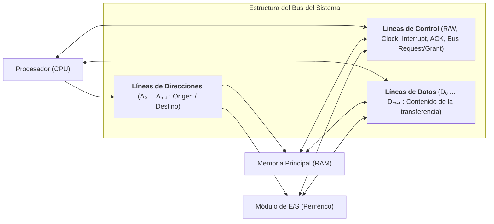
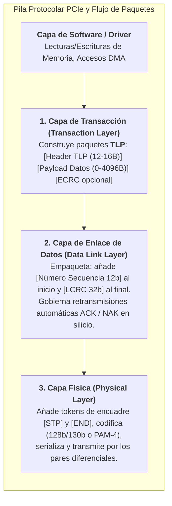
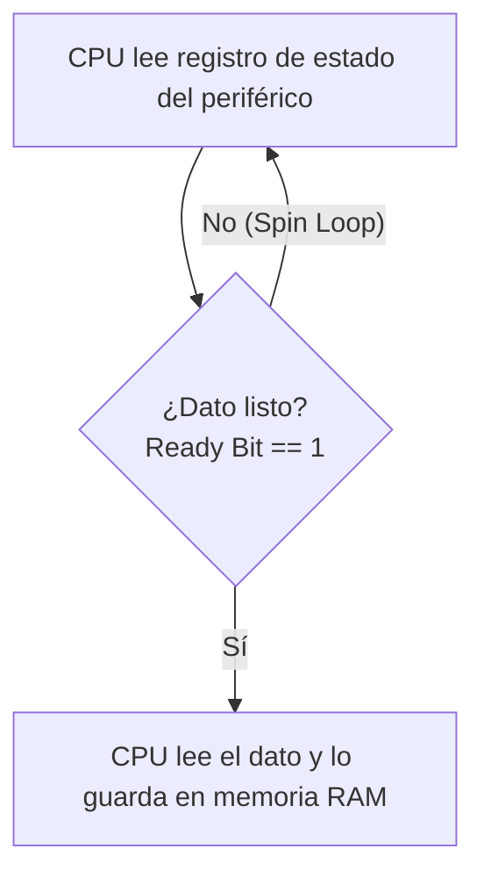
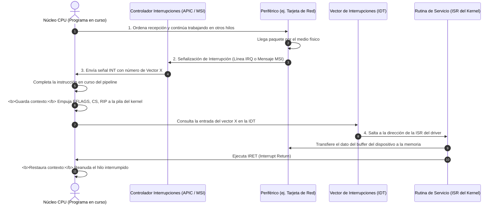
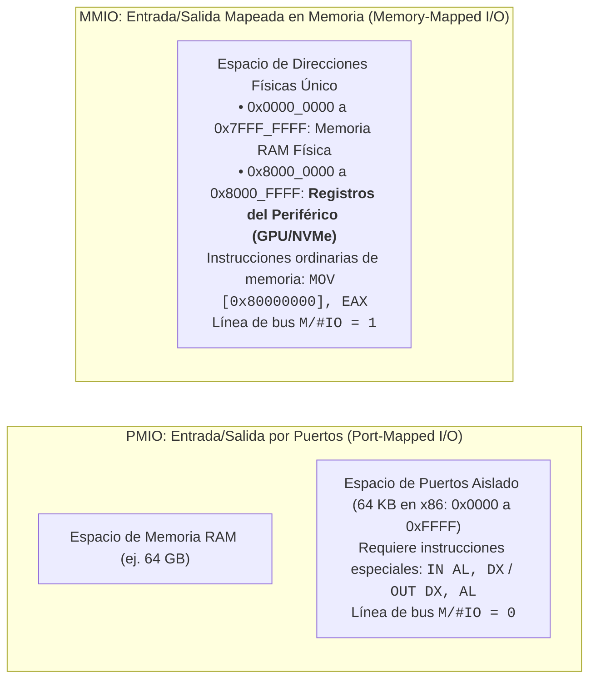

# Buses, Interconexión y Comunicación de Entrada/Salida (DMA e Interrupciones)

El rendimiento global de un computador no depende únicamente de la velocidad bruta de cálculo de su unidad central de procesamiento (CPU); depende de manera crítica de la **infraestructura de interconexión y comunicación** que transporta instrucciones y datos entre la CPU, los bancos de memoria principal (RAM), los aceleradores masivos (GPU) y el ecosistema de periféricos de almacenamiento y red (E/S).

Esta nota analiza la física y la lógica de los **buses del sistema**, la evolución arquitectónica desde los antiguos conjuntos de chips (*Northbridge / Southbridge*) hasta los modernos procesadores integrados (*SoC* y plataformas con enlaces punto a punto ultrarrápidos como **PCIe**, **UPI** e **Infinity Fabric**), y los tres métodos canónicos de transferencia de datos de Entrada/Salida: **E/S Programada**, **Interrupciones por Hardware (APIC)** y **Acceso Directo a Memoria (DMA)**.

> [!info] 💡 ¿Cómo entender esto desde cero? (Guía para novatos de pregrado)
> Imagina una gran **metrópoli industrial**:
> - La **CPU** es el edificio de la alcaldía y los ingenieros principales que toman decisiones a la velocidad de la luz.
> - La **Memoria RAM** es el almacén central de suministros inmediatos de la ciudad.
> - Los **Periféricos (SSD, Tarjeta de Red, Teclado)** son los puertos marítimos y fábricas en la periferia.
> - ¿Cómo viajan los productos?
>   - **Los Buses:** Son las autopistas. Un bus paralelo antiguo era como una calle de 32 carriles lentos donde si un auto tropezaba, toda la fila se desincronizaba (*bus skew*). El **PCI Express (PCIe)** moderno es una red de trenes bala ultrarrápidos punto a punto.
>   - **Interrupciones:** En lugar de que el alcalde esté llamando cada segundo al teléfono del puerto preguntando: *"¿Ya llegó el barco? ¿Ya llegó el barco?"* (**E/S Programada / Polling ineficiente**), el alcalde trabaja tranquilo hasta que suena una sirena de alarma (**Interrupción**), indicando que el barco atracó.
>   - **DMA (Direct Memory Access):** Si llega un tren con 10.000 cajas de mercancía para el almacén, sería ridículo que el alcalde cargue cada caja con sus propias manos hacia la RAM. En su lugar, el alcalde comisiona a un transportista autónomo (**el Controlador DMA**): *"Descarga todo el vagón en el estante 4 de la RAM y avísame cuando termines"*. La CPU queda 100% libre para seguir computando.

---

## 1. La Estructura Fundamental de un Bus: Datos, Direcciones y Control

Un **Bus** es una vía de comunicación compartida que interconecta dos o más unidades funcionales del computador. Desde el punto de vista lógico y funcional, cualquier sistema de bus se descompone en tres subsistemas de líneas:



1. **Líneas de Datos (*Data Bus*):**
   - Transportan los bits reales de información (instrucciones o datos numéricos).
   - Su **ancho** (número de líneas físicas, ej. 32, 64 o 128 bits) determina cuántos bytes se pueden transferir en un único ciclo de reloj (*Throughput* del bus).
2. **Líneas de Direcciones (*Address Bus*):**
   - Designan la fuente o destino del dato presente en el bus de datos (una celda de memoria RAM o un registro interno de un dispositivo de E/S).
   - El ancho de este bus dicta la **capacidad máxima de memoria direccionable**: un bus de direcciones de $k$ bits puede direccionar $2^k$ posiciones independientes (ej. 32 bits = 4 GiB; 48 bits = 256 TiB).
3. **Líneas de Control (*Control Bus*):**
   - Regulan el acceso y uso de las líneas de datos y direcciones para evitar colisiones:
     - `Memory Read` / `Memory Write`: Indican si la operación es de lectura o escritura en memoria.
     - `I/O Read` / `I/O Write`: Indican operaciones sobre el espacio de periféricos.
     - `Transfer ACK`: Notificación de que el dato ha sido leído o colocado exitosamente.
     - `Bus Request` / `Bus Grant`: Primitivas de **arbitraje de bus** (para determinar qué maestro del bus, CPU o DMA, toma el control de las líneas).
     - `Interrupt Request (IRQ)` / `Interrupt ACK`: Señalización de eventos asíncronos.
     - `Clock` y `Reset`: Sincronización temporal e inicialización del circuito.

### 1.1 Temporización de Buses: Síncronos vs. Asíncronos
- **Bus Síncrono:**
  - Todas las operaciones están referenciadas a una señal de reloj central común (`Clock`).
  - Cada evento (colocar dirección, muestrear datos) ocurre en flancos específicos del reloj o tras un número prefijado de ciclos.
  - **Ventaja:** Lógica de control extremadamente simple y altas velocidades en distancias muy cortas.
  - **Desventaja:** Todos los dispositivos deben acoplarse a la frecuencia del reloj común. Los periféricos lentos obligan a introducir **ciclos de espera (*Wait States*)**.
- **Bus Asíncrono:**
  - No existe reloj global. Las transferencias se coordinan mediante un protocolo de saludo o apretón de manos (**Handshaking** de 4 fases) usando líneas dedicadas de `Request` (Solicitud) y `Acknowledge` (Confirmación).
  - **Ventaja:** Permite conectar dispositivos con tiempos de respuesta radicalmente dispares sin forzar una frecuencia global; excelente para buses externos o interconexiones entre placas.
  - **Desventaja:** Mayor sobrecarga de señalización por cada byte transferido.

### 1.2 El Límite Físico de los Buses Paralelos: *Bus Skew*
Durante décadas, los diseñadores aumentaron el ancho de banda ensanchando los buses en paralelo (de 8 a 16, 32 y 64 pistas de cobre). Sin embargo, al superar los 100-133 MHz, la física impuso un muro infranqueable:
- **Desfase de Bus (*Clock Skew / Trace Skew*):** Debido a variaciones nanoscópicas en la longitud de las pistas en el circuito impreso (PCB) y diferencias microscópicas en la constante dieléctrica del material, las señales electromagnéticas viajan a velocidades ligeramente distintas por cada hilo.
- A frecuencias de GHz, un desfase de unos pocos picosegundos hace que el bit del hilo 0 llegue en un ciclo de reloj y el bit del hilo 63 llegue en el siguiente, corrompiendo la palabra completa.
- **Interferencia Electromagnética Cruzada (*Crosstalk*):** Decenas de pistas paralelas pulsando a voltajes altos en paralelo generan inductancia mutua y ruido destructivo.
- **Conclusión de la industria:** Los buses paralelos anchos quedaron obsoletos para interconexión externa, forzando la transición a enlaces serie diferenciales de ultra alta frecuencia (PCIe, SATA, USB 4).

---

## 2. Evolución Arquitectónica de la Tarjeta Madre: De North/Southbridge al SoC Moderno

La topología física de cómo la CPU se conecta con el resto del computador ha sufrido una revolución radical impulsada por la necesidad de abatir la latencia:

```mermaid
flowchart TD
    subgraph ArquitecturaClasica ["Arquitectura Clásica (Años 1990 - 2008)"]
        CPU1["CPU"] <-->|Front Side Bus (FSB)| NB["Northbridge (MCH)<br>• Controlador de Memoria<br>• Puerto Gráfico AGP/PCIe"]
        NB <--> RAM1["Memoria RAM"]
        NB <--> GPU1["GPU Dedicada"]
        NB <-->|Enlace Propietario| SB["Southbridge (ICH)<br>• PCI, SATA, USB, Audio<br>• BIOS / LPC, Red"]
        SB <--> DISK1["Discos / USB / Periféricos"]
    end

    subgraph ArquitecturaModerna ["Arquitectura Contemporánea (Procesador Integrado / PCH / SoC)"]
        CPU2["CPU Moderna (Die Unificado / Chiplet)<br>• Núcleos de Cómputo + Caché L3<br>• <b>Controlador de Memoria Integrado (IMC)</b><br>• <b>Controlador PCIe Raíz (16-24 líneas a GPU/NVMe)</b>"]
        CPU2 <-->|Canales DDR4/DDR5 Directos| RAM2["Memoria RAM (Baja Latencia: ~50 ns)"]
        CPU2 <-->|PCIe Gen 4/5 x16 Directo| GPU2["GPU Dedicada"]
        CPU2 <-->|PCIe Gen 4/5 x4 Directo| NVME["SSD M.2 NVMe Principal"]
        CPU2 <-->|DMI / PCIe x4-x8 Bus| PCH["PCH / Chipset Sur<br>• Puertos USB 3/4, SATA<br>• Red Ethernet / Wi-Fi<br>• Líneas PCIe Secundarias"]
        PCH <--> PERIF["Periféricos Secundarios"]
    end
```

### 2.1 La Arquitectura Antigua de Doble Puente (Two-Bridge Architecture)
- **Front-Side Bus (FSB):** Un bus paralelo compartido que conectaba la CPU con el **Northbridge** (*Memory Controller Hub - MCH*). Era el gran cuello de botella: todo el tráfico de memoria RAM y de gráficos debía atravesar este único bus.
- **Northbridge:** Contenía el controlador de memoria y las líneas para la tarjeta gráfica (puertos AGP o los primeros PCIe).
- **Southbridge (*I/O Controller Hub - ICH*):** Se encargaba de los dispositivos de baja velocidad (buses PCI tradicionales, discos IDE/SATA, puertos USB, teclado/ratón y chip de BIOS).
- **El Colapso del FSB ("The Memory Wall"):** Hacia 2005, los núcleos de CPU alcanzaban frecuencias de 3.8 GHz (Pentium 4 / Core 2 Quad), mientras el FSB estaba atascado en 1066-1333 MHz. Toda la CPU pasaba la mitad de su tiempo inactiva esperando datos a través del Northbridge con latencias de acceso a RAM superiores a los **100 - 120 ns**.

### 2.2 La Revolución del Controlador de Memoria Integrado (IMC)
- **El Salto de AMD e Intel:** AMD lideró la revolución en 2003 integrando el **Controlador de Memoria (IMC - *Integrated Memory Controller*)** directamente en el silicio del procesador con la arquitectura **AMD K8 (Athlon 64 / Opteron)** usando la interconexión punto a punto **HyperTransport**. Intel abandonó definitivamente el FSB en 2008 con la arquitectura **Nehalem (Core i7)** introduciendo **QuickPath Interconnect (QPI)** y su propio IMC.
- **Impacto en Rendimiento:** Al eliminar el intermediario del Northbridge y el bus FSB compartido, la latencia de acceso a la RAM física se redujo a más de la mitad (**de ~110 ns a ~50-60 ns**) y el ancho de banda disponible para los núcleos se multiplicó exponencialmente mediante canales dedicados directos (DDR4 / DDR5).

### 2.3 La Arquitectura Contemporánea: Chiplets, PCH y SoC
- **Líneas PCIe Directas de la CPU:** La CPU moderna incorpora su propio complejo raíz PCIe (*PCIe Root Complex*), comunicándose de forma directa y sin intermediarios con la GPU dedicada (típicamente 16 líneas PCIe Gen 4/5) y con el almacenamiento ultrarrápido (4 líneas directas a la primera ranura M.2 NVMe).
- **Platform Controller Hub (PCH / Chipset Sur):** Se encarga de concentrar la conectividad secundaria (red Gigabit/10G, audio, Wi-Fi, puertos SATA y USB adicionales), comunicándose con el procesador a través de un enlace serie de alta velocidad (como **Intel DMI** o un enlace PCIe dedicado).
- **Consolidación en SoC (System-on-Chip) y Chiplets:**
  - En servidores y procesadores de escritorio modernos (como AMD Ryzen / EPYC), la CPU se divide en baldosas (*Chiplets*): núcleos de cómputo (CCD) conectados a un chip central de Entrada/Salida (*I/O Die*) mediante enlaces coherentes ultrarrápidos (**Infinity Fabric**).
  - En dispositivos móviles y procesadores compactos (como Apple Silicon M-Series o Intel Core Ultra), la integración llega al extremo de **SoC completo**: la CPU, la GPU, los aceleradores neuronales (NPU) y la memoria DRAM física (LPDDR5 con arquitectura de memoria unificada UMA) conviven dentro del mismo sustrato de silicio, erradicando por completo las pistas externas de la tarjeta madre para el subsistema de memoria.

---

## 3. El Estándar PCIe (PCI Express): Arquitectura por Capas y Paquetes

El estándar **PCIe** reemplazó a todos los buses paralelos anteriores (ISA, PCI, PCI-X, AGP) gracias a un cambio paradigmático: **abandonar el bus paralelo compartido y adoptar enlaces serie punto a punto basados en conmutadores (*Switching Fabric*)**.

### 3.1 Física del Enlace Serie y Señalización Diferencial (LVDS)
En lugar de medir el voltaje de una sola pista respecto a tierra (señalización *Single-Ended*, altamente susceptible a interferencias del entorno), PCIe utiliza **señalización diferencial de bajo voltaje (LVDS)**:
- Cada dirección de un carril consta de dos conductores entrelazados que transportan voltajes opuestos: $V_+$ y $V_-$.
- El receptor en el chip no mide respecto a tierra, sino la diferencia neta:
  $$V_{\text{diff}} = V_+ - V_-$$
- **Rechazo de Ruido en Modo Común (*Common-Mode Noise Rejection*):** Si una fuente externa de interferencia electromagnética induce un voltaje de ruido $+V_{\text{ruido}}$ sobre el par físico, este afecta a ambos conductores simultáneamente:
  $$V_{\text{medido}} = (V_+ + V_{\text{ruido}}) - (V_- + V_{\text{ruido}}) = V_+ - V_-$$
  ¡El ruido se anula matemáticamente en el receptor!
- **Ventaja de Ingeniería:** Permite reducir la excursión de voltaje a tan solo $\approx 800\text{ mV}$ (frente a los $3.3\text{ V} / 5\text{ V}$ del antiguo bus PCI), reduciendo drásticamente el consumo energético y la disipación térmica, permitiendo frecuencias de reloj en el rango de los gigahercios y decenas de Gigatransferencias por segundo (GT/s).

### 3.2 Topología Punto a Punto y Carriles (*Lanes*)
- **Topología Conmutada (*Switched Point-to-Point*):** No hay colisiones de bus ni arbitraje compartido. Cada dispositivo cuenta con un enlace dedicado y exclusivo hacia el complejo raíz (*Root Complex*) integrado en la CPU o hacia un conmutador PCIe (*PCIe Switch*).
- **Carriles Físicos (*Lanes*):** Un enlace se ensambla con uno o múltiples carriles ($\times 1, \times 2, \times 4, \times 8, \times 16$). Cada carril físico está compuesto exactamente por **4 hilos de cobre** (2 pares diferenciales: un par para transmisión $TX+/TX-$ y un par para recepción $RX+/RX-$ en modo *Full Duplex* simultáneo).

### 3.3 Arquitectura por Capas y Anatomía de los Paquetes TLP

PCIe opera conceptualmente como una red local de conmutación de paquetes (similar al modelo OSI) dividida en 3 capas de hardware:



#### Funciones Clave por Capa:
1. **Capa de Transacción (*Transaction Layer*):**
   - Construye los paquetes de alto nivel llamados **TLP (*Transaction Layer Packets*)**.
   - **Tipos de TLP:**
     - *Memory Read / Memory Write:* Lecturas y transferencias masivas de datos hacia/desde RAM física.
     - *Configuration Read / Write:* Empleados por el BIOS/Kernel durante el arranque para consultar el *Vendor ID* y asignar direcciones a los registros *BAR*.
     - *Message TLP:* Señalización de interrupciones modernas (**MSI / MSI-X**) y gestión térmica/energética.
   - **Transacciones Publicadas (*Posted*) vs. No Publicadas (*Non-Posted*):**
     - *Posted* (ej. Escrituras en Memoria): El emisor envía el TLP y continúa trabajando sin esperar confirmación en la capa de software.
     - *Non-Posted* (ej. Lecturas en Memoria): Requieren obligatoriamente un paquete de respuesta con los datos solicitados denominado **Completion with Data (CplD)**.
2. **Capa de Enlace de Datos (*Data Link Layer*):**
   - Garantiza que **no se pierda ni un solo bit** entre los dos extremos del enlace físico.
   - **Protocolo de Reintento por Hardware (ACK / NAK):** El receptor verifica el código LCRC de cada TLP. Si es correcto, devuelve un paquete de enlace `ACK`. Si detecta ruido o error, devuelve un `NAK`. El transmisor almacena una copia de cada paquete en su memoria de reintento (*Replay Buffer* en silicio); al recibir un `NAK`, retransmite el paquete de inmediato de forma 100% transparente para la CPU y el sistema operativo.
   - **Control de Flujo Basado en Créditos (*Credit-Based Flow Control*):** Ningún transmisor envía un TLP a menos que el receptor le haya notificado previamente que tiene créditos suficientes en sus buffers, impidiendo saturaciones o pérdidas por desbordamiento.
3. **Capa Física (*Physical Layer*):**
   - Convierte los paquetes digitales en señales electromagnéticas analógicas serie mediante circuitos SerDes (*Serializer/Deserializer*).

### 3.4 Comparativa de Rendimiento por Generaciones PCIe

| Generación PCIe | Frecuencia de Señalización | Codificación | Ancho de Banda por Carril ($\times 1$) | Ancho de Banda para GPU ($\times 16$) | Latencia Típica |
| :--- | :--- | :--- | :--- | :--- | :--- |
| **PCIe 3.0 (2010)** | 8.0 GT/s | 128b/130b | ~ 985 MB/s | ~ 15.75 GB/s | ~ 100 ns |
| **PCIe 4.0 (2017)** | 16.0 GT/s | 128b/130b | ~ 1.969 GB/s | ~ 31.51 GB/s | ~ 100 ns |
| **PCIe 5.0 (2019)** | 32.0 GT/s | 128b/130b | ~ 3.938 GB/s | ~ 63.02 GB/s | ~ 100 ns |
| **PCIe 6.0 (2022)** | 64.0 GT/s (PAM-4) | Flit (1b/1b + FEC) | ~ 7.563 GB/s | ~ 121.0 GB/s | ~ 100 ns |

---

## 4. Métodos de Comunicación de Entrada/Salida

Cuando la CPU necesita transferir datos hacia o desde un módulo de E/S (como un controlador de disco NVMe, una tarjeta de red o un teclado), existen tres paradigmas arquitectónicos fundamentales:

### 4.1 Entrada/Salida Programada (Programmed I/O o Polling)
- **Mecanismo:** La CPU ejecuta un bucle cerrado de instrucciones de máquina que lee continuamente el registro de estado del módulo de E/S hasta que el bit de preparación (*Ready Bit*) indica que el periférico está listo para transferir un dato.
- **Ventaja:** Muy sencilla de diseñar a nivel de hardware; no requiere controladores de interrupción ni circuitos de arbitraje adicionales.
- **Desventaja Crítica:** **Desperdicio masivo del procesador**. La CPU queda atrapada en una espera activa (*busy-waiting* o *spin loop*).



> [!example] ⏱️ Demostración Cuantitativa del Desperdicio en Polling
> Supongamos que una unidad de almacenamiento secundario tarda $100\ \mu\text{s}$ ($0.0001\text{ s}$) en recuperar un bloque de datos del medio magnético o flash.
> En un procesador moderno funcionando a **3.0 GHz** ($3 \times 10^9\text{ ciclos/segundo}$):
> $$\text{Ciclos perdidos} = 3 \times 10^9 \frac{\text{ciclos}}{\text{s}} \times 0.0001\text{ s} = \mathbf{300{,}000\text{ ciclos de CPU}}$$
> ¡Trescientos mil ciclos de cálculo matemático desperdiciados en un bucle ciego `TEST bit; JZ loop`! Si se tratara de un disco duro mecánico antiguo ($10\text{ ms}$ de búsqueda), la CPU perdería **30 millones de ciclos**.

---

### 4.2 Entrada/Salida Dirigida por Interrupciones (Interrupt-Driven I/O)
- **Mecanismo:** La CPU emite la orden de lectura o escritura al periférico y **continúa de inmediato ejecutando otros procesos útiles de usuario**. Cuando el periférico ha completado la preparación del dato, activa un evento asíncrono que fuerza a la CPU a pausar su flujo normal y ejecutar una rutina de software especializada denominada **Rutina de Servicio de Interrupción (ISR - *Interrupt Service Routine*)**.



#### Evolución del Hardware de Interrupciones:
1. **PIC Legacy (Intel 8259A):** Dos chips en cascada (Maestro/Esclavo) con únicamente 15 líneas IRQ cableadas físicamente. Sufría constantes colisiones y conflictos al compartir líneas entre múltiples placas de expansión PCI.
2. **APIC (Advanced Programmable Interrupt Controller):**
   - **I/O APIC:** Reside en el chipset/PCH; recibe las líneas físicas de los dispositivos de la placa y las traduce en mensajes que distribuye a través del bus del sistema. Permite balanceo dinámico de interrupciones entre múltiples núcleos.
   - **Local APIC (LAPIC):** Integrado dentro de cada núcleo de la CPU; gestiona las prioridades de interrupción del núcleo y permite el envío de **Interrupciones Entre Procesadores (IPI - *Inter-Processor Interrupts*)** para sincronización multihilo.
3. **MSI / MSI-X (Message Signaled Interrupts en PCIe):**
   - **¡Desaparición de los cables físicos de IRQ!** Los dispositivos PCIe no cuentan con pines de interrupción. Cuando una tarjeta de red o SSD NVMe necesita interrumpir a la CPU, emite un paquete **TLP de Escritura en Memoria (*Memory Write TLP*)** normal hacia una dirección física especial asignada al Local APIC (rango `0xFEE0_0000`). El valor de datos escrito (de 32 bits) codifica el vector de interrupción. ¡La interrupción viaja por el mismo par de cables diferenciales del enlace PCIe que los datos ordinarios!

- **Límite de las Interrupciones Puras:** Aunque superan al Polling, para transferencias masivas (ej. descargar un archivo a 100 Gbps), interrumpir a la CPU por cada paquete de 1500 bytes provocaría **avalancha de interrupciones (*Interrupt Thrashing*)**: la CPU pasaría el 100% de su tiempo guardando y restaurando registros de contexto sin avanzar en el trabajo real.

---

### 4.3 Acceso Directo a Memoria (DMA - Direct Memory Access)

Para transferencias masivas de datos, la arquitectura descarga completamente a la CPU mediante un coprocesador especializado: el **Controlador de DMA (DMAC)**.

El DMA asume el rol de maestro del bus (**Bus Master**) y transfiere bloques masivos de información directamente entre el periférico y los módulos de memoria física RAM, **sin que los bytes pasen en ningún momento por los registros internos de la CPU**.

```mermaid
flowchart TD
    CPU["<b>1. CPU Configura DMAC:</b><br>• Dirección base física en RAM<br>• Longitud en bytes<br>• Dirección del flujo (Lectura/Escritura)"]
    
    DMA["<b>Controlador DMA (DMAC)</b><br>Toma el control como 'Bus Master'"]
    
    RAM["Memoria RAM Principal"]
    DEV["Periférico Masivo (SSD NVMe / Red / GPU)"]

    CPU -. 1. Envía parámetros .-> DMA
    CPU -->|2. CPU queda 100% libre para computar| UserApp["Ejecución de Código Útil de Usuario"]

    DMA <-->|3. Lectura/Escritura por ráfagas| DEV
    DMA <-->|3. Transferencia directa a memoria| RAM

    DMA -. 4. Una sola interrupción final: ¡Transferencia Completada! .-> CPU
```

#### Modos Canónicos de Operación de DMA:
1. **Robo de Ciclo (*Cycle Stealing*):**
   - El controlador de DMA solicita el bus (`Bus Request`). Cuando la CPU le concede las líneas (`Bus Grant`), el DMAC transfiere exactamente una palabra o bloque de bus y libera las líneas de inmediato. Se intercalan transferencias de E/S entre ciclos de la CPU sin detener completamente el procesamiento.
2. **Modo Ráfaga (*Burst Mode / Block Transfer*):**
   - El DMAC toma el bus y transfiere el bloque completo continuo a la máxima tasa que permita el bus antes de devolver el control. Ideal para llenar buffers a alta velocidad.
3. **Scatter-Gather DMA (Dispersión y Recolección):**
   - **El problema en sistemas modernos:** Debido a la memoria virtual, un búfer contiguo de 64 KiB en el espacio virtual del programa suele estar fragmentado en múltiples marcos físicos dispersos y no contiguos en la memoria RAM (ej. páginas físicas 12, 87, 4, 53...).
   - **La solución arquitectónica:** El sistema operativo no reprograma el DMA por cada página. En su lugar, construye una **Lista de Dispersión/Recolección (SGL - *Scatter-Gather List* o Descriptores PRD)** en la memoria RAM:

```
+-----------------------------------------------------------------------------------+
| LISTA SCATTER-GATHER (SGL) EN MEMORIA RAM                                         |
| [Descriptor 0]: Dirección Física = Marco 12  | Longitud = 4096 B | EndOfList = 0  |
| [Descriptor 1]: Dirección Física = Marco 87  | Longitud = 4096 B | EndOfList = 0  |
| [Descriptor 2]: Dirección Física = Marco 4   | Longitud = 4096 B | EndOfList = 0  |
| [Descriptor 3]: Dirección Física = Marco 53  | Longitud = 4096 B | EndOfList = 1  |
+-----------------------------------------------------------------------------------+
```

El controlador DMAC procesa descriptor por descriptor de forma totalmente autónoma y emite **una sola interrupción al procesador al alcanzar el flag `EndOfList = 1`**.

#### 4.4 El Problema de la Coherencia de Caché con DMA (*Cache Coherency Hazard*)
Dado que el DMA escribe y lee directamente en la memoria DRAM externa puenteando a la CPU, surge un conflicto crítico con la jerarquía de memoria:
- **Peligro de Datos Sucios (*Dirty Cache Hazard*):** Si la CPU ha modificado datos en su caché L1/L2 pero aún no los ha volcado a la DRAM (*Write-Back*), y el DMA lee de la DRAM para transmitir por red, ¡el DMA enviará datos obsoletos!
- **Peligro de Sobrescritura (*Stale Cache Hazard*):** Si el DMA descarga 4 KiB de un SSD en la RAM física, pero la CPU ya tenía esa misma línea cargada en su caché L1, la CPU continuará leyendo los datos viejos de su caché en lugar de los nuevos traídos por el DMA.
- **Solución Hardware (Estándar en Servidores y x86-64):** El controlador de memoria (IMC) incorpora **Snooping Coherente por Hardware**: intercepta todas las transacciones DMA en los buses internos e invalida o actualiza automáticamente las líneas en las cachés de la CPU.
- **Solución Software (Sistemas Embebidos / Microcontroladores ARM Cortex-M):** El programador del driver debe ejecutar explícitamente barreras de software (`clean_dcache()` antes de lecturas DMA, e `invalidate_dcache()` después de escrituras DMA).

---

## 5. Mapeo de Entrada/Salida: MMIO vs. PMIO

¿Cómo dialoga el conjunto de instrucciones de la CPU con los registros de control de los periféricos?



### 5.1 Port-Mapped I/O (PMIO / Entrada-Salida Aislada)
- Utilizado históricamente en la arquitectura x86 de Intel.
- Los puertos de periféricos residen en un mapa de direcciones de 16 bits completamente separado e independiente del mapa de la RAM (puertos `0x0000` a `0xFFFF`, es decir, 64 KiB en total).
- **Código Ensamblador:** Requiere el uso de instrucciones de máquina exclusivas:
  ```nasm
  ; Leer el registro de estado del puerto serie COM1 (puerto 0x03FD)
  mov dx, 0x03FD      ; DX debe contener obligatoriamente el número de puerto
  in  al, dx          ; Lee 1 byte del puerto hacia el acumulador AL
  ```
- **Control Físico:** La CPU activa la línea de control del bus `M/#IO = 0` para notificar a la placa que la dirección en el bus no es de memoria RAM, sino de un puerto E/S.
- **Desventajas:** Solo opera con los registros acumuladores (`AL`, `AX`, `EAX`) y el registro `DX`. No aprovecha los modos de direccionamiento avanzados ni la protección granular de páginas de la MMU.

### 5.2 Memory-Mapped I/O (MMIO)
- Es el estándar universal en arquitecturas RISC (ARM, RISC-V, MIPS) y el mecanismo primordial para periféricos de alta velocidad (PCIe, GPU, NVMe) en x86.
- Los registros de los dispositivos se proyectan directamente sobre ventanas reservadas del espacio de direcciones de memoria física.
- **Código Ensamblador:** No requiere instrucciones especializadas:
  ```nasm
  ; Escribir un comando en el registro de control de una tarjeta PCIe mapeada en 0xFED0_0000
  mov dword ptr [0xFED00000], 0x00000001   ; Instrucción MOV convencional
  ```

#### 5.3 Asignación Dinámica de MMIO: Registros BAR de PCIe
¿Cómo sabe el sistema operativo en qué dirección de memoria física ubicar cada dispositivo?
- Cada dispositivo PCIe incluye en su silicio un bloque de cabecera de configuración con hasta seis registros denominados **BAR (*Base Address Registers*)**.
- Durante el arranque (*Boot / UEFI*), el firmware escribe todos unos (`0xFFFFFFFF`) en el BAR del periférico y luego lee el valor resultante; la cantidad de bits que quedan en cero le indica exactamente **cuántos megabytes de espacio físico requiere el dispositivo**.
- El sistema operativo asigna un bloque de memoria física libre del mapa del sistema, escribe la dirección de inicio en el BAR y mapea esa región en las tablas de páginas de la MMU.

#### 5.4 El Rol Crítico de la MMU en MMIO: Atributos de Caché (`PCD` y `UC`)
Si la CPU utilizara su jerarquía de memoria habitual sobre un registro MMIO, el sistema colapsaría:
- Si la CPU consulta en bucle un registro de estado de hardware mapeado en memoria (ej. `[0xFED00004]`), la primera lectura cargaría la línea en la caché L1. ¡Las siguientes lecturas se resolverían desde la caché L1 y la CPU jamás vería los cambios de estado reales del periférico!
- Por ello, la MMU debe marcar obligatoriamente las entradas de tabla de páginas (PTE) que apuntan a regiones MMIO con:
  - **Bit `PCD = 1` (*Page-level Cache Disable*)** y **`PWT = 1` (*Page-level Write-Through*)**.
  - En arquitecturas x86 y ARM modernas, mediante las tablas **PAT (*Page Attribute Table*)** o registros **MTRR**, se configura la región como **Memoria No Cacheable (UC - *Uncacheable*)**.
  - Para aceleradores de vídeo (framebuffers), se utiliza el tipo **WC (*Write-Combining*)**, el cual no cachea lecturas pero combina múltiples escrituras pequeñas contiguas en un solo paquete de ráfaga PCIe de 64 bytes, maximizando la tasa de transferencia gráfica.

### 5.5 Tabla Comparativa Definitiva: PMIO vs. MMIO

| Característica | PMIO (Port-Mapped I/O) | MMIO (Memory-Mapped I/O) |
| :--- | :--- | :--- |
| **Espacio de Direcciones** | Separado y aislado (64 KiB en x86). | Unificado dentro del mapa de memoria física global. |
| **Instrucciones CPU** | Exclusivas (`IN`, `OUT`). | Cualquier instrucción estándar (`MOV`, `LDR`, `STR`, `TEST`). |
| **Flexibilidad de Registros** | Limitada a `AL`, `AX`, `EAX` y puerto en `DX`. | Cualquier registro de propósito general y modos de direccionamiento complejos. |
| **Protección del S.O.** | Controlada por el nivel de privilegios IOPL en `EFLAGS`. | Protegida con la granularidad y permisos de página de la **MMU** (Ring 0/3, R/W). |
| **Impacto en Caché** | Ninguno (no pasa por las cachés). | Requiere deshabilitar la caché en la MMU (`PCD=1`, tipo `UC`). |
| **Uso Principal** | Puertos legados (teclado PS/2, temporizador PIT 8254). | **Estándar moderno:** Dispositivos PCIe, GPUs, SSDs NVMe, tarjetas de red 100G. |
