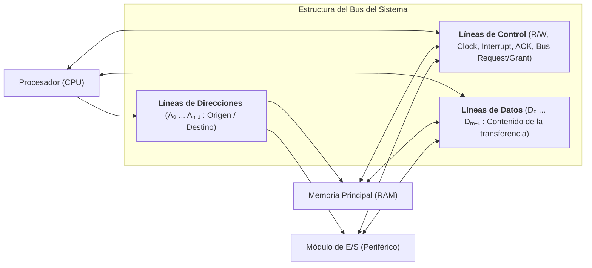
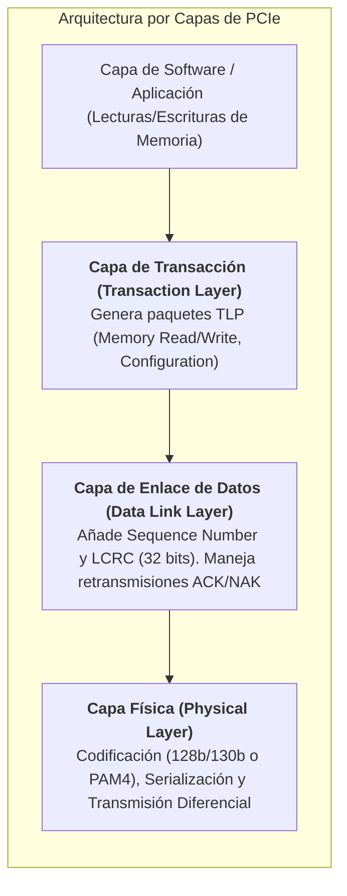
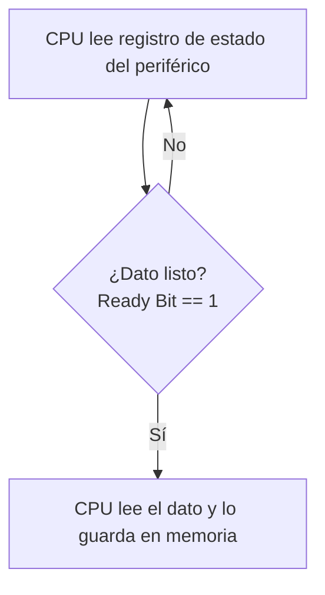
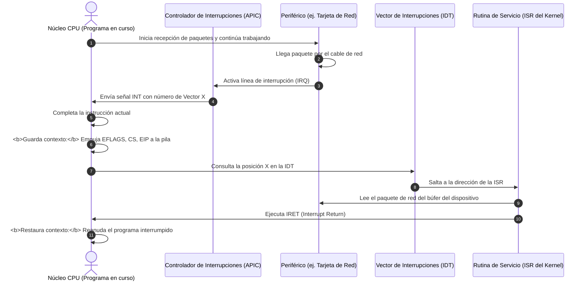
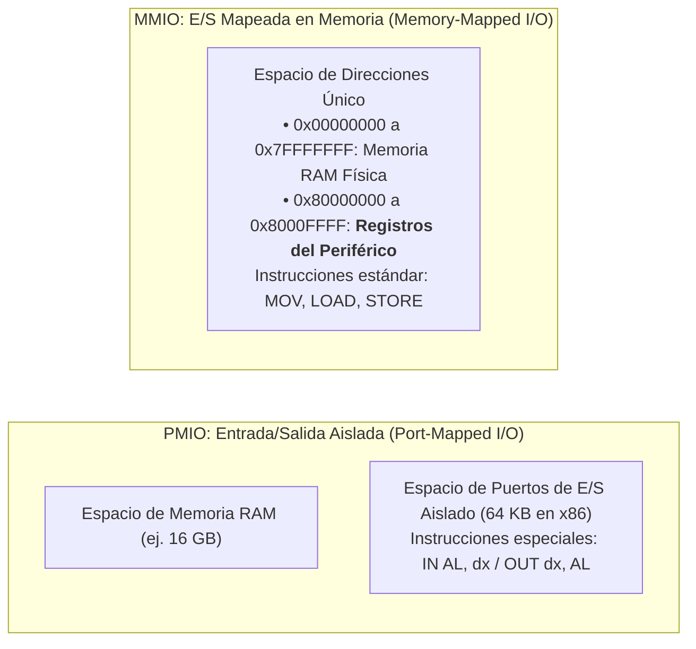

# Buses, Interconexión y Comunicación de Entrada/Salida (DMA e Interrupciones)

El rendimiento global de un computador no depende únicamente de la velocidad bruta de cálculo de su unidad central de procesamiento (CPU); depende de manera crítica de la **infraestructura de interconexión y comunicación** que transporta instrucciones y datos entre la CPU, los bancos de memoria principal (RAM), los aceleradores masivos (GPU) y el ecosistema de periféricos de almacenamiento y red (E/S).

Esta nota analiza la física y la lógica de los **buses del sistema**, la evolución arquitectónica desde los antiguos conjuntos de chips (*Northbridge / Southbridge*) hasta los modernos procesadores integrados (*SoC* y plataformas con enlaces punto a punto ultrarrápidos como **PCIe**, **UPI** e **Infinity Fabric**), y los tres métodos canónicos de transferencia de datos de Entrada/Salida: **E/S Programada**, **Interrupciones por Hardware (APIC)** y **Acceso Directo a Memoria (DMA)**.

> [!info] 💡 ¿Cómo entender esto desde cero? (Guía para novatos de pregrado)
> Imagina una gran **metrópoli industrial**:
> - La **CPU** es el edificio de la alcaldía y los ingenieros principales que toman decisiones a la velocidad de la luz.
> - La **Memoria RAM** es el almacén central de suministros inmediatos de la ciudad.
> - Los **Periféricos (SSD, Tarjeta de Red, Teclado)** son los puertos marítimos y fábricas en la periferia.
> - ¿Cómo viajan los productos?
>   - **Los Buses:** Son las autopistas. Un bus paralelo antiguo era como una calle de 32 carriles lentos donde si un auto tropezaba, toda la fila se desincronizaba (*bus skew*). El **PCI Express (PCIe)** moderno es una red de trenes bala ultrarrápidos punto a punto.
>   - **Interrupciones:** En lugar de que el alcalde esté llamando cada segundo al teléfono del puerto preguntando: *"¿Ya llegó el barco? ¿Ya llegó el barco?"* (**E/S Programada / Polling ineficiente**), el alcalde trabaja tranquilo hasta que suena una sirena de alarma (**Interrupción**), indicando que el barco atracó.
>   - **DMA (Direct Memory Access):** Si llega un tren con 10.000 cajas de mercancía para el almacén, sería ridículo que el alcalde cargue cada caja con sus propias manos hacia la RAM. En su lugar, el alcalde comisiona a un transportista autónomo (**el Controlador DMA**): *"Descarga todo el vagón en el estante 4 de la RAM y avísame cuando termines"*. La CPU queda 100% libre para seguir computando.

---

## 1. La Estructura Fundamental de un Bus: Datos, Direcciones y Control

Un **Bus** es una vía de comunicación compartida que conecta dos o más dispositivos del computador. Desde el punto de vista lógico y funcional, cualquier sistema de bus se descompone en tres subsistemas de líneas:



1. **Líneas de Datos (*Data Bus*):**
   - Transportan los bits reales de información (instrucciones o datos numéricos).
   - Su **ancho** (número de líneas físicas, ej. 32, 64 o 128 bits) determina cuántos bytes se pueden transferir en un único ciclo de reloj (*Throughput* del bus).
2. **Líneas de Direcciones (*Address Bus*):**
   - Designan la fuente o destino del dato presente en el bus de datos (una celda de memoria RAM o un registro interno de un dispositivo de E/S).
   - El ancho de este bus dicta la **capacidad máxima de memoria direccionable**: un bus de direcciones de $k$ bits puede direccionar $2^k$ posiciones independientes (ej. 32 bits = 4 GiB; 48 bits = 256 TiB).
3. **Líneas de Control (*Control Bus*):**
   - Regulan el acceso y uso de las líneas de datos y direcciones para evitar colisiones:
     - `Memory Read` / `Memory Write`: Indican si la operación es de lectura o escritura en memoria.
     - `I/O Read` / `I/O Write`: Indican operaciones sobre el espacio de periféricos.
     - `Transfer ACK`: Notificación de que el dato ha sido leído o colocado exitosamente.
     - `Bus Request` / `Bus Grant`: Primitivas de **arbitraje de bus** (para determinar qué maestro del bus, CPU o DMA, toma el control de las líneas).
     - `Interrupt Request (IRQ)` / `Interrupt ACK`: Señalización de eventos asíncronos.
     - `Clock` y `Reset`: Sincronización temporal e inicialización del circuito.

---

## 2. Evolución Arquitectónica de la Tarjeta Madre: De North/Southbridge al SoC Moderno

La topología física de cómo la CPU se conecta con el resto del computador ha sufrido una revolución radical impulsada por la necesidad de abatir la latencia:

```mermaid
flowchart TD
    subgraph ArquitecturaClasica ["Arquitectura Clásica (Años 1990 - 2008)"]
        CPU1["CPU"] <-->|Front Side Bus (FSB)| NB["Northbridge (MCH)<br>• Controlador de Memoria<br>• Puerto Gráfico AGP/PCIe"]
        NB <--> RAM1["Memoria RAM"]
        NB <--> GPU1["GPU Dedicada"]
        NB <-->|Enlace Propietario| SB["Southbridge (ICH)<br>• PCI, SATA, USB, Audio<br>• BIOS / LPC, Red"]
        SB <--> DISK1["Discos / USB / Periféricos"]
    end

    subgraph ArquitecturaModerna ["Arquitectura Contemporánea (Procesador Integrado / PCH / SoC)"]
        CPU2["CPU Moderna (Die Unificado / Chiplet)<br>• Núcleos de Cómputo + Caché L3<br>• <b>Controlador de Memoria Integrado (IMC)</b><br>• <b>Controlador PCIe Raíz (16-24 líneas a GPU/NVMe)</b>"]
        CPU2 <-->|Canales DDR4/DDR5 Directos| RAM2["Memoria RAM (Baja Latencia)"]
        CPU2 <-->|PCIe Gen 4/5 x16 Directo| GPU2["GPU Dedicada"]
        CPU2 <-->|PCIe Gen 4/5 x4 Directo| NVME["SSD M.2 NVMe Principal"]
        CPU2 <-->|DMI / PCIe x4-x8 Bus| PCH["PCH / Chipset Sur<br>• Puertos USB 3/4, SATA<br>• Red Ethernet / Wi-Fi<br>• Líneas PCIe Secundarias"]
        PCH <--> PERIF["Periféricos Secundarios"]
    end
```

### 2.1 La Arquitectura Antigua de Doble Puente (Two-Bridge Architecture)
- **Front-Side Bus (FSB):** Un bus paralelo compartido que conectaba la CPU con el **Northbridge** (*Memory Controller Hub - MCH*). Era el gran cuello de botella: todo el tráfico de memoria RAM y de gráficos debía atravesar este único bus.
- **Northbridge:** Contenía el controlador de memoria y las líneas para la tarjeta gráfica (puertos AGP o los primeros PCIe).
- **Southbridge (*I/O Controller Hub - ICH*):** Se encargaba de los dispositivos de baja velocidad (buses PCI tradicionales, discos IDE/SATA, puertos USB, teclado/ratón y chip de BIOS).

### 2.2 La Arquitectura Moderna: Integración en Silicio y PCH
- **Desaparición del Northbridge:** Para eliminar la latencia del FSB, los fabricantes integraron el **Controlador de Memoria (IMC - *Integrated Memory Controller*)** directamente dentro del silicio de la CPU. La CPU se conecta a la RAM mediante canales directos de 64 bits por canal (DDR4 / DDR5).
- **Líneas PCIe Directas de la CPU:** La CPU moderna incorpora su propio complejo raíz PCIe (*PCIe Root Complex*), comunicándose de forma directa y sin intermediarios con la GPU dedicada (típicamente 16 líneas PCIe Gen 4/5) y con el almacenamiento ultrarrápido (4 líneas directas a la primera ranura M.2 NVMe).
- **Platform Controller Hub (PCH / Chipset Sur):** Se encarga de concentrar la conectividad secundaria (red Gigabit/10G, audio, Wi-Fi, puertos SATA y USB adicionales), comunicándose con el procesador a través de un enlace serie de alta velocidad (como **Intel DMI** o un enlace PCIe dedicado).

---

## 3. El Estándar PCIe (PCI Express): Arquitectura por Capas y Paquetes

El estándar **PCIe** reemplazó a todos los buses paralelos anteriores (ISA, PCI, PCI-X, AGP) gracias a un cambio paradigmático: **abandonar el bus paralelo compartido y adoptar enlaces serie punto a punto basados en conmutadores (*Switching Fabric*)**.

### 3.1 Ventajas Fundamentales del Enlace Serie PCIe
1. **Eliminación del *Clock Skew*:** En un bus paralelo ancho (ej. 64 pistas de cobre), las ondas electromagnéticas llegan con ligerísimas diferencias de picosegundos a cada pin debido a variaciones microscópicas en la longitud de las pistas físicas. Esto impedía subir las frecuencias de reloj por encima de unos cientos de megahercios. PCIe utiliza **señalización diferencial** en un solo par de cables por dirección, permitiendo frecuencias de decenas de gigahercios.
2. **Topología Punto a Punto Dedicada:** Cada dispositivo tiene su propio enlace dedicado hacia el conmutador (*Root Complex / PCIe Switch*). No hay disputa ni arbitraje de bus con otros periféricos.
3. **Escalabilidad por Carriles (*Lanes*):** Un enlace PCIe se compone de uno o más carriles ($\times 1, \times 2, \times 4, \times 8, \times 16$). Cada carril consta de 4 hilos (dos pares diferenciales: un par para transmitir $TX+/TX-$ y un par para recibir $RX+/RX-$ en *Full Duplex* simultáneo).



### 3.2 Comparativa de Rendimiento por Generaciones PCIe

| Generación PCIe | Frecuencia de Señalización | Codificación | Ancho de Banda por Carril ($\times 1$) | Ancho de Banda para GPU ($\times 16$) |
| :--- | :--- | :--- | :--- | :--- |
| **PCIe 3.0 (2010)** | 8.0 GT/s | 128b/130b | ~ 985 MB/s | ~ 15.75 GB/s |
| **PCIe 4.0 (2017)** | 16.0 GT/s | 128b/130b | ~ 1.969 GB/s | ~ 31.51 GB/s |
| **PCIe 5.0 (2019)** | 32.0 GT/s | 128b/130b | ~ 3.938 GB/s | ~ 63.02 GB/s |
| **PCIe 6.0 (2022)** | 64.0 GT/s (PAM-4) | Flit (1b/1b + FEC) | ~ 7.563 GB/s | ~ 121.0 GB/s |

---

## 4. Métodos de Comunicación de Entrada/Salida

Cuando la CPU necesita transferir datos hacia o desde un módulo de E/S (como un controlador de disco, una tarjeta de interfaz de red o un teclado), existen tres paradigmas arquitectónicos:

### 4.1 Entrada/Salida Programada (Programmed I/O o Polling)
- **Mecanismo:** La CPU ejecuta un bucle de instrucciones que lee periódicamente el registro de estado del módulo de E/S hasta que este indica que está listo para transferir un dato.
- **Ventaja:** Muy sencilla de diseñar a nivel de hardware; no requiere circuitos de interrupción ni controladores adicionales.
- **Desventaja:** **Desperdicio masivo de CPU**. El procesador se queda atrapado en una espera activa (*busy-waiting* o *spin loop*), consumiendo miles de millones de ciclos de cálculo útiles sin hacer nada productivo.



---

### 4.2 Entrada/Salida Dirigida por Interrupciones (Interrupt-Driven I/O)
- **Mecanismo:** La CPU emite la orden de lectura o escritura al módulo de E/S y **continúa ejecutando otras tareas o procesos de inmediato**. Cuando el periférico ha completado la preparación del dato, envía una señal eléctrica a una línea de interrupción física (**IRQ - *Interrupt Request***).
- **El Controlador de Interrupciones (APIC):** En las plataformas modernas, el **Advanced Programmable Interrupt Controller (APIC)** recibe las señales de los periféricos (*I/O APIC*), las prioriza y las envía al *Local APIC* del núcleo de CPU correspondiente.



- **Ventaja:** Se elimina completamente la espera activa. La CPU solo atiende al dispositivo cuando este realmente tiene trabajo que entregar.
- **Limitación:** Para transferencias de gran volumen (ej. copiar un archivo de 10 GB desde un SSD NVMe o una tarjeta de red de 100 Gbps), atender una interrupción por cada bloque de 64 bytes saturaría a la CPU simplemente guardando y restaurando registros (*Interrupt Thrashing*).

---

### 4.3 Acceso Directo a Memoria (DMA - Direct Memory Access)

Para transferencias masivas de datos, el hardware incorpora un procesador especializado dedicado: el **Controlador de DMA (DMAC)**.

El DMA permite que los periféricos lean o escriban bloques gigantescos de memoria física directamente en la memoria RAM principal **sin que los datos pasen a través de los registros de la CPU**.

```mermaid
flowchart TD
    CPU["1. CPU programa el DMA:<br>• Dirección base en RAM<br>• Dirección del periférico<br>• Conteo de bytes a transferir<br>• Dirección de flujo (Read/Write)"]
    
    DMA["<b>Controlador DMA (DMAC)</b><br>Toma el rol de 'Bus Master'"]
    
    RAM["Memoria Principal RAM"]
    DEV["Periférico de E/S (SSD / NIC / GPU)"]

    CPU -. 1. Configura operación .-> DMA
    CPU -->|2. CPU queda libre para ejecutar código| Prog[Otros Procesos del Usuario]

    DMA <-->|3. Transferencia directa por ráfagas| DEV
    DMA <-->|3. Escritura directa en RAM| RAM

    DMA -. 4. Emite interrupción final: ¡Transferencia Completa! .-> CPU
```

#### Modos de Operación de DMA:
1. **Robo de Ciclo (*Cycle Stealing*):**
   - El controlador de DMA solicita el bus del sistema a la CPU (`Bus Request`). Cuando la CPU le concede el bus (`Bus Grant`), el DMAC transfiere exactamente una palabra o bloque y devuelve el control del bus a la CPU de inmediato. Se intercalan transferencias sin detener totalmente a la CPU.
2. **Modo Ráfaga (*Burst Mode / Block Transfer*):**
   - El DMAC toma el control del bus y transfiere el bloque entero de datos (ej. 64 KiB contiguos) a la máxima velocidad que permita la memoria antes de liberar el bus. La CPU se detiene temporalmente si intenta acceder a la RAM durante la ráfaga.
3. **Scatter-Gather DMA (Dispersión-Recolección):**
   - Es el estándar moderno en sistemas operativos con memoria virtual paginada: un búfer de datos grande en el espacio virtual de un proceso puede estar fragmentado en múltiples marcos físicos no contiguos en la RAM.
   - En lugar de reprogramar el DMA para cada página de 4 KiB, el sistema operativo le entrega al DMAC una lista encadenada de descriptores de punteros (*Descriptor Chain*): `[Dirección Física 1, Longitud 1] -> [Dirección Física 2, Longitud 2] -> ...`. El controlador de DMA procesa toda la lista de forma totalmente autónoma.

---

## 5. Mapeo de Entrada/Salida: MMIO vs. PMIO

¿Cómo le da órdenes la CPU a los controladores de los periféricos?



### 5.1 Port-Mapped I/O (PMIO / Isolated I/O)
- Utilizado históricamente en la arquitectura x86 de Intel.
- Los puertos de periféricos tienen su propio mapa de direcciones separado de la memoria RAM (un espacio de 16 bits: puertos `0x0000` a `0xFFFF`).
- Para comunicarse, la CPU debe usar instrucciones de máquina exclusivas: `IN` (leer de un puerto a un registro) y `OUT` (escribir de un registro a un puerto).
- La línea de control del bus `M/#IO` avisa al hardware si la dirección pertenece a la RAM o a un puerto de E/S.

### 5.2 Memory-Mapped I/O (MMIO)
- Es el estándar universal en arquitecturas RISC (ARM, RISC-V, MIPS) y el mecanismo primordial para dispositivos PCIe de alto rendimiento en x86.
- Los registros de control, estado y datos de los periféricos se asignan directamente a un rango del espacio de direcciones de memoria física.
- **Ventaja:** No requiere instrucciones especiales. Cualquier instrucción regular de la CPU (`MOV [0xE0000000], EAX`) escribe directamente en el registro de hardware del dispositivo periférico.
- La MMU marca estas páginas con el bit **`PCD = 1`** (*Page Cache Disable*) para impedir que las cachés de la CPU almacenen copias de estos registros, garantizando que cada lectura y escritura viaje físicamente por el bus PCIe hacia el silicio del periférico.
