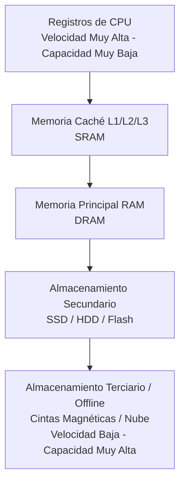

**Ubicación**
* **Interna:** Relacionada principalmente con la memoria principal, luego la memoria caché y los registros del procesador.
* **Externa:** Relacionada con dispositivos periféricos de almacenamiento masivo (discos duros, estado sólido, cintas).

> [!info] Explicación
> **Memoria Interna vs Externa:** La memoria interna es accesible directamente por la CPU y es muy rápida. La externa requiere que los datos pasen primero a la memoria principal.

## Jerarquía de Memoria

**Capacidad**
* Se expresa normalmente en términos de bytes (8 bits) o de palabras.
Longitudes comunes de palabra son de 8, 16, 32 y 64 bits. Se considera tanto el tamaño de la palabra como el número total de palabras para definir la capacidad.

**Unidad de Transferencia**
* En memorias internas es igual al número de líneas de entrada/salida de datos del módulo de memoria. A menudo es igual a la longitud de palabra.

> [!info] Explicación
> La **capacidad** determina cuántos datos se pueden guardar, mientras que la **unidad de transferencia** dicta cuántos datos viajan simultáneamente.

---

* **Palabra:** Es la unidad «natural» de organización de la memoria.
* **Unidades direccionables:** Por defecto la unidad direccionable es la palabra. En algunos casos se direcciona a nivel de byte. La relación entre la longitud A de una dirección y el número N de unidades direccionables, es 2A = 𝑁.
* **Unidad de transferencia:** Es el número de bits que se leen o escriben en memoria a la vez.
	* *Palabra* (entre caché y procesador)
	* *Bloques* (entre memoria interna y caché)

> [!info] Explicación
> Entre procesador y caché se mueven **palabras**, pero entre caché y RAM se mueven **bloques** enteros por el principio de localidad espacial.

## Método de acceso
* **Secuencial:** La memoria se organiza en unidades de datos llamadas registros. El acceso se realiza mediante una secuencia lineal específica. Se utiliza un mecanismo de lectura/escritura que se traslada desde su posición actual a la deseada pasando por todos los datos intermedios. Ejemplo: Unidad de cinta magnética.
* **Directo:** Tiene asociado un mecanismo de lectura/escritura. Los bloques individuales o registros tienen una dirección única basada en su ubicación física. Se salta primero a la vecindad general y luego se busca de forma secuencial. Ejemplo: Unidad de disco duro (HDD).
* **Aleatorio:** Cada posición tiene un mecanismo de acceso único, cableado físicamente. La posición puede seleccionarse aleatoriamente y ser accedida directamente en un tiempo constante, sin importar su ubicación. Ejemplo: La memoria principal (RAM).
* **Asociativa:** Permite hacer una comparación de ciertas posiciones de bits dentro de una palabra buscando que coincidan con unos valores dados. Ejemplo: Las memorias caché emplean acceso asociativo para buscar datos por su contenido (etiquetas) en lugar de por su dirección.

> [!info] Explicación
> **Secuencial**: Lee desde el inicio (cintas). **Directo**: Salta a un sector y luego busca (HDD). **Aleatorio**: Acceso instantáneo a cualquier parte (RAM). **Asociativa**: Busca por contenido, no por dirección (Caché).

## Tipos de memoria:
* **Memoria dinámica (DRAM):** Está compuesta de celdas que almacenan los datos como la carga eléctrica de capacitores, los cuales tienen la tendencia a descargarse, por lo que requieren periodos constantes de refrescamiento de la carga. Es esencialmente un dispositivo analógico. Las memorias DRAM se utilizan como memoria principal.
* **Memoria estática (SRAM):** Es un dispositivo digital que utiliza los mismos elementos lógicos (flip-flops) usados en el procesador. Las memorias SRAM no requieren refresco constante y son muy rápidas, por lo que se usan en la caché.
* **Memorias ROM (Read Only Memory):** Son memorias de solo lectura. Originalmente se grababan durante el proceso de fabricación con determinados programas específicos. Ejemplos: microprogramas, BIOS, firmware.
* **PROM (Programable Read Only Memory):** Pueden ser grabadas por el usuario con ayuda de un dispositivo especial, aunque una sola vez.
* **EPROM (Erasable Programable Read Only Memory):** Pueden ser grabadas o borradas por el usuario con ayuda de un dispositivo especial que emplea una luz ultravioleta. Es posible reprogramarlas varias veces.
* **EEPROM (Electrically Erasable Programable Read Only Memory):** Pueden ser grabadas o borradas eléctricamente por el usuario. Es posible reprogramarlas sin retirarlas del circuito (como las BIOS actuales).
* **Flash memory:** Es una variante de la EEPROM. Su nombre se debe a que pueden ser borradas en grandes bloques a alta velocidad.

![[Pasted image 20230730184430.png]]

> [!info] Explicación
> La SRAM es más rápida pero cara (se usa en caché). La DRAM es más lenta, necesita refresco, pero es barata y densa (se usa en RAM). Flash es no volátil y rápida para reescribir bloques completos.

## Notas relacionadas
- [[Principios de funcionamiento]]
- [[Ejercicio Correspondencia directa.excalidraw]]
- [[Documentos/computacion grafica/pipeline grafico|Pipeline gráfico]]
