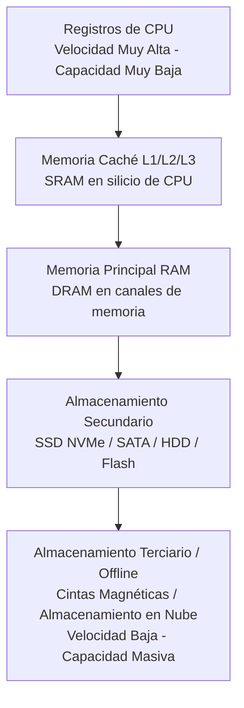
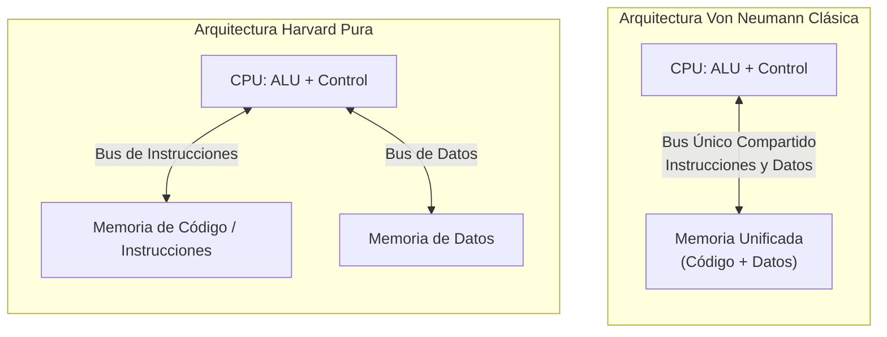
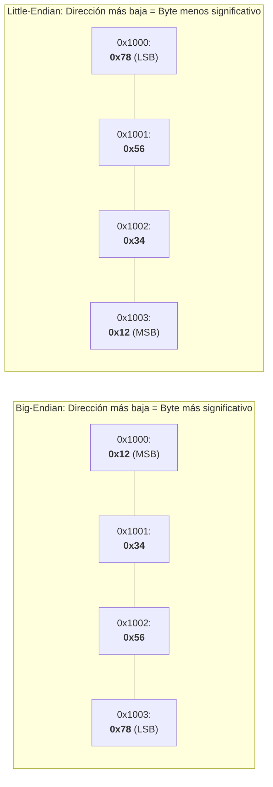
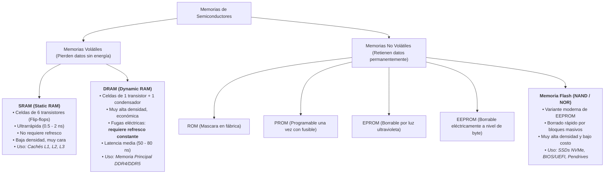
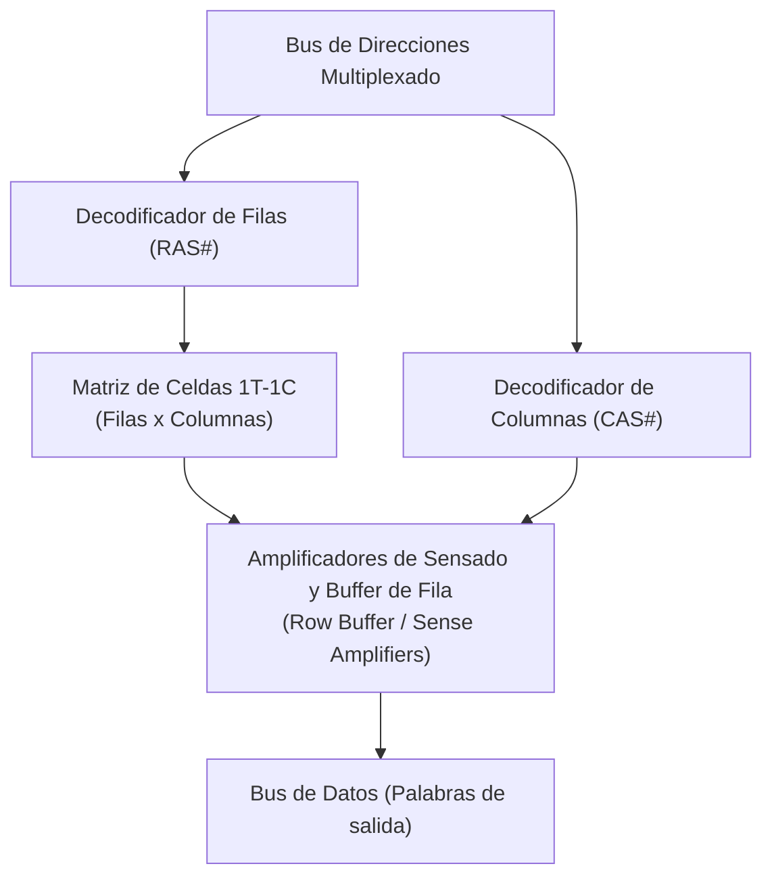

# Funcionamiento del Sistema de Memoria y Tecnologías de Almacenamiento

El subsistema de memoria de un computador se caracteriza a través de parámetros físicos y organizacionales fundamentales:

## 1. Características Esenciales de la Memoria

### Ubicación
* **Interna:** Accesible directamente por el procesador sin intermediación de controladores de periféricos. Comprende los registros de la CPU, la memoria caché (L1/L2/L3) y la memoria principal (RAM).
* **Externa:** Reside en dispositivos periféricos de almacenamiento masivo secundarios y terciarios (unidades de estado sólido SSD, discos magnéticos HDD, cintas, almacenamiento en la nube). Requiere que los bloques de datos se transfieran primero a la memoria principal antes de ser procesados por la CPU.

> [!info] Explicación
> **Memoria Interna vs Externa:** La memoria interna es accesible directamente por la CPU y es extremadamente rápida (latencias medidas en nanosegundos). La externa requiere controladores de bus (SATA, PCIe NVMe) y rutinas de Entrada/Salida para transferir los datos hacia la RAM física.

---

## 2. Jerarquía de Memoria


```mermaid
graph TD
    A[Registros de CPU\nVelocidad Muy Alta - Capacidad Muy Baja] --> B[Memoria Caché L1/L2/L3\nSRAM en silicio de CPU]
    B --> C[Memoria Principal RAM\nDRAM en canales de memoria]
    C --> D[Almacenamiento Secundario\nSSD NVMe / SATA / HDD / Flash]
    D --> E[Almacenamiento Terciario / Offline\nCintas Magnéticas / Almacenamiento en Nube\nVelocidad Baja - Capacidad Masiva]
```

### Capacidad
* Se expresa normalmente en términos de bytes (8 bits) o de palabras de máquina.
* Longitudes comunes de palabra son de 16, 32 y 64 bits. La capacidad total depende tanto de la longitud de la palabra como del número total de palabras direccionables.

### Unidad de Transferencia
* En memorias internas es igual al número de líneas eléctricas del bus de datos que entran o salen del módulo de memoria.
* A menudo coincide con la longitud de palabra o con un bloque completo de palabras:
	* **Palabra:** Unidad de transferencia atómica entre los registros de la CPU y la memoria caché.
	* **Bloque o Línea de Caché (típicamente 64 bytes):** Unidad de transferencia entre la memoria principal RAM y la caché (aprovechando la localidad espacial).
	* **Página (típicamente 4 KiB):** Unidad de transferencia entre almacenamiento secundario (SSD) y memoria principal RAM gestionada por la [[Memoria Virtual, Paginacion y Arquitectura de la MMU|MMU y el Sistema Operativo]].

> [!info] Explicación
> La **capacidad** determina cuántos datos se pueden almacenar, mientras que la **unidad de transferencia** dicta cuántos bits viajan simultáneamente por las líneas del bus en cada ciclo.

---

## 3. Unidades, Arquitectura y Direccionamiento

### 3.1 Unidades y Direccionamiento a Nivel de Byte
* **Palabra (*Word*):** Es la unidad «natural» de organización y cómputo de la arquitectura. Corresponde al tamaño de los registros de propósito general y al ancho nativo del camino de datos de la ALU (típicamente 32 bits en arquitecturas de 32 bits y 64 bits en arquitecturas modernas x86-64 y ARM64).
* **Jerarquía de Tipos Básicos en Memoria:**
  - **Byte (Octeto):** 8 bits.
  - **Media Palabra (*Halfword*):** 16 bits (2 bytes).
  - **Palabra (*Word*):** 32 bits (4 bytes).
  - **Palabra Doble (*Doubleword* / *Quadword*):** 64 bits (8 bytes).
* **Unidades direccionables:** En los computadores contemporáneos, la memoria se organiza de manera **direccionable a nivel de byte individual (*Byte-Addressable*)**. Cada número entero positivo generado por el bus de direcciones referencia exactamente **un único byte de 8 bits**, no una palabra completa.
* La relación formal entre la longitud de $A$ bits del bus de direcciones y el espacio direccionable máximo $N$ en bytes es:
  $$N = 2^A \text{ bytes}$$
  - Un bus de 32 bits direcciona hasta $2^{32}\text{ bytes} = 4\text{ GiB}$ de espacio físico.
  - Un bus de 48 bits (común en procesadores x86-64) direcciona físicamente hasta $2^{48}\text{ bytes} = 256\text{ TiB}$.

---

### 3.2 Modelos Arquitectónicos de Memoria: Von Neumann vs. Harvard

La forma en que se comunican las instrucciones y los datos con el procesador define la arquitectura fundamental del computador:


```mermaid
flowchart TD
    subgraph VonNeumann [Arquitectura Von Neumann Clásica]
        direction TB
        CPU_VN[CPU: ALU + Control] <-->|Bus Único Compartido<br>Instrucciones y Datos| Mem_VN["Memoria Unificada<br>(Código + Datos)"]
    end

    subgraph HarvardPura [Arquitectura Harvard Pura]
        direction TB
        CPU_H[CPU: ALU + Control] <-->|Bus de Instrucciones| Mem_Code["Memoria de Código / Instrucciones"]
        CPU_H <-->|Bus de Datos| Mem_Data["Memoria de Datos"]
    end
```

1. **Arquitectura Von Neumann (Memoria Unificada):**
   - Las instrucciones de máquina y los datos de las variables comparten el **mismo espacio físico de memoria** y viajan por el **mismo bus del sistema**.
   - **Cuello de Botella de Von Neumann (*Von Neumann Bottleneck*):** El rendimiento del sistema se estrangula porque el procesador no puede buscar la siguiente instrucción y acceder a un operando de datos de forma simultánea en el mismo ciclo de bus.
2. **Arquitectura Harvard Pura:**
   - Dispone de memorias físicas y buses eléctricos de direcciones y datos **totalmente independientes** para el código y para los datos.
   - Permite paralelismo real: el procesador puede buscar una nueva instrucción al mismo tiempo que lee o escribe una variable.
   - *Uso habitual:* Procesadores Digitales de Señales (DSP) y microcontroladores empotrados (ej. arquitecturas PIC y Atmel AVR).
3. **Arquitectura Harvard Modificada (El Estándar Moderno de CPU):**
   - Los computadores de propósito general (Intel Core, AMD Ryzen, Apple Silicon, procesadores ARM) implementan una **síntesis de ambos modelos**:
     - **Exterior / Nivel RAM (Von Neumann):** La memoria principal RAM es unificada para permitir la carga dinámica de programas, gestión uniforme por el Sistema Operativo y memoria virtual.
     - **Interior / Nivel L1 (Harvard):** En el silicio del procesador, la memoria caché de primer nivel se bifurca en **I-Cache (Instrucciones)** y **D-Cache (Datos)** con buses internos independientes. Esto evita riesgos estructurales en el pipeline ([[Pipeline de Instrucciones y Riesgos (Hazards)]]).

---

### 3.3 Ordenamiento de Bytes en Memoria: Little-Endian vs. Big-Endian

Cuando un dato ocupa múltiples bytes contiguos en memoria (por ejemplo, un entero de 32 bits `0x12345678`), surge una interrogante crucial de diseño: **¿en qué orden deben colocarse los bytes individuales dentro de las direcciones sucesivas de la memoria?**

> [!info] 💡 Analogía Didáctica (Gulliver y los Extremos del Huevo)
> El término proviene de *Los viajes de Gulliver* de Jonathan Swift, donde dos reinos entran en guerra civil debatiendo si los huevos duros deben abrirse por el extremo grande (*Big-End*) o por el extremo pequeño (*Little-End*). En informática:
> - **Big-Endian:** Coloca el "extremo grande" (byte más significativo, MSB) al principio (dirección más baja).
> - **Little-Endian:** Coloca el "extremo pequeño" (byte menos significativo, LSB) al principio (dirección más baja).

Sea el valor hexadecimal de 32 bits: `0x12345678`
- **MSB (*Most Significant Byte*):** `0x12`
- **LSB (*Least Significant Byte*):** `0x78`

Si este entero se almacena a partir de la dirección base `0x1000`:

```
Dirección:      0x1000    0x1001    0x1002    0x1003
------------------------------------------------------
Big-Endian:      0x12      0x34      0x56      0x78
Little-Endian:   0x78      0x56      0x34      0x12
```


```mermaid
flowchart LR
    subgraph BigEndian [Big-Endian: Dirección más baja = Byte más significativo]
        BE0["0x1000:<br><b>0x12</b> (MSB)"] --- BE1["0x1001:<br><b>0x34</b>"] --- BE2["0x1002:<br><b>0x56</b>"] --- BE3["0x1003:<br><b>0x78</b> (LSB)"]
    end
    subgraph LittleEndian [Little-Endian: Dirección más baja = Byte menos significativo]
        LE0["0x1000:<br><b>0x78</b> (LSB)"] --- LE1["0x1001:<br><b>0x56</b>"] --- LE2["0x1002:<br><b>0x34</b>"] --- LE3["0x1003:<br><b>0x12</b> (MSB)"]
    end
```

#### Relevancia en Sistemas, Compiladores y Redes:
1. **Dominancia de Arquitecturas:**
   - **Little-Endian:** Arquitecturas x86 / x86-64 (Intel, AMD), y configuraciones por defecto en ARM y RISC-V.
   - **Big-Endian:** Arquitecturas históricas (Motorola 68000, IBM z/Architecture, SPARC).
2. **Network Byte Order (Sistemas Distribuidos y Redes):**
   - El estándar de los protocolos de Internet (IP, TCP, UDP) define que los encabezados viajan estrictamente en formato **Big-Endian**.
   - Por esta razón, todo programa en C/C++ que use sockets debe convertir números de puerto y direcciones IP entre el orden del procesador (*Host Order*) y el orden de red (*Network Order*) usando funciones del sistema operativo:
     ```c
     uint16_t net_port = htons(host_port); // Host TO Network Short
     uint32_t host_ip  = ntohl(net_ip);    // Network TO Host Long
     ```
3. **Código de Verificación en C:**
   ```c
   #include <stdio.h>
   #include <stdint.h>

   int main() {
       uint32_t val = 0x12345678;
       uint8_t *byte_ptr = (uint8_t*)&val;
       
       if (byte_ptr[0] == 0x78) {
           printf("Sistema Little-Endian (x86/ARM)\n");
       } else if (byte_ptr[0] == 0x12) {
           printf("Sistema Big-Endian\n");
       }
       return 0;
   }
   ```

---

### 3.4 Alineamiento de Memoria (*Memory Alignment*) y Relleno (*Padding*)

El alineamiento de memoria es un requisito impuesto por la estructura física del hardware que dicta cómo se posicionan los datos en el espacio de memoria física.

> [!important] Regla de Oro del Alineamiento Natural
> Un dato de tamaño $K$ bytes se considera **naturalmente alineado** si y solo si su dirección de memoria base $A$ es un múltiplo entero exacto de su tamaño:
> $$A \pmod K == 0$$
> - Datos de 1 byte (`char`): Pueden residir en cualquier dirección (`A % 1 == 0`).
> - Datos de 2 bytes (`short`): Deben ubicarse en direcciones pares (`A % 2 == 0`, finalizadas en `0b...0`).
> - Datos de 4 bytes (`int`, `float`, instrucciones MIPS): Deben ubicarse en múltiplos de 4 (`A % 4 == 0`, finalizadas en `0b...00`).
> - Datos de 8 bytes (`double`, punteros en 64 bits): Deben ubicarse en múltiplos de 8 (`A % 8 == 0`, finalizadas en `0b...000`).

#### ¿Por qué el hardware exige alineamiento?
El bus de datos físico entre la CPU y la memoria lee o escribe palabras completas (de 32 o 64 bits) de forma alineada en cada ciclo de bus. 

```
Palabra de Bus 0 (Dir 0 - 3): [ Byte 0 | Byte 1 | Byte 2 | Byte 3 ]
Palabra de Bus 1 (Dir 4 - 7): [ Byte 4 | Byte 5 | Byte 6 | Byte 7 ]
```

- **Acceso Alineado:** Si se lee un entero de 4 bytes en la dirección `0x0004`, el controlador de bus realiza **1 única lectura** de la palabra 1 y transfiere el dato en un único ciclo.
- **Acceso Desalineado (*Misaligned Access*):** Si se ubica un entero de 4 bytes en la dirección `0x0002` (ocupa los bytes `2, 3, 4, 5`), el dato cruza la frontera de dos palabras físicas:
  1. En procesadores **RISC estrictos** (MIPS, SPARC): El hardware detecta la violación y genera una **excepción por fallo de alineamiento** (*Alignment Fault*), provocando que el Sistema Operativo mate el proceso con la señal `SIGBUS`.
  2. En procesadores **CISC (x86)**: La CPU tolera el acceso desalineado, pero a costa de un severo castigo de rendimiento: debe emitir **dos accesos consecutivos al bus**, desplazar los bytes internamente con máscaras lógicas y ensamblarlos en la ALU, duplicando o triplicando los ciclos de reloj requeridos.

#### Impacto en el Compilador: Relleno de Estructuras (*Struct Padding*)
Como se estudia en diseño de compiladores, el compilador inserta bytes de relleno (*padding bytes*) invisibles para garantizar que cada campo de una estructura permanezca naturalmente alineado.

```c
// Estructura Ineficiente (Desperdicio de RAM por Padding)
struct Desordenada {
    char a;      // 1 byte
    // [3 bytes de padding invisible insertados por el compilador]
    int32_t b;   // 4 bytes (alineado a múltiplo de 4)
    char c;      // 1 byte
    // [3 bytes de padding para que el tamaño total sea múltiplo de 4]
}; // sizeof(struct Desordenada) = 12 bytes (¡6 bytes son datos reales y 6 son desperdicio!)

// Estructura Optimizada (Reordenada de mayor a menor)
struct Optimizada {
    int32_t b;   // 4 bytes
    char a;      // 1 byte
    char c;      // 1 byte
    // [2 bytes de padding final]
}; // sizeof(struct Optimizada) = 8 bytes (Ahorro del 33% de memoria física)
```

---

## 4. Métodos de Acceso a Memoria

* **Secuencial:** La memoria se organiza en unidades lineales de datos. El acceso debe realizarse siguiendo una secuencia física estricta. El mecanismo de lectura/escritura debe desplazarse a través de todos los registros intermedios para alcanzar el dato deseado. El tiempo de acceso es altamente variable y dependiente de la posición actual. *Ejemplo:* Unidades de cinta magnética lineal.
* **Directo:** Los bloques de datos tienen direcciones físicas únicas basadas en su geometría tridimensional (pistas, sectores, cilindros). El mecanismo físico salta rápidamente a la vecindad general y luego realiza una búsqueda secuencial corta. El tiempo de acceso es variable. *Ejemplo:* Unidades de disco duro mecánico (HDD).
* **Aleatorio (Random Access):** Cada posición de memoria tiene un circuito de direccionamiento cableado e independiente. Cualquier celda física puede seleccionarse y leerse/escribirse exactamente en el **mismo tiempo constante ($O(1)$)**, sin importar su ubicación física ni el orden de accesos previos. *Ejemplo:* La memoria principal (RAM - Random Access Memory).
* **Asociativo (Content-Addressable Memory - CAM):** Permite comparar simultáneamente ciertas posiciones de bits en todas las palabras almacenadas buscando coincidencias con un patrón de entrada (*Tag*). Se accede al dato por su **contenido** y no por su dirección numérica. *Ejemplo:* Las memorias caché y el **TLB (*Translation Lookaside Buffer*)** de la MMU.

---

## 5. Tecnologías de Memoria de Semiconductores


```mermaid
flowchart TD
    Semi["Memorias de Semiconductores"]
    
    Semi --> Volatiles["Memorias Volátiles (Pierden datos sin energía)"]
    Semi --> NoVolatiles["Memorias No Volátiles (Retienen datos permanentemente)"]
    
    Volatiles --> SRAM["<b>SRAM (Static RAM)</b><br>• Celdas de 6 transistores (Flip-flops)<br>• Ultrarrápida (0.5 - 2 ns)<br>• No requiere refresco<br>• Baja densidad, muy cara<br>• <i>Uso: Cachés L1, L2, L3</i>"]
    Volatiles --> DRAM["<b>DRAM (Dynamic RAM)</b><br>• Celdas de 1 transistor + 1 condensador<br>• Muy alta densidad, económica<br>• Fugas eléctricas: <b>requiere refresco constante</b><br>• Latencia media (50 - 80 ns)<br>• <i>Uso: Memoria Principal DDR4/DDR5</i>"]
    
    NoVolatiles --> ROM["ROM (Mascara en fábrica)"]
    NoVolatiles --> PROM["PROM (Programable una vez con fusible)"]
    NoVolatiles --> EPROM["EPROM (Borrable por luz ultravioleta)"]
    NoVolatiles --> EEPROM["EEPROM (Borrable eléctricamente a nivel de byte)"]
    NoVolatiles --> Flash["<b>Memoria Flash (NAND / NOR)</b><br>• Variante moderna de EEPROM<br>• Borrado rápido por bloques masivos<br>• Muy alta densidad y bajo costo<br>• <i>Uso: SSDs NVMe, BIOS/UEFI, Pendrives</i>"]
```

![[Pasted image 20230730184430.png]]

### 5.1 Comparativa Tecnológica: SRAM vs. DRAM
- **SRAM (Static RAM):** Construida con circuitos biestables (*flip-flops* de 4 a 6 transistores CMOS). Es totalmente digital y no experimenta pérdida de carga mientras mantenga suministro eléctrico. Consume mayor área de silicio y genera más calor, pero alcanza tiempos de conmutación sub-nanosegundo. Por ello, domina las memorias caché integradas en el procesador.
- **DRAM (Dynamic RAM):** Construida con celdas ultra compactas de **un solo transistor y un condensador microscópico (1T-1C)**. Los condensadores almacenan la información como carga electrostática; sin embargo, debido a corrientes parásitas de fuga, la carga se disipa en cuestión de milisegundos. Requiere un **circuito de refresco periódico** que lee y reescribe continuamente cada fila de la matriz de memoria miles de veces por segundo. Esta característica física la hace más lenta, pero su bajísimo costo y masiva densidad por milímetro cuadrado la consagran como la tecnología indiscutible de la memoria principal.

### 5.2 Estructura y Funcionamiento Interno de la DRAM: Bancos, RAS y CAS

A diferencia de la memoria SRAM, la memoria DRAM organiza internamente sus millones de celdas en una **matriz bidimensional de Filas (*Rows / Wordlines*) y Columnas (*Columns / Bitlines*)**, agrupadas en **Bancos independientes**:


```mermaid
flowchart TD
    AddrBus["Bus de Direcciones Multiplexado"] --> RowDec["Decodificador de Filas (RAS#)"]
    AddrBus --> ColDec["Decodificador de Columnas (CAS#)"]

    RowDec --> Matriz["Matriz de Celdas 1T-1C<br>(Filas x Columnas)"]
    Matriz --> SenseAmp["Amplificadores de Sensado y Buffer de Fila<br>(Row Buffer / Sense Amplifiers)"]
    ColDec --> SenseAmp
    SenseAmp --> DataOut["Bus de Datos (Palabras de salida)"]
```

1. **Multiplexación de Direcciones (Ahorro de Pines):**
   - Para evitar chips de memoria con cientos de pines costosos, el bus de direcciones se envía en dos etapas consecutivas controladas por señales de estroboscópico (*strobes*):
     - **$\overline{\text{RAS}}$ (*Row Address Strobe*):** La primera mitad de los bits de dirección activa y decodifica la **Fila**. Toda la fila completa (varios kilobytes) se lee y se descarga en un búfer interno ultrarrápido llamado **Row Buffer** (acción que a la vez recarga los condensadores leídos destructivamente).
     - **$\overline{\text{CAS}}$ (*Column Address Strobe*):** La segunda mitad de los bits de dirección selecciona la **Columna** específica dentro del *Row Buffer* para entregar la palabra solicitada al bus de datos.
2. **Latencia de Página (Hit vs. Miss en Row Buffer):**
   - **Row Buffer Hit (Página abierta):** Si el siguiente acceso de memoria pertenece a la misma fila previamente cargada, solo se necesita emitir una nueva señal $\overline{\text{CAS}}$, reduciendo drásticamente la latencia.
   - **Row Buffer Miss / Conflict (Página cerrada):** Si el acceso apunta a una fila distinta, primero se debe restaurar y precargar la fila anterior ($\text{tRP}$ - *Row Precharge Time*), activar la nueva fila ($\text{tRCD}$ - *RAS to CAS Delay*) y finalmente leer la columna ($\text{tCL}$ - *CAS Latency*).
3. **Evolución a SDRAM y DDR (DDR4 / DDR5):**
   - **SDRAM (*Synchronous DRAM*):** Sincronizó las transferencias con una señal de reloj del sistema.
   - **DDR (*Double Data Rate*):** Duplica el ancho de banda efectivo transfiriendo datos **tanto en el flanco de subida como en el flanco de bajada** de la señal de reloj (*Dual-Pumping*).
   - DDR4 utiliza búferes de precarga (*Prefetch*) de $8n$ bits y DDR5 extiende la precarga a $16n$ bits dividiendo cada módulo físico en dos canales independientes de 32 bits de datos.

---

## Notas relacionadas
- [[Arquitectura de Computadores]] — Mapa de contenidos general de la materia.
- [[Principios de funcionamiento]] — Diseño de caché, organización de bloques y mapeo directo/asociativo.
- [[Jerarquia de Memoria y Memoria Cache]] — AMAT, políticas de reemplazo y protocolo de coherencia MESI.
- [[Memoria Virtual, Paginacion y Arquitectura de la MMU]] — Traducción de direcciones virtuales, tablas multinivel y TLB.
- [[Buses, Interconexion y Comunicacion de Entrada-Salida (DMA e Interrupciones)]] — Interconexión PCIe, controladores de memoria y DMA.
- [[Arquitectura de GPU y Aceleradores Hardware en el Computador]] — Memoria VRAM GDDR6/HBM de alto ancho de banda y UMA.
- [[Pipeline de Instrucciones y Riesgos (Hazards)]] — Penalizaciones por accesos a memoria en el pipeline del procesador.
- [[pipeline grafico|Pipeline Gráfico en Computación Gráfica]] — Framebuffers y rasterización.
- [[Ejercicio Correspondencia directa.excalidraw]] — Ejercicio visual de correspondencia directa.
