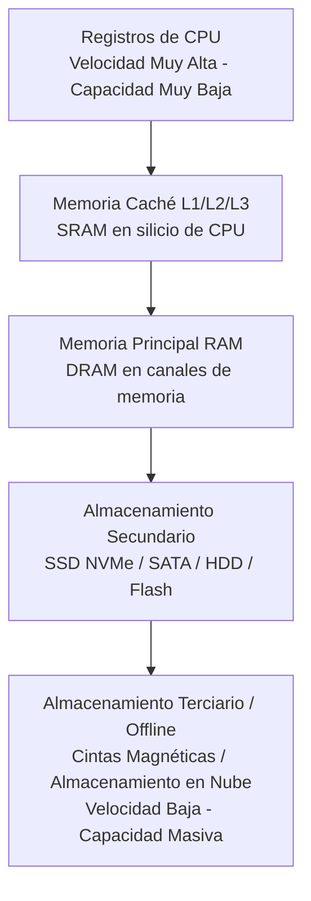
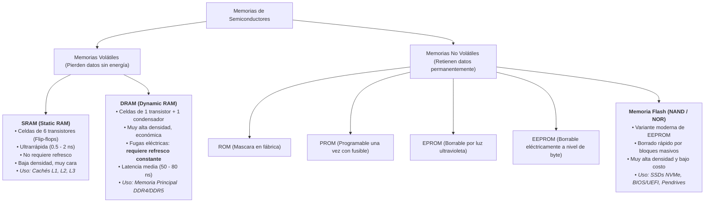

# Funcionamiento del Sistema de Memoria y Tecnologías de Almacenamiento

El subsistema de memoria de un computador se caracteriza a través de parámetros físicos y organizacionales fundamentales:

## 1. Características Esenciales de la Memoria

### Ubicación
* **Interna:** Accesible directamente por el procesador sin intermediación de controladores de periféricos. Comprende los registros de la CPU, la memoria caché (L1/L2/L3) y la memoria principal (RAM).
* **Externa:** Reside en dispositivos periféricos de almacenamiento masivo secundarios y terciarios (unidades de estado sólido SSD, discos magnéticos HDD, cintas, almacenamiento en la nube). Requiere que los bloques de datos se transfieran primero a la memoria principal antes de ser procesados por la CPU.

> [!info] Explicación
> **Memoria Interna vs Externa:** La memoria interna es accesible directamente por la CPU y es extremadamente rápida (latencias medidas en nanosegundos). La externa requiere controladores de bus (SATA, PCIe NVMe) y rutinas de Entrada/Salida para transferir los datos hacia la RAM física.

---

## 2. Jerarquía de Memoria

```mermaid
graph TD
    A[Registros de CPU\nVelocidad Muy Alta - Capacidad Muy Baja] --> B[Memoria Caché L1/L2/L3\nSRAM en silicio de CPU]
    B --> C[Memoria Principal RAM\nDRAM en canales de memoria]
    C --> D[Almacenamiento Secundario\nSSD NVMe / SATA / HDD / Flash]
    D --> E[Almacenamiento Terciario / Offline\nCintas Magnéticas / Almacenamiento en Nube\nVelocidad Baja - Capacidad Masiva]
```

### Capacidad
* Se expresa normalmente en términos de bytes (8 bits) o de palabras de máquina.
* Longitudes comunes de palabra son de 16, 32 y 64 bits. La capacidad total depende tanto de la longitud de la palabra como del número total de palabras direccionables.

### Unidad de Transferencia
* En memorias internas es igual al número de líneas eléctricas del bus de datos que entran o salen del módulo de memoria.
* A menudo coincide con la longitud de palabra o con un bloque completo de palabras:
	* **Palabra:** Unidad de transferencia atómica entre los registros de la CPU y la memoria caché.
	* **Bloque o Línea de Caché (típicamente 64 bytes):** Unidad de transferencia entre la memoria principal RAM y la caché (aprovechando la localidad espacial).
	* **Página (típicamente 4 KiB):** Unidad de transferencia entre almacenamiento secundario (SSD) y memoria principal RAM gestionada por la [[Memoria Virtual, Paginacion y Arquitectura de la MMU|MMU y el Sistema Operativo]].

> [!info] Explicación
> La **capacidad** determina cuántos datos se pueden almacenar, mientras que la **unidad de transferencia** dicta cuántos bits viajan simultáneamente por las líneas del bus en cada ciclo.

---

## 3. Unidades y Direccionamiento

* **Palabra:** Es la unidad «natural» de organización de la arquitectura. Corresponde al tamaño de los registros de propósito general y al ancho estándar de las operaciones de la ALU (32 o 64 bits).
* **Unidades direccionables:** En los computadores contemporáneos, la memoria se direcciona a nivel de **byte individual (Byte-Addressable)**. La relación entre la longitud $A$ de una dirección del bus y el número $N$ de bytes direccionables es:
  $$N = 2^A$$
  (Un bus de 32 bits direcciona hasta $2^{32}\text{ bytes} = 4\text{ GiB}$; un bus de 48 bits direcciona hasta $2^{48}\text{ bytes} = 256\text{ TiB}$).

---

## 4. Métodos de Acceso a Memoria

* **Secuencial:** La memoria se organiza en unidades lineales de datos. El acceso debe realizarse siguiendo una secuencia física estricta. El mecanismo de lectura/escritura debe desplazarse a través de todos los registros intermedios para alcanzar el dato deseado. El tiempo de acceso es altamente variable y dependiente de la posición actual. *Ejemplo:* Unidades de cinta magnética lineal.
* **Directo:** Los bloques de datos tienen direcciones físicas únicas basadas en su geometría tridimensional (pistas, sectores, cilindros). El mecanismo físico salta rápidamente a la vecindad general y luego realiza una búsqueda secuencial corta. El tiempo de acceso es variable. *Ejemplo:* Unidades de disco duro mecánico (HDD).
* **Aleatorio (Random Access):** Cada posición de memoria tiene un circuito de direccionamiento cableado e independiente. Cualquier celda física puede seleccionarse y leerse/escribirse exactamente en el **mismo tiempo constante ($O(1)$)**, sin importar su ubicación física ni el orden de accesos previos. *Ejemplo:* La memoria principal (RAM - Random Access Memory).
* **Asociativo (Content-Addressable Memory - CAM):** Permite comparar simultáneamente ciertas posiciones de bits en todas las palabras almacenadas buscando coincidencias con un patrón de entrada (*Tag*). Se accede al dato por su **contenido** y no por su dirección numérica. *Ejemplo:* Las memorias caché y el **TLB (*Translation Lookaside Buffer*)** de la MMU.

---

## 5. Tecnologías de Memoria de Semiconductores

```mermaid
flowchart TD
    Semi["Memorias de Semiconductores"]
    
    Semi --> Volatiles["Memorias Volátiles (Pierden datos sin energía)"]
    Semi --> NoVolatiles["Memorias No Volátiles (Retienen datos permanentemente)"]
    
    Volatiles --> SRAM["<b>SRAM (Static RAM)</b><br>• Celdas de 6 transistores (Flip-flops)<br>• Ultrarrápida (0.5 - 2 ns)<br>• No requiere refresco<br>• Baja densidad, muy cara<br>• <i>Uso: Cachés L1, L2, L3</i>"]
    Volatiles --> DRAM["<b>DRAM (Dynamic RAM)</b><br>• Celdas de 1 transistor + 1 condensador<br>• Muy alta densidad, económica<br>• Fugas eléctricas: <b>requiere refresco constante</b><br>• Latencia media (50 - 80 ns)<br>• <i>Uso: Memoria Principal DDR4/DDR5</i>"]
    
    NoVolatiles --> ROM["ROM (Mascara en fábrica)"]
    NoVolatiles --> PROM["PROM (Programable una vez con fusible)"]
    NoVolatiles --> EPROM["EPROM (Borrable por luz ultravioleta)"]
    NoVolatiles --> EEPROM["EEPROM (Borrable eléctricamente a nivel de byte)"]
    NoVolatiles --> Flash["<b>Memoria Flash (NAND / NOR)</b><br>• Variante moderna de EEPROM<br>• Borrado rápido por bloques masivos<br>• Muy alta densidad y bajo costo<br>• <i>Uso: SSDs NVMe, BIOS/UEFI, Pendrives</i>"]
```

![[Pasted image 20230730184430.png]]

### Comparativa: SRAM vs. DRAM
- **SRAM (Static RAM):** Construida con circuitos biestables (*flip-flops* de 4 a 6 transistores CMOS). Es totalmente digital y no experimenta pérdida de carga mientras mantenga suministro eléctrico. Consume mayor área de silicio y genera más calor, pero alcanza tiempos de conmutación sub-nanosegundo. Por ello, domina las memorias caché integradas en el procesador.
- **DRAM (Dynamic RAM):** Construida con celdas ultra compactas de **un solo transistor y un condensador microscópico (1T-1C)**. Los condensadores almacenan la información como carga electrostática; sin embargo, debido a corrientes parásitas de fuga, la carga se disipa en cuestión de milisegundos. Requiere un **circuito de refresco periódico** que lee y reescribe continuamente cada fila de la matriz de memoria miles de veces por segundo. Esta característica física la hace más lenta, pero su bajísimo costo y masiva densidad por milímetro cuadrado la consagran como la tecnología indiscutible de la memoria principal.

---

## Notas relacionadas
- [[Arquitectura de Computadores]] — Mapa de contenidos general de la materia.
- [[Principios de funcionamiento]] — Diseño de caché, organización de bloques y mapeo directo/asociativo.
- [[Jerarquia de Memoria y Memoria Cache]] — AMAT, políticas de reemplazo y protocolo de coherencia MESI.
- [[Memoria Virtual, Paginacion y Arquitectura de la MMU]] — Traducción de direcciones virtuales, tablas multinivel y TLB.
- [[Buses, Interconexion y Comunicacion de Entrada-Salida (DMA e Interrupciones)]] — Interconexión PCIe, controladores de memoria y DMA.
- [[Arquitectura de GPU y Aceleradores Hardware en el Computador]] — Memoria VRAM GDDR6/HBM de alto ancho de banda y UMA.
- [[Pipeline de Instrucciones y Riesgos (Hazards)]] — Penalizaciones por accesos a memoria en el pipeline del procesador.
- [[pipeline grafico|Pipeline Gráfico en Computación Gráfica]] — Framebuffers y rasterización.
- [[Ejercicio Correspondencia directa.excalidraw]] — Ejercicio visual de correspondencia directa.
