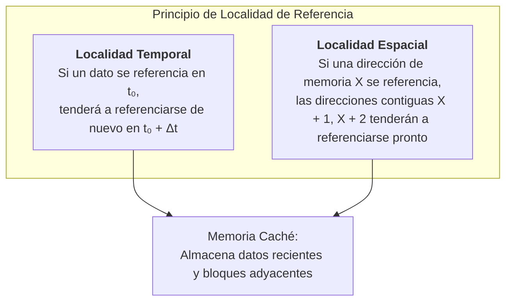
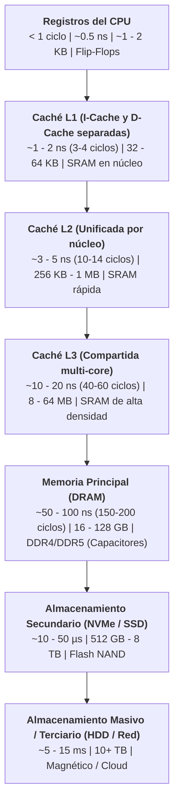
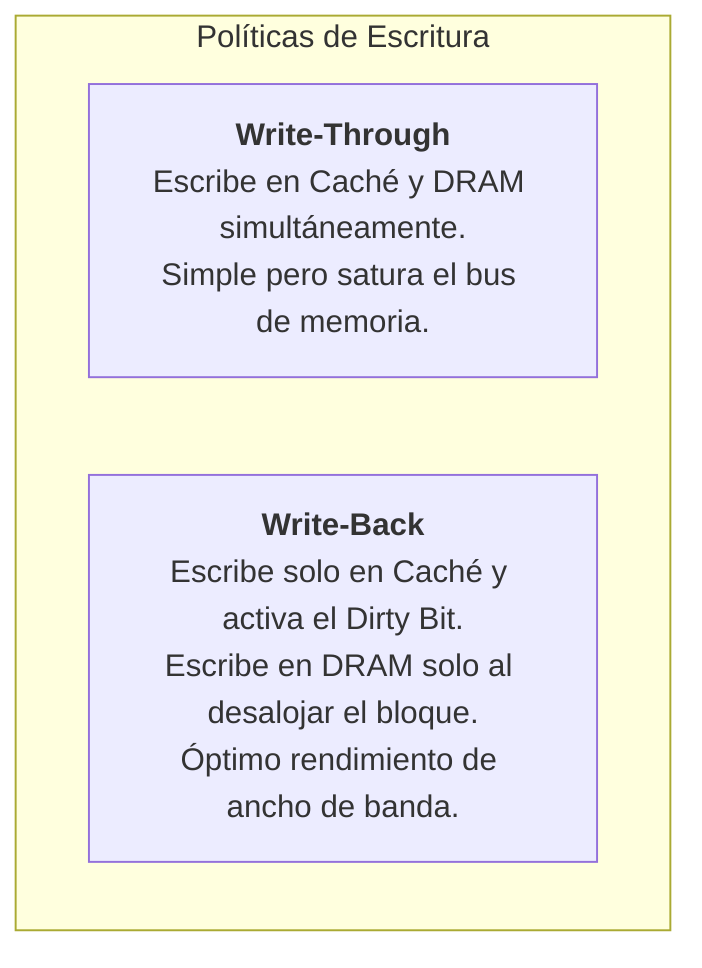
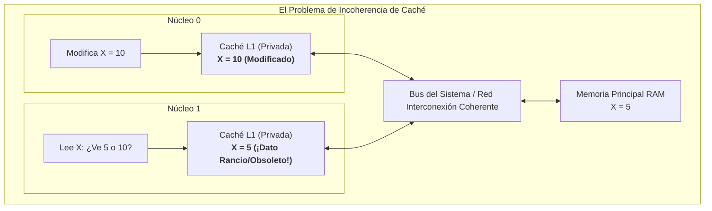
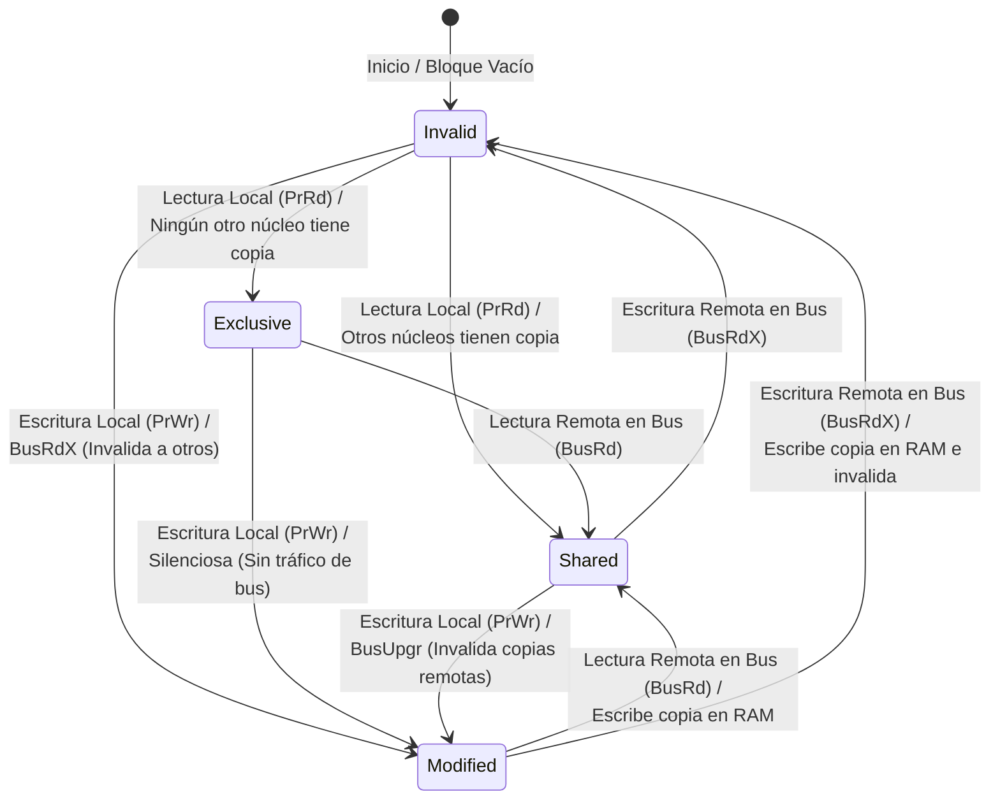
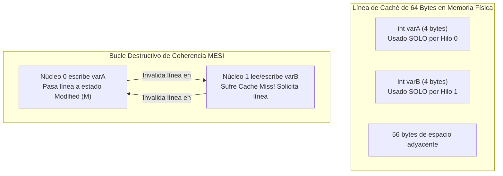

# Jerarquía de Memoria y Memoria Caché

Como se introdujo fundamentalmente en [[Funcionamiento del Sistema de Memoria]] y se exploró conceptualmente en [[Principios de funcionamiento]], el diseño de la memoria de un computador se enfrenta a una limitación física y económica ineludible: **las tecnologías de memoria más veloces son prohibitivamente caras y de baja densidad por unidad de área, mientras que las de mayor capacidad son exponencialmente más lentas**.

Para resolver esta disparidad (la llamada *Memory Wall* o brecha de velocidad procesador-memoria), los sistemas modernos implementan una **jerarquía piramidal de memoria**, orquestada por hardware y respaldada por el principio físico rector de la **localidad de referencia**.

> [!info] 💡 ¿Cómo entender esto desde cero? (Guía para novatos de pregrado)
> - **Analogía del estudiante estudiando en la biblioteca:**
>   - **Registros de CPU:** Lo que tienes en tus manos y cabeza en este milisegundo (velocidad instantánea, pero solo puedes sostener 2 cosas).
>   - **Caché L1/L2/L3:** Tu escritorio de estudio. Puedes colocar 4 libros y cuadernos abiertos. Mirar el escritorio toma 2 segundos.
>   - **Memoria Principal (RAM):** El estante de la biblioteca a 20 metros. Si necesitas un libro que no está en tu escritorio, caminas 30 segundos a buscarlo.
>   - **Disco SSD / Almacenamiento:** El almacén central subterráneo de la ciudad. Traer un libro de allá toma 3 días.
> - **Localidad Temporal y Espacial:** Si usaste una variable hace un segundo, es casi seguro que la volverás a usar en el siguiente bucle (**temporal**); si leíste el elemento `arr[0]`, casi seguro leerás `arr[1]` a continuación (**espacial**). La caché anticipa esto cargando bloques contiguos enteros.

---

## 1. Principio Físico Rector: Localidad de Referencia

La efectividad de cualquier jerarquía de memoria depende de que los programas no acceden a su espacio de direcciones de forma uniforme o puramente aleatoria, sino con una fuerte tendencia predecible.



### 1.1 Localidad Temporal
- **Fundamento:** Un elemento de memoria que ha sido accedido recientemente tiene una altísima probabilidad de ser consultado nuevamente en el futuro inmediato.
- **Ejemplos de software:** Variables contadoras de bucles (`i++`), punteros a pilas de ejecución (*stack frame*), variables acumuladoras locales.
- **Mecanismo hardware:** Mantener los datos recientemente accedidos en los niveles más cercanos a la CPU (L1/L2).

### 1.2 Localidad Espacial
- **Fundamento:** Si una dirección de memoria es accedida en un instante dado, es extremadamente probable que las direcciones físicamente contiguas sean referenciadas en el corto plazo.
- **Ejemplos de software:** Recorrido secuencial de vectores y matrices en memoria (`for (int i=0; i<N; i++) array[i]`), ejecución secuencial de código de instrucciones de máquina ($PC \leftarrow PC + 4$).
- **Mecanismo hardware:** Cuando ocurre un fallo de caché, **no se transfiere únicamente la palabra solicitada**, sino un **bloque continuo completo** ($K$ palabras o 64 bytes) desde la DRAM hacia la caché (como se detalló en [[Principios de funcionamiento#Memoria principal]]).

---

## 2. La Pirámide de la Jerarquía de Memoria

Expandiendo el modelo preliminar de [[Funcionamiento del Sistema de Memoria#Jerarquía de Memoria]], la jerarquía moderna se estructura en los siguientes niveles tecnológicos:



### Tabla Comparativa de Tecnologías Físicas

| Nivel | Tecnología Dominante | Tiempo de Acceso Típico | Capacidad Típica | Administrado por |
| :--- | :--- | :--- | :--- | :--- |
| **Registros** | CMOS Multiplexores / Flip-Flops | $< 0.5\text{ ns}$ | $64 - 128 \times 64\text{ bits}$ | Compilador ([[Fases del Compilador y Analisis Lexico]]) |
| **Caché L1** | SRAM (6T celdas de transistores) | $\sim 1\text{ ns}$ | $32 - 64\text{ KB}$ | Hardware de caché dedicado |
| **Caché L2** | SRAM (6T celdas) | $\sim 3 - 4\text{ ns}$ | $512\text{ KB} - 2\text{ MB}$ | Hardware de caché |
| **Caché L3** | SRAM de celda densa o eDRAM | $\sim 15 - 20\text{ ns}$ | $16 - 64\text{ MB}$ | Hardware de caché |
| **Memoria RAM** | DRAM (1 Transistor + 1 Capacitor) | $\sim 60 - 80\text{ ns}$ | $16 - 64\text{ GB}$ | Sistema Operativo + MMU |
| **SSD NVMe** | Flash NAND 3D TLC/QLC | $\sim 20 - 50\ \mu\text{s}$ | $1 - 4\text{ TB}$ | SO (Sistema de archivos) |

> [!info] ¿Por qué L1 se divide en I-Cache y D-Cache?
> La caché L1 se descompone físicamente en una **I-Cache** (Instruction Cache) y una **D-Cache** (Data Cache) para implementar una arquitectura **Harvard a nivel L1**. Como se verá en [[Pipeline de Instrucciones y Riesgos (Hazards)]], esto previene **riesgos estructurales**, permitiendo que la etapa de búsqueda de instrucción (*IF*) y la de acceso a datos (*MEM*) accedan a la caché en el mismo ciclo de reloj sin colisión de buses.

---

## 3. Mapeo de Memoria Caché y Descomposición de Direcciones

Como se explicó en [[Principios de funcionamiento#Función de correspondencia]], la caché contiene muchísimas menos líneas ($C$) que bloques la memoria principal ($M$). 

Una dirección física generada por la CPU de $A$ bits se descompone unívocamente en tres campos: **Etiqueta (Tag)**, **Índice (Index)** y **Desplazamiento (Offset)**.

```
+---------------------------+------------------------+-------------------------+
|        Tag (t bits)       |     Index (s bits)     |     Offset (b bits)     |
+---------------------------+------------------------+-------------------------+
|<------------------------------ Ancho de Dirección (A bits) ------------------>|
```

### Fórmulas Matemáticas Exactas de Dimensionamiento
Sea:
- $A$: Número total de bits del bus de direcciones (típicamente 32 o 64 bits).
- $B$: Tamaño del bloque o línea de caché en bytes (típicamente $B = 64\text{ bytes}$).
- $C$: Capacidad total de datos de la caché en bytes.
- $N$: Número de vías (*ways*) por conjunto (en mapeo directo $N=1$; en asociativa por conjuntos $N \in \{2, 4, 8, 16\}$).

1. **Bits de Desplazamiento de Bloque ($b$ - Offset):**
   Determina qué byte específico dentro de la línea de caché se está direccionando:
   $$b = \log_2(B)$$
2. **Número Total de Líneas de la Caché ($L$):**
   $$L = \frac{C}{B}$$
3. **Número de Conjuntos de la Caché ($S$):**
   $$S = \frac{L}{N} = \frac{C}{N \cdot B}$$
4. **Bits de Índice ($s$ - Index):**
   Identifica cuál de los $S$ conjuntos debe consultarse:
   $$s = \log_2(S)$$
5. **Bits de Etiqueta ($t$ - Tag):**
   Identificador único para confirmar que el bloque presente en la línea corresponde exactamente al bloque solicitado de la DRAM:
   $$t = A - (s + b)$$

---

### 3.1 Mapeo Directo (*Direct Mapped Cache*)
- **Estructura:** Cada bloque de la memoria principal se asigna a **exactamente una línea de caché**. Corresponde a $N=1$ vía ($S = L$).
- **Función de Mapeo:**
  $$\text{Línea de Caché} = (\text{Número de Bloque}) \pmod{L}$$

```mermaid
flowchart LR
    subgraph Direccion [Dirección de 32 bits]
        Tag["Tag (18 bits)"]
        Index["Index (8 bits)"]
        Offset["Offset (6 bits)"]
    end

    subgraph CacheMem [Caché Mapeo Directo (256 Líneas)]
        Line0["Línea 0: [V | Tag | 64B Datos]"]
        LineK["Línea K: [V | Tag | 64B Datos]"]
        Line255["Línea 255: [V | Tag | 64B Datos]"]
    end

    Index -->|Decodificador 1 a 256| LineK
    LineK -->|Compara Tag| Comp{Tag == Tag?}
    Comp -- Sí y V=1 --> Hit[Cache Hit!]
    Comp -- No o V=0 --> Miss[Cache Miss!]
```

- **Ventajas:** Hardware extremadamente simple; tiempo de acierto (*Hit Time*) mínimo ya que no requiere conmutación asociativa ni multiplexores de selección múltiple.
- **Desventaja Crítica:** Vulnerable a **fallos por conflicto** y **vapuleo (*thrashing*)** (descrito en [[Principios de funcionamiento#Función de Correspondencia Directa]]), donde dos bloques compiten continuamente por la misma línea.

---

### 3.2 Caché Completamente Asociativa (*Fully Associative Cache*)
- **Estructura:** Cualquier bloque de memoria puede almacenarse en **cualquier línea disponible de la caché**. Solo existe un único conjunto ($S = 1$).
- **Bits de Índice:** $s = \log_2(1) = 0$ bits. No existe campo de índice; la dirección se divide únicamente en:
  $$\text{Tag} = A - b \quad \text{y} \quad \text{Offset} = b$$
- **Mecanismo:** La dirección de la etiqueta debe compararse **en paralelo simultáneo** contra todas las etiquetas de todas las líneas mediante $L$ comparadores físicos de hardware.
- **Ventajas:** Cero fallos de conflicto.
- **Desventajas:** Consumo eléctrico y complejidad circuital desmesurados. Solo se implementa en estructuras reducidas como el **TLB** (*Translation Lookaside Buffer* de la memoria virtual).

---

### 3.3 Asociativa por Conjuntos de $N$ Vías (*N-Way Set Associative Cache*)
Es el compromiso óptimo estándar de la industria (utilizado en procesadores Intel, AMD, ARM y RISC-V).

- La caché se divide en $S$ conjuntos, y cada conjunto contiene exactamente $N$ líneas (vías).
- Un bloque se mapea a un conjunto específico según su índice:
  $$\text{Conjunto} = (\text{Número de Bloque}) \pmod S$$
  pero dentro de ese conjunto, el bloque puede colocarse en **cualquiera de las $N$ vías**.

```mermaid
flowchart TD
    subgraph DireccionFisica [Dirección Física]
        T[Tag]
        I[Index]
        O[Offset]
    end

    subgraph SetK [Conjunto K (4 Vías)]
        Way0["Vía 0: [Tag₀ | Datos₀]"]
        Way1["Vía 1: [Tag₁ | Datos₁]"]
        Way2["Vía 2: [Tag₂ | Datos₂]"]
        Way3["Vía 3: [Tag₃ | Datos₃]"]
    end

    I -->|Selecciona Conjunto| SetK
    T --> Comp0["Comp 0"]
    T --> Comp1["Comp 1"]
    T --> Comp2["Comp 2"]
    T --> Comp3["Comp 3"]

    Way0 --> Comp0
    Way1 --> Comp1
    Way2 --> Comp2
    Way3 --> Comp3

    Comp0 --> Mux["Lógica de Acierto / MUX"]
    Comp1 --> Mux
    Comp2 --> Mux
    Comp3 --> Mux
    Mux --> Out[Dato al CPU]
```

---

## 4. Políticas de Reemplazo y Políticas de Escritura

Cuando ocurre un fallo y el conjunto de destino está lleno, el hardware debe decidir qué línea expulsar para alojar el nuevo bloque.

### 4.1 Políticas de Reemplazo
1. **LRU (*Least Recently Used*):** Expulsa la línea que no ha sido accedida por más tiempo. Requiere bits de estado para mantener el orden temporal. Excelente tasa de aciertos gracias a la localidad temporal.
2. **Pseudo-LRU (Tree-PLRU):** Aproximación de bajo costo en silicio de LRU basada en un árbol binario de bits de decisión (utilizada en cachés modernas de 8 y 16 vías para evitar la sobrecarga de LRU puro).
3. **FIFO (*First-In, First-Out*):** Expulsa la línea que lleva más tiempo dentro de la caché, sin importar qué tan frecuentemente fue usada recientemente.
4. **Random (Aleatoria):** Selecciona una víctima al azar. Implementación casi nula en silicio; rendimiento sorprendentemente cercano a LRU en cargas de trabajo de alta dispersión.

---

### 4.2 Políticas de Escritura

Las operaciones de lectura (*loads*) traen datos a la caché sin alterarlos; sin embargo, las operaciones de escritura (*stores*) modifican el valor del bloque, creando inconsistencias entre la copia en caché y la copia en DRAM.



#### Write-Through vs. Write-Back
- **Write-Through (Escritura Directa):** Cada escritura de la CPU actualiza tanto la línea de caché como el bloque en la memoria principal DRAM simultáneamente.
  - *Ventaja:* Coherencia absoluta e inmediata; no requiere desalojos complejos.
  - *Desventaja:* El CPU se frena ante la latencia lenta de la DRAM (mitigado parcialmente con un *Write Buffer*).
- **Write-Back (Post-Escritura con *Dirty Bit*):** La CPU modifica únicamente la línea en la caché. Dicha línea se marca con un bit de estado denominado **Dirty Bit** (o bit de modificación $D=1$).
  - *Ventaja:* Las escrituras sucesivas a la misma variable ocurren a la velocidad ultra-rápida de la SRAM ($\sim 1\text{ ns}$) sin tráfico hacia el bus del sistema.
  - *Costo:* Al desalojar una línea víctima por reemplazo, si $D=1$, el bloque debe escribirse forzosamente en DRAM antes de cargar el nuevo dato.

#### Acierto y Fallo de Escritura: Write-Allocate vs. No-Write-Allocate
- **Write-Allocate (Fallo con Ubicación):** Si ocurre un fallo al escribir, se carga el bloque desde la DRAM hacia la caché y luego se ejecuta la escritura. (Usado típicamente en conjunto con *Write-Back*).
- **No-Write-Allocate (Fallo sin Ubicación):** Si ocurre un fallo al escribir, se modifica el dato directamente en la DRAM sin cargar el bloque en la caché. (Usado con *Write-Through*).

---

## 5. Métrica de Rendimiento: AMAT (*Average Memory Access Time*)

El rendimiento de un sistema de memoria no se mide por su capacidad, sino por el **Tiempo Medio de Acceso a Memoria (AMAT)**:

$$\text{AMAT} = \text{Hit Time} + (\text{Miss Rate} \times \text{Miss Penalty})$$

Donde:
- $\text{Hit Time}$: Tiempo que toma determinar si el dato está en la caché y entregarlo a la CPU.
- $\text{Miss Rate}$: Fracción de accesos a memoria que resultan en fallos ($1 - \text{Hit Rate}$).
- $\text{Miss Penalty}$: Tiempo adicional necesario para transferir el bloque desde el nivel inferior de la jerarquía.

### 5.1 Extensión de AMAT para Jerarquías Multinivel (L1, L2, L3, DRAM)

En sistemas contemporáneos con tres niveles de caché:

$$\text{AMAT} = T_{h, L1} + M_{L1} \cdot \Big[ T_{h, L2} + M_{L2} \cdot \big( T_{h, L3} + M_{L3} \cdot T_{\text{DRAM}} \big) \Big]$$

Donde:
- $M_{L1}, M_{L2}, M_{L3}$ son las **tasas de fallo locales** (*Local Miss Rates*) de cada nivel:
  $$M_{\text{local}} = \frac{\text{Fallos en este nivel}}{\text{Accesos que llegaron a este nivel}}$$
- Las **tasas de fallo globales** (*Global Miss Rates*) se calculan respecto a todos los accesos originales de la CPU:
  $$M_{\text{global, L2}} = M_{L1} \times M_{L2}$$
  $$M_{\text{global, L3}} = M_{L1} \times M_{L2} \times M_{L3}$$

---

## 6. Ejercicio Analítico Resuelto de Ingeniería

### Enunciado:
Un procesador de $32\text{ bits}$ de direcciones posee una memoria caché de datos L1 de $64\text{ KB}$, asociativa por conjuntos de $4\text{ vías}$ ($N=4$), con bloques de $64\text{ bytes}$.
- $T_{h, L1} = 1\text{ ns}$, Tasa de fallos $M_{L1} = 5\%$.
- Caché L2 unificada de $1\text{ MB}$, asociativa de $8\text{ vías}$, con $T_{h, L2} = 4\text{ ns}$ y tasa de fallos local $M_{L2} = 10\%$.
- Penalización de acceso a DRAM: $T_{\text{DRAM}} = 70\text{ ns}$.

### Paso 1: Descomposición de la Dirección Física en L1
1. **Bits de Offset ($b$):**
   $$b = \log_2(64) = 6\text{ bits}$$
2. **Número de Bloques (Líneas Totales $L$):**
   $$L = \frac{64\text{ KB}}{64\text{ Bytes}} = \frac{65536}{64} = 1024\text{ líneas}$$
3. **Número de Conjuntos ($S$):**
   $$S = \frac{L}{N} = \frac{1024}{4} = 256\text{ conjuntos}$$
4. **Bits de Índice ($s$):**
   $$s = \log_2(256) = 8\text{ bits}$$
5. **Bits de Etiqueta ($t$):**
   $$t = 32 - (s + b) = 32 - (8 + 6) = 32 - 14 = 18\text{ bits}$$

*Estructura de la dirección:* `[Tag: 18 bits] | [Index: 8 bits] | [Offset: 6 bits]`.

### Paso 2: Cálculo del AMAT del Sistema
Aplicando la fórmula multinivel (L1 + L2 + DRAM):
$$\text{Penalización de Fallo L1} = T_{h, L2} + (M_{L2} \times T_{\text{DRAM}}) = 4\text{ ns} + (0.10 \times 70\text{ ns}) = 4\text{ ns} + 7\text{ ns} = 11\text{ ns}$$

$$\text{AMAT} = T_{h, L1} + (M_{L1} \times \text{Penalización L1}) = 1\text{ ns} + (0.05 \times 11\text{ ns}) = 1\text{ ns} + 0.55\text{ ns} = 1.55\text{ ns}$$

> [!note] Conclusión del Ejercicio
> A pesar de que la memoria DRAM tarda $70\text{ ns}$ por acceso, la presencia de la jerarquía L1/L2 bien dimensionada reduce el tiempo medio de acceso efectivo percibido por el núcleo a apenas **$1.55\text{ ns}$**, un factor de aceleración de más de $45\times$.

---

---

## 6. Coherencia de Caché en Sistemas Multinúcleo y las 4 Cs de Fallos

En los procesadores modernos con múltiples núcleos (*Multi-Core*), cada núcleo dispone de sus propias memorias caché privadas de nivel 1 (L1i y L1d) y nivel 2 (L2), mientras comparten una gran caché de último nivel (L3 / LLC) y la memoria DRAM principal.

Esta topología física introduce el **Problema de la Coherencia de Caché**: ¿qué ocurre si el Núcleo 0 y el Núcleo 1 cargan en sus cachés privadas la misma variable `X = 5`, y luego el Núcleo 0 ejecuta una instrucción que modifica `X = 10`? Si no existe un mecanismo de hardware que sincronice las cachés, el Núcleo 1 continuará leyendo el valor obsoleto `X = 5` de su propia L1, corrompiendo la semántica del programa concurrente.



---

### 6.1 Mecanismos de Coherencia: Snooping vs. Directorios

Existen dos estrategias principales para mantener la coherencia en el silicio:

1. **Protocolos de Espionaje de Bus (*Bus Snooping*):**
   - Utilizados en procesadores de computadoras personales y servidores pequeños donde los núcleos comparten un bus o anillo (*Ring Bus / Mesh*) común.
   - Cada controlador de caché monitorea continuamente ("espía") todas las transacciones de lectura y escritura que otros núcleos anuncian en el bus. Si un núcleo observa que otro intenta escribir en una dirección que él tiene en su caché, invalida o actualiza su propia copia de inmediato.
2. **Protocolos Basados en Directorio (*Directory-Based*):**
   - Utilizados en supercomputadores y servidores masivos con arquitectura **NUMA (Non-Uniform Memory Access)** con decenas o cientos de sockets.
   - Dado que el tráfico de difusión (*broadcast*) del snooping saturaría la red, se mantiene un "directorio" centralizado o distribuido en el controlador de memoria que registra exactamente qué núcleos tienen una copia de cada bloque. Las invalidaciones se envían únicamente a los núcleos interesados vía mensajes punto a punto.

---

### 6.2 El Protocolo MESI (Protocolo Illinois)

El protocolo de coherencia por invalidación más extendido en la industria es **MESI**. Cada línea de la memoria caché añade **2 bits de estado** para clasificar su condición en uno de cuatro estados formales:



| Estado MESI | Nombre | ¿Datos Válidos? | ¿Copia Limpia o Sucia? | ¿Otros Núcleos la Tienen? | Permiso de Escritura |
| :--- | :--- | :--- | :--- | :--- | :--- |
| **M** | **Modified** (Modificado) | Sí | **Sucia** (Difiere de la RAM) | **No** (Copia exclusiva) | Inmediato, sin avisar al bus |
| **E** | **Exclusive** (Exclusivo) | Sí | **Limpia** (Idéntica a la RAM) | **No** (Copia exclusiva) | Inmediato (Pasa a estado M) |
| **S** | **Shared** (Compartido) | Sí | **Limpia** (Idéntica a la RAM) | **Sí** (Múltiples núcleos) | Requiere invalidar a los demás (`BusUpgr`) |
| **I** | **Invalid** (Inválido) | **No** | Indefinido (Línea sin datos útiles) | Indefinido | Provoca fallo de caché si se accede |

#### Operaciones Clave del Protocolo:
- **Transición Silenciosa (E -> M):** Si un núcleo tiene una línea en estado **Exclusive (E)**, significa que nadie más en todo el procesador la tiene copiada. Cuando el núcleo decide modificarla, no necesita emitir ningún mensaje por el bus: conmuta silenciosamente el estado a **Modified (M)** en cero nanosegundos, reduciendo drásticamente el tráfico del sistema.
- **Protocolo MOESI:** Arquitecturas como AMD x86-64 y ARM introducen un quinto estado: **Owner (O)**. Si una línea está en estado $M$ y otro núcleo quiere leerla, el núcleo original pasa a estado $O$ y el solicitante a estado $S$. El núcleo "propietario" suministra los datos directamente al solicitante a través de la interconexión rápida, **evitando tener que escribir inmediatamente el bloque en la lenta memoria RAM principal**.

---

### 6.3 El Fenómeno del Falso Compartir (False Sharing)

El **Falso Compartir (*False Sharing*)** es una de las anomalías de rendimiento más destructivas en la programación paralela y concurrente multinúcleo.

- **Causa Física:** La memoria caché no transfiere variables individuales de 4 bytes, sino **líneas de caché completas de 64 bytes**.
- Si dos hilos que se ejecutan en núcleos de CPU físicamente separados operan sobre variables que en el código son completamente independientes (`varA` y `varB`), pero que el compilador ubicó contiguas en la memoria dentro de los mismos 64 bytes:
  1. El Núcleo 0 escribe en `varA`. El protocolo MESI invalida la línea completa de 64 bytes en el Núcleo 1.
  2. El Núcleo 1 intenta escribir en `varB`. Como su línea fue invalidada, sufre un fallo de caché y solicita la línea al Núcleo 0, invalidando la línea en el Núcleo 0.
  3. La línea de caché pasa saltando de un núcleo a otro a través de la interconexión como una pelota de tenis (**Cache Ping-Pong**), degradando el rendimiento del programa concurrente por un factor de hasta $20\times$.



#### Solución en Software: Alineamiento de Líneas de Caché (Padding)
Para erradicar el falso compartir, los programadores fuerzan al compilador a separar las variables en líneas de caché físicas distintas mediante directivas de alineamiento:

```cpp
// En C++11 en adelante:
struct alignas(64) WorkerState {
    uint64_t counter; // Ocupa sus propios 64 bytes exclusivos
};

WorkerState threads_data[MAX_CORES]; // Cada hilo opera en una línea física distinta
```

---

### 6.4 La Taxonomía de las 4 Cs de Fallos de Caché (Hill & Smith)

Para diagnosticar y optimizar la tasa de aciertos de un computador, el arquitecto de computadores Mark Hill clasificó todos los fallos de caché en **cuatro categorías fundamentales (las 4 Cs)**:

1. **Compulsory Misses (Obligatorios o Fríos / *Cold Start*):**
   - Ocurren en el primerísimo acceso a un bloque de memoria que jamás había sido cargado en la caché desde el arranque del sistema.
   - *Solución arquitectónica:* Aumentar el tamaño del bloque/línea (localidad espacial) o implementar unidades de precarga por hardware (**Hardware Prefetchers**) que detectan patrones secuenciales y traen los bloques antes de que la CPU los solicite.
2. **Capacity Misses (Capacidad):**
   - Ocurren porque el conjunto de trabajo (*Working Set*) del programa es físicamente más grande que la capacidad total de almacenamiento de la memoria caché.
   - *Solución arquitectónica:* Incrementar la capacidad total en megabytes de la memoria caché (a costa de mayor área de silicio, mayor consumo energético y ligera mayor latencia de acceso).
3. **Conflict Misses (Conflicto o Colisión):**
   - Ocurren exclusivamente en memorias con **Correspondencia Directa** o **Asociativas por Conjuntos**, cuando múltiples bloques de memoria requeridos por el programa compiten y mapean exactamente al mismo conjunto de la caché, expulsándose mutuamente aun cuando el resto de los conjuntos de la caché estén totalmente vacíos.
   - *Solución arquitectónica:* Incrementar el grado de asociatividad $K$ (ej. pasar de 2-way a 4-way u 8-way Set Associative) o emplear algoritmos de dispersión pseudoaleatoria de índices (*Hash/Skewed Caches*). En una caché totalmente asociativa, los fallos de conflicto son exactamente cero.
4. **Coherence Misses (Coherencia - La 4ta C en Sistemas Multiprocesador):**
   - Ocurren cuando un núcleo intenta leer una línea válida de su propia caché, pero esta ha sido invalidada porque otro núcleo de la CPU escribió en esa misma dirección de memoria física para mantener la coherencia mediante el protocolo MESI.

---

## Notas Relacionadas y Enlaces de Vault
- [[Funcionamiento del Sistema de Memoria]] — Conceptos fundamentales de organización y tecnologías de memoria interna y externa.
- [[Principios de funcionamiento]] — Elementos de diseño de caché, mapeo directo y asociativo preliminar.
- [[Memoria Virtual, Paginacion y Arquitectura de la MMU]] — Traducción de direcciones lógicas, TLB y paginación en hardware.
- [[Buses, Interconexion y Comunicacion de Entrada-Salida (DMA e Interrupciones)]] — Enlaces de bus PCIe, controladores de interrupción APIC y DMA.
- [[Arquitectura de GPU y Aceleradores Hardware en el Computador]] — Jerarquía de memorias masivas de GPU, VRAM de alto ancho de banda y modelo SIMT.
- [[Pipeline de Instrucciones y Riesgos (Hazards)]] — Impacto de las latencias de memoria y cachés Harvard en el pipeline de la CPU.

