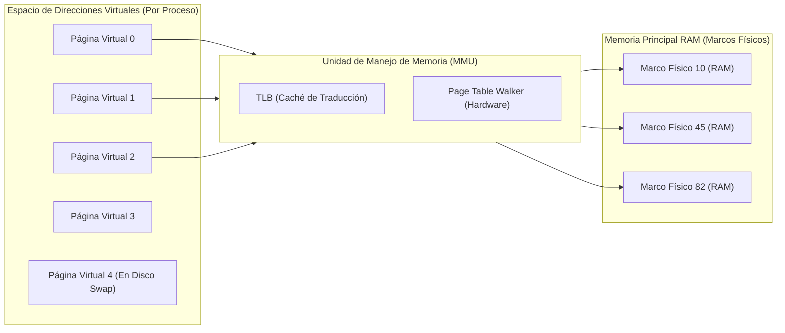
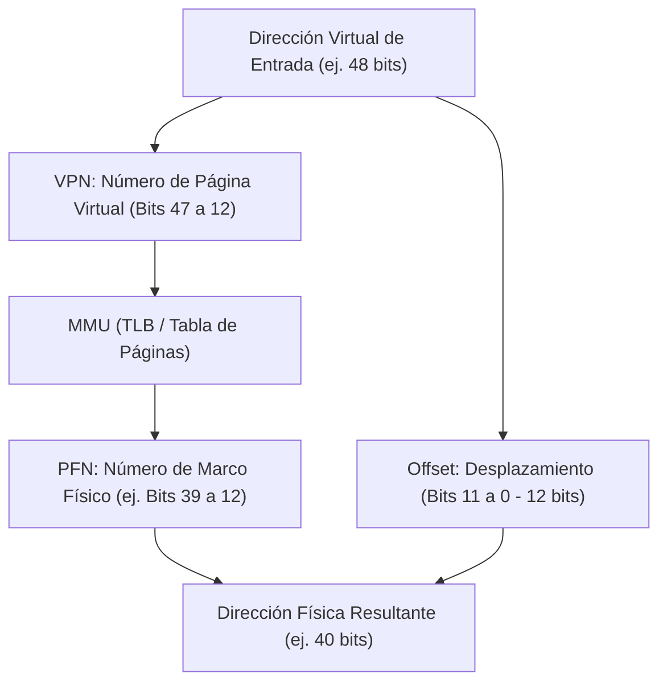
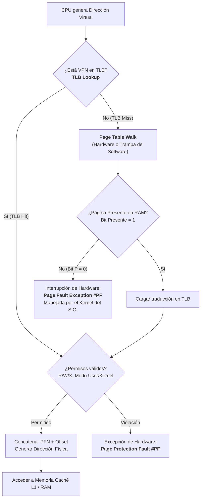
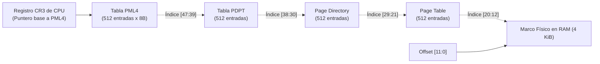
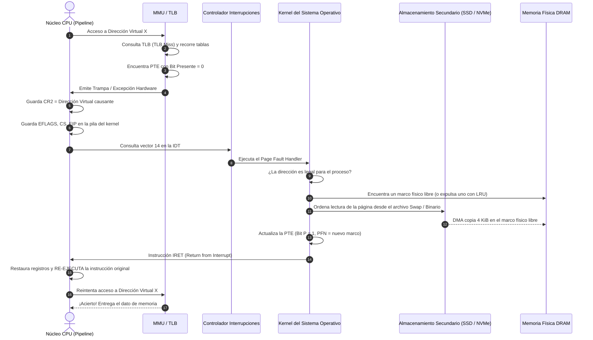
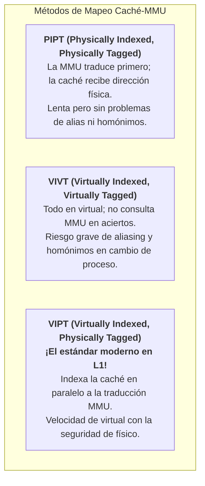

# Memoria Virtual, Paginación y Arquitectura de la MMU

La **Memoria Virtual** es una de las abstracciones arquitectónicas más cruciales de la computación moderna. Permite desacoplar el espacio de direcciones lógicas que perciben los programas del espacio de direcciones físicas provisto por los módulos de memoria física (DRAM). Esta arquitectura brinda a cada proceso la ilusión de disponer de un espacio de memoria lineal, continuo, aislado y protegido, potencialmente mucho más extenso que la RAM física instalada en la máquina.

Para que esta ilusión sea viable sin penalizar de forma prohibitiva el rendimiento de la CPU, la traducción entre direcciones virtuales y físicas no se realiza por software, sino mediante un componente de silicio dedicado integrado en el propio procesador: la **Unidad de Manejo de Memoria (MMU - *Memory Management Unit*)** asistida por una memoria asociativa de traducción ultrarrápida denominada **TLB (*Translation Lookaside Buffer*)**.

> [!info] 💡 ¿Cómo entender esto desde cero? (Guía para novatos de pregrado)
> Imagina una enorme **biblioteca nacional universitaria (la Memoria RAM Física)** con 16.000 estantes numerados físicamente.
> - Si cada estudiante (un **Proceso en ejecución**) tuviera que memorizar en qué estante exacto colocar sus apuntes, un estudiante descuidado podría sobrescribir los apuntes de otro estudiante o leer información confidencial ajena (**falta de aislamiento**).
> - En lugar de eso, la universidad le entrega a cada estudiante una **libreta personal de direcciones mágicas (Espacio Virtual de 64 bits)**: cada estudiante cree que tiene su propia biblioteca de 0 a 18 trillones de casilleros.
> - ¿Cómo se hace el milagro? Hay un **bibliotecario instantáneo en la puerta de la CPU (la MMU)**. Cuando el estudiante dice: *"Quiero ver mi página 5"*, el bibliotecario consulta una hoja de correspondencias (**Tabla de Páginas**) y traduce: *"La página 5 tuya está en el estante físico 208 de la RAM"*.
> - Para no buscar en un libro de registros gigante cada vez que parpadeas, el bibliotecario anota las últimas 64 traducciones en un **pizarrón ultra veloz en su mano (el TLB)**. Si el dato está en el pizarrón (**TLB Hit**), la respuesta toma menos de 1 nanosegundo.

---

## 1. El Desafío Arquitectónico: Espacio Lógico vs. Espacio Físico

En un sistema informático contemporáneo conviven dos universos de direcciones:



1. **Dirección Virtual (o Lógica):** La dirección emitida por el núcleo de la CPU durante las etapas de búsqueda de instrucción (*Instruction Fetch*) o acceso a datos (*Operand Load/Store*). En arquitecturas x86-64 y ARMv8/v9, los punteros son de 64 bits (con implementaciones físicas típicas de 48 o 57 bits de espacio direccionable canónico).
2. **Dirección Física:** La dirección real que viaja a través de los pines del bus de memoria hacia los controladores de memoria DRAM (canales DDR4/DDR5). Está limitada por la cantidad física de circuitos integrados de RAM instalados (ej. 16 GB, 64 GB, 512 GB).
3. **Página Virtual (*Virtual Page*):** Bloque contiguo de direcciones lógicas de tamaño fijo (típicamente $4\text{ KiB} = 4096\text{ bytes}$).
4. **Marco de Página Físico (*Page Frame*):** Bloque físico de memoria RAM del mismo tamaño exacto que la página virtual ($4\text{ KiB}$).

---

## 2. Anatomía y Desglose de una Dirección de Memoria Paginada

Para posibilitar la traducción directa, cualquier dirección virtual de $n$ bits se divide aritméticamente en dos campos complementarios:

$$\text{Dirección Virtual} = \big[ \text{Número de Página Virtual (VPN)} \;\big|\; \text{Desplazamiento dentro de la Página (Offset)} \big]$$

Para un tamaño de página canónico de $4\text{ KiB} = 2^{12}\text{ bytes}$:
- **Desplazamiento (*Offset*):** Requiere exactamente $\log_2(4096) = 12\text{ bits}$. El desplazamiento especifica el byte exacto dentro del bloque. **El desplazamiento nunca se traduce; pasa intacto de la dirección virtual a la dirección física**, garantizando que la posición relativa dentro del bloque se mantenga invariante.
- **Número de Página Virtual (VPN - *Virtual Page Number*):** Ocupa los bits más significativos restantes ($n - 12\text{ bits}$). Este índice es el que la MMU traduce al **Número de Marco Físico (PFN - *Physical Frame Number*)**.

$$\text{Dirección Física Resultante} = \big[ \text{PFN} \;\big|\; \text{Offset} \big]$$



---

## 3. La Unidad de Manejo de Memoria (MMU) y el TLB

La consulta de una tabla de páginas ubicada en la RAM física para cada acceso de memoria introduciría una penalización intolerable: **¡cada lectura de un dato requeriría primero dos, tres o cuatro lecturas previas a la RAM solo para traducir la dirección!**

Para neutralizar este cuello de botella, la MMU incorpora el **TLB (*Translation Lookaside Buffer*)**.

### 3.1 Estructura y Funcionamiento del TLB
El TLB es una memoria asociativa de muy alta velocidad (SRAM de celda rápida) integrada directamente en el silicio del núcleo de procesamiento:
- **Estructura:** Cada entrada del TLB almacena una tupla compuesta por:
  - Etiqueta de Página Virtual (VPN).
  - Marco de Página Físico (PFN).
  - Identificador de Espacio de Direcciones (ASID / PCID): Permite mantener entradas de distintos procesos en el TLB sin necesidad de vaciarlo (*flush*) en cada cambio de contexto de la CPU.
  - Bits de atributos y permisos (Lectura, Escritura, Ejecución, Cachabilidad).
- **Tiempo de acceso:** Menor o igual a un ciclo de reloj de la CPU (a menudo integrado en la misma etapa del pipeline de caché L1).

### 3.2 El Flujo de Traducción: TLB Hit vs. TLB Miss



- **TLB Hit:** La traducción se obtiene en fracciones de nanosegundo. La dirección física se sintetiza inmediatamente y el pipeline del procesador no se detiene.
- **TLB Miss:** La traducción no reside en el TLB. La MMU activa el **Caminante de Tablas de Páginas (*Hardware Page Table Walker*)**, el cual recorre la jerarquía multinivel de tablas en memoria principal. Si la página es válida, la traducción se inserta en el TLB y la instrucción culpable se completa.

---

## 4. Tablas de Páginas Multinivel (Paginación Jerárquica en x86-64 y ARM)

Si se utilizara una tabla lineal simple en un procesador de 64 bits con páginas de 4 KiB, se requerirían $2^{52}$ entradas. ¡Cada proceso consumiría millones de gigabytes de memoria solo para almacenar su tabla de páginas!

La solución arquitectónica es la **Paginación Jerárquica Multinivel**. Las tablas solo se crean para las regiones del espacio virtual que el programa realmente tiene asignadas (*sparse virtual address space*).

### 4.1 La Jerarquía de 4 Niveles en x86-64 (PML4)

En la arquitectura x86-64 canónica (espacio virtual de 48 bits), la traducción se distribuye en 4 niveles de indirección:

| Campo de la Dirección Virtual | Bits | Cantidad de Bits | Función |
| :--- | :--- | :--- | :--- |
| **PML4 Index (Page Map Level 4)** | 47 a 39 | 9 bits | Índice en la tabla PML4 ($2^9 = 512$ entradas) |
| **PDPT Index (Page Directory Pointer Table)** | 38 a 30 | 9 bits | Índice en la tabla PDPT (512 entradas) |
| **PD Index (Page Directory Table)** | 29 a 21 | 9 bits | Índice en el Directorio de Páginas (512 entradas) |
| **PT Index (Page Table)** | 20 a 12 | 9 bits | Índice en la Tabla de Páginas final (512 entradas) |
| **Page Offset** | 11 a 0 | 12 bits | Posición del byte exacto dentro de la página de 4 KiB |

Dado que cada entrada de tabla (**PTE - *Page Table Entry***) mide 8 bytes (64 bits), cada una de las tablas tiene exactamente $512 \times 8\text{ bytes} = 4096\text{ bytes} = 4\text{ KiB}$, encajando perfectamente dentro de un solo marco de página física.

El registro especial de control de la CPU **`CR3`** almacena la dirección base física de la tabla PML4 del proceso actualmente en ejecución.



### 4.2 Páginas Gigantes (Huge Pages / Large Pages)
Para aplicaciones con conjuntos masivos de datos en memoria (motores de bases de datos como PostgreSQL/Oracle, simulaciones de Machine Learning o máquinas virtuales):
- Si una aplicación utiliza 64 GB de RAM con páginas de 4 KiB, necesita 16 millones de entradas en tablas de páginas, saturando completamente el TLB y causando una avalancha constante de *TLB Misses*.
- La arquitectura permite truncar la jerarquía:
  - **Páginas de 2 MiB:** El índice de la tabla de páginas final (PT) se fusiona con el offset, requiriendo solo 3 niveles de traducción (PML4 -> PDPT -> PD).
  - **Páginas de 1 GiB:** Se fusionan los niveles PD y PT con el offset, traduciendo directamente desde la PDPT.
- **Impacto:** Una sola entrada en el TLB cubre 2 MiB o 1 GiB de datos, elevando drásticamente la tasa de *TLB Hits*.

---

## 5. Anatomía de una Entrada de Tabla de Páginas (PTE)

Cada entrada de 64 bits en una tabla de páginas moderna contiene campos de metadatos gobernados conjuntamente por el silicio y el sistema operativo:

```
 63   62                     52 51                               12 11 9 8 7 6 5 4 3 2 1 0
+----+-------------------------+-----------------------------------+----+-+-+-+-+-+-+-+-+-+
| XD | Disponsible para el S.O.|    Dirección Base del Marco PFN   |AVL |G|S|D|A|C|W|U|R|P|
+----+-------------------------+-----------------------------------+----+-+-+-+-+-+-+-+-+-+
```

### Bits de Control Esenciales:
1. **Bit P (Present / Absent - Bit 0):**
   - `P = 1`: El marco físico reside actualmente en la memoria RAM principal.
   - `P = 0`: La página solicitada no está en RAM física (puede haber sido expulsada al disco de intercambio o *Swap*, o nunca haber sido asignada). Un intento de acceso genera una interrupción de **Fallo de Página (*Page Fault*)**.
2. **Bit R/W (Read / Write - Bit 1):**
   - `0`: Solo lectura. Si el código ejecuta una instrucción de escritura (ej. `MOV [addr], EAX`), el procesador aborta la operación y dispara una falla de protección.
   - `1`: Lectura y escritura habilitadas.
3. **Bit U/S (User / Supervisor - Bit 2):**
   - `0`: Nivel Supervisor / Kernel (Ring 0). El código de usuario no puede tocar este marco de memoria (garantiza el blindaje del núcleo del sistema operativo).
   - `1`: Modo Usuario (Ring 3). Accesible por programas convencionales.
4. **Bit PWT (Page-level Write-Through - Bit 3) y PCD (Page-level Cache Disable - Bit 4):**
   - Controlan si los accesos a esta página pueden ser almacenados en las cachés de la CPU (L1/L2/L3) o si deben forzarse de forma directa al bus físico (indispensable para regiones de Entrada/Salida mapeada en memoria MMIO de periféricos y tarjetas gráficas).
5. **Bit A (Accessed - Bit 5):**
   - Puesto en `1` por el hardware del procesador cada vez que la página es leída o escrita. Utilizado por los algoritmos de reemplazo de páginas del sistema operativo (como el algoritmo de Reloj o LRU aproximado).
6. **Bit D (Dirty / Modified - Bit 6):**
   - Puesto en `1` automáticamente por el hardware cuando se realiza una escritura en la página. Si la página debe ser expulsada a disco, el S.O. verifica si $D=1$; si está "limpia" ($D=0$), no requiere escribirse en disco porque la copia en disco ya está sincronizada.
7. **Bit G (Global - Bit 8):**
   - Si está activo, previene que la entrada sea expulsada del TLB al cambiar el registro `CR3` (cambio de contexto de proceso). Utilizado para páginas compartidas del kernel.
8. **Bit XD / NX (Execute-Disable / No-Execute - Bit 63):**
   - Introducido por AMD (EVP) e Intel (XD bit) para mitigar vulnerabilidades de seguridad (*Buffer Overflow*). Si $XD = 1$, la CPU rehúsa decodificar y ejecutar instrucciones de máquina ubicadas en esta página (la memoria de datos de pila *Stack* y montículo *Heap* se marca con $XD=1$ para evitar ejecución de exploits inyectados).

---

## 6. La Excepción de Hardware: Ciclo de Vida de un Fallo de Página (Page Fault)

Un **Fallo de Página (*Page Fault - Interrupción #PF en x86, vector 14*)** no es un error de programación; es el mecanismo de sincronización que hace posible la paginación por demanda.



### Pasos Críticos:
1. **Detección:** La MMU detecta $P = 0$ o una violación de permisos. El procesador congela la ejecución del hilo.
2. **Carga del Registro CR2:** La CPU almacena automáticamente la dirección virtual exacta que provocó el fallo en el registro de hardware **`CR2`**.
3. **Cambio a Modo Kernel:** La CPU conmuta al Ring 0 y transfiere el control a la dirección del manejador de fallos de página registrado en la *Interrupt Descriptor Table* (IDT).
4. **Validación:** El kernel comprueba si la dirección virtual se encuentra dentro del rango de memoria asignado al proceso (usando sus estructuras internas de descriptores de memoria virtual, como `vm_area_struct` en Linux). Si la dirección es inválida (ej. acceso a puntero nulo `0x0`), el kernel genera una señal `SIGSEGV` (*Segmentation Fault*).
5. **Carga y Recuperación:** Si es legal, el kernel localiza el bloque correspondiente en el archivo de paginación o swap en el SSD/NVMe, lo transfiere a un marco físico disponible vía DMA, actualiza la PTE con $P=1$, invalida la línea del TLB asociada mediante la instrucción **`INVLPG`**, y reanuda la instrucción original de forma 100% transparente para el programa de usuario.

---

## 7. Interacción entre la MMU y la Memoria Caché: Indexación y Etiquetado

Un dilema de diseño fundamental en la microarquitectura es: **¿en qué momento del pipeline se traduce la dirección virtual con respecto a la búsqueda en la caché L1?**

Existen 4 configuraciones teóricas según qué tipo de dirección se use para indexar el conjunto de la caché y cuál para comparar la etiqueta (*Tag*):



### La Solución de la Industria: Caché VIPT (Virtually Indexed, Physically Tagged)
- **Operación Paralela:** Los bits de desplazamiento de la página (*Page Offset*, típicamente bits 0 a 11) no cambian durante la traducción de la MMU.
- Si el índice necesario para direccionar los conjuntos de la caché L1 está contenido completamente dentro de esos 12 bits invariantes (por ejemplo, una caché de 32 KiB con asociatividad de 8 vías: $32768 / 8 = 4096\text{ bytes}$ por vía, lo que requiere exactamente 12 bits de índice y offset):
  1. El procesador envía los bits de índice a la memoria SRAM de la caché L1 al mismo tiempo que envía los bits de VPN al TLB.
  2. Cuando la caché L1 ha recuperado los 8 bloques candidatos de sus conjuntos, el TLB termina su traducción y entrega el PFN físico.
  3. El comparador de etiquetas de la caché contrasta el PFN físico con las etiquetas físicas de las 8 líneas.
- **Resultado:** ¡Se obtiene la latencia de una caché virtual sin sufrir ningún problema de colisión o confusión de memoria entre procesos distintos!
