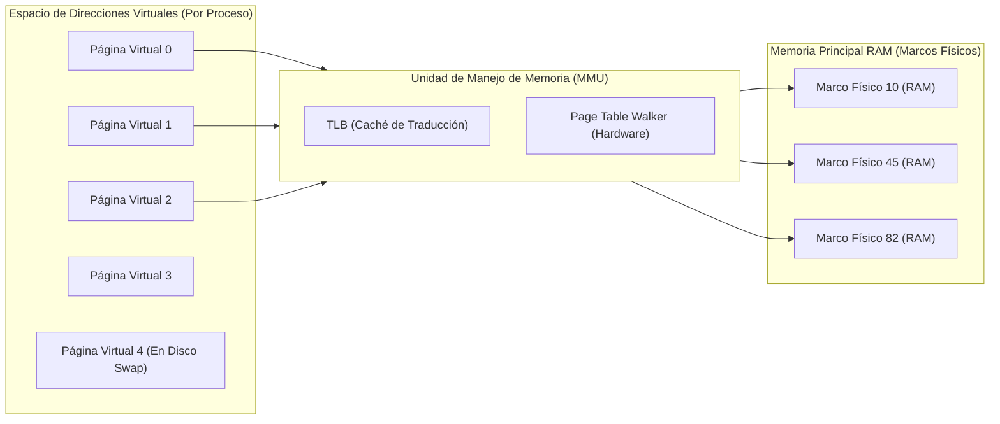
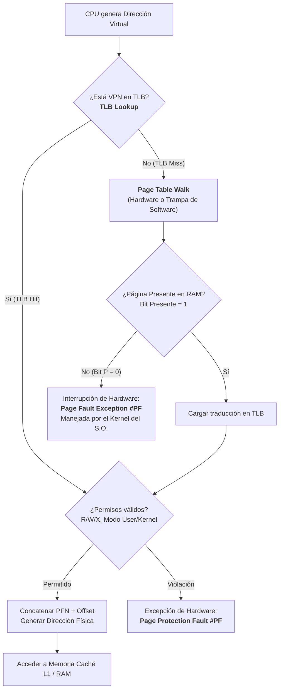
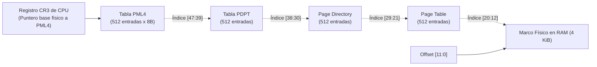
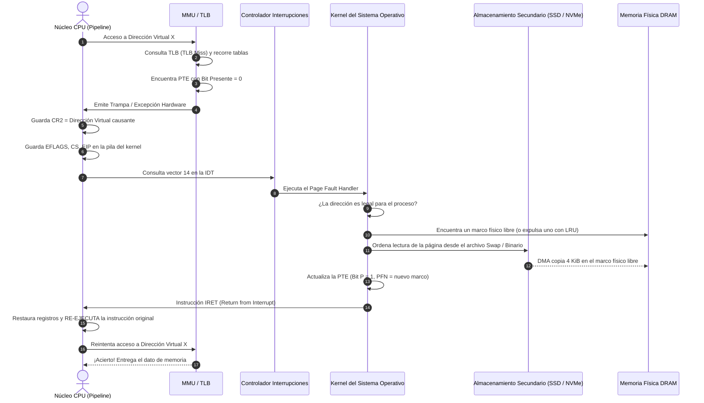
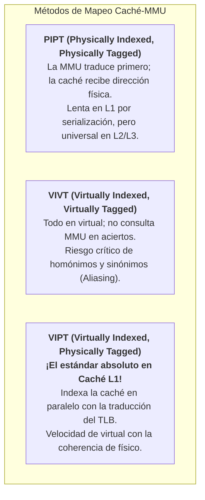

# Memoria Virtual, Paginación y Arquitectura de la MMU

La **Memoria Virtual** es una de las abstracciones arquitectónicas más cruciales de la computación moderna. Permite desacoplar el espacio de direcciones lógicas que perciben los programas del espacio de direcciones físicas provisto por los módulos de memoria física (DRAM). Esta arquitectura brinda a cada proceso la ilusión de disponer de un espacio de memoria lineal, continuo, aislado y protegido, potencialmente mucho más extenso que la RAM física instalada en la máquina.

Para que esta ilusión sea viable sin penalizar de forma prohibitiva el rendimiento de la CPU, la traducción entre direcciones virtuales y físicas no se realiza por software, sino mediante un componente de silicio dedicado integrado en el propio procesador: la **Unidad de Manejo de Memoria (MMU - *Memory Management Unit*)** asistida por una memoria asociativa de traducción ultrarrápida denominada **TLB (*Translation Lookaside Buffer*)**.

> [!info] 💡 ¿Cómo entender esto desde cero? (Guía para novatos de pregrado)
> Imagina una enorme **biblioteca nacional universitaria (la Memoria RAM Física)** con 16.000 estantes numerados físicamente.
> - Si cada estudiante (un **Proceso en ejecución**) tuviera que memorizar en qué estante exacto colocar sus apuntes, un estudiante descuidado podría sobrescribir los apuntes de otro estudiante o leer información confidencial ajena (**falta de aislamiento**).
> - En lugar de eso, la universidad le entrega a cada estudiante una **libreta personal de direcciones mágicas (Espacio Virtual de 64 bits)**: cada estudiante cree que tiene su propia biblioteca de 0 a 18 trillones de casilleros.
> - ¿Cómo se hace el milagro? Hay un **bibliotecario instantáneo en la puerta de la CPU (la MMU)**. Cuando el estudiante dice: *"Quiero ver mi página 5"*, el bibliotecario consulta una hoja de correspondencias (**Tabla de Páginas**) y traduce: *"La página 5 tuya está en el estante físico 208 de la RAM"*.
> - Para no buscar en un libro de registros gigante cada vez que parpadeas, el bibliotecario anota las últimas 64 traducciones en un **pizarrón ultra veloz en su mano (el TLB)**. Si el dato está en el pizarrón (**TLB Hit**), la respuesta toma menos de 1 nanosegundo.

---

## 1. El Desafío Arquitectónico: Espacio Lógico vs. Espacio Físico

En un sistema informático contemporáneo conviven dos universos de direcciones:



1. **Dirección Virtual (o Lógica):** La dirección emitida por el núcleo de la CPU durante las etapas de búsqueda de instrucción (*Instruction Fetch*) o acceso a datos (*Operand Load/Store*). En arquitecturas x86-64 y ARMv8/v9, los punteros son de 64 bits (con implementaciones físicas típicas de 48 o 57 bits de espacio direccionable canónico).
2. **Dirección Física:** La dirección real que viaja a través de los pines del bus de memoria hacia los controladores de memoria DRAM (canales DDR4/DDR5). Está limitada por la cantidad física de circuitos integrados de RAM instalados (ej. 16 GB, 64 GB, 512 GB).
3. **Página Virtual (*Virtual Page*):** Bloque contiguo de direcciones lógicas de tamaño fijo (típicamente $4\text{ KiB} = 4096\text{ bytes}$).
4. **Marco de Página Físico (*Page Frame*):** Bloque físico de memoria RAM del mismo tamaño exacto que la página virtual ($4\text{ KiB}$).

---

## 2. Anatomía y Desglose de una Dirección de Memoria Paginada

Para posibilitar la traducción directa en hardware, cualquier dirección virtual de $n$ bits se divide aritméticamente en dos campos complementarios:

$$\text{Dirección Virtual} = \big[ \text{Número de Página Virtual (VPN)} \;\big|\; \text{Desplazamiento dentro de la Página (Offset)} \big]$$

Para el tamaño de página estándar de la industria de $4\text{ KiB} = 4096\text{ bytes} = 2^{12}\text{ bytes}$:
- **Desplazamiento (*Page Offset*):** Requiere exactamente $\log_2(4096) = 12\text{ bits}$ (bits `[11:0]`). El desplazamiento especifica el byte exacto dentro del marco. **El desplazamiento nunca se traduce; pasa intacto de la dirección virtual a la dirección física**. ¿Por qué? Porque la página virtual y el marco físico tienen idéntica longitud: si un dato está en el byte 350 dentro de una página virtual, cuando esa página se aloje en un marco físico de la RAM, el dato seguirá estando en el byte 350 dentro de ese marco.
- **Número de Página Virtual (VPN - *Virtual Page Number*):** Ocupa los bits más significativos restantes ($n - 12\text{ bits}$). Este índice es el que la MMU y el TLB traducen al **Número de Marco Físico (PFN - *Physical Frame Number*)** en la RAM.

$$\text{Dirección Física Resultante} = \big[ \text{PFN} \;\big|\; \text{Offset} \big]$$

```mermaid
flowchart TD
    VA["Dirección Virtual de Entrada (ej. 48 bits: 0x0000_7FFF_ABCD_E123)"]
    VA --> VPN["VPN: Número de Página Virtual (Bits 47 a 12: 0x0000_7FFF_ABCD)"]
    VA --> OFF["Offset: Desplazamiento (Bits 11 a 0: 0x123 — 12 bits)"]

    VPN --> MMU_Trans["MMU (TLB / Caminante de Tablas)"]
    MMU_Trans -->|Traducción| PFN["PFN: Número de Marco Físico (Bits 39 a 12: ej. 0x0000_0005_4321)"]

    PFN --> PA["Dirección Física en Bus DRAM (ej. 40 bits: 0x0005_4321_E123)"]
    OFF -->|Pasa Intacto (Sin Traducir)| PA
```

> [!example] 🔬 Ejemplo Numérico Concreto (La revelación del Offset en Hexadecimal)
> Supón una dirección virtual emitida por la CPU en un puntero de x86-64: `0x0000_7FFF_89AB_C123`.
> 1. Como cada dígito hexadecimal equivale a 4 bits, los **últimos 3 dígitos hexadecimales** representan exactamente $3 \times 4 = 12\text{ bits}$:
>    - **Offset:** `0x123` (byte 291 dentro de la página).
>    - **VPN:** `0x0000_7FFF_89AB_C`.
> 2. La MMU consulta el TLB o recorre la tabla de páginas y descubre que la página virtual `0x0000_7FFF_89AB_C` reside actualmente en el marco físico de RAM **PFN = `0x0000_0005_4321`**.
> 3. La CPU construye la dirección física simplemente concatenando el PFN con el Offset:
>    $$\text{Dirección Física} = (\text{PFN} \ll 12) \mid \text{Offset} = \text{0x0005\_4321\_000} + \text{0x123} = \mathbf{0x0005\_4321\_123}$$
> 
> *¡Fíjate bien!* Los dígitos inferiores `123` son idénticos tanto en la dirección virtual como en la dirección física. El hardware no gasta ni un solo picosegundo en calcular el offset; solo reemplaza el prefijo.

---

## 3. La Unidad de Manejo de Memoria (MMU) y el TLB

La consulta de una tabla de páginas ubicada en la RAM física para cada acceso de memoria introduciría una penalización intolerable: **¡cada lectura de un dato requeriría primero dos, tres o cuatro lecturas previas a la RAM solo para traducir la dirección!**

Para neutralizar este cuello de botella, la MMU incorpora el **TLB (*Translation Lookaside Buffer*)**.

### 3.1 Estructura y Funcionamiento del TLB
El TLB es una memoria asociativa de muy alta velocidad (SRAM de celda rápida) integrada directamente en el silicio del núcleo de procesamiento:
- **Estructura:** Cada entrada del TLB almacena una tupla compuesta por:
  - Etiqueta de Página Virtual (VPN).
  - Marco de Página Físico (PFN).
  - Identificador de Espacio de Direcciones (ASID / PCID): Permite mantener entradas de distintos procesos en el TLB sin necesidad de vaciarlo (*flush*) en cada cambio de contexto de la CPU.
  - Bits de atributos y permisos (Lectura, Escritura, Ejecución, Cachabilidad).
- **Tiempo de acceso:** Menor o igual a un ciclo de reloj de la CPU (a menudo integrado en la misma etapa del pipeline de caché L1).

### 3.2 El Flujo de Traducción: TLB Hit vs. TLB Miss



- **TLB Hit:** La traducción se obtiene en fracciones de nanosegundo. La dirección física se sintetiza inmediatamente y el pipeline del procesador no se detiene.
- **TLB Miss:** La traducción no reside en el TLB. La MMU activa el **Caminante de Tablas de Páginas (*Hardware Page Table Walker*)**, el cual recorre la jerarquía multinivel de tablas en memoria principal. Si la página es válida, la traducción se inserta en el TLB y la instrucción culpable se completa.

### 3.3 Justificación Matemática: Tiempo de Acceso Efectivo (EAT)
¿Por qué el TLB es el componente más crítico para que la memoria virtual no destruya el rendimiento? Lo demostramos con el **Tiempo de Acceso Efectivo (*Effective Access Time - EAT*)**.

En una arquitectura con $k$ niveles de tablas (ej. $k = 4$ en x86-64):
$$\text{EAT} = h \cdot (t_{\text{TLB}} + t_{\text{RAM}}) + (1 - h) \cdot \big(t_{\text{TLB}} + (k + 1) \cdot t_{\text{RAM}}\big)$$
donde:
- $h$: Tasa de aciertos del TLB (*Hit Rate*, típicamente entre $98\%$ y $99.5\%$).
- $t_{\text{TLB}}$: Tiempo de consulta al TLB ($\approx 1\text{ ns}$).
- $t_{\text{RAM}}$: Tiempo de acceso a la memoria principal DRAM ($\approx 50\text{ ns}$).
- $k$: Número de niveles de tablas que deben leerse en RAM durante un fallo ($k=4$).

> [!example] 📊 Demostración Comparativa
> 1. **Sin TLB ($h = 0$):**
>    Cada lectura de memoria requiere primero consultar los 4 niveles de tablas en RAM y luego leer el dato real (5 accesos a RAM en total):
>    $$\text{EAT}_{\text{sin TLB}} = 5 \times 50\text{ ns} = \mathbf{250\text{ ns}} \quad \text{(¡Ralentización masiva del 500%!)}$$
> 2. **Con TLB moderno ($h = 99\%$):**
>    $$\text{EAT} = 0.99 \times (1 + 50) + 0.01 \times (1 + 5 \times 50) = 0.99 \times 51 + 0.01 \times 251 = 50.49 + 2.51 = \mathbf{53.0\text{ ns}}$$
> 
> Gracias al TLB, la penalización de tener 4 niveles de tablas se reduce a un imperceptible **$6\%$** en promedio (y cuando el dato además está en caché L1/L2, el tiempo efectivo cae a $\approx 1.5\text{ ns}$).

### 3.4 ¿Quién camina las tablas? Hardware Page Table Walker vs. Trampa de Software
- **Hardware Page Table Walker (Estándar Moderno: x86-64, ARMv8/v9, RISC-V):**
  La propia MMU posee un micro-autómata cableado en silicio capaz de leer el registro `CR3`, calcular los desplazamientos, emitir lecturas de bus hacia la RAM para cada nivel y cargar el TLB sin intervención de la CPU ni del sistema operativo. La CPU solo se entera si la página **no existe en RAM ($P=0$)**.
- **Software-Managed TLB (Arquitecturas Históricas: MIPS, SPARC, Alpha):**
  Ante un TLB Miss, la CPU lanzaba una excepción rápida por hardware. El kernel ejecutaba un manejador de software especializado de unas pocas instrucciones de ensamblador para buscar en la tabla y escribir la entrada en el TLB mediante instrucciones privilegiadas. Se abandonó en procesadores modernos de alto rendimiento porque guardar contexto y cambiar a modo supervisor introducía demasiada latencia frente a un autómata en silicio.

---

## 4. Tablas de Páginas Multinivel (Paginación Jerárquica en x86-64 y ARM)

Si se utilizara una tabla lineal simple en un procesador de 64 bits con páginas de 4 KiB, se requerirían $2^{52}$ entradas. ¡Cada proceso consumiría millones de gigabytes de memoria solo para almacenar su tabla de páginas!

La solución arquitectónica es la **Paginación Jerárquica Multinivel**. Las tablas solo se crean para las regiones del espacio virtual que el programa realmente tiene asignadas (*sparse virtual address space*).

### 4.1 La Jerarquía de 4 Niveles en x86-64 (PML4) y la Magia de los 9 Bits

¿De dónde sale exactamente el número **9 bits** para cada nivel? No es una constante arbitraria, sino una deducción aritmética rigurosa:
1. Una tabla de páginas debe caber exactamente dentro de **un marco físico de página ($4\text{ KiB} = 4096\text{ bytes} = 2^{12}\text{ bytes}$)** para que el propio sistema operativo pueda paginar sus tablas de manera uniforme.
2. En una arquitectura de 64 bits, cada entrada (**PTE - *Page Table Entry***) mide **8 bytes ($2^3\text{ bytes}$)**.
3. El número de entradas que caben en una tabla es:
   $$\text{Entradas por tabla} = \frac{4096\text{ bytes}}{8\text{ bytes}} = 512 = 2^9\text{ entradas}$$
4. Para direccionar e indexar inequívocamente 512 entradas, se requieren exactamente:
   $$\log_2(512) = \mathbf{9\text{ bits}}$$

Por lo tanto, la descomposición de la dirección virtual de 48 bits es:
$$9\text{ bits (PML4)} + 9\text{ bits (PDPT)} + 9\text{ bits (PD)} + 9\text{ bits (PT)} + 12\text{ bits (Offset)} = \mathbf{48\text{ bits}}$$

| Campo de la Dirección Virtual | Bits | Cantidad de Bits | Función |
| :--- | :--- | :--- | :--- |
| **PML4 Index (Page Map Level 4)** | 47 a 39 | 9 bits | Índice en la tabla PML4 ($2^9 = 512$ entradas) |
| **PDPT Index (Page Directory Pointer Table)** | 38 a 30 | 9 bits | Índice en la tabla PDPT (512 entradas) |
| **PD Index (Page Directory Table)** | 29 a 21 | 9 bits | Índice en el Directorio de Páginas (512 entradas) |
| **PT Index (Page Table)** | 20 a 12 | 9 bits | Índice en la Tabla de Páginas final (512 entradas) |
| **Page Offset** | 11 a 0 | 12 bits | Posición del byte exacto dentro de la página de 4 KiB |

Dado que cada entrada intermedia almacena la **dirección física base** de la siguiente tabla en RAM, el hardware camina nivel tras nivel como una búsqueda en un árbol de 4 niveles. El registro especial de control de la CPU **`CR3`** almacena la dirección física base de la raíz del árbol (la PML4 del proceso actual).



### 4.2 El Espacio Canónico de 48 Bits y el "Agujero No Canónico"
Si los punteros en C/C++ y los registros (`RAX`, `RSP`, `RIP`) son de 64 bits, ¿qué ocurre con los bits 48 a 63?
- La arquitectura x86-64 exige que las direcciones sean **canónicas**: los bits 48 al 63 deben ser una **extensión de signo del bit 47**:
  - **Mitad Inferior (Espacio de Usuario):** El bit 47 es `0`, por lo que los bits 48 a 63 deben ser `0`. Rango válido: `0x0000_0000_0000_0000` a `0x0000_7FFF_FFFF_FFFF` (128 Terabytes de memoria de usuario).
  - **Mitad Superior (Espacio de Kernel):** El bit 47 es `1`, por lo que los bits 48 a 63 deben ser `1`. Rango válido: `0xFFFF_8000_0000_0000` a `0xFFFF_FFFF_FFFF_FFFF` (128 Terabytes reservados para el núcleo del S.O.).
  - **El Agujero No Canónico (*Non-canonical Gap*):** El rango intermedio (entre `0x0000_8000_0000_0000` y `0xFFFF_7FFF_FFFF_FFFF`) es estrictamente ilegal. Si un hilo intenta desreferenciar una dirección dentro del agujero, la circuitería decodificadora de la CPU no gasta ciclos consultando a la MMU: detiene la instrucción en el acto y lanza una **Excepción de Protección General (`#GP Fault`)**.

> [!note] 🚀 Evolución hacia 5 Niveles (PML5 / 57-bit Paging)
> Para servidores con decenas de terabytes de RAM física, Intel (Ice Lake) y AMD (Zen 4) introdujeron **PML5**: añade un quinto nivel de 9 bits (bits 56 a 48), elevando el espacio virtual direccionable a $2^{57} = 128\text{ Petabytes}$.

### 4.3 Páginas Gigantes (Huge Pages / Large Pages) y el Bit PS
Para aplicaciones con conjuntos masivos de datos en memoria (motores de bases de datos como PostgreSQL/Oracle, simulaciones de Machine Learning o máquinas virtuales):
- Si una aplicación utiliza 64 GB de RAM con páginas de 4 KiB, necesita 16 millones de entradas en tablas de páginas, saturando completamente el TLB y causando una avalancha constante de *TLB Misses*.
- La arquitectura permite truncar la jerarquía activando el **Bit 7 (PS - *Page Size*)** en las tablas intermedias:
  - **Páginas de 2 MiB:** Se pone el bit `PS = 1` en la entrada del Directorio de Páginas (**PDE**). El Page Table Walker se detiene en el nivel 2 y trata los bits `[20:0]` ($21\text{ bits} = 2^{21}\text{ bytes} = 2\text{ MiB}$) como un único gran offset directo.
  - **Páginas de 1 GiB:** Se pone el bit `PS = 1` en la entrada de la tabla **PDPTE**. Se detiene en el nivel 3 y utiliza los bits `[29:0]` ($30\text{ bits} = 2^{30}\text{ bytes} = 1\text{ GiB}$) como offset directo.
- **Impacto:** Una sola entrada en el TLB cubre 2 MiB o 1 GiB de datos, reduciendo radicalmente los fallos de traducción y acelerando el rendimiento de cargas intensivas entre un $10\%$ y un $30\%$.

---

## 5. Anatomía de una Entrada de Tabla de Páginas (PTE)

Cada entrada de 64 bits en una tabla de páginas moderna contiene campos de metadatos gobernados conjuntamente por el silicio y el sistema operativo:

```
 63   62                     52 51                               12 11 9 8 7 6 5 4 3 2 1 0
+----+-------------------------+-----------------------------------+----+-+-+-+-+-+-+-+-+-+
| XD | Disponsible para el S.O.|    Dirección Base del Marco PFN   |AVL |G|S|D|A|C|W|U|R|P|
+----+-------------------------+-----------------------------------+----+-+-+-+-+-+-+-+-+-+
```

### Bits de Control Esenciales:
1. **Bit P (Present / Absent - Bit 0):**
   - `P = 1`: El marco físico reside actualmente en la memoria RAM principal.
   - `P = 0`: La página solicitada no está en RAM física (puede haber sido expulsada al disco de intercambio o *Swap*, o nunca haber sido asignada). Un intento de acceso genera una interrupción de **Fallo de Página (*Page Fault #PF*)**.
2. **Bit R/W (Read / Write - Bit 1):**
   - `0`: Solo lectura. Si el código ejecuta una instrucción de escritura (ej. `MOV [addr], EAX`), el procesador aborta la operación y dispara una falla de protección.
   - `1`: Lectura y escritura habilitadas.
3. **Bit U/S (User / Supervisor - Bit 2):**
   - `0`: Nivel Supervisor / Kernel (Ring 0). El código de usuario no puede tocar este marco de memoria (garantiza el blindaje absoluto del núcleo del sistema operativo).
   - `1`: Modo Usuario (Ring 3). Accesible por programas convencionales.
4. **Bit PWT (Page-level Write-Through - Bit 3) y PCD (Page-level Cache Disable - Bit 4):**
   - Controlan si los accesos a esta página pueden ser almacenados en las cachés de la CPU (L1/L2/L3) o si deben forzarse de forma directa al bus físico (indispensable para regiones de Entrada/Salida mapeada en memoria MMIO de periféricos y tarjetas gráficas).
5. **Bit A (Accessed - Bit 5):**
   - Puesto en `1` automáticamente por el hardware del procesador cada vez que la página es leída o escrita. Utilizado por los algoritmos de reemplazo de páginas del sistema operativo (como el algoritmo de Reloj o LRU aproximado) para identificar páginas "frías" candidatas a swap.
6. **Bit D (Dirty / Modified - Bit 6):**
   - Puesto en `1` automáticamente por el hardware cuando se realiza una escritura en la página. Si la página debe ser expulsada a disco, el S.O. verifica si $D=1$; si está "limpia" ($D=0$), no requiere escribirse en disco porque la copia en disco ya está sincronizada, ahorrando I/O crítico.
7. **Bit PS / PAT (Page Size / Page Attribute Table - Bit 7):**
   - En entradas intermedias (PDE / PDPTE): actúa como **Page Size (PS)**. Si `PS = 1`, la entrada no apunta a otra tabla, sino que mapea directamente una página gigante (*Huge Page* de 2 MiB o 1 GiB).
   - En la PTE final de 4 KiB: actúa como bit selector PAT, permitiendo configurar tipos de memoria avanzados (ej. *Write-Combining* para acelerar buffers de vídeo).
8. **Bit G (Global - Bit 8):**
   - Si está activo (`G = 1`), previene que la entrada sea purgada del TLB cuando cambia el registro `CR3` (cambio de contexto de proceso). Utilizado para páginas compartidas del kernel, evitando invalidaciones innecesarias del TLB.
9. **Bit XD / NX (Execute-Disable / No-Execute - Bit 63):**
   - Introducido por AMD (EVP) e Intel (XD bit) para mitigar vulnerabilidades de seguridad (*Buffer Overflow*). Si $XD = 1$, la CPU rehúsa decodificar y ejecutar instrucciones de máquina ubicadas en esta página.

> [!tip] 🧠 Dos Escenarios Clásicos de Examen: ¿Cómo explotan estos bits los Sistemas Operativos?
> 1. **El Milagro del Copy-on-Write (CoW en `fork()`):**
>    Cuando un proceso hijo se clona en Linux con `fork()`, el sistema operativo **no copia los gigabytes de memoria del padre**. Simplemente crea una nueva tabla de páginas para el hijo que apunta a los mismos marcos físicos, pero **marca todas las PTEs de ambos como Solo Lectura ($R/W = 0$)**.
>    - Si padre o hijo solo leen, ambos comparten la misma RAM sin costo.
>    - Cuando cualquiera intenta escribir: ¡la MMU detecta una violación y lanza un `#PF`! El kernel intercepta la excepción, ve que la página está marcada como CoW, asigna un marco nuevo en RAM, duplica únicamente esos 4 KiB, reconfigura la PTE del proceso escritor con $R/W = 1$, y reanuda la instrucción.
> 2. **Seguridad Moderna: DEP / W^X (Write XOR Execute):**
>    Para evitar que atacantes inyecten código malicioso (*shellcode*) en la memoria de variables (Pila/*Stack* o Montículo/*Heap*), el sistema operativo aplica la regla estricta $W \oplus X$: una página puede ser modificable ($R/W=1, XD=1$) o ejecutable ($R/W=0, XD=0$), pero **jamás ambas a la vez**. Si un exploit desvía el puntero de instrucción `RIP` hacia la pila, la CPU detecta $XD=1$ y detiene el ataque instantáneamente con una excepción `#PF`.

---

## 6. La Excepción de Hardware: Ciclo de Vida de un Fallo de Página (Page Fault)

Un **Fallo de Página (*Page Fault - Interrupción #PF en x86, vector 14*)** no es un error de programación; es el mecanismo de sincronización que hace posible la paginación por demanda.



### Pasos Críticos y Registros de Hardware:
1. **Detección por el Silicio:** La MMU detecta que el bit $P = 0$ o que la operación viola los permisos ($R/W$, $U/S$ o $XD$). El procesador congela la instrucción culpable en la etapa de ejecución.
2. **Carga Automática de Registros por Hardware:**
   - **Registro `CR2`:** La CPU almacena automáticamente la dirección virtual exacta de 64 bits que causó el fallo. El manejador del kernel lee `CR2` de inmediato para identificar qué página falló.
   - **Código de Error (#PF Error Code):** La CPU empuja a la pila del kernel un entero de 32 bits con las causas precisas del fallo:
     - **Bit 0 ($P$):** `0` = La página no está en RAM ($P=0$); `1` = Violación de derechos de protección (la página sí estaba presente pero se intentó escribir con $R/W=0$ o ejecutar con $XD=1$).
     - **Bit 1 ($W/R$):** `0` = Acceso de lectura; `1` = Acceso de escritura.
     - **Bit 2 ($U/S$):** `0` = Ocurrió en modo Kernel (Ring 0); `1` = Ocurrió en modo Usuario (Ring 3).
     - **Bit 3 ($RSVD$):** `1` = Se leyó un bit reservado en una entrada de tabla (corrupción de tabla).
     - **Bit 4 ($I/D$):** `1` = El fallo ocurrió al buscar una instrucción para ejecutar (*Instruction Fetch* violando $XD=1$).
3. **Cambio de Modo y Salto a la IDT:** La CPU conmuta al Ring 0, cambia a la pila del kernel y transfiere el control a la rutina del vector 14 en la *Interrupt Descriptor Table* (IDT).
4. **Clasificación del Fallo por el Kernel:**
   - **Fallo Mayor (*Major Page Fault*):** La página solicitada es legal pero reside en el archivo swap o en el ejecutable en disco (SSD/NVMe). El kernel pone el hilo en estado durmiente (*sleep*), ordena al controlador de disco transferir los 4 KiB a RAM física vía DMA, actualiza la PTE con $P=1$, y despierta al hilo. (Latencia: microsegundos a milisegundos).
   - **Fallo Menor (*Minor Page Fault*):** La página física ya está en la memoria RAM (por ejemplo, compartida en la caché del kernel por otro proceso que usa la misma biblioteca `libc.so`, o una asignación de memoria nueva con `malloc` que solo requiere mapearse a la "página cero"). No hay I/O de disco; el kernel solo enlaza la PTE al marco y retorna. (Latencia: nanosegundos).
   - **Fallo Inválido / Ilegal (*Segmentation Fault*):** La dirección no pertenece a ningún segmento de memoria asignado al proceso (ej. puntero nulo `0x00000000` o desbordamiento fuera del montículo). El kernel no carga nada: envía la señal `SIGSEGV` al proceso y lo termina de forma controlada.
5. **Invalidación del TLB y Reanudación:** Si el fallo se resolvió, el kernel ejecuta la instrucción de hardware **`INVLPG [dirección]`** para forzar al TLB a expulsar cualquier traducción obsoleta de esa dirección virtual. Luego ejecuta **`IRET`** (*Interrupt Return*), restaurando los registros. La CPU reintenta exactamente la misma instrucción de máquina que falló, la cual ahora se ejecuta con total éxito.

---

## 7. Interacción entre la MMU y la Memoria Caché: Indexación y Etiquetado

Un dilema de diseño fundamental en la microarquitectura es: **¿en qué momento del pipeline se traduce la dirección virtual con respecto a la búsqueda en la caché L1?**

Existen 4 configuraciones teóricas según qué tipo de dirección se use para indexar el conjunto de la caché y cuál para comparar la etiqueta (*Tag*):



### 7.1 Los Peligros de una Caché Puramente Virtual (VIVT)
Si la caché L1 operara 100% con direcciones virtuales sin consultar a la MMU:
1. **Homónimos (*Homonyms*):** Dos procesos independientes (ej. Proceso A y Proceso B) usan la misma dirección virtual (ej. `0x0040_0000`), pero apuntan a datos físicos totalmente distintos. Si el Proceso A guarda su saldo bancario en esa dirección y la CPU cambia de contexto al Proceso B, ¡el Proceso B leería los datos privados del Proceso A de la caché! Para evitar esto, habría que vaciar (*flush*) toda la caché L1 en cada cambio de contexto, destruyendo el rendimiento.
2. **Sinónimos o Alias (*Synonyms / Aliasing*):** Dos direcciones virtuales diferentes dentro del mismo proceso apuntan al mismo marco físico en la RAM (memoria compartida). En una caché virtual, el mismo byte físico podría residir duplicado en dos líneas de caché diferentes. Si un hilo escribe en una dirección, la otra copia queda obsoleta, generando inconsistencias catastróficas.

### 7.2 La Solución de la Industria: Caché VIPT (Virtually Indexed, Physically Tagged)
Para obtener la velocidad de una caché virtual sin sufrir ningún problema de alias ni de homónimos, las CPUs modernas utilizan **VIPT**:
- **Búsqueda en Paralelo:** Recuerda que los 12 bits inferiores de cualquier dirección (**Page Offset**) son idénticos tanto en la dirección virtual como en la física ($4\text{ KiB} = 2^{12}\text{ bytes}$).
- **La Regla de Oro del Hardware (Para evitar Aliasing en VIPT):**
  Si el tamaño de una vía de la caché es menor o igual a un tamaño de página:
  $$\text{Tamaño por Vía (Way Size)} = \frac{\text{Tamaño Total de la Caché}}{\text{Asociatividad}} \le \text{Tamaño de Página (4 KiB)}$$
  los bits necesarios para indexar los conjuntos de la caché caen estrictamente dentro de los bits `[11:0]` del Offset. ¡Por tanto, el índice virtual es exactamente idéntico al índice físico!

> [!example] ⚡ El Pipeline de un Ciclo en L1 VIPT (Caché de 32 KiB, 8 vías, líneas de 64 bytes)
> 1. $\text{Tamaño de una vía} = 32\text{ KiB} / 8 = 4096\text{ bytes} = 4\text{ KiB}$.
> 2. Número de conjuntos (*sets*) = $4096 / 64 = 64 = 2^6$ conjuntos $\rightarrow$ Requiere **6 bits de índice** (bits `[11:6]`).
> 3. Como los bits `[11:6]` forman parte del Offset de página, **¡no se ven alterados por la MMU!**
> 4. **En el ciclo de reloj $T$:**
>    - La CPU envía los bits `[11:6]` a la memoria SRAM de la caché L1 para seleccionar el conjunto y leer las 8 etiquetas candidatas.
>    - Al mismo tiempo, en paralelo, la CPU envía los bits de VPN `[47:12]` al TLB.
> 5. **Al final del ciclo:**
>    - El TLB entrega el PFN físico traducido.
>    - El comparador de la caché contrasta el PFN físico con las 8 etiquetas físicas leídas de la caché.
>    - ¡Acierto inmediato en 1 solo ciclo de reloj!

### 7.3 Tabla Comparativa Definitiva: Métodos de Caché

| Tipo de Caché | Indexado por | Etiquetado por | Ventajas | Desventajas / Retos | Implementación en Procesadores |
| :--- | :--- | :--- | :--- | :--- | :--- |
| **VIVT** | Dirección Virtual | Dirección Virtual | Máxima velocidad teórica; no consulta TLB si hay acierto. | Sufre homónimos y sinónimos. Exige vaciar caché en cada cambio de contexto. | Prácticamente extinta (utilizada en microcontroladores antiguos). |
| **PIPT** | Dirección Física | Dirección Física | Cero problemas de alias; simplicidad conceptual absoluta. | Lenta en L1: debe esperar a que el TLB termine antes de empezar a buscar en caché. | Estándar universal en cachés grandes **L2 y L3**. |
| **VIPT** | Dirección Virtual | Dirección Física | **Latencia ultra baja:** la búsqueda en caché y la traducción del TLB ocurren en paralelo. Sin homónimos. | Exige que $\text{Way Size} \le \text{Page Size}$ para no requerir lógica compleja de anti-aliasing. | **Estándar universal en caché L1** de x86 (Intel/AMD) y ARM Cortex/Apple Silicon. |
