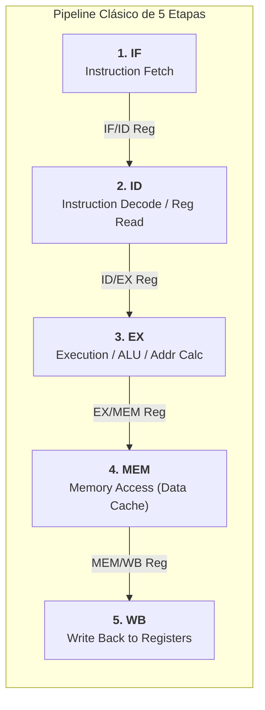
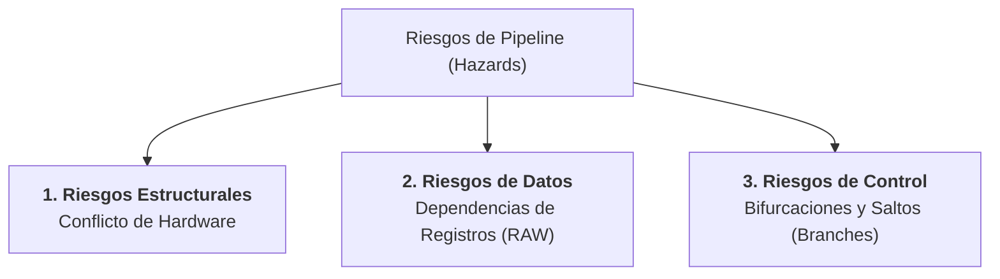
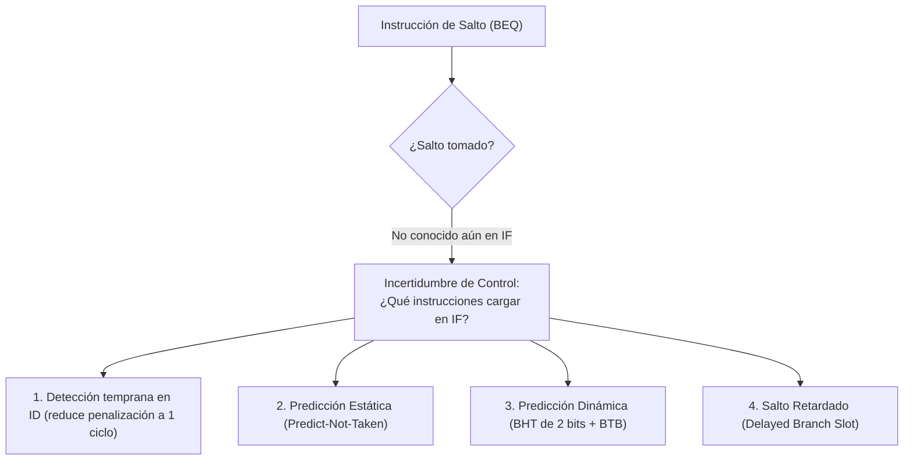

# Pipeline de Instrucciones y Riesgos (Hazards)

En las arquitecturas monobiciclo (*single-cycle*) no segmentadas, una instrucción debe completar todas sus fases operativas antes de que la siguiente pueda comenzar a ejecutarse. Dado que la frecuencia del procesador queda limitada por el camino crítico de la instrucción más lenta (típicamente `load word`, que involucra acceso a memorias y ALU), el rendimiento global resulta deficiente.

El **pipelining** (o segmentación de instrucciones) es una técnica de diseño arquitectónico que explota el **paralelismo a nivel de instrucción (ILP)** superponiendo temporalmente la ejecución de múltiples instrucciones simultáneas, de forma enteramente análoga a una cadena de ensamblaje industrial automotriz.

> [!info] 💡 ¿Cómo entender esto desde cero? (Guía para novatos de pregrado)
> - **Analogía de la lavandería:**
>   - Tienes 4 cargas de ropa sucia. Cada carga requiere 4 pasos: Lavar (30 min), Secar (30 min), Doblar (30 min) y Guardar (30 min).
>   - **Sin Pipeline:** Lavas la carga 1, esperas, la secas, la doblas, la guardas (2 horas). Luego empiezas la carga 2. En total: ¡8 horas para 4 cargas!
>   - **Con Pipeline:** Mientras la carga 1 se está secando, ¡ya metes la carga 2 a la lavadora! Las máquinas nunca están ociosas. En 2.5 horas terminas las 4 cargas.
> - **¿Qué es un Hazard (Riesgo)?** Un obstáculo que frena la línea de ensamblaje:
>   - **Estructural:** Dos personas quieren usar la misma secadora a la vez.
>   - **De Datos:** Necesitas doblar una camisa que todavía no termina de lavarse (una instrucción necesita el resultado de la anterior).
>   - **De Control:** El usuario dice "si llueve, no laves pantalones". Tienes que esperar a ver si llueve antes de meter la siguiente ropa (un salto condicional `if/else`).

---

---

## 1. El Pipeline Clásico MIPS / RISC de 5 Etapas

El pipeline canónico propuesto por Patterson y Hennessy para la arquitectura RISC/MIPS descompone el ciclo de vida de cualquier instrucción en **cinco etapas independientes**, desacopladas por registros intermedios de segmentación (*pipeline registers*):



### 1.1 Detalle Funcional de cada Etapa

1. **IF (*Instruction Fetch* - Búsqueda de Instrucción):**
   - La CPU lee la instrucción de 32 bits desde la memoria caché de instrucciones (**I-Cache**, ver [[Jerarquia de Memoria y Memoria Cache]]) apuntada por el *Program Counter* ($PC$).
   - Se actualiza el contador de programa secuencialmente:
     $$PC \leftarrow PC + 4$$
   - La instrucción leída y el nuevo $PC+4$ se depositan en el registro de segmentación **IF/ID**.

2. **ID (*Instruction Decode / Register File Read* - Decodificación y Lectura de Registros):**
   - La unidad de control decodifica el código de operación (*opcode*) y campo de función (*funct*).
   - Se leen en paralelo los dos registros fuente del banco de registros:
     $$\text{Dato 1} \leftarrow \text{Reg}[Rs], \quad \text{Dato 2} \leftarrow \text{Reg}[Rt]$$
   - Se realiza la extensión de signo del campo inmediato de 16 bits a 32 bits.
   - Toda la información y señales de control se guardan en el registro **ID/EX**.

3. **EX (*Execution / Address Calculation* - Ejecución o Cálculo de Dirección):**
   - La Unidad Aritmético-Lógica (**ALU**) opera sobre los operandos leídos de registros o sobre el valor inmediato extendido.
   - Según el tipo de instrucción:
     - **Tipo-R:** Realiza la operación aritmética o lógica (`ADD`, `SUB`, `AND`, `OR`).
     - **Load / Store:** Calcula la dirección de memoria efectiva:
       $$\text{Addr}_{\text{efectiva}} = \text{Reg}[Rs] + \text{SignExtend}(\text{inmediato})$$
     - **Branch (`BEQ`/`BNE`):** Calcula la dirección de destino del salto condicional y evalúa la condición de igualdad.
   - Salidas guardadas en el registro **EX/MEM**.

4. **MEM (*Memory Access* - Acceso a Memoria de Datos):**
   - Si la instrucción es un `LW` (*Load Word*), se realiza una lectura en la caché de datos (**D-Cache**) en la dirección computada por la ALU.
   - Si es un `SW` (*Store Word*), se escribe el contenido de $\text{Reg}[Rt]$ en la dirección de la D-Cache.
   - Las instrucciones aritméticas no interactúan con la memoria; sus datos simplemente transitan a través de esta etapa.
   - Salidas guardadas en el registro **MEM/WB**.

5. **WB (*Write Back* - Escritura en el Banco de Registros):**
   - Se escribe el resultado final (proveniente de la ALU o de la memoria de datos) en el registro destino del banco de registros ($\text{Reg}[Rd]$ en Tipo-R o $\text{Reg}[Rt]$ en `LW`).

---

## 2. Ganancia Teórica de Rendimiento (*Speedup*)

Sea:
- $k$: Número de etapas del pipeline (para MIPS, $k = 5$).
- $n$: Número de instrucciones a ejecutar.
- $\tau$: Tiempo de ciclo de reloj del procesador.

En un procesador **no segmentado** (monociclo):
$$\text{Tiempo No-Segmentado} = n \cdot k \cdot \tau$$

En un procesador **segmentado** ideal (sin paradas ni riesgos):
- La primera instrucción requiere $k$ ciclos para salir.
- A partir de ese momento, **se completa una instrucción por cada ciclo de reloj** ($CPI_{\text{ideal}} = 1$):
$$\text{Tiempo Segmentado} = (k + n - 1) \cdot \tau'$$

$$\text{Speedup} = \frac{\text{Tiempo No-Segmentado}}{\text{Tiempo Segmentado}} = \frac{n \cdot k \cdot \tau}{(k + n - 1) \cdot \tau'}$$

Para programas grandes donde el número de instrucciones domina ($n \gg k$):

$$\lim_{n \to \infty} \text{Speedup} = k \cdot \frac{\tau}{\tau'}$$

Si las etapas estuvieran perfectamente balanceadas y sin sobrecarga de registros ($\tau' = \tau$), el speedup teórico sería exactamente igual a **$k$** (un procesador de 5 etapas sería 5 veces más rápido).

> [!warning] Límites Físicos del Pipelining Real
> 1. **Desequilibrio de Etapas:** El tiempo de ciclo $\tau'$ queda dictado por la etapa que tarde más tiempo:
>    $$\tau' = \max(\tau_{\text{IF}}, \tau_{\text{ID}}, \tau_{\text{EX}}, \tau_{\text{MEM}}, \tau_{\text{WB}}) + t_{\text{latch}}$$
> 2. **Sobrecarga de Registros de Segmentación ($t_{\text{latch}}$):** El tiempo de *setup* y propagación de los registros flip-flop impone un límite asintótico; aumentar $k$ infinitamente degrada el rendimiento.
> 3. **Riesgos de Pipeline (*Hazards*):** Provocan paradas (*stalls* / burbujas), aumentando el $CPI$ real por encima de 1.

---

## 3. Los 3 Riesgos de Pipeline (*Hazards*) y sus Soluciones

Un **riesgo (*hazard*)** es cualquier situación en la que la siguiente instrucción no puede ejecutarse en el ciclo de reloj designado.



---

### 3.1 Riesgos Estructurales (*Structural Hazards*)
Ocurren cuando dos o más instrucciones que se encuentran en diferentes etapas del pipeline intentan acceder al **mismo recurso físico de hardware simultáneamente**.

#### Conflicto Clásico 1: Memoria Unificada de Instrucciones y Datos
- **Problema:** En el ciclo CC4, una instrucción `LW` en etapa **MEM** lee datos de la memoria, mientras que una instrucción nueva en etapa **IF** intenta leer la siguiente instrucción de la misma memoria.
- **Solución Arquitectónica:** Separación estricta de la memoria a nivel L1 en dos bloques físicos: **I-Cache** y **D-Cache** (Arquitectura Harvard a nivel de caché, vista en [[Jerarquia de Memoria y Memoria Cache#2. La Pirámide de la Jerarquía de Memoria]]).

#### Conflicto Clásico 2: Banco de Registros (Escritura y Lectura Simultánea)
- **Problema:** La instrucción en etapa **WB** escribe en el banco de registros al mismo tiempo que la instrucción en etapa **ID** lee del banco de registros.
- **Solución Hardware:** Dividir el ciclo de reloj en dos fases:
  - En la primera mitad del ciclo ($\phi_1$, flanco de subida): Se ejecuta la **escritura** de la etapa WB.
  - En la segunda mitad del ciclo ($\phi_2$, flanco de bajada): Se ejecuta la **lectura** de la etapa ID.
  - De esta forma, si la etapa ID lee el mismo registro que WB está escribiendo, lee inmediatamente el nuevo valor actualizado sin demoras.

---

### 3.2 Riesgos de Datos (*Data Hazards*)
Surgen cuando una instrucción depende del resultado de una instrucción anterior que aún se encuentra dentro del pipeline y no ha completado su fase de escritura.

#### Clasificación Teórica de Dependencias:
1. **RAW (*Read After Write* / Verdadera Dependencia):** La instrucción $J$ intenta leer una fuente antes de que la instrucción $I$ la escriba. (Es el único riesgo que ocurre en pipelines estrictamente en orden como el MIPS de 5 etapas).
2. **WAR (*Write After Read* / Antidependencia):** $J$ intenta escribir en un destino antes de que $I$ lo lea. (Ocurre solo en arquitecturas superescalares con ejecución fuera de orden).
3. **WAW (*Write After Write* / Dependencia de Salida):** $J$ intenta escribir en un registro antes de que $I$ escriba en él. (Ocurre en ejecuciones fuera de orden).

#### Solución 1: Reenvío de Datos (*Data Forwarding / Bypassing*)
El valor computado por la ALU en la etapa EX o recuperado de la memoria en MEM ya existe físicamente en los registros de segmentación (**EX/MEM** o **MEM/WB**); no es necesario esperar a que la etapa WB escriba el dato en el banco de registros para utilizarlo.

```mermaid
flowchart LR
    subgraph ForwardingPath [Caminos de Reenvío (Forwarding)]
        ALU_Out["EX/MEM Register (Salida ALU)"]
        MEM_Out["MEM/WB Register (Salida Memoria/ALU)"]
        MuxA["Multiplexor Operando A (Entrada ALU)"]
        MuxB["Multiplexor Operando B (Entrada ALU)"]
    end

    ALU_Out ==>|Forwarding Inmediato| MuxA
    ALU_Out ==>|Forwarding Inmediato| MuxB
    MEM_Out -->|Forwarding 1 ciclo después| MuxA
    MEM_Out -->|Forwarding 1 ciclo después| MuxB
```

- **Unidad de Reenvío (*Forwarding Unit*):** Monitorea si el registro destino de `EX/MEM` o `MEM/WB` coincide con los registros fuente `Rs` o `Rt` de la instrucción en etapa `ID/EX`, y conmuta los multiplexores de entrada de la ALU en tiempo real.

#### Solución 2: Parada de Pipeline (*Stall*) ante Riesgo Carga-Uso (*Load-Use Data Hazard*)
El reenvío de datos **no puede viajar hacia atrás en el tiempo**. Si una instrucción `LW` es seguida inmediatamente por una instrucción que consume ese dato, el dato de memoria no está disponible sino hasta el final de la etapa MEM (ciclo 4), mientras que la siguiente instrucción lo necesita al inicio de su etapa EX (ciclo 3).

```
Ciclo:             CC1    CC2    CC3    CC4    CC5    CC6
LW   $s0, 0($sp):   IF     ID     EX    MEM     WB
ADD  $t0, $s0, $s1:        IF     ID  [STALL]   EX    MEM   WB
```

- **Unidad de Detección de Riesgos (*Hazard Detection Unit*):**
  Si detecta:
  $$\text{ID/EX.MemRead} == 1 \quad \mathbf{y} \quad (\text{ID/EX.RegisterRt} == \text{IF/ID.RegisterRs} \lor \text{ID/EX.RegisterRt} == \text{IF/ID.RegisterRt})$$
  Fuerza una **parada de pipeline (burbuja)**:
  1. Mantiene el $PC$ sin cambios ($PC \leftarrow PC$).
  2. Mantiene el registro `IF/ID` sin modificar.
  3. Inserta una instrucción nula (`NOP` o burbuja de ceros) en el registro `ID/EX`.
  4. Tras la burbuja de 1 ciclo, el dato de MEM se reenvía a EX mediante *forwarding* convencional.

#### Solución 3: Optimización y Reordenamiento por el Compilador
Como se estudia en [[Fases del Compilador y Analisis Lexico|Compiladores e Infraestructuras de Optimización]], el optimizador del backend puede reordenar instrucciones independientes para separar la instrucción `LW` de su consumidora, rellenando la ranura crítica y eliminando la burbuja sin alterar la semántica.

---

### 3.3 Riesgos de Control (*Control / Branch Hazards*)
Surgen ante la ejecución de instrucciones de salto condicional (`BEQ`, `BNE`) o incondicional (`J`). El pipeline busca la siguiente instrucción ($PC+4$) en la etapa IF antes de saber si el salto se tomará o no en la etapa EX o MEM.



#### Soluciones a Riesgos de Control:
1. **Evaluación Temprana del Salto en ID:** Mover los comparadores lógicos de igualdad y el sumador de dirección de branch de la etapa EX a la etapa ID. Si el salto se toma, solo se pierde **1 ciclo** (se purga solo 1 instrucción del registro IF/ID mediante una señal de *flush*).
2. **Predicción Estática:** La CPU asume por defecto una regla invariable. Por ejemplo, *Predict-Not-Taken* (asumir que el branch nunca salta y continuar con $PC+4$). Si el branch efectivamente salta, se descarta la instrucción errónea cargada.
3. **Predicción Dinámica de Saltos:**
   - **BHT (*Branch History Table*):** Memoria indexada por los bits inferiores del $PC$ que contiene autómatas de estados finitos saturantes de 2 bits:
     - `11`: Fuertemente Tomado (*Strongly Taken*)
     - `10`: Débilmente Tomado (*Weakly Taken*)
     - `01`: Débilmente No Tomado (*Weakly Not Taken*)
     - `00`: Fuertemente No Tomado (*Strongly Not Taken*)
   - Requiere dos errores consecutivos para cambiar la predicción, evitando fallos oscilatorios en bucles anidados.
   - **BTB (*Branch Target Buffer*):** Caché que recuerda la dirección calculada de salto anticipadamente para saltar sin perder ni 1 solo ciclo en caso de acierto de predicción.
4. **Salto Retardado (*Delayed Branch*):** Utilizado en MIPS clásico. La instrucción ubicada en la ranura posterior al branch (*branch delay slot*) **se ejecuta siempre**, tanto si el salto se toma como si no. El compilador ubica una instrucción útil en este slot.

---

## 4. Cronograma Espacio-Tiempo de Ciclos de Reloj

El siguiente diagrama ilustra la ejecución de una secuencia que involucra un cálculo de datos con reenvío (*Forwarding*) y una parada por *Load-Use*:

```mermaid
gantt
    title Cronograma de Segmentación de Instrucciones con Reenvío y Burbuja
    dateFormat X
    axisFormat CC%s

    section I1: ADD $s0, $t1, $t2
    IF          :0, 1
    ID          :1, 2
    EX          :2, 3
    MEM         :3, 4
    WB          :4, 5

    section I2: SUB $t3, $s0, $t4 (Forwarding EX->EX)
    IF          :1, 2
    ID          :2, 3
    EX          :3, 4
    MEM         :4, 5
    WB          :5, 6

    section I3: LW $t5, 0($sp)
    IF          :2, 3
    ID          :3, 4
    EX          :4, 5
    MEM         :5, 6
    WB          :6, 7

    section Burbuja NOP (Hazard Load-Use)
    Stall       :4, 5

    section I4: AND $t6, $t5, $a0 (Forwarding MEM->EX tras Stall)
    IF          :3, 4
    ID (Pausado):4, 5
    EX          :5, 6
    MEM         :6, 7
    WB          :7, 8
```



---

## Notas Relacionadas y Enlaces de Vault
- [[Funcionamiento del Sistema de Memoria]] — Principios de jerarquía de memorias internas y buses de transferencia.
- [[Principios de funcionamiento]] — Estructura de buses, retardos y funciones de correspondencia.
- [[Jerarquia de Memoria y Memoria Cache]] — Implementación de cachés Harvard L1 (I-Cache y D-Cache) para resolver riesgos estructurales.
- [[Fases del Compilador y Analisis Lexico]] — Optimización y reordenamiento de instrucciones en la fase de generación de código máquina.
