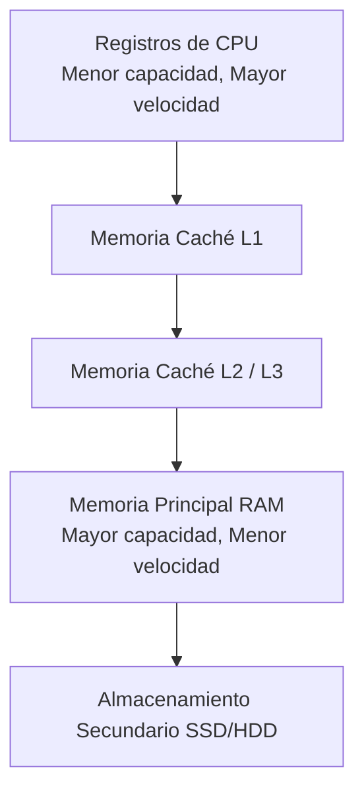
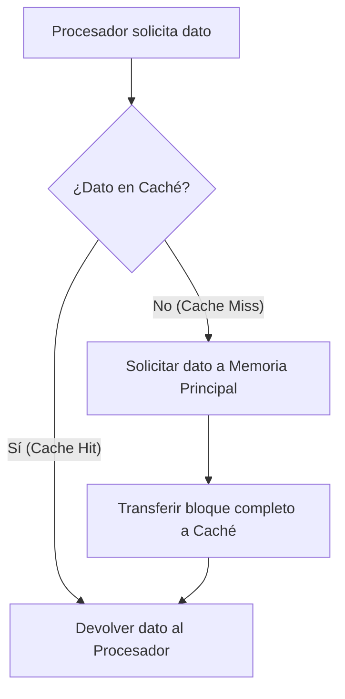

[[Funcionamiento del Sistema de Memoria]]
* El objetivo de la memoria caché es lograr que la velocidad de acceso a la memoria sea lo más rápida posible, consiguiendo al mismo tiempo una gran capacidad de almacenamiento al precio de memorias semiconductoras, que son menos costosas.
* La caché contiene una copia de partes de la memoria principal. Cuando el procesador intenta leer una palabra de memoria, se hace una comprobación para determinar si la palabra está en la caché. Si se encuentra allí, se entrega dicha palabra al procesador. Si no, un bloque de memoria principal se transfiere a la caché y, posteriormente, la palabra es entregada al procesador.

> [!info] Explicación
> La memoria caché funciona como un intermediario ultra rápido entre el procesador y la memoria RAM. Al aprovechar el principio de localidad (si un dato se usa, probablemente se volverá a usar pronto, o se usarán sus datos vecinos), la caché almacena copias de las partes de la RAM que el procesador está usando activamente. Esto evita que el procesador tenga que esperar los tiempos de acceso más lentos de la memoria principal.

![[Pasted image 20230730184934.png]]

## Memoria principal
* Contiene 2𝑛 palabras direccionables.
* Cada palabra tiene una única dirección física de n bits.
* Los datos se dividen en bloques de longitud fija, donde cada bloque contiene K palabras.
* El número total de bloques (M) se calcula de la siguiente manera:
$$ M= \frac {2^{n}}{K}    \mathsf bloques $$ ![[Pasted image 20230730190942.png]]

> [!info] Explicación
> La memoria principal (RAM) se conceptualiza como un arreglo inmenso de palabras, pero para fines de transferencia hacia la caché, se agrupa en "bloques". Esto significa que cuando la CPU pide una palabra, no se transfiere solo esa palabra, sino todo el bloque que la contiene.

## Memoria Caché
* Consta de "C" líneas (o ranuras).
* Cada línea contiene un bloque de K palabras, además de una etiqueta de unos cuantos bits.
* El tamaño de línea se refiere al número de palabras que hay en cada línea, lo cual equivale al tamaño del bloque.
* Se cumple que C << M (el número de líneas en la caché es muchísimo menor que el número de bloques en la memoria principal).
* En todo momento, solo un pequeño subconjunto de los bloques de memoria reside temporalmente en las líneas de la caché.
* Si se lee una palabra de un bloque y ocurre un fallo de caché, dicho bloque entero es transferido a una de las líneas de la caché.
* La etiqueta sirve para identificar qué bloque de memoria principal se encuentra almacenado en esa línea específica.
![[Pasted image 20230730191120.png]]

> [!info] Explicación
> Dado que la caché es mucho más pequeña que la RAM, no todos los bloques de la RAM pueden estar en la caché al mismo tiempo. Las "etiquetas" (tags) son cruciales porque actúan como identificadores; gracias a ellas, el controlador de caché sabe exactamente qué pedazo de la RAM está copiado en una línea particular en un momento dado.

### Organización de la caché
* La caché se conecta directamente con el procesador mediante líneas de datos, líneas de direcciones y líneas de control. 
* Las líneas de direcciones y de datos se conectan a los buffers de datos y de direcciones, los cuales comunican al procesador y la caché con el bus del sistema (y, por ende, con la memoria principal). 
* Si existe un acierto de caché (cache hit), los buffers de datos y de direcciones se inhabilitan, evitando que la solicitud salga al bus del sistema. En caso contrario (cache miss), la dirección se carga en el bus del sistema y el dato solicitado es llevado desde la memoria principal, a través del buffer de datos, tanto a la caché como al procesador.

![[Pasted image 20230730191355.png]]

> [!info] Explicación
> Esta organización permite que, en caso de acierto, la CPU trabaje a la máxima velocidad sin saturar el bus principal. Solo cuando el dato no está (fallo), se activa la comunicación con el exterior (memoria principal), cargando el dato en la caché para futuros accesos y pasándolo a la CPU simultáneamente.

## Elementos de diseño
### Tamaño de caché 
* Se busca que el tamaño sea lo suficientemente pequeño como para que el coste total medio por bit se aproxime al de la memoria principal, pero lo suficientemente grande como para que el tiempo de acceso medio total sea próximo al de la caché sola.
* Cuanto más grande es la caché, mayor es el número de puertas lógicas implicadas en direccionar sus líneas, por lo que tienden a ser ligeramente más lentas. 
* El tamaño físico de la caché está también limitado por el espacio disponible en el chip del procesador o en la tarjeta madre.

> [!info] Explicación
> Diseñar una caché es buscar un equilibrio (trade-off) ideal. Una caché gigante sería más lenta de consultar debido a la complejidad de sus circuitos y costaría muchísimo dinero. Una caché muy pequeña tendría demasiados "fallos", obligando a la CPU a esperar a la RAM continuamente.

### Función de correspondencia
* La función de correspondencia determina cómo se organiza lógicamente la caché y cómo se mapean los datos. 
* Para su diseño se necesita: 
	1. Un algoritmo que defina cómo asignar los bloques de la memoria principal a las líneas de la caché. 
	2. Un medio (etiquetas) para determinar qué bloque de memoria principal ocupa actualmente una línea dada. 
* Existen 3 técnicas diferentes de correspondencia: directa, asociativa, y asociativa por conjuntos.
![[Pasted image 20230730192432.png]]

> [!info] Explicación
> Como muchos bloques de RAM deben compartir pocas líneas de caché, necesitamos reglas claras sobre en qué línea puede guardarse cada bloque. Estas "reglas de mapeo" son las funciones de correspondencia.

## Función de Correspondencia Directa
* Es la técnica más sencilla y la menos costosa de implementar. Su principal desventaja es que existe una posición estricta y única en la caché para cada bloque de memoria. 
* Si un programa referencia repetidas veces a palabras de dos bloques diferentes que, por diseño, están asignados a la misma línea de caché, dichos bloques se estarán intercambiando continuamente. Esto provoca que la tasa de aciertos sea muy baja, un fenómeno conocido como vapuleo (thrashing). 
* Desde el punto de vista del acceso a caché, cada dirección de memoria principal se divide en tres campos fundamentales: etiqueta, línea y palabra. 
![[Pasted image 20230730193153.png]]
* Cuando un bloque es escrito en la línea que tiene asignada, es necesario etiquetarlo para distinguirlo del resto de los bloques que podrían introducirse en dicha línea. Para ello se emplean los bits de etiqueta (s-r bits).
* Además, el valor "m" representa el número total de líneas disponibles en la caché.
![[Pasted image 20230730193411.png]]
![[Pasted image 20230730193431.png]]

> [!info] Explicación
> En la correspondencia directa, un bloque de RAM solo puede ir a una línea específica (por ejemplo, el bloque 12 solo puede ir a la línea 2). Esto hace que buscar el dato sea rapidísimo (solo miras en esa línea), pero causa conflictos si necesitas usar al mismo tiempo los bloques 12 y 22, y ambos "compiten" por la misma línea 2.

### Ejercicio

## Notas relacionadas
- [[Funcionamiento del Sistema de Memoria]]
- [[Ejercicio Correspondencia directa.excalidraw]]
- [[Ejercicio Correspondencia directa.excalidraw]]

## Correspondencia Asociativa
* Permite que cada bloque de memoria principal pueda cargarse en cualquier línea disponible de la caché. En este caso, la lógica de control de la caché interpreta una dirección de memoria simplemente dividiéndola en una etiqueta (que identifica unívocamente al bloque completo de memoria principal) y un campo de palabra.
* Para determinar si un bloque específico está en la caché, la lógica de control debe examinar simultáneamente todas las etiquetas de las líneas para buscar una coincidencia.
![[Pasted image 20230815145932.png]]

> [!info] Explicación
> A diferencia de la correspondencia directa, aquí cualquier bloque puede ir a cualquier línea vacía o reemplazable. Esto elimina el problema del "vapuleo" (thrashing) por colisiones, pero a cambio, el hardware debe comparar la etiqueta buscada con *todas* las etiquetas de la caché al mismo tiempo, lo que requiere circuitos comparadores complejos y costosos.

### **Funcionamiento** 
![[Pasted image 20230815150330.png]]

### Ejercicio
