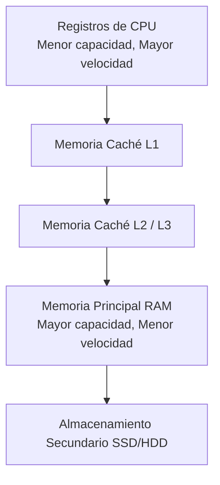
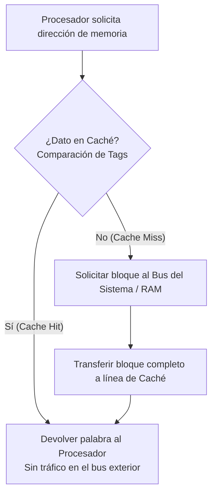
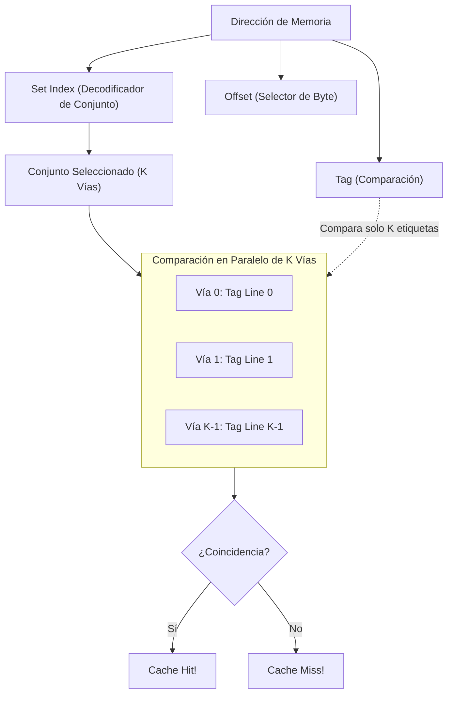

# Principios de Funcionamiento y Organización de la Memoria Caché

* El objetivo de la **memoria caché** es lograr que la velocidad efectiva de acceso a la memoria se aproxime a la del procesador, consiguiendo al mismo tiempo una gran capacidad de almacenamiento al precio por bit de las memorias semiconductoras DRAM, que son mucho menos costosas.
* La caché contiene una copia de partes activas de la memoria principal. Cuando el procesador intenta leer una palabra de memoria, se hace una comprobación en hardware para determinar si la palabra solicitada está en la caché (*Cache Hit*). Si se encuentra allí, se entrega dicha palabra al procesador de forma casi instantánea. Si no está (*Cache Miss*), un bloque entero de memoria principal se transfiere a una de las líneas de la caché y, posteriormente, la palabra es entregada al procesador.

> [!info] Explicación
> La memoria caché funciona como un intermediario ultra rápido entre el procesador y la memoria RAM. Al aprovechar el **principio de localidad de referencia** (si un dato se usa, probablemente se volverá a usar pronto, o se usarán sus datos vecinos), la caché almacena copias de las partes de la RAM que el procesador está usando activamente. Esto evita que el procesador tenga que esperar los tiempos de acceso mucho más lentos de la memoria principal.


```mermaid
graph TD
    A[Registros de CPU\nMenor capacidad, Mayor velocidad] --> B[Memoria Caché L1]
    B --> C[Memoria Caché L2 / L3]
    C --> D[Memoria Principal RAM\nMayor capacidad, Menor velocidad]
    D --> E[Almacenamiento Secundario SSD/HDD]
```

![[Pasted image 20230730184934.png]]

---

## 1. Memoria Principal y Memoria Caché

### 1.1 Memoria Principal (DRAM)
* Contiene $2^n$ palabras direccionables.
* Cada palabra tiene una única dirección física de $n$ bits.
* Los datos se dividen en bloques de longitud fija, donde cada bloque contiene $K$ palabras.
* El número total de bloques ($M$) en la memoria principal se calcula de la siguiente manera:

$$ M = \frac{2^n}{K} \quad \text{bloques} $$

![[Pasted image 20230730190942.png]]

> [!info] Explicación
> La memoria principal (RAM) se conceptualiza como un arreglo inmenso de palabras, pero para fines de transferencia hacia la caché, se agrupa en **bloques**. Esto significa que cuando la CPU pide una palabra, no se transfiere solo esa palabra, sino todo el bloque que la contiene (aprovechando la localidad espacial).

### 1.2 Memoria Caché (SRAM)
* Consta de $C$ líneas (o ranuras).
* Cada línea contiene un bloque de $K$ palabras, además de una **etiqueta (*Tag*)** de unos cuantos bits y bits de control (Validez, Modificado).
* El tamaño de línea se refiere al número de palabras o bytes que hay en cada línea, lo cual equivale exactamente al tamaño del bloque.
* Se cumple que $C \ll M$ (el número de líneas en la caché es muchísimo menor que el número de bloques en la memoria principal).
* En todo momento, solo un pequeño subconjunto de los bloques de memoria reside temporalmente en las líneas de la caché.
* Si se lee una palabra de un bloque y ocurre un fallo de caché, dicho bloque entero es transferido a una de las líneas de la caché.
* La etiqueta sirve para identificar unívocamente qué bloque de memoria principal se encuentra almacenado en esa línea específica.

![[Pasted image 20230730191120.png]]

> [!info] Explicación
> Dado que la caché es mucho más pequeña que la RAM, no todos los bloques de la RAM pueden estar en la caché al mismo tiempo. Las **etiquetas** (*tags*) son cruciales porque actúan como identificadores de silicio; gracias a ellas, el controlador de caché sabe exactamente qué pedazo de la RAM está copiado en una línea particular en un momento dado.

---

## 2. Organización y Flujo de Control de la Caché

* La caché se conecta directamente con el procesador mediante líneas de datos, líneas de direcciones y líneas de control. 
* Las líneas de direcciones y de datos se conectan a los búferes de datos y de direcciones, los cuales comunican al procesador y la caché con el bus del sistema (y, por ende, con la memoria principal). 
* Si existe un acierto de caché (*cache hit*), los búferes de datos y de direcciones hacia el bus exterior se inhabilitan, evitando que la solicitud salga al bus del sistema. En caso contrario (*cache miss*), la dirección se carga en el bus del sistema y el dato solicitado es llevado desde la memoria principal, a través del búfer de datos, tanto a la caché como al procesador.


```mermaid
flowchart TD
    CPU[Procesador solicita dirección de memoria] --> C{¿Dato en Caché?<br>Comparación de Tags}
    C -- Sí (Cache Hit) --> H[Devolver palabra al Procesador<br>Sin tráfico en el bus exterior]
    C -- No (Cache Miss) --> M[Solicitar bloque al Bus del Sistema / RAM]
    M --> N[Transferir bloque completo a línea de Caché]
    N --> H
```

![[Pasted image 20230730191355.png]]

> [!info] Explicación
> Esta organización permite que, en caso de acierto, la CPU trabaje a la máxima velocidad sin saturar el bus principal. Solo cuando el dato no está (fallo), se activa la comunicación con el exterior (memoria principal), cargando el dato en la caché para futuros accesos y pasándolo a la CPU simultáneamente.

---

## 3. Elementos de Diseño de la Memoria Caché

### Tamaño de Caché 
* Se busca que el tamaño sea lo suficientemente pequeño como para que el coste total medio por bit se aproxime al de la memoria principal, pero lo suficientemente grande como para que el tiempo de acceso medio total sea próximo al de la caché sola.
* Cuanto más grande es la caché, mayor es el número de puertas lógicas implicadas en direccionar y comparar sus líneas, por lo que tienden a tener un tiempo de acceso ligeramente mayor. 
* El tamaño físico de la caché está también limitado por el área disponible en el chip (*die*) del procesador.

### Función de Correspondencia (Mapping Function)
* La función de correspondencia determina cómo se organiza lógicamente la caché y cómo se mapean los bloques de RAM a las líneas de caché. 
* Para su diseño se necesita: 
	1. Un algoritmo que defina cómo asignar los bloques de la memoria principal a las líneas de la caché. 
	2. Un medio (etiquetas y comparadores) para determinar qué bloque de memoria principal ocupa actualmente una línea dada. 
* Existen 3 técnicas de correspondencia: **Directa**, **Asociativa**, y **Asociativa por Conjuntos**.

![[Pasted image 20230730192432.png]]

---

## 4. Función de Correspondencia Directa (Direct Mapping)

* Es la técnica más sencilla y la menos costosa de implementar en hardware.
* **Regla de asignación:** Cada bloque de la memoria principal se mapea a una **única línea específica y fija** de la caché mediante la función módulo:
  $$i = j \pmod m$$
  donde $i$ es el número de línea de caché ($0 \le i < m$), $j$ es el número de bloque de memoria principal ($0 \le j < M$), y $m$ es el número total de líneas de la caché ($m = 2^r$).
* **Desventaja principal:** Si un programa referencia repetidas veces a palabras de dos bloques diferentes que mapean a la misma línea de caché (por ejemplo, el bloque 0 y el bloque $m$), dichos bloques se estarán expulsando e intercambiando continuamente. Esto provoca que la tasa de aciertos caiga drásticamente, un fenómeno conocido como **vapuleo (*thrashing*)**.

### Estructura de la Dirección en Correspondencia Directa:
Cada dirección de memoria de $n$ bits se divide rígidamente en 3 campos:
- **Etiqueta (*Tag*):** $s - r$ bits. Identifica cuál de los posibles bloques que mapean a esta línea está actualmente presente.
- **Línea (*Line / Index*):** $r$ bits. Identifica a cuál de las $m = 2^r$ líneas de la caché pertenece el bloque.
- **Palabra / Desplazamiento (*Word / Offset*):** $w$ bits. Identifica el byte o palabra específica dentro del bloque ($K = 2^w$ palabras por bloque).

```
+------------------------+-------------------+--------------------+
|  Etiqueta (Tag: s - r) |  Línea (Index: r) |  Palabra (Word: w) |
+------------------------+-------------------+--------------------+
```

![[Pasted image 20230730193153.png]]
![[Pasted image 20230730193411.png]]
![[Pasted image 20230730193431.png]]

### Ejercicio Práctico Resuelto (Mapeo Directo)
Considere un sistema con:
- Memoria principal de $16\text{ MB} = 2^{24}\text{ bytes}$ (direcciones de $n = 24\text{ bits}$).
- Capacidad de la memoria caché de $64\text{ KB} = 2^{16}\text{ bytes}$.
- Tamaño de bloque / línea de $4\text{ bytes} = 2^2\text{ bytes}$ ($K = 4$).

**Cálculo de los campos de la dirección:**
1. **Bits de Palabra ($w$):** $\log_2(4) = 2\text{ bits}$.
2. **Número total de líneas ($m$):** $\frac{\text{Tamaño Caché}}{\text{Tamaño Bloque}} = \frac{64\text{ KB}}{4\text{ B}} = \frac{2^{16}}{2^2} = 2^{14} = 16.384\text{ líneas}$.
3. **Bits de Línea ($r$):** $\log_2(2^{14}) = 14\text{ bits}$.
4. **Bits de Etiqueta (*Tag*):** $n - (r + w) = 24 - (14 + 2) = 24 - 16 = 8\text{ bits}$.

*Estructura de la dirección:* `[Tag: 8 bits] | [Línea: 14 bits] | [Palabra: 2 bits]`.
*(Para el diagrama visual interactivo, consulte [[Ejercicio Correspondencia directa.excalidraw]])*.

---

## 5. Correspondencia Asociativa (Fully Associative Mapping)

* Permite que cada bloque de memoria principal pueda cargarse en **cualquier línea disponible** de la caché.
* En este caso, la lógica de control de la caché interpreta una dirección de memoria dividiéndola únicamente en dos campos:
  - **Etiqueta (*Tag*):** $s$ bits. Identifica de forma global y unívoca al bloque completo de memoria principal.
  - **Palabra (*Word / Offset*):** $w$ bits. Identifica la posición de la palabra dentro del bloque.

```
+---------------------------------------+--------------------+
|            Etiqueta (Tag: s)          |  Palabra (Word: w) |
+---------------------------------------+--------------------+
```

* **Mecanismo de búsqueda:** Para determinar si un bloque específico está en la caché, la lógica de control debe examinar simultáneamente **todas las etiquetas de todas las líneas** mediante comparadores cableados en paralelo.

![[Pasted image 20230815145932.png]]
![[Pasted image 20230815150330.png]]

> [!info] Explicación
> A diferencia de la correspondencia directa, aquí cualquier bloque puede ir a cualquier línea vacía o reemplazable. Esto elimina por completo el problema del vapuleo por conflicto, pero a cambio, el hardware debe comparar la etiqueta buscada con *todas* las etiquetas de la caché al mismo tiempo, lo que requiere circuitería analógica/digital asociativa muy costosa y con alto consumo de energía.

### Ejercicio Práctico Resuelto (Totalmente Asociativa)
Con los mismos parámetros anteriores (Memoria Principal de 16 MB con direcciones de 24 bits, bloque de 4 bytes):
1. **Bits de Palabra ($w$):** $\log_2(4) = 2\text{ bits}$.
2. **Bits de Etiqueta (*Tag*):** $24 - w = 24 - 2 = 22\text{ bits}$.
*Cada línea de la caché requiere un comparador de 22 bits operando en paralelo con los otros 16.383 comparadores.*
*(Para el diagrama visual interactivo, consulte [[funcion asociativa.excalidraw]])*.

---

## 6. Correspondencia Asociativa por Conjuntos (K-Way Set Associative)

La correspondencia asociativa por conjuntos combina lo mejor de ambos mundos: **el bajo costo de comparación del mapeo directo con la flexibilidad anti-colisiones del mapeo asociativo**. Es el estándar indiscutible en los procesadores comerciales modernos (Intel Core, AMD Ryzen, Apple Silicon).

* Las líneas de la caché se agrupan en $S$ **conjuntos (*Sets*)**, donde cada conjunto contiene exactamente $K$ líneas ($K$ vías o *ways*):
  $$C = S \times K$$
* **Regla de asignación:** Un bloque de memoria principal $j$ mapea rígidamente a un conjunto específico $i$ dado por:
  $$i = j \pmod S$$
  Pero **dentro de ese conjunto**, el bloque puede colocarse en **cualquiera de las $K$ líneas libres**.

```
+------------------------+---------------------+--------------------+
|  Etiqueta (Tag: s - d) |  Conjunto (Set: d)  |  Palabra (Word: w) |
+------------------------+---------------------+--------------------+
```


```mermaid
flowchart TD
    Addr["Dirección de Memoria"] --> Tag["Tag (Comparación)"]
    Addr --> Set["Set Index (Decodificador de Conjunto)"]
    Addr --> Offset["Offset (Selector de Byte)"]

    Set --> ConjuntoX["Conjunto Seleccionado (K Vías)"]
    
    subgraph K_Vias ["Comparación en Paralelo de K Vías"]
        direction LR
        V1["Vía 0: Tag Line 0"]
        V2["Vía 1: Tag Line 1"]
        VK["Vía K-1: Tag Line K-1"]
    end

    ConjuntoX --> K_Vias
    Tag -. Compara solo K etiquetas .-> K_Vias
    K_Vias --> Hit_Miss{¿Coincidencia?}
    Hit_Miss -- Sí --> Hit[Cache Hit!]
    Hit_Miss -- No --> Miss[Cache Miss!]
```

* Para un procesador con caché asociativa de 8 vías ($K=8$), el hardware solo necesita 8 comparadores de etiquetas por acceso, independientemente de que la caché tenga miles de líneas en total.

---

## Notas relacionadas
- [[Funcionamiento del Sistema de Memoria]] — Métodos de acceso, DRAM vs SRAM y tecnologías de almacenamiento.
- [[Jerarquia de Memoria y Memoria Cache]] — Análisis formal de AMAT, protocolos de coherencia MESI/MOESI y falso compartir.
- [[Memoria Virtual, Paginacion y Arquitectura de la MMU]] — Traducción de direcciones lógicas a físicas, TLB y Page Faults.
- [[Pipeline de Instrucciones y Riesgos (Hazards)]] — Riesgos de datos, saltos y cómo la latencia de memoria afecta el IPC.
- [[Buses, Interconexion y Comunicacion de Entrada-Salida (DMA e Interrupciones)]] — Canales de comunicación, PCIe y DMA.
- [[Arquitectura de GPU y Aceleradores Hardware en el Computador]] — Jerarquía de cómputo paralelo masivo y modelo SIMT.
- [[Ejercicio Correspondencia directa.excalidraw]] — Pizarra visual de mapeo directo.
- [[funcion asociativa.excalidraw]] — Pizarra visual de mapeo asociativo.
- [[ejercicios memoria cache.excalidraw]] — Pizarra visual de ejercicios resueltos de caché.
