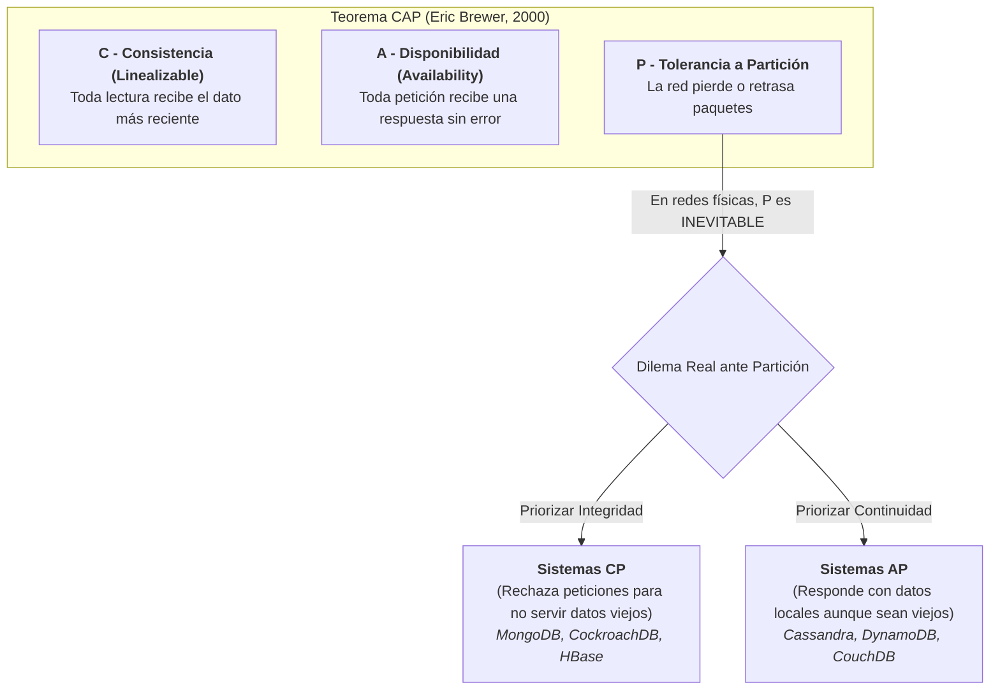
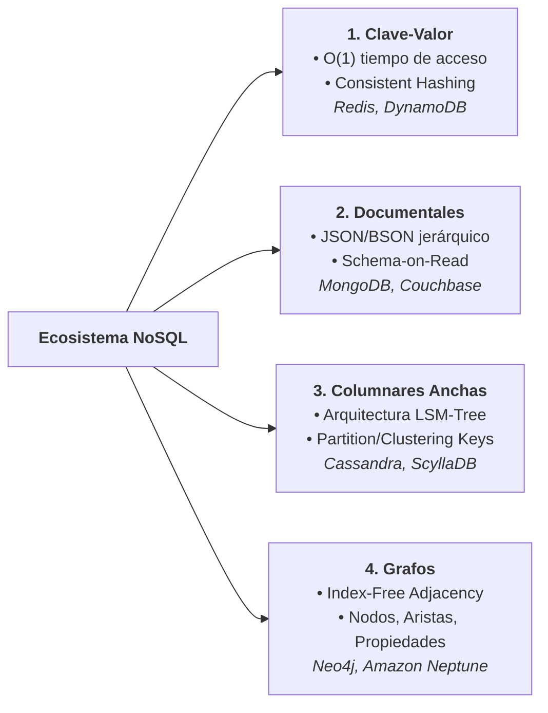
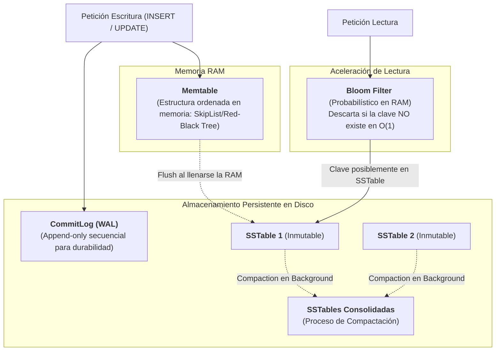
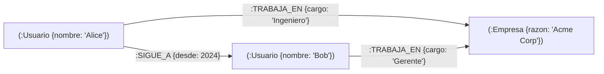
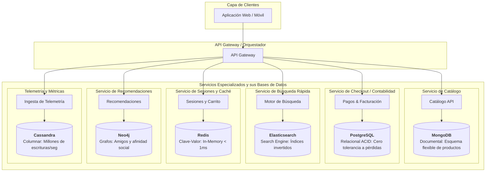

# Bases de Datos NoSQL y el Paradigma de Persistencia Políglota

Durante casi cuatro décadas, los Sistemas de Gestión de Bases de Datos Relacionales (RDBMS) sustentados en el modelo de Edgar F. Codd y el estándar [[SQL]] dominaron de manera absoluta la industria del software. Sin embargo, la explosión de la Web 2.0 y el surgimiento de empresas de escala masiva (como Google, Amazon y Yahoo!) expusieron dos cuellos de botella insalvables para los sistemas relacionales tradicionales:

1. **La Imposibilidad del Escalamiento Horizontal Ilimitado con ACID:** Escalar un RDBMS verticalmente (adquiriendo servidores con más CPUs y RAM) alcanza un límite físico y económico. Distribuir un motor SQL tradicional en cientos de nodos fragmentados (*sharding*) manteniendo transacciones [[Transaccion|ACID]] con bloqueos de dos fases (*Two-Phase Locking - 2PC*) degrada el rendimiento a niveles inaceptables.
2. **La Rigidez de los Esquemas Fijos (*Schema-on-Write*):** El modelo relacional exige que cada tupla se ajuste rigurosamente a una tabla predefinida y normalizada (ver [[Normalización]] y [[Modelo entidad-relación]]), lo cual resulta restrictivo al modelar catálogos heterogéneos, flujos de telemetría IoT o grafos sociales densos.

El movimiento **NoSQL** (*Not Only SQL*), cimentado en los papers fundacionales de **Google Bigtable (2006)** y **Amazon Dynamo (2007)**, rompió esta hegemonía, introduciendo modelos de datos no relacionales diseñados desde su origen para la computación distribuida y la alta disponibilidad.

---

## 1. Fundamentos Teóricos: Teoremas CAP, PACELC y el Modelo BASE



### El Teorema CAP (Eric Brewer, 2000; formalizado por Gilbert y Lynch, 2002)
Establece que cualquier almacén de datos distribuido solo puede garantizar simultáneamente dos de las siguientes tres propiedades:
* **Consistencia ($C$):** En sentido estricto (*Linearizability*), cada lectura debe devolver la escritura más reciente o un error; todos los nodos observan el mismo dato en el mismo instante.
* **Disponibilidad ($A$):** Todo nodo libre de fallo debe devolver una respuesta no errónea ante cualquier petición (sin garantía de que contenga el dato más actualizado).
* **Tolerancia a Particiones ($P$):** El clúster continúa operando a pesar de que la red de comunicaciones sufra cortes o retrasos arbitrarios entre nodos.

> [!important] La Realidad Práctica de CAP
> Dado que en cualquier entorno físico distribuido las particiones de red ($P$) son fenómenos inevitables e impredecibles, **un sistema distribuido no puede "elegir CA"**. La disyuntiva forzosa de diseño ocurre exclusivamente durante una partición: **elegir entre consistencia (CP) o disponibilidad (AP)**.

---

### El Teorema PACELC (Daniel Abadi, 2012)
El Teorema CAP solo describe el comportamiento del sistema cuando ocurre una partición de red. El Teorema **PACELC** refina el análisis formalizando lo que ocurre durante la operación normal:
* **P / A / C:** Si hay Partición (**P**), ¿el sistema elige Disponibilidad (**A**) o Consistencia (**C**)?
* **E / L / C:** Sino (**E**lse, en operación normal y saludable), ¿el sistema elige Latencia reducida (**L**) o Consistencia fuerte (**C**)?

```
     ┌─── En Partición (P) ────► Disponibilidad (A) ó Consistencia (C)
PACELC
     └─── Sino (Else - E)  ────► Latencia baja (L)  ó Consistencia (C)
```

* **Sistemas PA/EL:** Amazon DynamoDB, Apache Cassandra (priorizan disponibilidad y latencia mínima mediante réplicas asíncronas).
* **Sistemas PC/EC:** MongoDB (nodo maestro obligatorio), PostgreSQL/MySQL en replicación síncrona (priorizan consistencia sobre disponibilidad y latencia).

---

### Modelo BASE vs. Transacciones ACID
Frente al modelo clásico [[Transaccion|ACID]] (Atomicidad, Consistencia, Aislamiento, Durabilidad) de los RDBMS, los sistemas distribuidos NoSQL adoptan el modelo **BASE**:
* **B**asically **A**vailable: El sistema garantiza disponibilidad operativa continua, degradando grácilmente ciertas particiones si es necesario.
* **S**oft-state: El estado del sistema puede fluctuar con el tiempo, incluso sin nuevas escrituras, a medida que las réplicas convergen.
* **E**ventual consistency: Si no se introducen nuevas actualizaciones, todos los nodos del clúster eventualmente sincronizarán sus datos y convergerán al mismo valor (ver [[Consistencia y replicacion]]).

---

## 2. Taxonomía Exhaustiva de las 4 Familias NoSQL



---

### 1. Bases de Datos Clave-Valor (*Key-Value Stores*)
* **Representantes Principales:** Redis, Amazon DynamoDB, Memcached, Riak.
* **Modelo Conceptual:** El modelo más elemental y veloz. Los datos se almacenan como pares de clave única y un valor asociado (que puede ser desde un blob opaco de bytes hasta estructuras avanzadas como hashes, listas o conjuntos en Redis).
* **Mecánica de Búsqueda:** Acceso en tiempo constante $\mathcal{O}(1)$ mediante funciones hash distribuidas (*Consistent Hashing*).
* **Casos de Uso Ideales:**
  * Almacenamiento de sesiones web de usuario a escala masiva.
  * Carritos de compra de comercio electrónico.
  * Capa de memoria intermedia de ultra-baja latencia (Caché en RAM).
  * Tablas de control de concurrencia y límites de tasa (*rate limiters*).

---

### 2. Bases de Datos Documentales (*Document-Oriented Databases*)
* **Representantes Principales:** MongoDB, Couchbase, AWS DocumentDB.
* **Modelo Conceptual:** Los datos se estructuran en documentos semiestructurados (predominantemente **BSON** o **JSON**). A diferencia de las filas planas relacionales, los documentos admiten estructuras jerárquicas con objetos anidados y matrices.
* **Características Clave:**
  * **Schema-on-Read:** No existe un DDL rígido que deba ser migrado; la estructura evoluciona orgánicamente en el código de la aplicación.
  * **Desnormalización Natural:** Un pedido puede embeber directamente sus líneas de producto y dirección dentro del mismo documento, eliminando la necesidad de costosas operaciones de reunión de tablas (ver [[Joins en SQL]]).
  * **Índices Secundarios Flexibles:** Soporte nativo para indexar campos internos anidados e índices geoespaciales.
* **Casos de Uso Ideales:**
  * Catálogos de productos con atributos dispares y cambiantes.
  * Sistemas de gestión de contenidos (CMS) y blogs.
  * Historias clínicas y perfiles de usuarios.

---

### 3. Bases de Datos Columnares Anchas (*Wide-Column Stores*)
* **Representantes Principales:** Apache Cassandra, ScyllaDB, Google Cloud Bigtable.
* **Modelo Conceptual:** Inspiradas en Google Bigtable, organizan la información en filas que contienen un número variable y potencialmente gigantesco de columnas dinámicas agrupadas en familias de columnas (*Column Families*).

#### La Arquitectura Física del LSM-Tree (*Log-Structured Merge-tree*)
En lugar de actualizar páginas de disco in-place como los índices B-Tree relacionales (ver [[Optimizacion de Consultas e Indices B-Tree]]), los motores columnares como Cassandra utilizan **LSM-Trees** para absorber millones de escrituras por segundo:



* **Modelo de Llaves en Cassandra:**
  * **Partition Key:** Se pasa por una función de hashing tokenizada (`Murmur3`) para determinar en qué nodo exacto del anillo físico residirá el registro.
  * **Clustering Key:** Determina el orden de almacenamiento físico secuencial de las columnas dentro de esa partición en disco, permitiendo búsquedas de rango ultra-eficientes.
* **Casos de Uso Ideales:**
  * Series temporales masivas (*Time-Series*) y telemetría IoT.
  * Monitoreo y registro de métricas de red y logs de eventos a nivel global.
  * Registro de actividad financiera y pistas de auditoría inmutables.

---

### 4. Bases de Datos de Grafos (*Graph Databases*)
* **Representantes Principales:** Neo4j, Amazon Neptune, OrientDB.
* **Modelo Conceptual:** Implementan el modelo de grafo de propiedades etiquetadas (**Labeled Property Graph**):
  * **Nodos (Vértices):** Entidades del dominio (ej. `Persona`, `Transacción`).
  * **Relaciones (Aristas):** Conexiones dirigidas y tipadas entre nodos (ej. `:AMIGO_DE`, `:TRANSFIRIÓ_A`).
  * **Propiedades:** Pares clave-valor adheridos a nodos y también a las relaciones (ej. `monto: 5000`, `fecha: "2026-09-28"`).



#### Adyacencia Libre de Índices (*Index-Free Adjacency*)
En un RDBMS relacional, consultar amigos de amigos requiere cruzar tablas intermedias mediante costosas operaciones de join ($\mathcal{O}(N \log M)$). En una base de datos de grafos, **cada nodo almacena punteros de memoria directos a sus nodos vecinos adyacentes**.
* Traversar una relación toma **tiempo constante $\mathcal{O}(1)$ por cada salto**, sin importar si la base de datos contiene diez mil o diez mil millones de nodos en total.
* **Lenguajes Declarativos de Grafos (Cypher):**
  ```cypher
  MATCH (a:Usuario {nombre: 'Alice'})-[:AMIGO_DE*2..3]-(sugerido:Usuario)
  WHERE NOT (a)-[:AMIGO_DE]-(sugerido)
  RETURN sugerido.nombre, count(*) AS afinidad
  ORDER BY afinidad DESC LIMIT 5;
  ```
* **Casos de Uso Ideales:**
  * Motores de recomendación social y comercial en tiempo real.
  * Detección de fraude financiero (detección de redes y ciclos circulares de lavado).
  * Motores de control de acceso e identidades (RBAC/ABAC).

---

## 3. Matriz Comparativa Integral de Modelos de Datos

| Familia NoSQL | Modelo Físico de Datos | Modelo de Consistencia | Complejidad de Consultas | Ventaja Sobresaliente | Mayor Limitación |
| :--- | :--- | :--- | :--- | :--- | :--- |
| **Clave-Valor** | Tablas hash distribuidas | Eventual o Fuerte (configurable) | Primitiva (Get / Put / Delete) | Latencia sub-milisegundo, escalamiento lineal | Imposible consultar por atributos del valor sin escanear todo |
| **Documental** | Árboles jerárquicos (BSON/JSON) | Fuerte en un documento, Eventual entre colecciones | Media-Alta (Pipelines, subdocumentos, índices) | Flexibilidad de esquema, mapeo natural a objetos | Riesgo de inconsistencias por duplicación desnormalizada |
| **Columnar Ancha** | Filas dispersas con LSM-Trees | Eventual (Tuning de Quorum $W + R > N$) | Media (Filtrado estricto por Partition/Clustering key) | Rendimiento de escritura descomunal, compresión | No admite consultas ad-hoc que no coincidan con la Partition Key |
| **Grafos** | Punteros directos de adyacencia | ACID nativo / Consistencia Fuerte | Alta (Traversales recursivos, caminos mínimos) | Consultas profundas multired a velocidad constante | Muy complejo de particionar horizontalmente en clusters masivos |

---

## 4. El Paradigma de la Persistencia Políglota (*Polyglot Persistence*)

Acuñado por **Martin Fowler**, el principio de Persistencia Políglota postula que:
> *"Cualquier aplicación empresarial moderna de envergadura debe abandonar la pretensión de forzar todos sus datos en un único motor de base de datos. En su lugar, debe orquestar múltiples motores especializados, seleccionando cada uno de ellos según la naturaleza intrínseca del problema específico a resolver."*



### Sincronización y Retos de la Persistencia Políglota:
1. **Consistencia Eventual Global:** Al utilizar múltiples bases de datos, no existen transacciones distribuidas XA globales eficientes. Se recurre al patrón **Outbox Transaccional** y la propagación de eventos vía brokers ([[Sistemas de mensajeria]] como Kafka o RabbitMQ) hacia los almacenes de lectura (enlace directo con [[Arquitecturas de Software (Limpia, Hexagonal, Event-Driven)#5. Patrones Avanzados en EDA: CQRS y Event Sourcing|CQRS]]).
2. **Complejidad Operativa:** Requiere experiencia en monitorización, respaldo, aprovisionamiento y seguridad para múltiples motores dispares.

---

## Notas relacionadas
- [[Conexion remota]]
- [[computacion distribuida]]
- [[Consistencia y replicacion]]
- [[Tolerancia a fallos]]
- [[Transaccion]]
- [[Normalización]]
- [[Modelo entidad-relación]]
- [[SQL]]
- [[Indixacion y procesos almacenados]]
- [[Optimizacion de Consultas e Indices B-Tree]]
- [[Algoritmos de Consenso Distribuido (Paxos y Raft)]]
- [[Arquitecturas de Software (Limpia, Hexagonal, Event-Driven)]]
