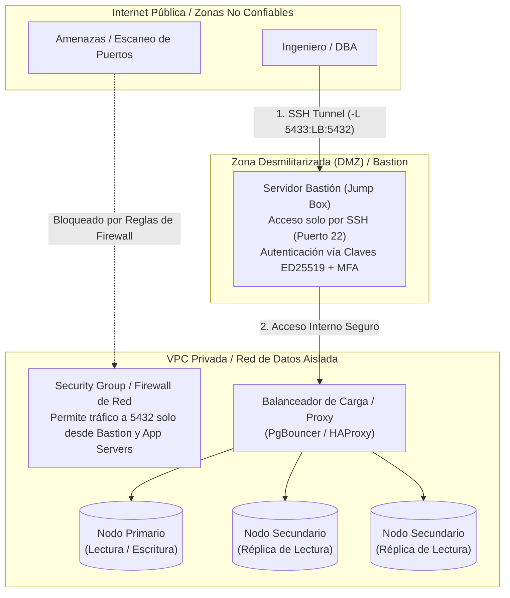
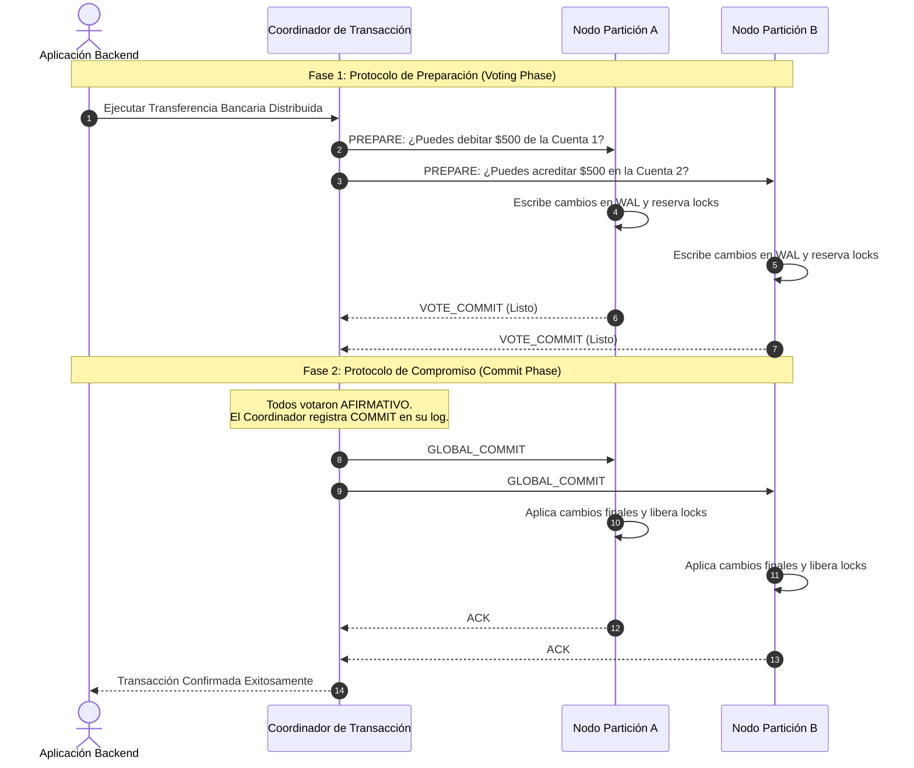

# Conexión Remota y Comunicación en Sistemas de Bases de Datos Distribuidas

> [!info] Fundamento en Sistemas Distribuidos
> En un **Sistema de Base de Datos Distribuida (DDBMS)**, un conjunto de múltiples nodos de procesamiento y almacenamiento independientes se interconectan mediante una red de comunicaciones, presentándose ante los clientes como una única base de datos lógica y coherente. El diseño de conexiones remotas en estos entornos abarca tanto el **acceso perimetral del cliente/aplicación** hacia el clúster, como los **protocolos internos de comunicación inter-nodo** que gobiernan la replicación, la consistencia y el consenso distribuido frente a fallos de red.

---

## 1. Configuración de Escucha de Red y Control de Acceso por Host

Por defecto, los motores de bases de datos se instalan vinculados exclusivamente a la interfaz de bucle invertido (*loopback* `127.0.0.1` o `localhost`), impidiendo cualquier tráfico externo. Para habilitar conexiones remotas legítimas en arquitecturas distribuidas, se deben configurar los parámetros de red del demonio:

### 1.1. Directivas de Enlace de Red (*Binding*)
- **PostgreSQL (`postgresql.conf`):**
  ```ini
  # Escuchar en todas las interfaces de red del servidor o en IPs de la VPC privada
  listen_addresses = '*'
  port = 5432
  ```
- **MySQL / MariaDB (`my.cnf` o `mysqld.cnf`):**
  ```ini
  [mysqld]
  bind-address = 0.0.0.0 # O la IP privada de la interfaz eth1
  ```

### 1.2. Control de Acceso por Host en PostgreSQL: `pg_hba.conf`
El archivo **Host-Based Authentication (HBA)** actúa como la primera línea de defensa a nivel de capa de aplicación, evaluando las conexiones secuencialmente de arriba hacia abajo:

```conf
# TYPE  DATABASE        USER            ADDRESS                 METHOD
# Permitir conexiones locales del sistema operativo
local   all             postgres                                peer

# Permitir a los microservicios de la red interna (VPC 10.0.2.0/24) con cifrado scram-sha-256
hostssl erp_db          app_user        10.0.2.0/24             scram-sha-256

# Permitir a los nodos réplica la transmisión de logs WAL para replicación física
hostssl replication     replicator_user 10.0.5.0/24             scram-sha-256

# Denegar explícitamente cualquier otra procedencia
host    all             all             0.0.0.0/0               reject
```

### 1.3. Control de Acceso por Host en MySQL
En MySQL, la identidad de una cuenta se define formalmente como la tupla `'usuario'@'origen_red'`:

```sql
-- Conceder privilegios a un usuario que se conecta estrictamente desde una subred privada
CREATE USER 'app_service'@'192.168.10.%' IDENTIFIED BY 'CredencialSegura2026!';
GRANT SELECT, INSERT, UPDATE, DELETE ON tienda_distribuida.* TO 'app_service'@'192.168.10.%';
FLUSH PRIVILEGES;
```

---

## 2. Seguridad en Accesos Remotos: Infraestructura y Perímetros

> [!danger] Regla Absoluta de Seguridad en Redes
> **NUNCA expongas el puerto de una base de datos (5432, 3306, 1433, 27017) directamente hacia la Internet pública (`0.0.0.0/0`).** Los motores de base de datos no están diseñados como servidores de cara al público; exponerlos invita a ataques de denegación de servicio (DoS), ataques de fuerza bruta automatizados y explotación de vulnerabilidades de día cero (*Zero-Day Exploits*).



### 2.1. Túneles SSH con Reenvío de Puertos (*SSH Port Forwarding*)
Para labores administrativas de un Administrador de Bases de Datos (DBA), se emplea un servidor de salto (*Bastion Host / Jump Box*):

```bash
# Redirige el puerto local 5433 hacia el host de la base de datos a través del bastión
ssh -N -L 5433:db-cluster-privado.internal:5432 dba_user@bastion.empresa.com -i ~/.ssh/id_ed25519
```
A partir de ese instante, el cliente gráfico (DBeaver, pgAdmin) se conecta localmente a `localhost:5433`, viajando el tráfico encapsulado y cifrado a través de SSH.

### 2.2. Redes Privadas Virtuales (VPNs) y Microsegmentación Cloud
- **VPNs Corporativas (WireGuard, OpenVPN, AWS Client VPN):** Los operadores integran su estación de trabajo a la subred privada de la organización.
- **Firewalls a Nivel de S.O.:** Utilizar `ufw` o `nftables` en Linux para filtrar paquetes antes de que alcancen el socket:
  ```bash
  sudo ufw allow from 10.0.2.0/24 to any port 5432 proto tcp
  ```
- **Security Groups (AWS/GCP):** Reglas *stateful* que permiten tráfico entrante en el puerto 5432 **únicamente** si el origen es el ID del Security Group asignado a la flota de servidores de aplicaciones.

---

## 3. Protocolos de Comunicación y Consenso en Bases de Datos Distribuidas

En un entorno distribuido, los nodos del clúster deben coordinarse permanentemente a través de la red física para mantener la coherencia de los datos.



### 3.1. Transacciones Distribuidas: Two-Phase Commit (2PC)
Cuando una transacción atómica abarca fragmentos particionados en múltiples servidores físicos, no basta con un `COMMIT` local:

1. **Fase 1: Preparación / Votación (*Prepare / Voting*):**
   - El nodo **Coordinador** envía un mensaje `PREPARE` a todos los nodos participantes.
   - Cada participante ejecuta la transacción internamente, escribe los registros en su WAL persistente, adquiere los bloqueos necesarios sobre los datos y responde con `VOTE_COMMIT` (si garantiza que puede confirmarla) o `VOTE_ABORT` (si detectó alguna restricción rota o fallo local).
2. **Fase 2: Compromiso / Aborto (*Commit / Abort*):**
   - Si **absolutamente todos** los participantes votaron `VOTE_COMMIT`, el coordinador persiste una entrada `GLOBAL_COMMIT` en su propio log y envía la orden `GLOBAL_COMMIT` a todos los nodos.
   - Si tan solo **uno** vota `VOTE_ABORT` (o si expira el tiempo de espera por fallo de red), el coordinador envía `GLOBAL_ABORT`, obligando a todos a revertir los cambios mediante sus registros de log (*Rollback*).

> [!warning] La Debilidad del Protocolo 2PC: Naturaleza Bloqueante
> El protocolo 2PC es un **protocolo bloqueante (*blocking protocol*)**. Si el coordinador sufre una falla catastrófica de hardware justo después de que los participantes votaron `VOTE_COMMIT` pero antes de enviar la decisión global, los participantes quedan en un estado de incertidumbre (*in-doubt state*), **reteniendo los bloqueos exclusivos indefinidamente**, lo que puede paralizar el sistema.

### 3.2. Consenso Moderno: Algoritmos Paxos y Raft
Para superar las deficiencias de 2PC, las bases de datos distribuidas de última generación (como **CockroachDB**, **YugabyteDB** o **Google Cloud Spanner**):
- Implementan algoritmos de consenso basados en quórum mayoritario (**Raft** o **Multi-Paxos**).
- No exigen unanimidad del 100% de los nodos: si un clúster consta de $2F + 1$ nodos, el sistema continúa procesando escrituras con consistencia linealizable siempre que una mayoría simple de $F + 1$ nodos esté operativa y comunicada.

---

## 4. El Teorema CAP y Estrategias de Replicación

Formulado por Eric Brewer y demostrado por Gilbert y Lynch, el **Teorema CAP** establece que en presencia de una partición de red inevitable ($P$), un sistema distribuido debe elegir entre:
- **Consistencia Fuerte / Linealizabilidad ($C$):** Todas las lecturas reciben el dato más reciente o devuelven un error.
- **Disponibilidad ($A$):** Todas las peticiones reciben una respuesta no errónea, pero no se garantiza que contenga la versión más reciente del dato.

```
       Consistencia (C)
            /\
           /  \
          /    \
         /  CA  \   (Inviable ante particiones reales de red)
        /________\
       / \      / \
      /   \    /   \
     /  CP \  /  AP \
    /_______\/_______\
Disponibilidad (A)   Tolerancia a Particiones (P)
```

### 4.1. Replicación Síncrona vs. Asíncrona

| Dimensión | Replicación Síncrona | Replicación Asíncrona |
| :--- | :--- | :--- |
| **Pérdida de Datos ante Fallos** | **RPO = 0** (Zero Data Loss garantizado). | **RPO > 0** (Pueden perderse transacciones en tránsito que no llegaron al réplica). |
| **Latencia de Escritura** | Alta: El commit no retorna al cliente hasta recibir el ACK de red de la réplica. | Mínima: El nodo primario confirma la transacción en disco local y retorna de inmediato. |
| **Disponibilidad** | Menor: Si la réplica o la red se desconectan, las escrituras en el primario pueden bloquearse. | Alta: El primario continúa operando con independencia del estado de las réplicas. |

### 4.2. Topologías de Despliegue
1. **Primario - Réplica (*Single-Master / Read Replicas*):**
   - El nodo primario canaliza el 100% de las transacciones DDL/DML de escritura.
   - Múltiples réplicas de solo lectura asumen el tráfico analítico y consultas `SELECT`, distribuyendo la carga de lectura horizontalmente mediante balanceadores como HAProxy.
2. **Multi-Maestro (*Multi-Master / Active-Active*):**
   - Múltiples nodos aceptan lecturas y escrituras simultáneamente en distintas regiones geográficas.
   - Exige algoritmos de resolución de colisiones: **CRDTs** (*Conflict-free Replicated Data Types*) o políticas deterministas basadas en sellos de tiempo como *Last-Write-Wins* (LWW).

---

## Notas relacionadas
- [[Conexion a la base datos]]
- [[Transaccion]]
- [[Insertar datos]]
- [[SQL]]
- [[SQL data adapter]]
