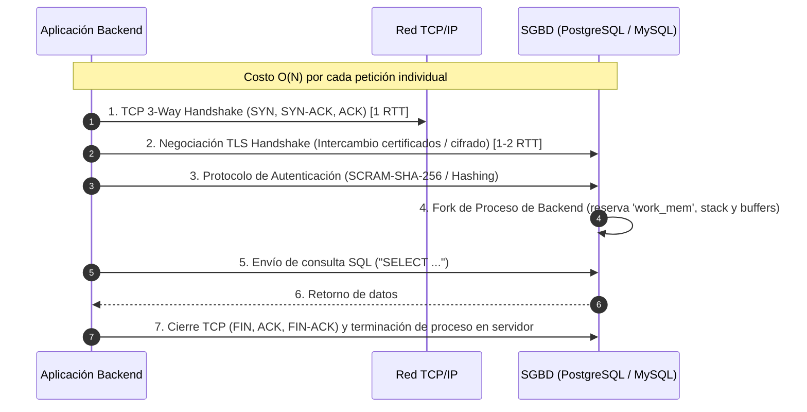

# Conexión a Bases de Datos Relacionales: Arquitectura, Pooling y Seguridad

> [!info] Definición Formal
> Una **conexión a base de datos** es un canal de comunicación de capa de aplicación (típicamente sobre TCP/IP) establecido entre un proceso cliente (aplicación backend, microservicio, herramienta analítica) y el proceso servidor de un Sistema de Gestión de Bases de Datos Relacionales (RDBMS). Su ciclo de vida abarca la resolución de red, negociación de cifrado (TLS), autenticación y autorización criptográfica, asignación de memoria en el servidor y el intercambio transaccional de comandos de consulta y conjuntos de tuplas.

---

## 1. Anatomía del Connection String (Cadena de Conexión)

La **Cadena de Conexión** (*Connection String*) es una cadena formateada de pares clave-valor que suministra al controlador (*driver*) todos los parámetros necesarios para localizar el motor y negociar la sesión:

```ini
Server=db-cluster.corp.internal;Port=5432;Database=erp_academico;User Id=app_service;Password=TokenSeguro123!;SslMode=VerifyFull;TrustServerCertificate=False;Connection Timeout=15;Pooling=true;Min Pool Size=5;Max Pool Size=100;
```

### Parámetros Críticos y su Impacto Operativo

| Parámetro | Función Técnica | Riesgo / Recomendación |
| :--- | :--- | :--- |
| **`Host / Server`** | Nombre de host FQDN o dirección IP del nodo de base de datos. | Usar registros DNS internos o balanceadores (ej. HAProxy/PgBouncer) en lugar de IPs estáticas. |
| **`Port`** | Puerto TCP de escucha del servicio (PostgreSQL: 5432, MySQL: 3306, SQL Server: 1433, Oracle: 1521). | En entornos de producción, es una buena práctica de hardening modificar los puertos estándar. |
| **`Database / Initial Catalog`** | Catálogo relacional específico al que se asocia la sesión tras autenticar. | Limitar los privilegios del usuario únicamente a esta base de datos. |
| **`User Id` & `Password`** | Credenciales de autenticación del usuario de base de datos. | **Prohibido hardcodear en código fuente**. Gestionar vía Secrets Manager. |
| **`SslMode / Encrypt`** | Nivel de negociación criptográfica TLS/SSL para el canal de transporte. | Valores: `Disable`, `Require`, `Verify-CA`, `Verify-Full` (protege contra ataques Man-In-The-Middle). |
| **`Connection Timeout`** | Tiempo máximo (en segundos) que el cliente esperará a que el socket se abra y autentique. | Un timeout muy alto ante caídas de red puede provocar saturación de hilos en la aplicación cliente. |
| **`Pooling`** | Bandera booleana (`true`/`false`) que habilita el gestor de pool de conexiones local. | Debe estar siempre habilitado en aplicaciones web y APIs multi-hilo. |
| **`Min / Max Pool Size`** | Límites inferior y superior de conexiones vivas mantenidas en reserva por el pool. | Ajustar calculando la fórmula: $\text{Conexiones Servidor} \ge \text{Instancias App} \times \text{MaxPoolSize}$. |

---

## 2. El Patrón Connection Pooling (Pool de Conexiones)

### 2.1. ¿Por Qué Abrir y Cerrar Conexiones Directas es Sumamente Costoso?
En una arquitectura ingenua sin pool, cada petición HTTP de un usuario abre una nueva conexión física:



En motores como PostgreSQL (basado en arquitectura multiproceso `fork()`):
1. Cada nueva conexión física exige al sistema operativo clonar un proceso `postgres`.
2. Asigna bloques de memoria privada (`work_mem`, memoria de mantenimiento, pilas de ejecución).
3. La sobrecarga (*overhead*) de tiempo puede superar fácilmente los **50 a 150 milisegundos por conexión**, mientras que la consulta SQL en sí tarda menos de 2 milisegundos.

### 2.2. Funcionamiento y Ciclo de Vida del Connection Pool

El Connection Pool mantiene una reserva de conexiones TCP ya autenticadas y vivas en memoria:

```mermaid
flowchart TD
    Req[Petición entrante desde hilo de la aplicación] --> GetConn{¿Hay conexión 'Idle' en el Pool?}
    GetConn -- Sí --> Lease[Arrendar conexión inmediatamente\nRetardo: < 0.1 ms]
    GetConn -- No --> CapCheck{¿Conexiones activas < MaxPoolSize?}
    CapCheck -- Sí --> CreateNew[Abrir nueva conexión TCP física con el SGBD]
    CapCheck -- No --> WaitQueue[Encolar petición en espera\n(hasta Connection Timeout)]
    WaitQueue -- Timeout Excedido --> ErrPool[Lanzar TimeoutException]
    CreateNew --> Lease
    WaitQueue -- Se libera una conexión --> Lease
    Lease --> Exec[Ejecutar transacciones y consultas SQL]
    Exec --> Close["conn.close() / Context Manager"]
    Close --> Recycle[No destruye el socket TCP:\nLimpia estado y retorna a la lista 'Idle']
```

> [!important] Prevención de Fugas de Conexión (Connection Leaks)
> Si un desarrollador omite invocar `.close()` o si ocurre una excepción de software que interrumpe el flujo normal, la conexión queda marcada como "activa" permanentemente. Cuando todas las conexiones del pool se agotan, el sistema sufre una **fuga de conexiones (*connection leak*)**, bloqueando indefinidamente a todas las peticiones futuras de los usuarios.
> **Solución mandatoria:** Utilizar bloques deterministas de liberación de recursos: `with` en Python, `using` en C#, o `try-with-resources` en Java.

---

## 3. Interfaces Estándar de la Industria

Para evitar acoplar los lenguajes de alto nivel a las particularidades de red de cada fabricante de base de datos, la industria definió capas de abstracción normalizadas:

1. **ODBC (Open Database Connectivity):** Estándar de la industria en C/C++ introducido por Microsoft y el grupo SQL Access en 1992. Define una API uniforme basada en controladores nativos compilados.
2. **JDBC (Java Database Connectivity):** Especificación estándar de Java (JSR) con cuatro categorías de drivers (siendo el **Tipo 4 - Pure Java / Direct-to-Database Wire Protocol** el estándar de producción).
3. **ADO.NET:** Arquitectura del ecosistema .NET fundamentada en proveedores de datos especializados (`Microsoft.Data.SqlClient`, `Npgsql`, `MySqlConnector`) que implementan interfaces comunes (`IDbConnection`, `IDbCommand`).
4. **Python DB-API 2.0 (PEP 249):** Especificación estándar en el ecosistema Python. Exige métodos uniformes: `connect()`, `cursor()`, `execute()`, `fetchone()`, `fetchall()`, `commit()`, `rollback()`.

---

## 4. Seguridad en Conexiones a Bases de Datos

### 4.1. Inyección SQL (SQL Injection - SQLi) y Consultas Parametrizadas
La inyección de código SQL (vulnerabilidad clasificada históricamente en el **OWASP Top 10**) ocurre cuando una aplicación concatena entradas arbitrarias del usuario directamente en la cadena de consulta SQL:

```python
# VULNERABILIDAD CRÍTICA (Concatenación Dinámica de Texto)
input_usuario = "admin' OR '1'='1"
query = f"SELECT * FROM usuarios WHERE username = '{input_usuario}' AND password = '{password}'"
# El AST (Árbol Sintáctico) del motor interpreta OR '1'='1' como condición siempre verdadera,
# concediendo acceso de superusuario sin requerir contraseña.
```

#### Solución de Ingeniería: Sentencias Preparadas (*Prepared Statements / Parameterized Queries*)
En una consulta parametrizada, la estructura de la consulta se envía al motor por separado de los parámetros de datos:
1. El compilador SQL analiza, optimiza y compila el plan de ejecución utilizando marcadores de posición (`$1, $2` o `@param`).
2. Los valores provistos por el usuario se transmiten en un paquete secundario de la red como **datos literales puros**.
3. Es matemáticamente imposible que un valor inyectado altere la gramática o el árbol sintáctico (AST) de la consulta.

```python
# IMPLEMENTACIÓN SEGURA Y ROBUSTA (PostgreSQL con psycopg y Context Managers)
import os
import psycopg
from psycopg.rows import dict_row

DATABASE_URL = os.environ.get("DATABASE_URL")

def obtener_datos_estudiante(codigo_identificacion: str):
    # Uso de context managers para garantizar el retorno de conexiones al pool
    with psycopg.connect(DATABASE_URL, row_factory=dict_row) as conn:
        with conn.cursor() as cur:
            # Consulta parametrizada estricta (Separación de código y datos)
            consulta = """
                SELECT id, nombre, apellido, email, creditos_aprobados
                FROM estudiantes
                WHERE identificacion = %s;
            """
            cur.execute(consulta, (codigo_identificacion,)) # Tupla de parámetros
            resultado = cur.fetchone()
            return resultado
```

### 4.2. Cifrado TLS en Tránsito
Toda conexión entre el servidor de aplicaciones y el motor debe viajar cifrada mediante **TLS 1.3**. En la configuración del cliente:
- `sslmode=require`: Cifra el canal, pero no valida la autenticidad del certificado (vulnerable a Man-In-The-Middle en redes locales).
- `sslmode=verify-full`: Exige cifrado estricto y comprueba que la Autoridad Certificadora (CA) sea válida y que el FQDN del servidor coincida exactamente con el Common Name (CN) del certificado.

### 4.3. Gestión Moderna de Credenciales y Autenticación sin Contraseña
- **Variables de Entorno y Secretos:** Jamás commitear credenciales en repositorios Git. Utilizar gestores dedicados como **AWS Secrets Manager**, HashiCorp Vault o Azure Key Vault con rotación periódica automatizada de contraseñas.
- **Autenticación IAM (Cloud Native):** En nubes públicas (AWS RDS, GCP Cloud SQL), los microservicios pueden autenticarse ante la base de datos utilizando tokens temporales firmados por roles de máquina (IAM Roles / Workload Identity), eliminando por completo la existencia de contraseñas estáticas en archivos de configuración.

---

## Notas relacionadas
- [[Insertar datos]]
- [[Principales tipo de datos]]
- [[Fechas]]
- [[Subconsultas]]
- [[Conexion remota]]
- [[SQL data adapter]]
- [[SQL]]
