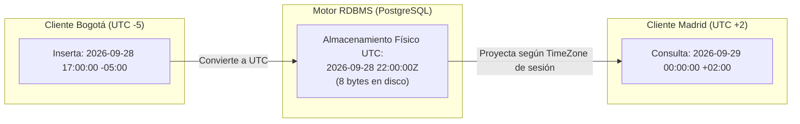

# Manejo de Tipos Temporales y Funciones de Fecha en SQL

> [!info] Definición Formal
> En la teoría relacional y los sistemas de procesamiento transaccional (OLTP) y analítico (OLAP), los **datos temporales** capturan la dimensión cronológica en la que ocurren los hechos del negocio (tiempos de transacción, tiempos válidos y marcas de auditoría). El manejo riguroso del tiempo exige comprender la representación según la norma internacional **ISO 8601**, los husos horarios (**Time Zones**), la aritmética de intervalos y el diseño de predicados de consulta **sargables** (*Search Argument Able*) para maximizar la eficiencia de los índices.

---

## 1. Estándares de Representación y Tipos de Datos Temporales

### 1.1. La Norma ISO 8601
Para evitar ambigüedades culturales en la interpretación de fechas (por ejemplo, determinar si `05/06/2026` corresponde al 5 de junio o al 6 de mayo), el estándar internacional prescribe el orden jerárquico descendente:
- **Solo Fecha:** `YYYY-MM-DD` (ej. `2026-09-28`).
- **Fecha y Hora Combinada:** `YYYY-MM-DDTHH:MM:SS.ssssss` (ej. `2026-09-28T22:30:00`).
- **Con Desplazamiento UTC (Offset):** `YYYY-MM-DDTHH:MM:SSZ` (donde `Z` denota *Zulu time* o UTC+0) o `2026-09-28T17:30:00-05:00` (hora estándar de Colombia/Perú).

### 1.2. `TIMESTAMP WITHOUT TIME ZONE` vs. `TIMESTAMP WITH TIME ZONE` (`TIMESTAMPTZ`)

Esta es una de las distinciones conceptuales más críticas en la arquitectura de software:



* **`TIMESTAMP WITHOUT TIME ZONE` (Hora de Pared / Wall-Clock):**
  - Almacena únicamente el año, mes, día, hora, minuto y segundo sin contexto geográfico alguno.
  - Si un usuario en Bogotá guarda `17:00:00` y un usuario en Tokio consulta la columna, ambos leerán `17:00:00`, lo cual distorsiona la realidad cronológica del evento físico.
  - **Uso legítimo:** Alarmas recurrentes locales o agendas no vinculadas al huso horario (ej. "todos los días a las 08:00 AM hora local").
* **`TIMESTAMP WITH TIME ZONE` (`TIMESTAMPTZ`):**
  - **Mito común:** No almacena el nombre ni el offset de la zona horaria junto a la tupla.
  - **Realidad física:** Convierte la marca temporal entrante a **UTC** y almacena el número de microsegundos desde la época Unix (`1970-01-01 00:00:00 UTC`) en un entero de 64 bits (8 bytes).
  - Al leer la tupla, el motor toma ese valor en UTC y lo proyecta automáticamente en el huso horario configurado en la sesión activa del cliente (`SET timezone = 'America/Bogota'`).
  - **Regla de Oro en Arquitectura:** Cualquier evento de auditoría (`creado_en`, `actualizado_en`, `transferencia_bancaria_en`) **debe almacenarse obligatoriamente como `TIMESTAMPTZ`**.

---

## 2. Catálogo de Funciones Temporales entre Dialectos SQL

| Operación | PostgreSQL | MySQL | SQL Server (T-SQL) | Oracle |
| :--- | :--- | :--- | :--- | :--- |
| **Tiempo Actual con Zona** | `NOW()` / `CURRENT_TIMESTAMP` | `NOW()` / `CURRENT_TIMESTAMP` | `SYSDATETIMEOFFSET()` | `CURRENT_TIMESTAMP` |
| **Tiempo Actual Local** | `LOCALTIMESTAMP` | `NOW()` | `GETDATE()` / `SYSDATETIME()` | `SYSDATE` |
| **Solo Fecha Actual** | `CURRENT_DATE` | `CURRENT_DATE` | `CAST(GETDATE() AS DATE)` | `TRUNC(SYSDATE)` |
| **Aritmética de Intervalos** | `ts + INTERVAL '7 days'` | `DATE_ADD(ts, INTERVAL 7 DAY)` | `DATEADD(day, 7, ts)` | `ts + NUMTODSINTERVAL(7, 'DAY')` |
| **Diferencia entre Marcas** | `AGE(ts1, ts2)` o `ts1 - ts2` | `TIMESTAMPDIFF(DAY, ts2, ts1)` | `DATEDIFF(day, ts2, ts1)` | `ts1 - ts2` (días fraccionales) |
| **Extracción de Componente** | `EXTRACT(YEAR FROM ts)` | `YEAR(ts)` / `EXTRACT()` | `DATEPART(year, ts)` | `EXTRACT(YEAR FROM ts)` |
| **Truncamiento Temporal** | `DATE_TRUNC('month', ts)` | `DATE_FORMAT(ts, '%Y-%m-01')` | `DATETRUNC(month, ts)` | `TRUNC(ts, 'MM')` |

### Distinción en PostgreSQL: Reloj Transaccional vs. Reloj Real
- `CURRENT_TIMESTAMP` o `NOW()`: Devuelve el momento de **inicio de la transacción actual**. Dentro de una transacción larga, múltiples llamadas a `NOW()` devolverán exactamente el mismo valor (garantizando consistencia para auditoría ACID).
- `clock_timestamp()`: Devuelve la hora real del reloj del sistema en el instante exacto en que se ejecuta la función física.

---

## 3. Consultas Temporales y Optimización: El Principio de Sargabilidad (SARGable)

Uno de los errores más frecuentes en el diseño de consultas SQL es escribir predicados no sargables (*Search Argument Able*). Un predicado es sargable si el optimizador de consultas puede aprovechar un índice **B-Tree** para realizar un salto directo (*Index Seek* o búsqueda binaria en $O(\log N)$) en lugar de recorrer la tabla entera tupla por tupla (*Sequential Scan* o *Full Table Scan* en $O(N)$).

### 3.1. Destrucción de Índices Mediante Funciones en el `WHERE`

Supóngase una tabla `facturas` con 10 millones de registros y un índice B-Tree creado sobre la columna `fecha_emision`:

```sql
-- ANTI-PATRÓN (No Sargable): El motor debe evaluar la función sobre cada una de las 10 millones de filas
SELECT id, total
FROM facturas
WHERE EXTRACT(YEAR FROM fecha_emision) = 2026; -- Invalida el índice B-Tree convencional
```

```sql
-- PATRÓN ÓPTIMO (Sargable): Expresión pura de rango sobre la columna indexada
SELECT id, total
FROM facturas
WHERE fecha_emision >= '2026-01-01 00:00:00' 
  AND fecha_emision <  '2027-01-01 00:00:00'; -- Index Seek inmediato
```

> [!important] Análisis de Complejidad
> En la consulta no sargable, el motor debe leer todas las páginas de datos desde el disco ($10^7$ operaciones de I/O) para calcular `EXTRACT()`. En la consulta sargable, el árbol B-Tree ubica el límite inferior en $O(\log N)$ y lee secuencialmente únicamente las hojas correspondientes al año 2026.

---

## 4. La Trampa del `BETWEEN` y Rangos Semi-Abiertos

El operador `BETWEEN x AND y` es inclusivo en ambos extremos ($x \le \text{valor} \le y$). Cuando se aplica sobre columnas de tipo fecha con componentes de tiempo (`TIMESTAMP` o `DATETIME`), introduce errores lógicos sutiles pero graves:

### 4.1. El Problema del Final del Mes (End-of-Month)
Si se desea consultar todas las facturas de enero de 2026:

```sql
-- ERROR COMÚN:
SELECT * FROM facturas 
WHERE fecha_emision BETWEEN '2026-01-01' AND '2026-01-31';
```
Dado que la cadena literal `'2026-01-31'` se promociona implícitamente a `'2026-01-31 00:00:00'`, **cualquier factura emitida el 31 de enero a las 09:15 AM quedará excluida del resultado**, falseando los reportes financieros.

### 4.2. El Problema del Redondeo a `23:59:59.999`
Para remediar lo anterior, muchos programadores intentan:
```sql
WHERE fecha_emision BETWEEN '2026-01-01 00:00:00' AND '2026-01-31 23:59:59.999';
```
En motores como SQL Server con el tipo clásico `DATETIME` (cuya precisión es de $1/300$ de segundo o $3.33$ milisegundos), el valor `23:59:59.999` **se redondea automáticamente hacia arriba** a `'2026-02-01 00:00:00'`, incluyendo erróneamente registros del 1 de febrero.

### 4.3. Solución Estándar de Ingeniería: Intervalos Semi-Abiertos
La única estrategia universal, robusta e independiente de la resolución del motor es el uso de intervalos semi-abiertos $[\text{inicio}, \text{fin})$:

```sql
SELECT id, fecha_emision, total
FROM facturas
WHERE fecha_emision >= '2026-01-01'
  AND fecha_emision <  '2026-02-01'; -- Cubre hasta el último microsegundo de enero
```

---

## 5. Agrupamiento Temporal Analítico (Data Analytics)

Para la generación de tableros de control y análisis de series de tiempo, se utiliza la función de truncamiento temporal `DATE_TRUNC`:

```sql
-- Reporte de ingresos agregados por mes y cálculo de tasa de crecimiento
SELECT 
    DATE_TRUNC('month', fecha_venta) AS mes_periodo,
    COUNT(id) AS volumen_ventas,
    SUM(monto_total) AS facturacion_total,
    LAG(SUM(monto_total), 1) OVER (ORDER BY DATE_TRUNC('month', fecha_venta)) AS facturacion_mes_anterior
FROM transacciones_comerciales
WHERE fecha_venta >= '2025-01-01' AND fecha_venta < '2027-01-01'
GROUP BY DATE_TRUNC('month', fecha_venta)
ORDER BY mes_periodo ASC;
```

---

## Notas relacionadas
- [[Principales tipo de datos]]
- [[Insertar datos]]
- [[Subconsultas]]
- [[Comandos]]
- [[SQL]]
