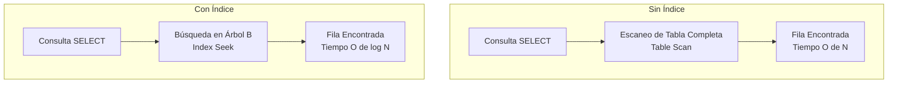
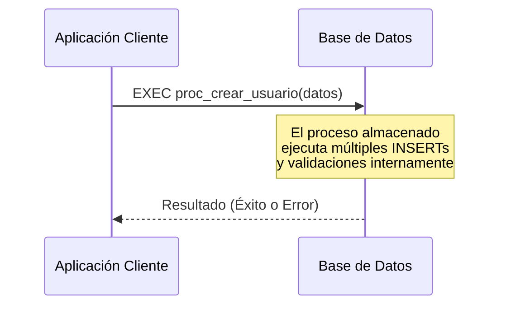

## Índices (Indexing)

> [!info] Explicación
> Los índices son estructuras de datos especiales asociadas a tablas o vistas que mejoran significativamente la velocidad de búsqueda y recuperación de registros (como el índice de un libro). Sin embargo, ocupan espacio en disco y pueden ralentizar las operaciones de inserción, actualización y borrado (`INSERT`, `UPDATE`, `DELETE`), ya que el índice también debe actualizarse.

Mejoran la búsqueda de un registro en una tabla mediante una estructura de acceso rápido.

## Procesos almacenados (Stored Procedures)

> [!info] Explicación
> Un proceso (o procedimiento) almacenado es un conjunto de instrucciones SQL que se compilan y almacenan en el propio motor de base de datos. Sirve para encapsular lógica de negocio compleja, reducir el tráfico de red (al no enviar comandos largos repetidamente) y mejorar la seguridad (previniendo inyecciones SQL y controlando permisos a nivel de procedimiento).

En la base de datos se realiza un proceso almacenado donde el cliente de la aplicación solo manda a ejecutar (por ejemplo con `EXEC proc_nombre`) y ya no es necesario enviar toda la consulta SQL estructurada desde el código de la aplicación.

## Notas relacionadas
- [[SQL]]
- [[Comandos]]
- [[Vistas]]

## Aplicación en Data Engineering freelance

- [[Obsidian/freelance/Data Engineering/SQL/02 Índices y filtros eficientes|02 Índices y filtros eficientes]] — Ampliación de SARGability, tipos de índices y costos.
