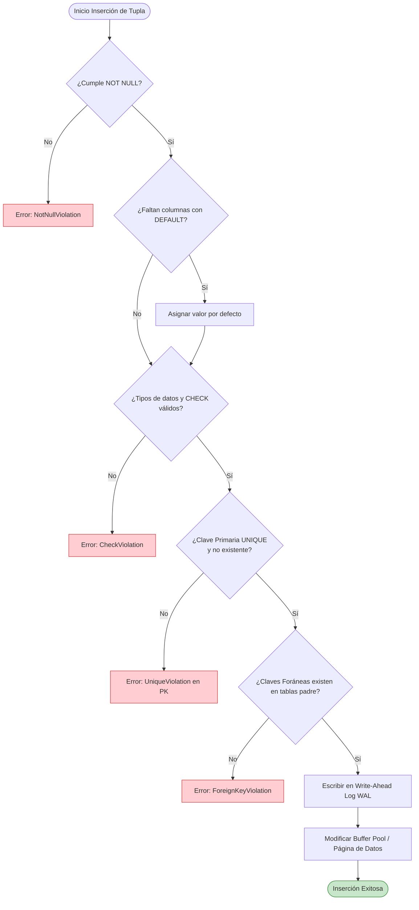

# Inserción de Datos en SQL (Sentencia INSERT)

> [!info] Definición Formal
> En el Álgebra Relacional y los Sistemas de Gestión de Bases de Datos Relacionales (RDBMS), la operación de **inserción** corresponde a la adición de nuevas tuplas (filas) a una relación existente (tabla), formalmente representada como $R \leftarrow R \cup \{t\}$. La sentencia estándar del lenguaje de manipulación de datos (DML) para ejecutar esta operación es **`INSERT INTO`**, la cual debe someter a cada tupla entrante a una estricta batería de validaciones de **integridad semántica y estructural** antes de persistirla físicamente en las páginas de datos en disco.

---

## 1. Variantes Sintácticas de la Sentencia `INSERT`

El estándar ANSI SQL contempla diversas formas sintácticas para la creación de registros:

### 1.1. Inserción de Fila Única (Single-Row Insert)
La forma más elemental asocia una lista explícita de columnas con una lista coincidente de literales o expresiones evaluables.

```sql
INSERT INTO estudiantes (identificacion, nombre, apellido, email, creditos_aprobados)
VALUES ('1001234567', 'Carlos', 'Mendoza', 'carlos.mendoza@universidad.edu.co', 0);
```

> [!tip] Buena Práctica de Ingeniería
> **Nunca omitir la lista de columnas destino** (es decir, evitar `INSERT INTO tabla VALUES (...)`). Omitir las columnas crea una dependencia frágil del orden posicional físico de la tabla. Si una migración altera el orden de las columnas o agrega un campo nullable intermedio, las consultas sin especificación fallarán o corromperán silenciosamente los datos.

### 1.2. Inserción Multivalor Masiva (Multi-Row / Bulk Insert)
A partir del estándar SQL-92, la cláusula `VALUES` permite especificar múltiples tuplas separadas por comas dentro de una única instrucción atómica.

```sql
INSERT INTO facultades (codigo, nombre, presupuesto_anual)
VALUES 
    ('ING', 'Facultad de Ingeniería', 1500000.00),
    ('MED', 'Facultad de Medicina', 2200000.00),
    ('CIE', 'Facultad de Ciencias', 980000.00);
```

#### Ventajas de Rendimiento de Inserciones Batch:
1. **Reducción de Latencia de Red (Network Round-Trips):** Se envía un único paquete de red a través del socket hacia el servidor en lugar de $N$ llamadas individuales.
2. **Eficiencia en el Registro de Transacciones (Write-Ahead Logging - WAL):** El motor agrupa las escrituras en el WAL/Transaction Log bajo un único identificador de transacción (*Log Sequence Number* - LSN), reduciendo drásticamente las operaciones de sincronización de disco (`fsync`).
3. **Mecanismos Especializados de Alto Volumen:** Para cargas masivas de millones de registros, los dialectos proveen utilitarios que evitan el parseo SQL tradicional:
   - **PostgreSQL:** Protocolo binario `COPY estudiantes FROM '/data/estudiantes.csv' WITH (FORMAT csv, HEADER);`
   - **MySQL:** `LOAD DATA INFILE '/var/lib/mysql-files/data.csv' INTO TABLE estudiantes;`
   - **SQL Server:** Comando `BULK INSERT` y utilidad de línea de comandos `bcp`.

### 1.3. Inserción Mediante Subconsulta (`INSERT INTO ... SELECT`)
Permite poblar una tabla a partir del conjunto resultante devuelto por una consulta analítica compleja sobre una o más tablas del sistema.

```sql
-- Poblar tabla de auditoría de egresados potenciales
INSERT INTO egresados_candidatos (estudiante_id, promedio_acumulado, fecha_postulacion)
SELECT 
    e.id, 
    AVG(n.calificacion), 
    CURRENT_DATE
FROM estudiantes e
INNER JOIN notas n ON e.id = n.estudiante_id
WHERE e.creditos_aprobados >= 160
GROUP BY e.id
HAVING AVG(n.calificacion) >= 4.0;
```

---

## 2. Validación de Restricciones de Integridad (Integrity Constraints)

Antes de alterar los archivos de datos en almacenamiento secundario, el motor de base de datos evalúa las restricciones declaradas en el esquema de la tabla:



| Restricción | Definición Matemática / Relacional | Comportamiento en Inserción |
| :--- | :--- | :--- |
| **`PRIMARY KEY`** | $\forall t_1, t_2 \in R, t_1[PK] \neq t_2[PK] \land t_1[PK] \neq \text{NULL}$ | Invalida tuplas con valores nulos o claves duplicadas. Genera un índice B-Tree (Clustered en SQL Server / MySQL InnoDB). |
| **`FOREIGN KEY`** | $R_1[FK] \subseteq R_2[PK]$ (Integridad Referencial) | Falla si el valor referenciado no preexiste en la tabla primaria, salvo que el valor sea `NULL`. |
| **`UNIQUE`** | $\forall t_1, t_2 \in R, (t_1[U] = t_2[U]) \implies t_1 = t_2$ | Falla ante colisiones. En PostgreSQL y Oracle se permiten múltiples tuplas con valor `NULL` (ya que según 3VL, `NULL = NULL` es `UNKNOWN`). En versiones clásicas de SQL Server, solo se permite un único `NULL` (salvo índice filtrado). |
| **`NOT NULL`** | $\forall t \in R, t[A] \neq \text{NULL}$ | Rechaza la inserción si el campo no recibe valor explícito ni posee una cláusula `DEFAULT`. |
| **`CHECK`** | Predicado booleano $\mathcal{P}(t) \in \{\text{TRUE}, \text{UNKNOWN}\}$ | Evalúa condiciones personalizadas (`CHECK (edad >= 18 AND estrato BETWEEN 1 AND 6)`). |
| **`DEFAULT`** | Asignación de fallback $t[A] \leftarrow v_{def}$ si $t[A]$ no se suministra | Provee valores estáticos o dinámicos del sistema (`CURRENT_TIMESTAMP`, `gen_random_uuid()`). |

---

## 3. Manejo de Conflictos y Operaciones "Upsert" (Merge)

En entornos de alta concurrencia o procesos ETL idempotentes, es habitual que una fila entrante colisione con una restricción de unicidad (`UNIQUE` o `PRIMARY KEY`). En lugar de abortar la transacción, los motores modernos proporcionan mecanismos de **Upsert** (Update or Insert):

### 3.1. PostgreSQL y SQLite (`ON CONFLICT`)
PostgreSQL utiliza la cláusula `ON CONFLICT` permitiendo referenciar la tupla que se pretendía insertar mediante el pseudorregistro `EXCLUDED`.

```sql
-- Upsert en PostgreSQL
INSERT INTO inventario_producto (producto_id, stock_disponible, ultima_actualizacion)
VALUES (402, 15, NOW())
ON CONFLICT (producto_id) 
DO UPDATE SET 
    stock_disponible = inventario_producto.stock_disponible + EXCLUDED.stock_disponible,
    ultima_actualizacion = EXCLUDED.ultima_actualizacion;

-- Si solo se desea ignorar duplicados silenciosamente:
INSERT INTO registros_telemetria (sensor_id, lectura, marca_tiempo)
VALUES (88, 24.5, '2026-09-28 10:00:00')
ON CONFLICT (sensor_id, marca_tiempo) DO NOTHING;
```

### 3.2. MySQL (`ON DUPLICATE KEY UPDATE`)
En MySQL (motor InnoDB), si una fila causa duplicado en un índice `PRIMARY KEY` o `UNIQUE`, se ejecuta la cláusula de actualización:

```sql
-- MySQL 8.0.19+ con alias de fila nueva
INSERT INTO inventario_producto (producto_id, stock_disponible, ultima_actualizacion)
VALUES (402, 15, NOW()) AS nueva_fila
ON DUPLICATE KEY UPDATE 
    stock_disponible = inventario_producto.stock_disponible + nueva_fila.stock_disponible,
    ultima_actualizacion = nueva_fila.ultima_actualizacion;
```

### 3.3. SQL Server y Oracle (Sentencia Estándar `MERGE`)
La cláusula `MERGE` sincroniza dos tablas mediante una condición de coincidencia (*join condition*):

```sql
-- SQL Server / Oracle MERGE
MERGE INTO inventario_producto AS target
USING (VALUES (402, 15, GETDATE())) AS source (producto_id, stock_disponible, ultima_actualizacion)
ON (target.producto_id = source.producto_id)
WHEN MATCHED THEN
    UPDATE SET 
        target.stock_disponible = target.stock_disponible + source.stock_disponible,
        target.ultima_actualizacion = source.ultima_actualizacion
WHEN NOT MATCHED THEN
    INSERT (producto_id, stock_disponible, ultima_actualizacion)
    VALUES (source.producto_id, source.stock_disponible, source.ultima_actualizacion);
```

---

## 4. Columnas Autoincrementales, Identidades y Recuperación de IDs

La asignación de claves primarias numéricas correlativas o identificadores globales se gestiona mediante distintos mecanismos según el gestor:

### 4.1. Definición de Columnas de Identidad
* **PostgreSQL:**
  - *Tradicional:* Pseudotipo `SERIAL` (crea una secuencia `CREATE SEQUENCE` vinculada implícitamente).
  - *Estándar SQL:2008 (Recomendado):* `id INT GENERATED ALWAYS AS IDENTITY PRIMARY KEY` o `GENERATED BY DEFAULT AS IDENTITY`.
* **MySQL:** Atributo `id INT AUTO_INCREMENT PRIMARY KEY`.
* **SQL Server:** Atributo `Id INT IDENTITY(1, 1) PRIMARY KEY` (semilla = 1, incremento = 1).

### 4.2. Recuperación Segura del ID Generado en Concurrencia
En aplicaciones multiusuario, jamás debe consultarse `MAX(id)`, pues provocaría condiciones de carrera (*Race Conditions*). Se deben usar los mecanismos transaccionales por sesión:

```sql
-- PostgreSQL: Cláusula RETURNING directa (atómica y multipropósito)
INSERT INTO cursos (nombre, creditos)
VALUES ('Bases de Datos Distribuidas', 4)
RETURNING id, creado_en;
```

```sql
-- SQL Server: Función de ámbito de sesión o cláusula OUTPUT
INSERT INTO Cursos (Nombre, Creditos) 
OUTPUT INSERTED.Id, INSERTED.CreadoEn
VALUES ('Bases de Datos Distribuidas', 4);

-- O mediante variable de sesión:
SELECT SCOPE_IDENTITY(); -- Retorna el último IDENTITY generado en el scope local actual
```

```sql
-- MySQL: Función de conexión
SELECT LAST_INSERT_ID(); -- Devuelve el primer valor generado por AUTO_INCREMENT para la conexión actual
```

---

## 5. Transacciones, Atomicidad y Puntos de Restauración

Cualquier operación de inserción modifica el estado persistente del sistema, por lo que debe gobernar bajo las propiedades **ACID** (Atomicidad, Consistencia, Aislamiento y Durabilidad):

```sql
-- Demostración de control transaccional robusto en PostgreSQL
BEGIN TRANSACTION;

-- Inserción 1: Encabezado de Orden de Compra
INSERT INTO ordenes_compra (id, cliente_id, total, estado)
VALUES (5001, 10, 350.00, 'PENDIENTE');

-- Definición de un Savepoint (Punto de Restauración Intermedio)
SAVEPOINT antes_de_detalles;

-- Inserción 2: Detalle 1
INSERT INTO detalles_orden (orden_id, producto_id, cantidad, precio_unitario)
VALUES (5001, 88, 2, 100.00);

-- Inserción 3: Detalle 2 (Supongamos que este producto no tiene stock y deseamos abortar solo esta tupla)
INSERT INTO detalles_orden (orden_id, producto_id, cantidad, precio_unitario)
VALUES (5001, 99, 1, 150.00);

-- Si la inserción 3 arroja error de negocio, podemos deshacer parcialmente:
-- ROLLBACK TO SAVEPOINT antes_de_detalles;

-- Confirmación definitiva de los cambios hacia el WAL y páginas de datos
COMMIT;
```

---

## Notas relacionadas
- [[Principales tipo de datos]]
- [[Fechas]]
- [[Subconsultas]]
- [[Transaccion]]
- [[Comandos]]
- [[Conexion a la base datos]]
