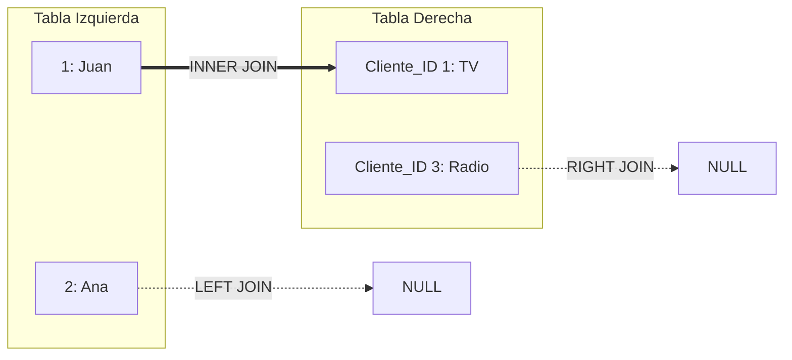

Los **JOINs** en SQL permiten combinar filas de dos o más tablas, basándose en una columna relacionada entre ellas (usualmente llaves primarias y foráneas). 

> [!info] Explicación
> Imagina que tienes una tabla de `Clientes` y otra de `Pedidos`. En lugar de tener toda la información de un cliente repetida en cada pedido, usas el ID del cliente. Un JOIN te permite "unir" ambas tablas al momento de consultar, trayendo el nombre del cliente junto con los detalles de su pedido.



## Tipos de JOIN

### INNER JOIN
Devuelve únicamente los registros que tienen valores coincidentes en **ambas** tablas. Es el tipo de JOIN más común.

```sql
SELECT Clientes.nombre, Pedidos.fecha
FROM Clientes
INNER JOIN Pedidos ON Clientes.id_cliente = Pedidos.id_cliente;
```

> [!info] Explicación
> Si un cliente nunca ha hecho un pedido, no aparecerá en el resultado. Si hay un pedido sin cliente válido (huérfano), tampoco aparecerá. Solo salen las parejas perfectas.

### LEFT JOIN (o LEFT OUTER JOIN)
Devuelve **todos** los registros de la tabla izquierda (la primera que se menciona), y los registros coincidentes de la tabla derecha. Si no hay coincidencia, el resultado mostrará `NULL` del lado derecho.

```sql
SELECT Clientes.nombre, Pedidos.fecha
FROM Clientes
LEFT JOIN Pedidos ON Clientes.id_cliente = Pedidos.id_cliente;
```

> [!info] Explicación
> Es ideal para preguntas como: "¿Qué clientes han comprado algo y cuáles no?". Te mostrará todos los clientes, y los que no tienen compras tendrán `NULL` en la fecha del pedido.

### RIGHT JOIN (o RIGHT OUTER JOIN)
Funciona igual que el LEFT JOIN, pero a la inversa: devuelve **todos** los registros de la tabla derecha, y los coincidentes de la izquierda.

```sql
SELECT Clientes.nombre, Pedidos.fecha
FROM Clientes
RIGHT JOIN Pedidos ON Clientes.id_cliente = Pedidos.id_cliente;
```

### FULL JOIN (o FULL OUTER JOIN)
Devuelve todos los registros cuando hay una coincidencia en los registros de la tabla izquierda o de la derecha. Si no hay coincidencia, llena con `NULL` los campos vacíos de ambos lados.

```sql
SELECT Clientes.nombre, Pedidos.fecha
FROM Clientes
FULL OUTER JOIN Pedidos ON Clientes.id_cliente = Pedidos.id_cliente;
```

### CROSS JOIN
Devuelve el producto cartesiano de las filas de ambas tablas. Es decir, combina cada fila de la primera tabla con cada fila de la segunda.

```sql
SELECT Tallas.nombre, Colores.nombre
FROM Tallas
CROSS JOIN Colores;
```

> [!info] Explicación
> Útil si necesitas generar todas las combinaciones posibles (por ejemplo, si vendes camisetas y tienes 3 tallas y 3 colores, el CROSS JOIN generará las 9 variantes posibles).

## Notas relacionadas
- [[Comandos]]
- [[Subconsultas]]
- [[SQL]]
