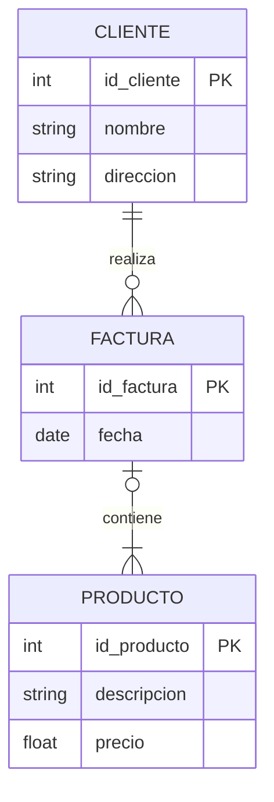

El **Modelo Entidad-Relación (ER)** es un modelo de datos conceptual de alto nivel que se utiliza para diseñar la estructura lógica de una base de datos, describiendo cómo se relacionan los datos entre sí independientemente del sistema de gestión de bases de datos que se vaya a utilizar.

> [!info] Explicación
> El modelo ER es como el plano arquitectónico de una casa. Antes de empezar a programar en [[SQL]] o crear tablas, primero dibujas qué información necesitas guardar (entidades) y cómo interactúan entre ellas (relaciones).

## Componentes del Modelo ER

### Entidades
Son objetos, conceptos o eventos del mundo real sobre los cuales se desea almacenar información. En los diagramas, se representan usualmente con **rectángulos**.
*Ejemplo:* `Cliente`, `Producto`, `Factura`.

### Atributos
Son las propiedades o características que describen a una entidad. Se representan con **óvalos** o **elipses**.
*Ejemplo:* Un `Cliente` tiene atributos como `ID`, `Nombre`, `Dirección` y `Teléfono`.
- **Atributo clave (Llave primaria):** Es un atributo que identifica de manera única a una instancia de la entidad (ej. el número de cédula o ID). Se suele subrayar.

### Relaciones
Describen la interacción, asociación o dependencia entre dos o más entidades. Se representan con **rombos** (diamantes).
*Ejemplo:* Un `Cliente` (Entidad) **COMPRA** (Relación) un `Producto` (Entidad).

## Cardinalidad
La cardinalidad define el número máximo y mínimo de instancias de una entidad que pueden asociarse a una instancia de otra entidad a través de una relación.

1. **Uno a Uno (1:1):** Una entidad A se asocia a lo sumo con una entidad B, y viceversa. *(Ej: Un `País` tiene una `Capital`, y una `Capital` pertenece a un solo `País`).*
2. **Uno a Muchos (1:N):** Una entidad A se asocia con cualquier cantidad de entidades B, pero una entidad B solo se asocia con una entidad A. *(Ej: Un `Cliente` puede tener muchas `Facturas`, pero una `Factura` pertenece a un solo `Cliente`).*
3. **Muchos a Muchos (M:N o N:M):** Múltiples entidades A pueden asociarse con múltiples entidades B. *(Ej: Un `Estudiante` puede matricularse en muchos `Cursos`, y un `Curso` tiene muchos `Estudiantes`).*

> [!info] Explicación
> En las bases de datos relacionales reales, no se pueden implementar relaciones directas de **Muchos a Muchos (N:M)**. Se debe crear una **tabla intermedia** (o entidad asociativa) para romperla en dos relaciones de **Uno a Muchos (1:N)**. En el ejemplo anterior, la tabla intermedia sería `Matricula`.

## Notas relacionadas
- [[Normalización]]
- [[Joins en SQL]]
- [[Principales tipo de datos]]
