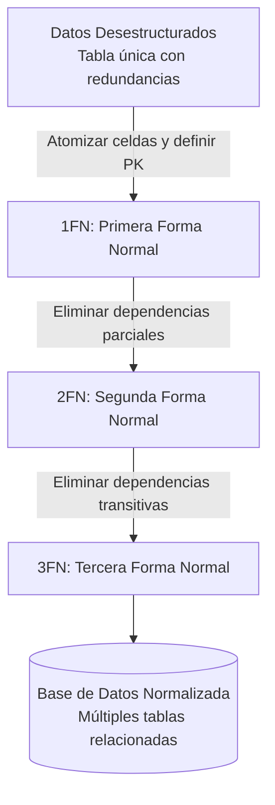

La **Normalización** es el proceso de organizar los datos de una base de datos relacional para reducir o eliminar la redundancia de datos y proteger su integridad. Se logra aplicando una serie de reglas conocidas como "Formas Normales" (FN).

> [!info] Explicación
> **¿Por qué normalizar?** Si guardas el nombre y teléfono del cliente en cada factura (en lugar de solo su ID), estás repitiendo datos. Si el cliente cambia de teléfono, tendrías que actualizar cientos de facturas. La normalización soluciona esto dividiendo la información en múltiples tablas conectadas por relaciones.

## 1FN (Primera Forma Normal)
Una tabla está en 1FN si:
- Todos sus atributos son atómicos (indivisibles). No se permiten listas ni arreglos en una sola celda.
- Cada columna debe contener un solo tipo de dato.
- Cada fila debe ser única y poseer una llave primaria (Primary Key).

## 2FN (Segunda Forma Normal)
Una tabla está en 2FN si:
- Ya cumple con la 1FN.
- Todos los atributos que no forman parte de la clave primaria dependen **completamente** de la clave primaria, y no de una parte de ella (esto aplica principalmente en tablas con claves compuestas).

## 3FN (Tercera Forma Normal)
Una tabla está en 3FN si:
- Ya cumple con la 2FN.
- No existen dependencias transitivas. Esto significa que ningún campo "no clave" debe depender de otro campo "no clave". Todos los atributos deben depender únicamente de la clave primaria.

> [!info] Explicación
> Ejemplo de dependencia transitiva: Si en la tabla `Empleados` tienes `ID_Empleado`, `ID_Departamento`, y `Nombre_Departamento`. `Nombre_Departamento` depende de `ID_Departamento`, no del empleado. Por lo tanto, debes crear una tabla independiente de `Departamentos` y dejar solo el `ID_Departamento` como clave foránea en la tabla de `Empleados`.

## BCNF (Forma Normal de Boyce-Codd)
Es una versión ligeramente más estricta de la 3FN. Se usa cuando una tabla tiene múltiples claves candidatas superpuestas. Estipula que para cada dependencia funcional `X -> Y`, `X` debe ser una superclave.

## Desnormalización
Es el proceso inverso. Se introduce redundancia deliberadamente en una base de datos previamente normalizada con el objetivo de mejorar el rendimiento y la velocidad de lectura. Se suele usar en almacenes de datos (Data Warehouses) donde las lecturas son masivas y las escrituras son infrecuentes, evitando así operaciones costosas como los [[Joins en SQL|JOINs]].

## Notas relacionadas
- [[SQL]]
- [[Modelo entidad-relación]]
