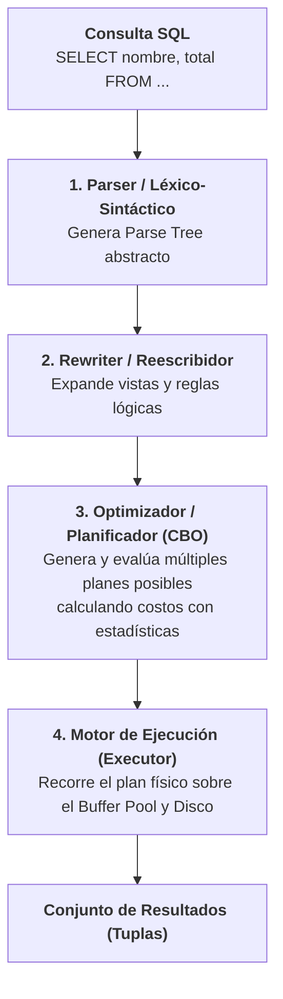
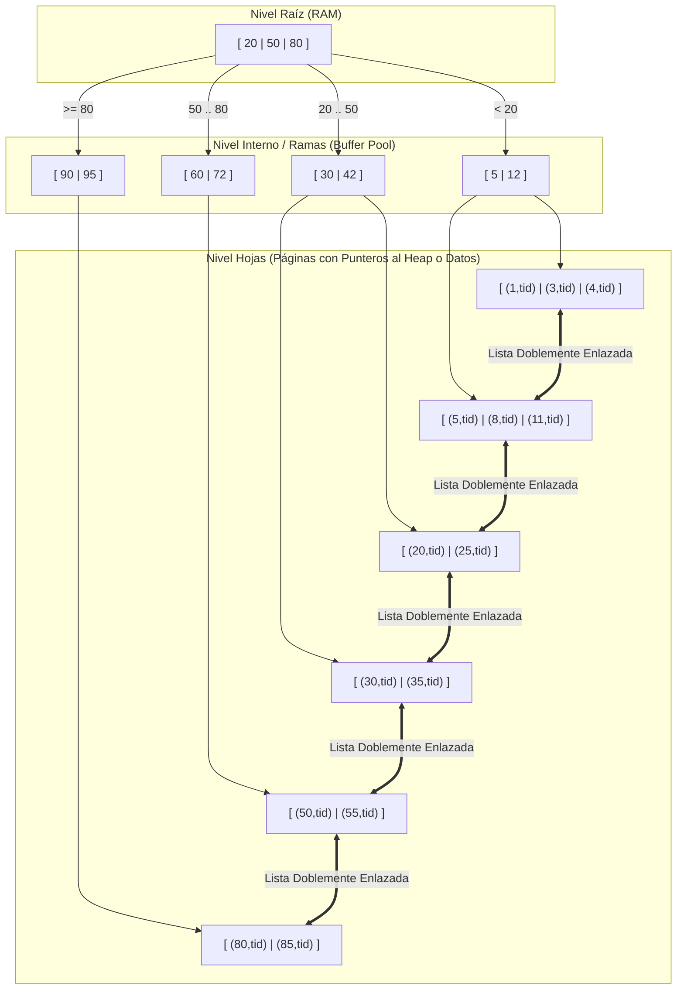

# Optimización de Consultas e Índices B-Tree / B+Tree

En los Sistemas de Gestión de Bases de Datos Relacionales (RDBMS) modernos como PostgreSQL, Oracle y MySQL (InnoDB), la velocidad con la que se resuelven las consultas sobre millones de registros no depende de la suerte ni de trucos sintácticos aislados, sino de la interacción profunda entre el **Optimizador de Consultas Basado en Costos (CBO)** y las estructuras físicas de almacenamiento en disco, principalmente el **Índice B+Tree**.

Esta nota profundiza y expande lo introducido en [[Indixacion y procesos almacenados]] y [[SQL]], analizando la mecánica física de las páginas de disco, el álgebra relacional interna, la matemática del B+Tree y el diagnóstico avanzado mediante `EXPLAIN ANALYZE`.

> [!info] 💡 ¿Cómo entender esto desde cero? (Guía para novatos de pregrado)
> - **El problema de buscar una palabra en un libro de 1,000 páginas:**
>   - **Escaneo Secuencial (Seq Scan):** Lees el libro hoja por hoja desde la página 1 hasta la 1,000 buscando la palabra "algoritmo". Si el libro tiene 1 millón de páginas, tu base de datos colapsa y la CPU se pone al 100%.
>   - **Índice B+Tree:** Vas al índice alfabético al final del libro. En 3 saltos encuentras: "algoritmo -> páginas 45, 120, 890". Vas directamente a esas páginas sin leer el resto del libro.
> - **¿Por qué B+Tree y no un Árbol Binario (AVL)?** Un disco duro o SSD lee bloques enteros de 8 KB de golpe. Un árbol binario solo tiene 2 ramas por nodo, por lo que tendrías que hacer 30 lecturas de disco lentas para encontrar un dato. Un B+Tree tiene cientos de ramas por nodo (un factor de ramificación gigante), logrando que una tabla con 100 millones de filas se busque en apenas 3 o 4 lecturas de disco.

---

## 1. El Optimizador de Consultas Basado en Costos (CBO)

El lenguaje [[SQL]] es puramente **declarativo**: el desarrollador le indica al motor *qué* datos desea obtener, pero no *cómo* localizarlos físicamente en los discos o memoria. La transformación de una sentencia SQL en una secuencia ejecutable de instrucciones es responsabilidad del motor relacional:



### Del Texto SQL al Árbol del Álgebra Relacional
El optimizador descompone la consulta en operadores formales del álgebra relacional:
* **Selección ($\sigma$):** Filtros de filas condicionales (`WHERE`).
* **Proyección ($\pi$):** Selección de columnas específicas (`SELECT`).
* **Reunión / Join ($\bowtie$):** Algoritmos de combinación (`Nested Loop`, `Hash Join`, `Merge Join` — ver [[Joins en SQL]]).
* **Agrupación y Orden ($\gamma, \tau$):** Operaciones de `GROUP BY` y `ORDER BY`.

---

### Modelo Matemático de Costos
El Optimizador no mide el costo de un plan en segundos, sino en **unidades de costo arbitrarias** que simulan el impacto en hardware. En PostgreSQL, el costo se estima con base en parámetros configurables:
* `seq_page_cost` ($1.0$): Costo de leer secuencialmente una página de disco de 8 KB.
* `random_page_cost` ($4.0$ por defecto en HDDs magnéticos; se calibra a $1.1 - 1.5$ en unidades de estado sólido SSD NVMe).
* `cpu_tuple_cost` ($0.01$): Costo de procesamiento de la CPU por cada tupla analizada en memoria.
* `cpu_index_tuple_cost` ($0.005$): Costo de procesar una entrada de índice en memoria.
* `cpu_operator_cost` ($0.0025$): Costo de evaluar un operador de comparación o función en el `WHERE`.

$$\text{Costo Total} \approx (N_{\text{páginas secuenciales}} \times \text{seq\_cost}) + (N_{\text{páginas aleatorias}} \times \text{random\_cost}) + (N_{\text{tuplas}} \times \text{cpu\_cost})$$

### Estadísticas del Sistema (`pg_statistic` / `pg_stats`)
Para calcular estos números con precisión, el demonio `ANALYZE` mantiene actualizados metadatos cruciales de cada tabla:
1. **Histogramas de Rango (`histogram_bounds`):** Dividen el universo de valores de una columna en cubetas de igual frecuencia para predecir la selectividad de consultas de rango (`WHERE fecha BETWEEN '2026-01-01' AND '2026-06-30'`).
2. **Valores Más Comunes (MCV - *Most Common Values* y `most_common_freqs`):** Lista los valores que aparecen con frecuencia atípica y su porcentaje exacto de ocurrencia.
3. **Correlación Física (`correlation`):** Mide el alineamiento estadístico entre el orden lógico de las claves y su orden físico real en las páginas de disco. Una correlación cercana a $+1.0$ o $-1.0$ hace que los escaneos de índice sean masivamente más rápidos.

---

## 2. Estructura Física y Matemática del B+Tree

Los árboles binarios clásicos en memoria RAM (como AVL o Red-Black Trees) son completamente inadecuados para motores de bases de datos persistentes en disco:
* **Fallo de los Árboles Binarios:** Para almacenar $10^7$ tuplas, un árbol binario tiene una altura $h \approx \log_2(10^7) \approx 24$ niveles. Dado que cada nodo reside potencialmente en una página de disco distinta, buscar un registro requeriría hasta 24 accesos aleatorios de I/O a disco. Con una latencia mecánica de disco de 10 ms por lectura, ¡una sola búsqueda demoraría 240 ms!

### La Solución: El Árbol B+ (B+Tree)
El B+Tree es un árbol balanceado de búsqueda m-aria diseñado específicamente para coincidir con el tamaño de los bloques de almacenamiento secundario (páginas de 8 KB).



### Propiedades Clave del B+Tree:
1. **Nodos Internos Delgados:** Almacenan **únicamente claves guía de separación y punteros de página**. No contienen datos de tuplas. Esto permite un **factor de ramificación (*fan-out*) masivo** ($B \approx 100 \text{ a } 500$).
2. **Todas las Tuplas en las Hojas:** Todo puntero físico a la tabla (*Tuple ID / CTID* `(block_id, offset)`) reside exclusivamente en los nodos hoja.
3. **Lista Doblemente Enlazada en Hojas:** Todas las páginas hoja están unidas entre sí horizontalmente mediante punteros `prev` y `next`. Una búsqueda de rango (`WHERE id BETWEEN 5 AND 50`) solo navega una vez desde la raíz hasta la hoja del valor $5$, y luego recorre linealmente la lista de hojas en disco hacia adelante, sin necesidad de re-escalar el árbol.

### Altura Matemática y Fan-Out ($B$)
La altura $h$ de un B+Tree que almacena $N$ registros con factor de ramificación $B$ se rige por:

$$h \le \left\lceil \log_B \left( \frac{N}{2} \right) \right\rceil + 1$$

* **Ejemplo Real con $B = 200$:**
  * Nivel 1 (Raíz): 1 página $\implies$ hasta 200 punteros.
  * Nivel 2: 200 páginas $\implies$ hasta 40,000 punteros.
  * Nivel 3: 40,000 páginas $\implies$ hasta 8,000,000 punteros.
  * Nivel 4: 8,000,000 páginas $\implies$ **¡1,600,000,000 registros!**

> [!tip] Eficiencia de Caché
> Para una tabla de **100 millones de registros**, un B+Tree tiene una altura de apenas **3 o 4 niveles**. Dado que la raíz y los niveles intermedios residen casi permanentemente en la memoria RAM (*Buffer Cache*), localizar cualquier tupla individual toma **a lo sumo 1 lectura física de disco**.

---

## 3. Tipos de Escaneos de Consultas en el Motor

Cuando el optimizador elige la estrategia de acceso a una tabla, selecciona entre cuatro métodos principales:

| Tipo de Escaneo | Mecánica Física | Cuándo lo Elige el Optimizador |
| :--- | :--- | :--- |
| **Sequential Scan (`Seq Scan`)** | Lee secuencialmente todas las páginas de la tabla Heap desde la primera hasta la última. | Tablas pequeñas, o consultas cuya condición devuelve más del 15%-25% de la tabla. El I/O secuencial continuo y el *read-ahead* del kernel superan a los saltos aleatorios de índice. |
| **Index Scan** | Atraviesa el B+Tree para hallar los CTIDs y realiza lecturas aleatorias individuales a las páginas del Heap por cada fila coincidente. | Consultas altamente selectivas que recuperan una pequeña fracción de tuplas (e.g., `< 5%`). |
| **Index Only Scan** | Todas las columnas requeridas (`SELECT` y `WHERE`) están contenidas en el propio índice (*Covering Index* / `INCLUDE`). Si la página está limpia en el *Visibility Map*, **no se accede al Heap**. | Consultas donde el índice cubre la totalidad de los datos solicitados. Es el acceso más rápido posible. |
| **Bitmap Index Scan** | Fase 1: Recorre uno o más índices y construye un mapa de bits en RAM indicando qué páginas y offsets coinciden. Realiza operaciones `AND`/`OR` bit a bit entre índices.<br/>Fase 2: `Bitmap Heap Scan` lee las páginas físicas del disco ordenadamente para no repetir lecturas. | Selectividad intermedia (5% a 15%), o cuando se combinan múltiples condiciones `WHERE colA = 1 AND colB = 2` indexadas por separado. |

---

## 4. Reglas de Oro para la Creación de Índices

### A. La Regla del Prefijo Más a la Izquierda (*Leftmost Prefix Rule*)
Al definir un índice compuesto sobre múltiples columnas:
```sql
CREATE INDEX idx_pedidos_compuesto ON pedidos (cliente_id, fecha, estado);
```
El motor solo puede aprovechar este índice para consultas que incluyan las columnas en orden comenzando desde el extremo izquierdo:
* ✅ `WHERE cliente_id = 5` (Usa el índice).
* ✅ `WHERE cliente_id = 5 AND fecha = '2026-09-28'` (Usa el índice óptimamente).
* ✅ `WHERE cliente_id = 5 AND fecha >= '2026-01-01' AND estado = 'ENTREGADO'` (Usa el índice).
* ❌ `WHERE fecha = '2026-09-28'` (No puede usar el índice: el prefijo izquierdo `cliente_id` no fue provisto).
* ❌ `WHERE estado = 'ENTREGADO'` (Completamente inútil).

---

### B. Predicados No Sargables (*Non-SARGable*)
Un predicado es **SARGable** (*Search Argument Able*) si el motor puede usar el índice para delimitar un rango de búsqueda directo. Envolver columnas en funciones o transformaciones destruye la sargabilidad:

| Consulta No-SARGable (Lenta - Fuerza `Seq Scan`) | Consulta SARGable Optimizada (Rápida - Usa Índice) |
| :--- | :--- |
| `WHERE UPPER(email) = 'ALICE@EXAMPLE.COM'` | Usar índice funcional: `CREATE INDEX ON users (UPPER(email))` |
| `WHERE fecha >= NOW() - INTERVAL '7 days'` *(OK)* pero `WHERE DATE(fecha) = '2026-09-28'` *(Lenta)* | `WHERE fecha >= '2026-09-28 00:00:00' AND fecha < '2026-09-29 00:00:00'` |
| `WHERE saldo + 50 > 500` | `WHERE saldo > 450` (Despejar algebraicamente la columna) |
| `WHERE nombre LIKE '%garcia'` (Comodín al inicio) | `WHERE nombre LIKE 'garcia%'` (O usar índices trigram / GIN para full-text) |
| `WHERE CAST(telefono AS VARCHAR) = '12345'` | Evitar conversiones implícitas de tipo; comparar tipos idénticos. |

---

### C. Índices Parciales (*Partial Indexes*)
Si una tabla posee 10 millones de registros de facturas pero solo el 1% está en estado `PENDIENTE` de pago, indexar toda la tabla desperdicia disco y memoria:
```sql
-- Solo indexa las filas que realmente son objeto de búsquedas críticas
CREATE INDEX idx_facturas_pendientes ON facturas (cliente_id) 
WHERE estado = 'PENDIENTE';
```
El índice ocupará unos pocos megabytes en lugar de gigabytes, manteniéndose caliente en la memoria RAM.

---

### D. La Penalización Oculta: Sobrecarga de Escritura (*Write Overhead*)
> [!warning] La Trampa del Sobre-Indexado
> Cada índice agregado a una tabla acelera ciertas lecturas, pero **penaliza de forma directa cada `INSERT`, `UPDATE` y `DELETE`**.
> * Al insertar una tupla, el motor debe insertar entradas en el árbol B+ de cada uno de los índices existentes.
> * Las divisiones de página (*Page Splits*) en el B+Tree ocurren cuando una hoja se llena y debe fragmentarse en dos bloques de 8 KB, generando escrituras síncronas costosas y fragmentación (*Bloat*).
> * En PostgreSQL, un `UPDATE` en una columna indexada rompe la optimización **HOT (Heap-Only Tuples)**, obligando a duplicar punteros en todos los índices.

---

## 5. Análisis Práctico con `EXPLAIN ANALYZE`

La sentencia `EXPLAIN` muestra el plan del optimizador; al añadir `ANALYZE`, el motor ejecuta efectivamente la consulta, midiendo tiempos reales y consumo de memoria:

```sql
EXPLAIN (ANALYZE, BUFFERS, COSTS)
SELECT p.id, p.total, c.nombre
FROM pedidos p
JOIN clientes c ON p.cliente_id = c.id
WHERE p.fecha >= '2026-09-01' AND p.total > 500.00
ORDER BY p.total DESC
LIMIT 10;
```

### Desglose de la Salida de Ejecución:
```text
Limit  (cost=120.45..120.47 rows=10 width=45) (actual time=2.134..2.140 rows=10 loops=1)
  Buffers: shared hit=42 read=3
  ->  Sort  (cost=120.45..123.15 rows=1080 width=45) (actual time=2.132..2.136 rows=10 loops=1)
        Sort Key: p.total DESC
        Sort Method: top-N heapsort  Memory: 26kB
        ->  Nested Loop  (cost=0.57..88.20 rows=1080 width=45) (actual time=0.045..1.850 rows=1200 loops=1)
              Buffers: shared hit=42 read=3
              ->  Index Scan using idx_pedidos_fecha on pedidos p  (cost=0.28..45.10 rows=1200 width=20) (actual time=0.025..0.620 rows=1200 loops=1)
                    Index Cond: (fecha >= '2026-09-01')
                    Filter: (total > 500.00)
                    Rows Removed by Filter: 350
                    Buffers: shared hit=18 read=2
              ->  Index Scan using clientes_pkey on clientes c  (cost=0.29..0.04 rows=1 width=25) (actual time=0.001..0.001 rows=1 loops=1200)
                    Index Cond: (id = p.cliente_id)
                    Buffers: shared hit=24 read=1
Planning Time: 0.285 ms
Execution Time: 2.210 ms
```

### Puntos Críticos de Diagnóstico:
1. **`actual time=0.025..0.620`:** El primer número indica el tiempo hasta emitir la primera tupla; el segundo marca la finalización del nodo.
2. **`shared hit=42 read=3`:** 42 páginas de 8 KB se obtuvieron directamente de la memoria RAM (*Buffer Cache*), mientras que solo 3 páginas requirieron lectura física a disco (`read`).
3. **`Rows Removed by Filter: 350`:** Indica que el índice de fecha trajo 1,550 tuplas del Heap, pero 350 fueron descartadas por el filtro `total > 500.00`. Si este número fuera de cientos de miles, indicaría la necesidad imperiosa de crear un índice compuesto `(fecha, total)`.
4. **`Sort Method: top-N heapsort Memory: 26kB`:** Dado que se usó `LIMIT 10`, el motor evitó ordenar las miles de filas en disco, reteniendo únicamente las 10 mayores en un montículo (*heap*) de 26 KB en memoria.

---

## Notas relacionadas
- [[Indixacion y procesos almacenados]]
- [[SQL]]
- [[Comandos]]
- [[Subconsultas]]
- [[Joins en SQL]]
- [[Transaccion]]
- [[Vistas]]
- [[Conexion a la base datos]]
- [[Bases de Datos NoSQL y Poliglota]]
