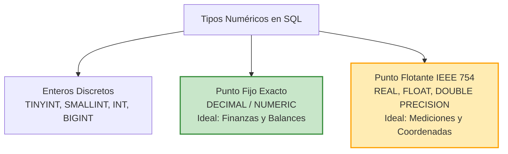
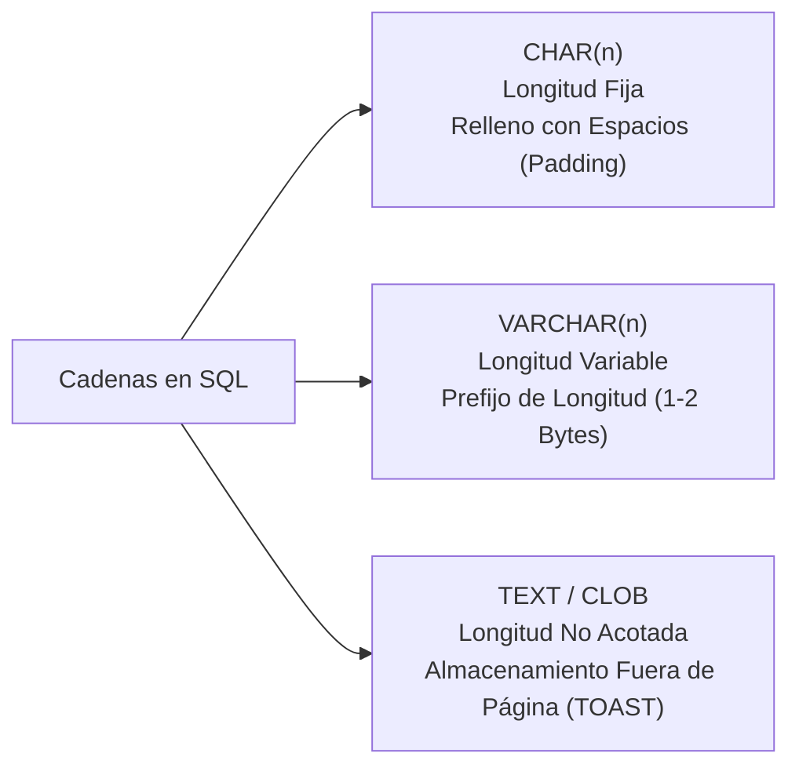

# Tipología de Datos en Sistemas de Bases de Datos Relacionales (SQL)

> [!info] Fundamento Teórico
> En el modelo relacional formulado por E. F. Codd, cada atributo de una relación está estrictamente acotado a un **dominio** de valores atómicos permitidos. En los sistemas RDBMS contemporáneos (conforme al estándar **ISO/IEC 9075 SQL:2016/2023**), la especificación del **tipo de dato** determina:
> 1. El formato de representación binaria a nivel de almacenamiento físico (disco y páginas de memoria en el *Buffer Pool*).
> 2. El conjunto de operadores algebraicos, funciones y comparaciones semánticamente válidas.
> 3. El ancho en bytes de las tuplas, impactando directamente en la altura y dispersión de los índices **B-Tree** y el rendimiento de I/O.

---

## 1. Tipos Numéricos

Los tipos de datos numéricos se dividen formalmente en tres categorías: enteros, exactos de punto fijo y aproximados de punto flotante.



### 1.1. Enteros Discretos
Almacenados en complemento a dos. No admiten decimales y permiten cálculos ultra rápidos a nivel de ALU (Unidad Aritmético Lógica).

| Tipo de Dato | Almacenamiento | Rango con Signo (Signed) | Rango sin Signo (Unsigned - MySQL) | Uso Típico |
| :--- | :--- | :--- | :--- | :--- |
| **`TINYINT`** | 1 byte (8 bits) | $-128$ a $127$ | $0$ a $255$ | Enumeraciones, meses, estados discretos, banderas. |
| **`SMALLINT`** | 2 bytes (16 bits) | $-32,768$ a $32,767$ | $0$ a $65,535$ | Años, códigos postales numéricos, edades. |
| **`INT / INTEGER`** | 4 bytes (32 bits) | $-2.14 \times 10^9$ a $2.14 \times 10^9$ | $0$ a $4.29 \times 10^9$ | Claves primarias estándar, contadores medianos. |
| **`BIGINT`** | 8 bytes (64 bits) | $-9.22 \times 10^{18}$ a $9.22 \times 10^{18}$ | $0$ a $1.84 \times 10^{19}$ | PKs de sistemas masivos (redes sociales, logs, transacciones bancarias). |

### 1.2. Numéricos Exactos de Punto Fijo: `DECIMAL(p, s)` y `NUMERIC(p, s)`
* **Definición:**
  - $p$ (**Precisión**): Cantidad total de dígitos significativos admisibles (del 1 al 1000 en PG, o 1 a 38 en SQL Server).
  - $s$ (**Escala**): Cantidad de dígitos situados a la derecha del separador decimal ($0 \le s \le p$).
  - Ejemplo: `DECIMAL(8, 2)` admite números de hasta $999999.99$.
* **Mecanismo de Almacenamiento:** No utilizan la representación binaria en potencias de 2; se almacenan en formato empaquetado en base 10 (Binary Coded Decimal o grupos de enteros de 4 o 8 bytes por bloque de dígitos).
* **Aplicación:** **Mandatorio en aplicaciones financieras, contables y de facturación**. Garantiza ausencia total de error por redondeo en sumas y multiplicaciones acumulativas.

### 1.3. Numéricos Aproximados de Punto Flotante: `FLOAT` y `DOUBLE PRECISION`
* **Definición:** Implementan el estándar **IEEE 754** para coma flotante binaria:
  - `REAL` / `FLOAT(24)`: Precisión simple (4 bytes, ~6-7 dígitos de precisión decimal).
  - `DOUBLE PRECISION` / `FLOAT(53)`: Precisión doble (8 bytes, ~15-17 dígitos de precisión decimal).
* **El Peligro del Redondeo Binario:** En base 2, fracciones decimales simples como $0.1$ o $0.2$ son números periódicos infinitos.

```sql
-- Demostración de discrepancia de punto flotante en SQL
SELECT (0.1::FLOAT8 + 0.2::FLOAT8) = 0.3::FLOAT8 AS igualdad_float; 
-- Retorna FALSE debido al residuo infinitesimal residual en IEEE 754
```

> [!warning] Regla de Oro en Finanzas
> **NUNCA utilices `FLOAT` o `DOUBLE` para saldos bancarios o precios.** Un error de $0.000000000000001$ multiplicado por millones de transacciones descuadra un balance contable. Utiliza siempre `NUMERIC` o `DECIMAL`. Reserva los tipos flotantes exclusivamente para cálculos científicos, modelado 3D o coordenadas GPS.

---

## 2. Tipos de Cadenas de Caracteres y Texto



### 2.1. `CHAR(n)` (Longitud Fija)
- Almacena cadenas de tamaño exactamente $n$. Si el texto introducido tiene menos caracteres, el motor rellena automáticamente el espacio restante con caracteres en blanco (*blank padding*).
- **Cuándo Usarlo:** Cadenas de tamaño intrínsecamente constante:
  - Códigos ISO de países (`CHAR(2)`: `'CO'`, `'MX'`, `'ES'`).
  - Hashes criptográficos (`CHAR(64)` para SHA-256).
  - UUIDs canónicos sin formato nativo (`CHAR(36)`).

### 2.2. `VARCHAR(n)` (Longitud Variable)
- Almacena cadenas de hasta $n$ caracteres. Ocupa físicamente únicamente la longitud real del texto más un prefijo de cabecera (1 byte si $n \le 255$, 2 bytes si $n > 255$) que codifica la longitud en bytes.
- **Cuándo Usarlo:** Nombres, apellidos, correos electrónicos, direcciones y descripciones con límite conocido.

### 2.3. `TEXT` / `CLOB` (Cadenas Extensas)
- Almacenamiento de grandes volúmenes de texto (artículos, logs, código fuente).
- **Almacenamiento Fuera de Página (Out-of-line Storage):** Los registros de una tabla residen en páginas de memoria y disco fijas (típicamente 8 KB). Si un texto supera el umbral de la página:
  - **PostgreSQL (TOAST - The Oversized-Attribute Storage Technique):** Comprime el texto de forma transparente y lo traslada a una tabla física secundaria auxiliar, dejando un puntero de 18 bytes en la tupla original.
  - **SQL Server:** Asigna páginas LOB (*Large Object*).

### 2.4. Codificaciones (*Encoding*) y Reglas de Ordenación (*Collation*)
- **Codificación:** Mapea caracteres a bytes. Se recomienda unánimemente **UTF-8** (`utf8mb4` en MySQL para garantizar soporte al plano suplementario de 4 bytes, emojis y símbolos internacionales; el obsoleto `utf8` de MySQL solo usaba 3 bytes).
- **Collation (Intercalación):** Regula el orden alfabético y la igualdad en comparaciones:
  - `_ci` (*Case-Insensitive*): No distingue entre mayúsculas y minúsculas (`'admin' = 'ADMIN'`).
  - `_cs` (*Case-Sensitive*): Distingue mayúsculas de minúsculas.
  - `_ai` (*Accent-Insensitive*): Trata `'café'` igual que `'cafe'`.
  - `_bin` (*Binary*): Compara directamente los valores de los bytes del punto de código Unicode.

---

## 3. Tipos Temporales (Fechas, Horas e Intervalos)

| Tipo Estándar | Tamaño | Formato Representación | Descripción Semántica |
| :--- | :--- | :--- | :--- |
| **`DATE`** | 4 bytes | `YYYY-MM-DD` | Solo fecha calendárica (año 0001 al 9999). Sin hora ni zona horaria. |
| **`TIME`** | 8 bytes | `HH:MM:SS.ssssss` | Hora del día con precisión de microsegundos. |
| **`TIMESTAMP`** | 8 bytes | `YYYY-MM-DD HH:MM:SS` | Marca temporal completa *sin* zona horaria (hora de pared / local). |
| **`TIMESTAMPTZ`** | 8 bytes | UTC normalizado | Marca temporal *con* zona horaria. Almacena en UTC y proyecta según la sesión. |
| **`INTERVAL`** | 16 bytes | `1 year 2 mons 3 days 04:05:06` | Lapso de tiempo medible, soporte para aritmética de fechas. |

*(Para una profundización matemática y algorítmica sobre funciones temporales, véase la nota especializada [[Fechas]]).*

---

## 4. Tipos Booleanos y Binarios

### 4.1. `BOOLEAN` y la Lógica Trivalente de SQL (3VL)
A diferencia de los lenguajes de programación convencionales basados en el Álgebra de Boole binaria ($\{\text{TRUE}, \text{FALSE}\}$), SQL opera bajo la **Lógica Trivalente de Lukasiewicz** ($\{\text{TRUE}, \text{FALSE}, \text{UNKNOWN}\}$), donde `UNKNOWN` es el valor resultante de operar con `NULL`:

```sql
-- Tablas de verdad de la lógica trivalente en SQL
-- TRUE AND UNKNOWN    => UNKNOWN
-- FALSE AND UNKNOWN   => FALSE
-- TRUE OR UNKNOWN     => TRUE
-- FALSE OR UNKNOWN    => UNKNOWN
-- NOT UNKNOWN         => UNKNOWN
```

> [!note] Compatibilidad
> PostgreSQL soporta `BOOLEAN` nativo (1 byte). Motores como MySQL históricamente mapean `BOOLEAN` como sinónimo de `TINYINT(1)`, donde `1 = TRUE` y `0 = FALSE`.

### 4.2. `BLOB` (Binary Large Object) y `BYTEA`
- Diseñados para secuencias arbitrarias de bytes en bruto (imágenes binarias, documentos PDF, firmas criptográficas, modelos entrenados).

> [!tip] Decisión de Arquitectura: ¿BLOB en Base de Datos u Object Storage?
> - **Almacenar en Base de Datos (`BLOB` / `BYTEA`):** Garantiza coherencia transaccional ACID estricta y copias de seguridad unificadas. **Desventaja:** Degrada severamente el rendimiento del *Buffer Cache*, satura el ancho de banda del motor y dispara los costos de almacenamiento premium en el RDBMS.
> - **Patrón Recomendado en Ingeniería:** Almacenar el archivo binario en un almacén de objetos de alta escalabilidad (como **Amazon S3**, Google Cloud Storage o MinIO) y persistir en la tabla relacional únicamente la URL/URI (`VARCHAR(512)`), el hash MD5/SHA-256 (`CHAR(64)`) y los metadatos.

---

## 5. Tipos Semi-Estructurados: `JSON` vs. `JSONB`

La convergencia relacional con estructuras de documentos no normalizadas se consolidó en motores modernos (especialmente PostgreSQL):

| Característica | `JSON` (Texto Plano Validado) | `JSONB` (Binario Descompuesto e Indexable) |
| :--- | :--- | :--- |
| **Formato de Almacenamiento** | Copia exacta del texto entrante (con espacios y sangrías). | Formato binario descompuesto en árbol de claves y valores. |
| **Velocidad de Inserción** | Muy rápida ($O(1)$, solo parsea sintaxis). | Ligeramente más lenta (descompone y estructura en binario). |
| **Velocidad de Consulta / Búsqueda** | Lenta (debe re-parsear el string en cada ejecución). | Ultra rápida (acceso directo indexado a propiedades). |
| **Duplicidad de Claves** | Conserva claves duplicadas y orden original. | Elimina claves duplicadas (prevalece la última) y reordena. |
| **Indexación** | Solo índices sobre expresiones extraídas. | **Soporte completo de índices GIN (*Generalized Inverted Index*)**. |

```sql
-- Demostración de uso avanzado de JSONB en PostgreSQL
CREATE TABLE configuraciones_usuario (
    usuario_id INT PRIMARY KEY,
    perfil JSONB NOT NULL
);

INSERT INTO configuraciones_usuario VALUES (
    101, 
    '{"tema": "dark", "notificaciones": {"email": true, "sms": false}, "idiomas": ["es", "en"]}'
);

-- Búsqueda eficiente utilizando operadores de contención JSONB
SELECT usuario_id 
FROM configuraciones_usuario 
WHERE perfil @> '{"tema": "dark"}';

-- Acceso tipado a campos anidados: -> retorna JSON, ->> retorna TEXT
SELECT 
    usuario_id,
    perfil->'notificaciones'->>'email' AS email_notif_activo
FROM configuraciones_usuario;

-- Creación de un índice GIN para búsquedas a escala en milisegundos
CREATE INDEX idx_config_perfil_gin ON configuraciones_usuario USING GIN (perfil);
```

---

## 6. Buenas Prácticas de Selección de Tipos y Optimización

1. **Alineación de Páginas y Huella de Memoria:** Seleccionar el tipo de menor tamaño físico admisible (`SMALLINT` vs `BIGINT`). Los índices B-Tree almacenan más claves por nodo cuando los tipos son compactos, reduciendo la altura del árbol ($O(\log_B N)$) y las lecturas de disco.
2. **Definir Restricciones de Longitud Adecuadas:** Aunque un campo sea `VARCHAR`, acotarlo (`VARCHAR(100)` vs `VARCHAR(MAX)`) ayuda al optimizador de consultas a estimar adecuadamente el uso de memoria (*Memory Grants*) al realizar ordenamientos (`ORDER BY`) y agrupaciones (`GROUP BY`).
3. **Coherencia en Tipos de Claves Foráneas:** La columna clave foránea debe coincidir **exactamente** en tipo de dato, precisión y escala con la clave primaria que referencia. Si una es `INT` y la otra `BIGINT`, el optimizador no podrá realizar uniones mediante *Index Seek* directo sin conversiones implícitas (*Implicit Conversion Overhead*), invalidando el índice.

---

## Notas relacionadas
- [[Insertar datos]]
- [[Fechas]]
- [[Subconsultas]]
- [[SQL]]
- [[Comandos]]
- [[Transaccion]]
