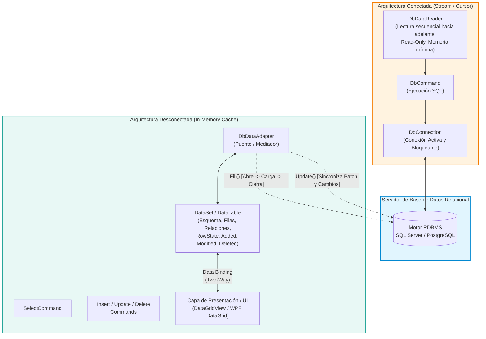
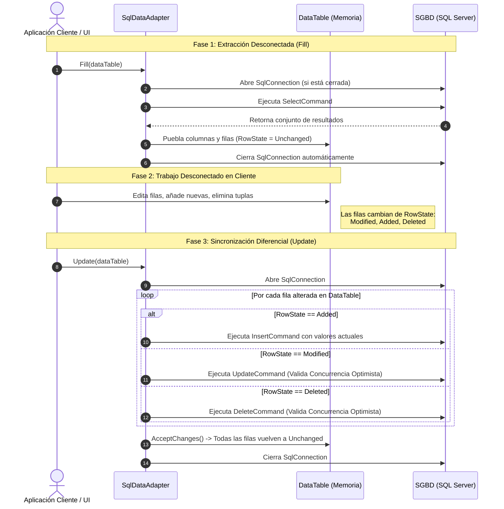

# Patrón SQL DataAdapter y Arquitectura Desconectada de Datos

> [!info] Definición Formal
> En el marco de la ingeniería de software y el acceso a bases de datos relacionales (especialmente consolidado en el ecosistema **ADO.NET** de Microsoft), un **DataAdapter** es un componente de software que implementa el patrón estructural *Adapter* y el patrón de comportamiento *Mediator*. Su función primordial es actuar como un **puente bidireccional desacoplado** entre un almacén de datos físico (como Microsoft SQL Server, PostgreSQL u Oracle) y una estructura de memoria en el cliente (como un `DataSet` o `DataTable`), permitiendo la manipulación de datos en un modelo de **arquitectura desconectada**.

---

## 1. Arquitectura Conectada vs. Desconectada

El diseño de acceso a datos en sistemas de información se fundamenta en dos grandes paradigmas:



### 1.1. Arquitectura Conectada (`DbConnection`, `DbCommand`, `DbDataReader`)
* **Mecanismo:** Requiere mantener un socket de red y una sesión activa y dedicada con el motor durante todo el proceso de consulta e iteración.
* **Componentes:** `SqlConnection`, `SqlCommand`, `SqlDataReader`.
* **Características:**
  - El `DataReader` provee un flujo de datos secuencial hacia adelante y de solo lectura (*forward-only, read-only stream*).
  - Máxima eficiencia en consumo de memoria RAM en el cliente, ideal para procesar grandes volúmenes de datos donde no se requiere edición en pantalla.
  - **Desventaja:** Bloquea la conexión; si la lógica de negocio tarda en procesar cada fila, retiene un hilo de ejecución y recursos de conexión en el servidor (*connection starvation*).

### 1.2. Arquitectura Desconectada (`DbDataAdapter`, `DataSet`, `DataTable`)
* **Mecanismo:** La conexión a la base de datos se abre únicamente durante el microsegundo necesario para extraer datos o volcar modificaciones; el resto del tiempo la aplicación opera sobre una copia local en memoria.
* **Componentes en Memoria:**
  - **`DataSet`:** Representación en memoria de una base de datos relacional completa, con soporte para múltiples tablas, relaciones (`DataRelation`) y restricciones (`UniqueConstraint`, `ForeignKeyConstraint`).
  - **`DataTable`:** Representación tabular con esquema tipado (`DataColumnCollection`) y colección de tuplas (`DataRowCollection`).
  - **`DataRow`:** Registro individual que almacena no solo los valores actuales, sino su historial de cambios y su estado transaccional.
  - **`DataView`:** Vista personalizada de un `DataTable` para filtrado, ordenamiento y enlace de datos.

### 1.3. Tabla Comparativa de Paradigmas

| Criterio | Arquitectura Conectada (`SqlDataReader`) | Arquitectura Desconectada (`SqlDataAdapter` / `DataTable`) |
| :--- | :--- | :--- |
| **Tiempo de Conexión** | Abierta de forma continua mientras se leen los datos. | Abierta transitoriamente durante `Fill()` y `Update()`. |
| **Uso de Memoria Cliente** | Mínimo ($O(1)$ por fila procesada). | Alto ($O(N)$ proporcional al tamaño del conjunto de datos en RAM). |
| **Navegabilidad** | Unidireccional hacia adelante (solo `Read()`). | Bidireccional, indexada aleatoria (`Rows[i]`), ordenable y filtrable. |
| **Capacidad de Edición** | Solo lectura directa. | Lectura y escritura en memoria con seguimiento de auditoría. |
| **Soporte Concurrencia** | Bloqueos en servidor si se mantiene transacción. | Concurrencia optimista (*Optimistic Concurrency*) en cliente. |
| **Casos de Uso Típicos** | Servicios REST, APIs de alto rendimiento, ETLs. | Aplicaciones de escritorio ricas (WinForms/WPF), trabajo offline. |

---

## 2. Ciclo de Vida y Mecanismos Internos del DataAdapter

El `SqlDataAdapter` encapsula cuatro comandos SQL (`SelectCommand`, `InsertCommand`, `UpdateCommand`, `DeleteCommand`).



### 2.1. El Método `Fill()`
1. Examina el estado de la conexión asignada a `SelectCommand`. Si la conexión está cerrada, la abre de forma explícita.
2. Ejecuta la consulta SQL y crea la estructura de columnas en el `DataTable` si aún no existe.
3. Transfiere cada fila desde el flujo de red hacia objetos `DataRow`.
4. Establece el `DataRowState` de cada fila importada en `Unchanged`.
5. Si `Fill()` abrió la conexión originalmente, procede a **cerrarla inmediatamente**, devolviéndola al [[Conexion a la base datos#Connection Pooling|Connection Pool]].

### 2.2. Seguimiento de Estados de Fila (`DataRowState` y `DataRowVersion`)
Cada `DataRow` almacena múltiples copias de los valores de sus campos según el estado de la edición:
- **`DataRowState`:**
  - `Unchanged`: Sin modificaciones desde el último `Fill()` o `AcceptChanges()`.
  - `Added`: Creada en memoria, pendiente de inserción en el SGBD.
  - `Modified`: Uno o más campos han cambiado respecto a la versión original.
  - `Deleted`: Marcada para borrado mediante `row.Delete()`.
  - `Detached`: Creada pero aún no incorporada a una colección de filas.
- **`DataRowVersion`:**
  - `Original`: Valores que la fila poseía al momento de ser extraída del servidor.
  - `Current`: Valores presentes en la fila tras las modificaciones del usuario.
  - `Proposed`: Valores provisionales durante una transacción de edición interna (`BeginEdit()`).

### 2.3. El Método `Update()` y Control de Concurrencia Optimista
Al invocar `adapter.Update(dataTable)`:
1. El adaptador itera sobre las filas cuyo `RowState != Unchanged`.
2. Para cada fila modificada (`Modified`), ejecuta el `UpdateCommand` parametrizado.
3. **Detección de Colisiones (Optimistic Concurrency Control):** Para garantizar que otro usuario no haya alterado la fila en el servidor mientras el cliente trabajaba desconectado, el comando SQL compara en su cláusula `WHERE` los valores de la clave primaria y **todas las columnas originales** (o una columna de versión / timestamp):
   ```sql
   UPDATE Clientes 
   SET Nombre = @NuevoNombre, Email = @NuevoEmail
   WHERE Id = @OriginalId AND Nombre = @OriginalNombre AND Email = @OriginalEmail;
   ```
4. Si otra transacción modificó la fila en el servidor, la condición `WHERE` falla y la cantidad de filas afectadas devuelta por la consulta es `0`. Al detectar cero filas afectadas, el adaptador lanza inmediatamente una excepción del tipo **`DBConcurrencyException`**, evitando la sobrescritura silenciosa (*Lost Update Problem*).
5. Si la operación es exitosa, se invoca automáticamente `AcceptChanges()`, consolidando la versión `Current` como la nueva versión `Original`.

---

## 3. Enlace de Datos (Data Binding) y Separación de Responsabilidades

En aplicaciones cliente enriquecidas (Windows Forms, WPF, Avalonia):
- El componente visual `DataGridView` se asocia directamente a un `DataTable` o `DataView` mediante su propiedad `DataSource`.
- **Mapeo Bidireccional (*Two-Way Binding*):** Cuando el usuario final modifica una celda en el grid o presiona la tecla de eliminar fila, el control visual notifica al `DataTable` subyacente, el cual actualiza el estado de la fila (`Modified` o `Deleted`) de forma transparente.

> [!warning] Violación Arquitectónica: Acoplamiento UI vs. Capa de Acceso a Datos
> En arquitecturas empresariales modernas (Domain-Driven Design, Clean Architecture, Onion Architecture), **el enlace directo de controles UI a estructuras `DataTable` se considera un anti-patrón de acoplamiento severo**:
> 1. **Falta de Tipado Estático:** Las columnas de un `DataTable` se consultan por índice o string (`row["Saldo"]`), lo que desplaza los errores de tipado a tiempo de ejecución en lugar de detectarse en tiempo de compilación.
> 2. **Violación del Principio de Responsabilidad Única (SRP):** La interfaz gráfica termina conociendo detalles de bajo nivel del esquema relacional (nombres de columnas físicas de la base de datos).
> 3. **Imposibilidad de Pruebas Unitarias:** Resulta inviable probar la lógica de negocio sin instanciar componentes visuales pesados o conexiones a bases de datos.

---

## 4. Comparación con Paradigmas y ORMs Contemporáneos

La industria de software evolucionó desde el patrón DataAdapter hacia patrones de abstracción de mayor nivel:

```
[SQL Nativo / DataAdapter] -> [Patrón DAO / Active Record] -> [Micro-ORMs (Dapper)] -> [ORMs Completos (EF Core / Hibernate)]
```

| Tecnología / Patrón | Ecosistema | Nivel de Abstracción | Change Tracking | Seguridad SQLi Nativa |
| :--- | :--- | :--- | :--- | :--- |
| **SqlDataAdapter / DataTable** | .NET (ADO.NET) | Bajo (Orientado a Tuplas Relacionales) | Manual vía `DataRowState` | Requiere parametrización manual o `CommandBuilder` |
| **DAO / Repository Pattern** | Agnóstico (Java, C#, Go) | Medio (Abstrae operaciones CRUD) | Depende de la implementación | Depende de la capa subyacente |
| **Dapper** | .NET | Micro-ORM (Mapeo rápido de consultas a POCOs) | Sin Change Tracking (Stateless) | Obliga al uso de objetos anónimos parametrizados |
| **Entity Framework Core** | .NET | Full ORM (Mapeo Objeto-Relacional rico) | Automático en memoria vía `ChangeTracker` | 100% parametrizado por motor LINQ |
| **Hibernate / JPA** | Java | Full ORM | Automático (Dirty Checking en `EntityManager`) | Parametrizado vía HQL / Criteria API |
| **SQLAlchemy** | Python | Full ORM / Expression Language | Automático (`Session`, Unit of Work) | Parametrizado mediante Core / ORM |

### Riesgos de Inyección SQL y el Peligro de `SqlCommandBuilder`
El uso de `SqlCommandBuilder` para generar automáticamente los comandos de inserción, actualización y borrado a partir del `SelectCommand` puede simplificar el código, pero acarrea serias deficiencias:
1. Si la consulta `SELECT` utiliza joins o agregaciones, `SqlCommandBuilder` no puede inferir el esquema y falla en tiempo de ejecución.
2. La concatenación dinámica de filtros en el `SelectCommand` (`"SELECT * FROM Clientes WHERE Categoria = '" + txtCat.Text + "'"` opens **SQL Injection** de forma crítica.
3. **Regla de Oro:** Siempre deben definirse los comandos `InsertCommand`, `UpdateCommand` y `DeleteCommand` de forma explícita utilizando **consultas parametrizadas** (`SqlParameter`).

---

## 5. Implementación Completa en C#

El siguiente código ilustra la implementación rigurosa de una arquitectura desconectada con concurrencia optimista y manejo seguro de recursos mediante la instrucción `using`:

```csharp
using System;
using System.Data;
using Microsoft.Data.SqlClient;

public class RepositorioClientesDesconectado
{
    private readonly string _connectionString;

    public RepositorioClientesDesconectado(string connectionString)
    {
        _connectionString = connectionString;
    }

    /// <summary>
    /// Construye y configura el DataAdapter con sus 4 comandos SQL parametrizados.
    /// </summary>
    private SqlDataAdapter ConfigurarDataAdapter(SqlConnection connection)
    {
        var adapter = new SqlDataAdapter();

        // 1. SELECT COMMAND
        var selectCmd = new SqlCommand(
            "SELECT Id, Nombre, Saldo, VersionFila FROM Clientes;", 
            connection);
        adapter.SelectCommand = selectCmd;

        // 2. INSERT COMMAND
        var insertCmd = new SqlCommand(
            @"INSERT INTO Clientes (Nombre, Saldo) 
              VALUES (@Nombre, @Saldo);
              SELECT SCOPE_IDENTITY();", 
            connection);
        insertCmd.Parameters.Add("@Nombre", SqlDbType.NVarChar, 100, "Nombre");
        insertCmd.Parameters.Add("@Saldo", SqlDbType.Decimal, 18, "Saldo");
        adapter.InsertCommand = insertCmd;

        // 3. UPDATE COMMAND con Control de Concurrencia Optimista
        // Compara Id y la versión original de VersionFila (RowVersion / Timestamp)
        var updateCmd = new SqlCommand(
            @"UPDATE Clientes 
              SET Nombre = @Nombre, Saldo = @Saldo 
              WHERE Id = @OriginalId AND VersionFila = @OriginalVersionFila;", 
            connection);
        
        updateCmd.Parameters.Add("@Nombre", SqlDbType.NVarChar, 100, "Nombre");
        updateCmd.Parameters.Add("@Saldo", SqlDbType.Decimal, 18, "Saldo");
        
        // Mapeo hacia la versión original almacenada en memoria para validar concurrencia
        var paramId = updateCmd.Parameters.Add("@OriginalId", SqlDbType.Int, 0, "Id");
        paramId.SourceVersion = DataRowVersion.Original;

        var paramVer = updateCmd.Parameters.Add("@OriginalVersionFila", SqlDbType.Timestamp, 8, "VersionFila");
        paramVer.SourceVersion = DataRowVersion.Original;

        adapter.UpdateCommand = updateCmd;

        // 4. DELETE COMMAND
        var deleteCmd = new SqlCommand(
            "DELETE FROM Clientes WHERE Id = @OriginalId AND VersionFila = @OriginalVersionFila;", 
            connection);
        var pDelId = deleteCmd.Parameters.Add("@OriginalId", SqlDbType.Int, 0, "Id");
        pDelId.SourceVersion = DataRowVersion.Original;

        var pDelVer = deleteCmd.Parameters.Add("@OriginalVersionFila", SqlDbType.Timestamp, 8, "VersionFila");
        pDelVer.SourceVersion = DataRowVersion.Original;

        adapter.DeleteCommand = deleteCmd;

        return adapter;
    }

    public DataTable ObtenerDatosYModificar()
    {
        var dataTable = new DataTable("Clientes");

        using (var connection = new SqlConnection(_connectionString))
        {
            var adapter = ConfigurarDataAdapter(connection);

            // Fase 1: Carga en memoria desconectada
            Console.WriteLine("[INFO] Ejecutando Fill()...");
            adapter.Fill(dataTable);
        } // Conexión cerrada y devuelta al pool aquí

        // Fase 2: Trabajo desconectado en el cliente (UI / Lógica de negocio)
        if (dataTable.Rows.Count > 0)
        {
            DataRow primeraFila = dataTable.Rows[0];
            Console.WriteLine($"[INFO] Modificando cliente: {primeraFila["Nombre"]}");
            
            // Modificación en memoria: cambia DataRowState a 'Modified'
            primeraFila["Saldo"] = Convert.ToDecimal(primeraFila["Saldo"]) + 150.00m;
        }

        // Agregar una nueva fila
        DataRow nuevaFila = dataTable.NewRow();
        nuevaFila["Nombre"] = "Laura Gómez";
        nuevaFila["Saldo"] = 500.00m;
        dataTable.Rows.Add(nuevaFila); // DataRowState pasa a 'Added'

        // Fase 3: Sincronización de vuelta a la base de datos
        using (var connection = new SqlConnection(_connectionString))
        {
            var adapter = ConfigurarDataAdapter(connection);

            try
            {
                Console.WriteLine("[INFO] Ejecutando Update() diferencial...");
                int filasAfectadas = adapter.Update(dataTable);
                Console.WriteLine($"[SUCCESS] Sincronización exitosa. Filas afectadas: {filasAfectadas}");
            }
            catch (DBConcurrencyException ex)
            {
                Console.ForegroundColor = ConsoleColor.Red;
                Console.WriteLine($"[CONCURRENCY CONFLICT] La fila fue alterada por otro usuario: {ex.Message}");
                Console.ResetColor();
                // Estrategia: Recargar datos con Fill() y notificar al usuario para resolver colisión
            }
        }

        return dataTable;
    }
}
```

---

## Notas relacionadas
- [[Conexion a la base datos]]
- [[Insertar datos]]
- [[Transaccion]]
- [[SQL]]
- [[Vistas]]
