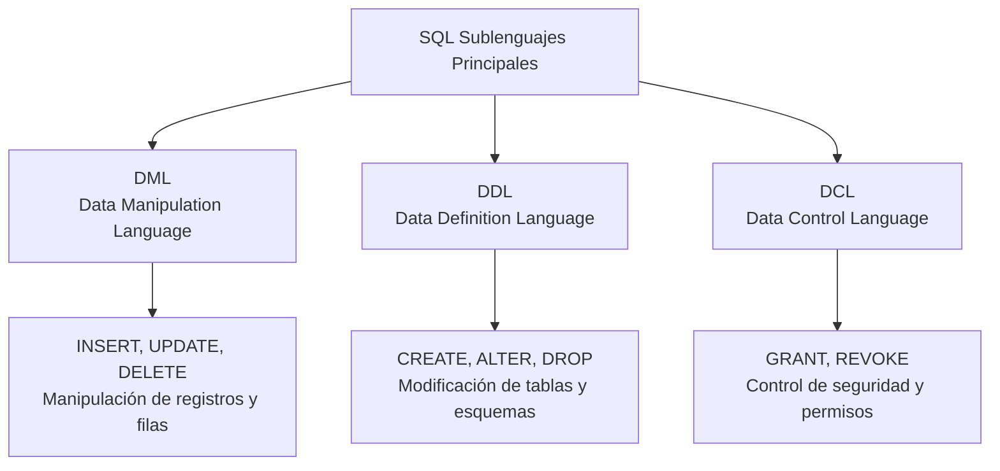

> [!info] Explicación de los sublenguajes de SQL
> SQL se divide en varios sublenguajes o categorías dependiendo de la función de sus comandos:
> - **DML (Data Manipulation Language):** Se usa para manipular los datos dentro de las tablas. Incluye `INSERT`, `DELETE`, `UPDATE`.
> - **DDL (Data Definition Language):** Se usa para definir o modificar la estructura de la base de datos y sus objetos (tablas, esquemas). Incluye `CREATE`, `DROP`, `ALTER`.
> - **DCL (Data Control Language):** Se usa para administrar los derechos y restricciones de acceso a los datos. Incluye `GRANT` y `REVOKE`.



**DML:** Insert - Delete - Update
**DDL:** Create - Drop - Alter
**DCL:** Create Roles, Users

Con DCL, el administrador puede:
- Eliminar roles de usuarios.
- Utilizar `GRANT` para otorgar permisos.
- Utilizar `REVOKE` para quitar permisos.

El flujo típico de seguridad es:
1. Se crea el superusuario o usuario administrador (`CREATE USER`).
2. El administrador otorga privilegios específicos (`GRANT`).
3. El administrador puede quitar los privilegios otorgados si es necesario (`REVOKE`).

## DCL (Data Control Language)

```sql
-- Creación de un usuario con contraseña
CREATE USER epn
WITH PASSWORD 'epn';

-- Otorgar permisos de selección, actualización y borrado sobre una tabla
GRANT SELECT, UPDATE, DELETE
ON clientes
TO epn;

-- A partir de este momento, el usuario 'epn' puede hacer:
SELECT * FROM productos;
INSERT INTO productos VALUES (...); -- Si tuviera permiso de INSERT en productos
```

## Notas relacionadas
- [[Comandos]]
- [[Principales tipo de datos]]
- [[Insertar datos]]
- [[Vistas]]
- [[Transaccion]]
