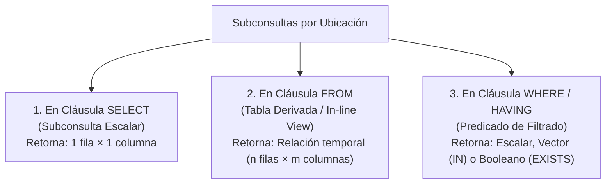
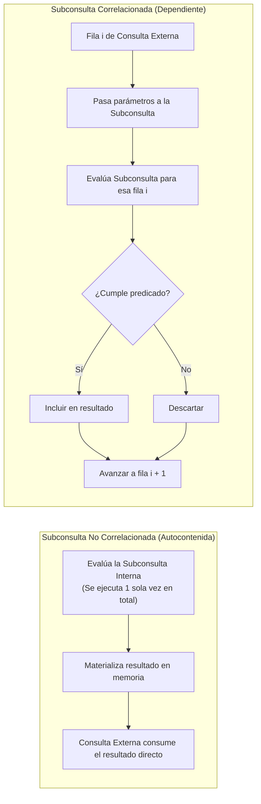

# Subconsultas en SQL (Subqueries)

> [!info] Definición Formal
> En el álgebra relacional extendida y el lenguaje SQL, una **subconsulta** (o *subquery*, consulta anidada o consulta interna) es una expresión de consulta subordinada contenida dentro de una consulta externa (*outer query*) o de otra subconsulta. Matemáticamente, representan la composición funcional de operadores relacionales, permitiendo evaluar relaciones intermedias para su consumo inmediato como **escalares**, **vectores de valores** o **relaciones derivadas**.

---

## 1. Clasificación por Ubicación Sintáctica

El estándar SQL permite ubicar subconsultas en prácticamente cualquier cláusula donde se admita una expresión o una relación:



### 1.1. Subconsultas Escalares en la Cláusula `SELECT`
Debe proyectar obligatoriamente **exactamente un valor atómico** (una única fila y una única columna). Si en tiempo de ejecución la subconsulta arroja cero filas, el motor le asigna el valor `NULL`. Si arroja dos o más filas, el motor aborta la transacción con una violación de cardinalidad (*Scalar subquery produced more than one row*).

```sql
SELECT 
    p.id,
    p.nombre,
    p.precio,
    (SELECT AVG(precio) FROM productos) AS precio_promedio_global,
    p.precio - (SELECT AVG(precio) FROM productos) AS desviacion_respecto_media
FROM productos p;
```

### 1.2. Tablas Derivadas en la Cláusula `FROM` (In-Line Views)
Actúa como una tabla virtual temporal calculada al vuelo en el plan de ejecución. Es mandatorio asignarle un alias sintáctico (`AS nombre_alias`).

```sql
SELECT 
    resumen.departamento_id,
    resumen.salario_maximo,
    d.nombre AS nombre_departamento
FROM (
    -- Tabla derivada
    SELECT departamento_id, MAX(salario) AS salario_maximo
    FROM empleados
    GROUP BY departamento_id
) AS resumen
INNER JOIN departamentos d ON resumen.departamento_id = d.id
WHERE resumen.salario_maximo > 10000;
```

### 1.3. Subconsultas en Cláusulas `WHERE` y `HAVING`
Permiten parametrizar condiciones dinámicas sin conocer valores estáticos previamente.

```sql
-- Empleados que ganan más que el promedio de su empresa
SELECT nombre, salario
FROM empleados
WHERE salario > (SELECT AVG(salario) FROM empleados);
```

---

## 2. Clasificación por Dependencia: No Correlacionadas vs. Correlacionadas



### 2.1. Subconsultas No Correlacionadas (Self-Contained)
* **Principio:** No referencian ningún atributo de las tablas presentes en la consulta externa.
* **Comportamiento del Optimizador:** Se evalúan **una sola vez** al inicio de la ejecución. El resultado intermedio se almacena en memoria temporal (*cache/spool*) y es consultado por la sentencia principal en tiempo constante.

### 2.2. Subconsultas Correlacionadas (Correlated)
* **Principio:** Hacen referencia explícita a una o más columnas de la consulta externa (actuando conceptualmente como una función parametrizada: $f(\text{tupla\_externa})$).
* **Complejidad Algorítmica:** Si el motor no logra reescribirla, la subconsulta se ejecuta de forma repetitiva para **cada una de las $N$ filas** procesadas por la consulta externa, derivando en una complejidad computacional de $O(N \times M)$ (donde $M$ es el tamaño de la tabla interna).

```sql
-- Ejemplo de Subconsulta Correlacionada: 
-- Empleados cuyo salario supera el promedio específico de SU PROPIO departamento
SELECT e.nombre, e.departamento_id, e.salario
FROM empleados e
WHERE e.salario > (
    SELECT AVG(sub.salario)
    FROM empleados sub
    WHERE sub.departamento_id = e.departamento_id -- Vínculo de correlación
);
```

---

## 3. Operadores de Pertenencia y la Trampa de los Valores NULL

### 3.1. Operadores Cuantificados: `ANY` / `SOME` y `ALL`
- `v > ALL (SELECT ...)`: Verdadero si $v$ es estrictamente mayor que todos los valores devueltos por la subconsulta (equivalente a $v > \max(\text{subconsulta})$).
- `v = ANY (SELECT ...)`: Semánticamente idéntico a `v IN (SELECT ...)`.

### 3.2. La Trampa Mortal de `NOT IN` frente a Valores `NULL`

> [!danger] Peligro Crítico en Producción: La Semántica Trivalente de `NOT IN`
> Uno de los errores de programación más costosos ocurre al contrastar conjuntos mediante `NOT IN` cuando la tabla secundaria contiene al menos un registro nulo (`NULL`).

Considérese la siguiente consulta que busca clientes que aún no han registrado compras:

```sql
SELECT id, nombre 
FROM clientes 
WHERE id NOT IN (SELECT cliente_id FROM pedidos);
```

Si en la tabla `pedidos` existe **una sola fila** donde `cliente_id` es `NULL` (por ejemplo, pedidos anónimos o invitados):
1. La expresión se expande algebraicamente como:
   $$\text{id} \neq v_1 \land \text{id} \neq v_2 \land \dots \land \text{id} \neq \text{NULL}$$
2. Según las reglas de la lógica trivalente (3VL), cualquier comparación directa contra `NULL` evalúa inexorablemente a `UNKNOWN` ($\text{id} \neq \text{NULL} \equiv \text{UNKNOWN}$).
3. La conjunción lógica resulta en:
   $$\text{TRUE} \land \text{TRUE} \land \dots \land \text{UNKNOWN} \equiv \text{UNKNOWN}$$
4. La cláusula `WHERE` únicamente devuelve tuplas cuyo predicado evalúe estrictamente a `TRUE`.
5. **Resultado Catastrófico:** **La consulta devuelve cero (0) filas**, silenciando la información sin arrojar ningún mensaje de error sintáctico.

### 3.3. La Solución Superior: `NOT EXISTS`
El predicado `EXISTS` evalúa si el conjunto generado contiene al menos una fila (cardinalidad $\ge 1$).

```sql
SELECT c.id, c.nombre
FROM clientes c
WHERE NOT EXISTS (
    SELECT 1 
    FROM pedidos p 
    WHERE p.cliente_id = c.id
);
```

#### Ventajas Determinantes de `NOT EXISTS`:
1. **Inmunidad a Nulos:** Si la tabla `pedidos` posee `cliente_id = NULL`, la igualdad `p.cliente_id = c.id` simplemente evalúa a `UNKNOWN` y se descarta; **no contamina** al resto de las comparaciones.
2. **Evaluación en Cortocircuito (Short-Circuit Optimization):** El motor no procesa todas las tuplas coincidentes de la subconsulta; en cuanto encuentra el primer registro que cumple la condición, detiene el escaneo inmediatamente (*Early-exit*).

---

## 4. Comparativa de Rendimiento: Subconsultas vs. `JOIN` vs. `CTE`

| Mecanismo | Legibilidad / Mantenimiento | Comportamiento del Optimizador (CBO) | Rendimiento Típico |
| :--- | :--- | :--- | :--- |
| **Subconsulta `IN` / `EXISTS`** | Alta en intenciones de filtrado semántico. | Los motores modernos aplican **desanidamiento** (*Subquery Flattening / Unnesting*) y lo transforman en un **Semi-Join** o **Anti-Semi-Join**. | Muy alto si se desanida; pobre si se fuerza ejecución correlacionada $O(N \times M)$. |
| **`LEFT JOIN ... WHERE right.id IS NULL`** | Tradicional, pero puede ser verborrágico. | Convierte directamente a un plan *Hash Anti-Join* o *Merge Anti-Join*. | Idéntico a un `NOT EXISTS` bien optimizado. |
| **Expresión de Tabla Común (`WITH CTE`)** | Máxima legibilidad modular (estilo top-down). | En PostgreSQL 12+, las CTEs no recursivas se integran (*inlined*) en la consulta principal por defecto, a menos que se especifique `AS MATERIALIZED`. | Excelente; permite estructurar tuberías lógicas complejas sin penalización. |

### Ejemplo: Desanidamiento con CTE
La consulta correlacionada de salarios por departamento puede reformularse de manera elegante y de alto desempeño mediante una CTE con una función de ventana (*Window Function*):

```sql
WITH EstadisticasSalario AS (
    SELECT 
        nombre,
        departamento_id,
        salario,
        AVG(salario) OVER(PARTITION BY departamento_id) AS salario_promedio_depto
    FROM empleados
)
SELECT nombre, departamento_id, salario, salario_promedio_depto
FROM EstadisticasSalario
WHERE salario > salario_promedio_depto;
```

---

## Notas relacionadas
- [[Comandos]]
- [[Insertar datos]]
- [[Principales tipo de datos]]
- [[Fechas]]
- [[SQL]]
- [[Vistas]]
