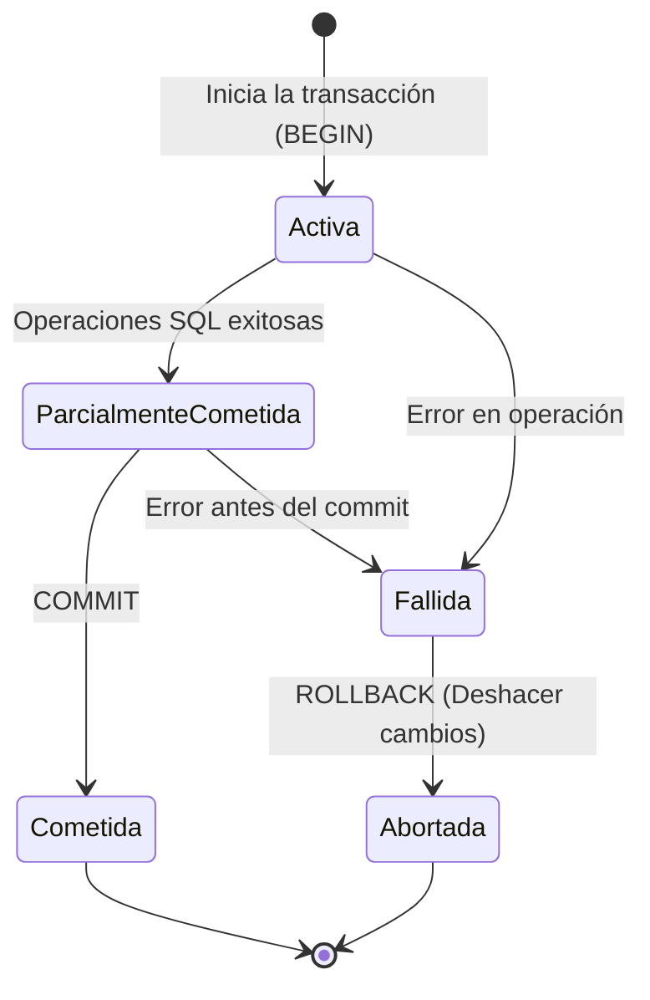

> [!info] Explicación
> Una **transacción** es un conjunto de operaciones u órdenes SQL que se ejecutan como una única unidad lógica e indivisible de trabajo. Si todo sale bien, los cambios se aplican permanentemente a la base de datos; si ocurre algún error en medio del proceso, ningún cambio se guarda, regresando la base de datos al estado previo a la transacción.

Las transacciones deben ser atómicas, consistentes, aisladas y duraderas, cumpliendo con las cuatro propiedades denominadas por sus siglas en inglés como **ACID** (*Atomicity, Consistency, Isolation, Durability*).



## Propiedades ACID

1. **_Atomicidad (Atomicity):_** Todas las operaciones dentro de una transacción se realizan como una sola unidad atómica. Si alguna operación falla, todas las operaciones previas dentro de esa transacción se deshacen (*rollback*).
2. **_Consistencia (Consistency):_** Lleva a la base de datos desde un estado válido a otro estado válido. Debe cumplir con todas las reglas definidas, como restricciones de integridad referencial, tipos de datos, etc.
3. **_Aislamiento (Isolation):_** Controla cómo y cuándo los cambios producidos por una operación se hacen visibles para las demás operaciones concurrentes. Cada transacción se ejecuta en un entorno aislado, lo que significa que no puede interferir con otras transacciones en ejecución (Concurrencia: acceso simultáneo de múltiples usuarios o procesos).
4. **_Durabilidad (Durability):_** Cuando la transacción finaliza con éxito, los cambios realizados por dicha transacción deben ser permanentes y sobrevivir a cualquier fallo futuro del sistema (por ejemplo, cortes de energía).

> [!info] Comandos y control
> - **COMMIT:** Acepta y guarda permanentemente todo lo ejecutado en la transacción.
> - **ROLLBACK (Undo):** Deshace todo lo hecho en la transacción si ocurrió un error.
> - **SAVEPOINT:** Guarda el avance hasta un cierto punto (puntos seguros) dentro de la transacción, permitiendo deshacer operaciones solo hasta ese punto en lugar de cancelar toda la transacción.

En lenguajes de programación como C#, las transacciones se manejan típicamente a nivel de código atrapando excepciones:
```csharp
try {
    // Iniciar transacción (BEGIN TRANSACTION)
    // Ejecutar queries (INSERT, UPDATE, DELETE)
    // Commit (Guardar cambios permanentemente)
}
catch (Exception ex) {
    // Rollback (Deshacer todos los cambios de esta transacción)
}
```

## Notas relacionadas
- [[SQL]]
- [[Comandos]]
- [[Insertar datos]]
- [[Vistas]]
