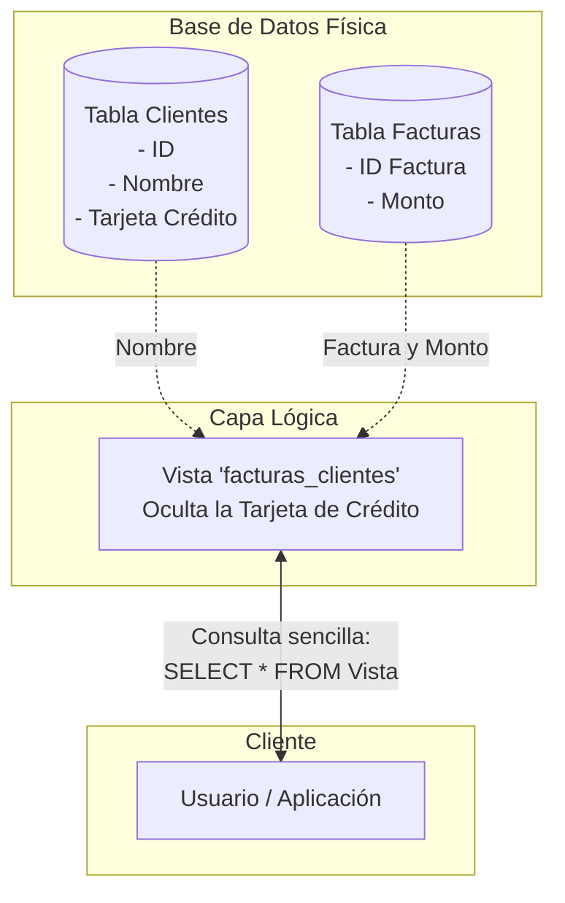

> [!info] Explicación de Vistas (Views)
> Una **vista** es una consulta SQL predefinida que se guarda en la base de datos y actúa como si fuera una tabla virtual. Sirve para encapsular consultas complejas (como aquellas con múltiples JOINs), simplificando el trabajo de los usuarios y desarrolladores. También se utilizan por seguridad, ya que permiten mostrar a ciertos usuarios solo los datos que tienen permitido ver, ocultando información sensible de otras columnas de la tabla original.

Muestra solamente aquello que se le permita al usuario.
[[Comandos]]



```sql
CREATE VIEW facturas_clientes AS
SELECT nombre_cli, num_factura, fecha_fact
FROM clientes C
INNER JOIN facturas F ON (C.id_cliente = F.id_cliente);
```

No es una tabla real lo que se crea; una vista es solo una definición (la consulta guardada). Los datos se calculan dinámicamente cada vez que se consulta la vista.

```sql
SELECT *
FROM facturas_clientes
WHERE nombre_cli LIKE '%';
```

## Vistas Materializadas

> [!info] Explicación
> Las vistas materializadas son un tipo especial de vista donde el resultado de la consulta **sí se guarda físicamente en el disco** como si fuera una tabla real. Esto mejora muchísimo el rendimiento en consultas complejas que consumen mucho tiempo, a costa de que los datos no se actualizan en tiempo real (deben ser refrescados manual o automáticamente).

Hay vistas especiales que guardan el set de resultados físicamente y se denominan **vistas materializadas**.

```sql
CREATE MATERIALIZED VIEW prod_prov AS
SELECT nombre_prod, precio_unit, nombre_prov
FROM productos P
INNER JOIN proveedores V ON (P.id_proveedor = V.id_proveedor);
```

La vista materializada se crea como una "fotografía" de los datos en el momento en que se ejecuta. En ese instante los datos quedan congelados y no cambian; se mantienen en el tiempo tal cual hasta que la vista materializada sea explícitamente actualizada (`REFRESH MATERIALIZED VIEW`).

## Notas relacionadas
- [[Comandos]]
- [[SQL]]
- [[Subconsultas]]
- [[SQL data adapter]]
