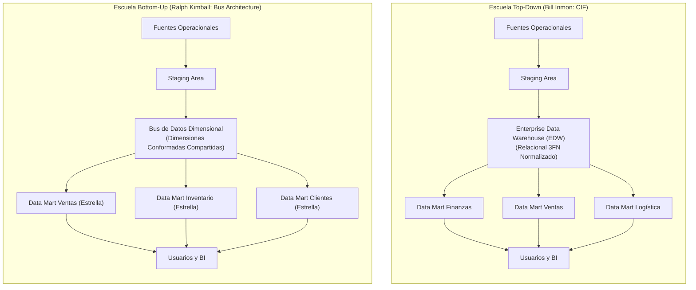
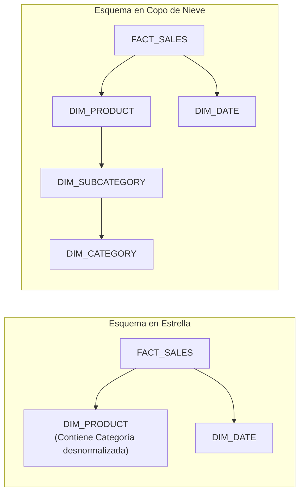

# Arquitectura de Data Warehouse y Modelado Dimensional
**Cátedra:** Business Intelligence & Data Warehousing (ISWD743)  
**Institución:** Escuela Politécnica Nacional (EPN) — Facultad de Ingeniería de Sistemas  
**Nivel:** Pregrado Avanzado  

---

> [!info] 💡 ¿Cómo entender esto desde cero? (Guía para novatos de pregrado)
> Imagina una cadena de supermercados a nivel nacional como *Supermaxi* o una plataforma de comercio electrónico global como *Amazon*.
> 
> En el día a día operativo, cuando un cajero pasa un código de barras por el escáner o un cliente hace clic en "Comprar", el sistema de base de datos de producción (denominado **OLTP** — *Online Transaction Processing*) solo necesita realizar una tarea inmediata y atómica: registrar esa venta en milisegundos, decrementar una unidad del stock y emitir la factura. Esas bases de datos están ultranormalizadas (Tercera Forma Normal) para no repetir datos y evitar inconsistencias al escribir.
> 
> Ahora bien, imagina que la Junta Directiva de la empresa te hace esta pregunta:  
> *"¿Cuál ha sido la variación porcentual del margen de ganancia en productos lácteos orgánicos vendidos durante fines de semana con lluvia en la ciudad de Quito frente a Guayaquil, comparando los últimos 5 años por segmento socioeconómico de clientes?"*
> 
> Si intentas ejecutar esa consulta sobre la base de datos operativa OLTP:
> 1. Tendrías que enlazar (**JOIN**) 25 o 30 tablas normalizadas.
> 2. Bloquearías las tablas operativas con un escaneo masivo de millones de registros, congelando las cajas del supermercado e impidiendo que los clientes paguen.
> 3. La consulta tardaría horas o colapsaría el servidor por falta de memoria RAM.
> 
> Para resolver este dilema fundamental de la informática empresarial nace el **Data Warehouse (DWH)**: un almacén de datos separado, analítico, histórico, consolidado y desnormalizado. En lugar de organizar los datos pensando en transacciones individuales de escritura, los organizamos pensando en cómo las personas de negocios miden el desempeño (**Hechos**) a través de diferentes lentes o perspectivas de análisis (**Dimensiones**).

---

## 1. Concepto y Propósito de un Data Warehouse

La definición formal y canónica que rige la disciplina fue acuñada en 1990 por el Dr. William H. Inmon (reconocido unánimemente como el *"Padre del Data Warehouse"*):

> [!definition] Definición Clásica de Data Warehouse (W. H. Inmon, 1990)
> *"Un Data Warehouse es una colección de datos orientada a temas, integrada, variante en el tiempo y no volátil, organizada para dar soporte a los procesos de toma de decisiones de la administración."*

Para comprender la magnitud teórica y práctica de esta definición, descomponemos sus cuatro pilares fundamentales:

```
+---------------------------------------------------------------------------------------+
|                              PILAR DE INMON (1990)                                    |
+---------------------+-----------------------------------------------------------------+
| 1. Sujeto / Tema    | Modela áreas de valor (Ventas, Finanzas, Clientes) y no flujos. |
| 2. Integrado        | Resuelve discrepancias de esquemas, tipos y unidades de medida.  |
| 3. Variante Tiempo  | Preserva la historia completa; cada dato tiene coordenada $t$.  |
| 4. No Volátil       | Operaciones de inserción y lectura; prohibido el UPDATE/DELETE.  |
+---------------------+-----------------------------------------------------------------+
```

### 1.1. Las Cuatro Características Cardinales

1. **Orientado a Temas (Subject-Oriented):**  
   Los sistemas operacionales se diseñan en torno a procesos y funciones de software (p. ej., facturación, recepción en bodega, nómina de pagos, gestión de reclamos). En contraste, el Data Warehouse se estructura en torno a los temas o áreas de negocio estratégicas de la organización (p. ej., Ventas, Clientes, Productos, Siniestralidad, Rendimiento Financiero). Excluye los datos que no son relevantes para el análisis analítico.

2. **Integrado (Integrated):**  
   Constituye el atributo técnico más crítico y costoso. En una corporación típica existen decenas de sistemas heterogéneos (sistemas legados en COBOL, bases de datos relacionales PostgreSQL/Oracle, ERPs como SAP, CRMs en la nube como Salesforce y archivos planos CSV). Estos sistemas presentan inconsistencias severas:
   - **Codificación:** El género se almacena como `'M'`/`'F'` en el ERP, `'1'`/`'0'` en el CRM y `'Masculino'`/`'Femenino'` en la web.
   - **Unidades de Medida:** Galones frente a litros, libras frente a kilogramos, divisas locales frente a dólares estadounidenses ($USD$).
   - **Identificadores:** Un cliente tiene cédula en ventas locales, pero pasaporte o código hash en compras web.  
   El Data Warehouse homogeneíza, limpia y resuelve los conflictos semánticos, consolidando una *"única versión de la verdad"* (*Single Version of Truth*).

3. **Variante en el Tiempo (Time-Variant):**  
   En un sistema operacional, la información representa el estado actual en el instante presente (tiempo $t_{actual}$). Si un cliente actualiza su dirección de Quito a Cuenca, la base OLTP suele sobrescribir el registro antiguo: el pasado desaparece. En cambio, en un Data Warehouse el tiempo es una dimensión explícita obligatoria. Todo registro posee una coordenada temporal inequívoca. Formalmente, un Data Warehouse modela la trayectoria temporal del negocio:
   
   $$\mathcal{DWH} = \bigcup_{t=t_0}^{T} \mathcal{S}(t)$$
   
   donde $\mathcal{S}(t)$ representa el estado snapshot o evento ocurrido en el instante temporal $t$. Esto permite análisis de series temporales, proyecciones econométricas y comparativas interanuales (*Year-over-Year*).

4. **No Volátil (Non-Volatile):**  
   En los sistemas OLTP, las operaciones frecuentes son `INSERT`, `UPDATE` y `DELETE` en transacciones ACID atómicas. En un Data Warehouse, los datos son inmutables una vez ingresados. Los únicos accesos permitidos son la carga masiva inicial o incremental (*bulk load*) y consultas analíticas masivas de solo lectura (`SELECT`). No se realizan actualizaciones destructivas in-situ; si el estado de una entidad cambia, se genera una nueva versión temporal sin borrar el registro previo.

---

## 2. Las Dos Grandes Escuelas Arquitectónicas: Inmon vs. Kimball

Dentro de la ingeniería de datos existe un debate histórico fundamental entre dos filosofías de diseño: el enfoque **Top-Down de Bill Inmon** y el enfoque **Bottom-Up de Ralph Kimball**.



### 2.1. El Enfoque Top-Down de Bill Inmon (Corporate Information Factory - CIF)

Inmon propone una visión centralizada y purista desde la ingeniería corporativa:

1. **Enterprise Data Warehouse (EDW) Central:** Se construye un gran almacén de datos empresarial modelado en **Tercera Forma Normal (3FN)** relacional. Este EDW modela toda la empresa de forma integrada a nivel atómico.
2. **Data Marts Dependientes:** Una vez consolidado el EDW central, se desprenden pequeños almacenes departamentales (*Data Marts* para Finanzas, Mercadeo, Recursos Humanos). Estos Data Marts pueden desnormalizarse para facilitar consultas departamentales, pero se alimentan estrictamente desde el EDW, nunca directamente de las fuentes.

- **Ventajas:**
  - Máxima consistencia de datos a nivel corporativo.
  - Elimina redundancias estructurales mediante normalización estricta.
  - Gran flexibilidad para responder a preguntas imprevistas a nivel granular.
- **Desventajas:**
  - Plazos de implementación extremadamente prolongados (proyectos de 2 a 4 años antes de entregar el primer reporte).
  - Costos astronómicos de consultoría y diseño de modelos relacionales gigantescos.
  - Alto riesgo de fracaso si las prioridades de la empresa cambian durante el desarrollo.

### 2.2. El Enfoque Bottom-Up de Ralph Kimball (Dimensional Bus Architecture)

Kimball, autor de la obra cumbre *The Data Warehouse Toolkit*, postula un enfoque pragmático centrado en el usuario de negocio y el retorno de inversión ágil:

1. **Data Marts Dimensionales:** El Data Warehouse no es una base de datos 3FN gigante separada; el Data Warehouse **es la unión congruente de todos sus Data Marts dimensionales**.
2. **Dimensiones Conformadas (Conformed Dimensions):** Los Data Marts no se construyen como silos aislados. Comparten dimensiones idénticas y estandarizadas (como la dimensión `Tiempo`, `Cliente` o `Producto`) mediante la **Matriz del Bus de Datos** (*Data Warehouse Bus Matrix*).
3. **Modelado Dimensional Puro:** Todos los almacenes se estructuran en Esquemas en Estrella (*Star Schema*) o Copo de Nieve (*Snowflake Schema*).

- **Ventajas:**
  - *Time-to-Value* acelerado: se entregan Data Marts funcionales en iteraciones de 8 a 12 semanas.
  - Consultas analíticas ultrarrápidas y optimizadas para agregaciones numéricas.
  - Comprensión intuitiva para usuarios de negocio y herramientas de BI (PowerBI, Tableau, Looker).
- **Desventajas:**
  - Si la gobernanza corporativa falla y no se respetan las dimensiones conformadas, el sistema degenera en un archipiélago caótico de "islas de datos" incoherentes.
  - La desnormalización deliberada introduce redundancia controlada en los atributos descriptivos.

### 2.3. Tabla Comparativa Integral: Inmon vs. Kimball

| Criterio Técnico | Enfoque Bill Inmon (Top-Down) | Enfoque Ralph Kimball (Bottom-Up) |
| :--- | :--- | :--- |
| **Filosofía Base** | Datos orientados a la estructura corporativa. | Datos orientados a procesos y analistas. |
| **Estructura del EDW** | Relacional normalizado en 3FN (*ER Modeling*). | Desnormalizado dimensional (*Star Schema*). |
| **Piedra Angular** | Enterprise Data Warehouse Centralizado. | Dimensiones Conformadas y Matriz de Bus. |
| **Data Marts** | Dependientes, desprendidos a partir del EDW. | Constituyentes primarios del Data Warehouse. |
| **Velocidad de Entrega** | Lenta; requiere modelar toda la empresa. | Rápida; iteraciones ágiles por proceso de negocio. |
| **Complejidad de ETL** | Menor al inicio (fuente a 3FN), compleja al Data Mart. | Muy compleja en la preparación hacia el modelo estrella. |
| **Mantenibilidad** | Alta consistencia relacional; difícil mantenimiento de esquema. | Flexible ante adición de nuevas dimensiones y hechos. |
| **Preferencia Industrial** | Grandes corporaciones bancarias y telecomunicaciones. | Más del 80% de implementaciones modernas y Data Warehouses cloud. |

---

## 3. Componentes de la Arquitectura de BI de Extremo a Extremo

Una solución integral de Inteligencia de Negocios articula cinco capas físicas y lógicas secuenciales:

```mermaid
flowchart LR
    subgraph SOURCES["1. Fuentes Operacionales"]
        S1["ERP (SAP/Oracle)"]
        S2["CRM (Salesforce)"]
        S3["Logs / APIs REST"]
        S4["Archivos CSV / Parquet"]
    end

    subgraph STAGING["2. Área de Staging"]
        STG["Staging Area<br/>(Landing Zone)<br/>*Sin índices ni FKs*"]
    end

    subgraph CORE["3. Almacén Central (DWH)"]
        DWH["Data Warehouse / Data Marts<br/>(Modelado Dimensional Kimball)<br/>*Surrogate Keys + Índices Bitmap*"]
    end

    subgraph SEMANTIC["4. Capa Semántica"]
        SEM["Capa Semántica / Cubos<br/>*Métricas DAX, RLS, Vistas Lógicas*"]
    end

    subgraph PRESENTATION["5. Capa de Presentación"]
        P1["Dashboards Interactivos"]
        P2["Reportes Operativos / C-Level"]
        P3["Ad-hoc SQL Analytics"]
        P4["Modelos de Machine Learning"]
    end

    SOURCES -->|Extracción CDC / Batch| STAGING
    STAGING -->|Limpieza y Transformación| CORE
    CORE -->|Agregaciones y Jerarquías| SEMANTIC
    SEMANTIC --> PRESENTATION
```



1. **Sistemas Fuente Operacionales (OLTP / Transaccionales):**  
   Bases de datos transaccionales, sistemas transaccionales legacy, microservicios, eventos de telemetría IoT, logs de servidores web y APIs externas. Son los productores primarios de datos.

2. **Área de Staging (Área de Preparación Temporal / Landing Zone):**  
   Zona intermedia de almacenamiento volátil o persistente donde se depositan las extracciones en crudo.  
   > [!important] Regla de Oro del Staging
   > El Área de Staging **nunca** debe tener índices B-Tree complejos ni restricciones de integridad referencial foránea (`FOREIGN KEY constraints`). Su único objetivo es absorber los datos extraídos con el máximo rendimiento de entrada/salida (*high I/O throughput*) sin penalizar el rendimiento ni saturar los sistemas transaccionales fuente.

3. **Almacén de Datos (Enterprise Data Warehouse / Data Marts):**  
   El núcleo analítico gobernado donde residen las tablas de hechos y dimensiones con claves subrogadas, estructuradas para el almacenamiento masivo y consultas de agregación.

4. **Capa Semántica (Semantic Layer / Business Abstraction Layer):**  
   Capa de abstracción que traduce las tablas físicas a conceptos de negocio (p. ej., define la fórmula oficial de `"Margen EBITDA"` o `"Rotación de Inventario"`). Centraliza las medidas calculadas, sinónimos, jerarquías y políticas de seguridad a nivel de filas (*Row-Level Security* - RLS).

5. **Capa de Presentación y Explotación:**  
   Herramientas de consumo analítico para usuarios finales: tableros ejecutivos (*Dashboards* en Power BI / Tableau), cubos OLAP multidimensionales, herramientas de consulta Ad-Hoc SQL y canalizaciones hacia modelos de *Machine Learning* y analítica predictiva.

---

## 4. Modelado Dimensional en Detalle

El modelado dimensional es una técnica de diseño lógico y físico que optimiza las bases de datos relacionales para consultas de alta velocidad y simplicidad analítica, reduciendo drásticamente el número de operaciones `JOIN` requeridas en comparación con esquemas 3FN.

### 4.1. Análisis Visual del Esquema en Estrella

A continuación se presenta la arquitectura canónica de un modelo dimensional en estrella para el seguimiento de ventas comerciales:

![[star-schema-datawarehouse.png]]

> [!definition] Desglose Técnico de la Arquitectura en Estrella Representada
> En la imagen superior se observa un diseño clásico de **Esquema en Estrella (Star Schema)** centrado en el proceso de negocio de ventas minoristas:
> 
> 1. **Tabla de Hechos Central (`FACT_SALES`):**
>    - Ocupa el centro neurálgico del esquema y modela cada línea individual de compra facturada.
>    - **Claves Foráneas Subrogadas:** Contiene las columnas `date_key`, `product_key`, `customer_key` y `store_key`. Cada una apunta a la clave primaria subrogada de su respectiva dimensión satélite con una relación cardinal de muchos a uno ($N:1$).
>    - **Clave Primaria:** Puede implementarse como una clave compuesta por la concatenación de las cuatro claves foráneas `(date_key, product_key, customer_key, store_key)` o mediante una clave subrogada artificial propia `sales_fact_id`.
>    - **Métricas Numéricas Aditivas:** Almacena los indicadores de desempeño cuantificables del evento: `units_sold` (unidades vendidas), `unit_price` (precio de venta unitario), `discount_amount` (monto total de descuento) y `total_revenue` (ingreso neto generado: $\text{total\_revenue} = (\text{units\_sold} \times \text{unit\_price}) - \text{discount\_amount}$).
> 
> 2. **Tablas Dimensionales Satélite Desnormalizadas:**
>    - `DIM_DATE`: Contiene la descomposición temporal completa (`date_key`, `full_date`, `day_of_week`, `day_name`, `month`, `month_name`, `quarter`, `year`, `is_weekend`, `fiscal_period`). Evita la necesidad de ejecutar funciones de extracción de fechas dinámicas en SQL (`DATEPART`, `EXTRACT`), sustituyéndolas por búsquedas indexadas directas.
>    - `DIM_PRODUCT`: Describe el catálogo comercial (`product_key`, `product_id_natural`, `product_name`, `sku`, `brand`, `category`, `subcategory`, `unit_cost`). Integra atributos desnormalizados para evitar tablas intermedias de categorías.
>    - `DIM_CUSTOMER`: Representa al comprador (`customer_key`, `customer_id_natural`, `first_name`, `last_name`, `gender`, `birth_date`, `email`, `city`, `province_state`, `country`, `customer_segment`).
>    - `DIM_STORE`: Modela la infraestructura física o digital de expendio (`store_key`, `store_id_natural`, `store_name`, `store_type`, `surface_sqm`, `city`, `region`, `opening_date`).
> 
> 3. **Eficiencia en la Consulta:** Cualquier reporte analítico requiere **un único salto relacional** ($O(1)$ joins por dimensión) desde la tabla de hechos central hacia las dimensiones, permitiendo que el optimizador del motor de base de datos aproveche mecanismos de *Star Join Transformation* y escaneo mediante índices Bitmap.

---

### 4.2. Tablas de Hechos (Fact Tables)

Una tabla de hechos es la manifestación numérica y cuantificable de un evento operativo del negocio.

#### 4.2.1. El Concepto de Granularidad (The Grain)

> [!important] Principio Fundamental de Kimball
> El **Grano** es la especificación exacta de lo que representa una sola fila física en la tabla de hechos. **Debe ser definido formalmente antes de seleccionar las dimensiones o las métricas.** Violar la uniformidad del grano en una misma tabla de hechos destruye la integridad analítica.

*Ejemplo de Grano Atómico:* "Una fila individual por cada ítem escaneado en un ticket de caja registrado en una sucursal física en un segundo determinado".

#### 4.2.2. Tipología de Medidas Numéricas

Las medidas se clasifican estrictamente según su comportamiento algebraico frente a los operadores de agregación ($\sum, \text{Promedio}, \text{Máximo}$):

```
                                  TIPOLOGÍA DE MEDIDAS
                                           |
         +---------------------------------+---------------------------------+
         |                                 |                                 |
   Completamente                     Semiaditivas                      No Aditivas
      Aditivas                              |                                 |
         |                                  |                                 |
* Sumables en TODAS                * Sumables en ALGUNAS             * NO SUMABLES en
  las dimensiones.                   dimensiones.                      ninguna dimensión.
* Ej: total_ventas,                * NO en dimensión Tiempo.         * Ratios, márgenes %,
  cantidad_unidades.               * Ej: saldo_cuenta, stock.          precios unitarios.
```

1. **Completamente Aditivas (Fully Additive Measures):**  
   Pueden sumarse a través de absolutamente todas las dimensiones presentes en el esquema.
   $$\text{Venta Total} = \sum_{i \in \text{Clientes}} \sum_{j \in \text{Productos}} \sum_{k \in \text{Tiempo}} \text{Monto}_{ijk}$$
   *Ejemplos:* `unidades_vendidas`, `monto_facturado`, `costo_envio`.

2. **Semiaditivas (Semi-Additive Measures):**  
   Son sumables a través de ciertas dimensiones (p. ej., cuentas, sucursales, productos), pero **no se pueden sumar a lo largo de la dimensión Tiempo**.
   *Ejemplo Crítico:* El saldo de una cuenta bancaria (`account_balance`) o el inventario en almacén (`current_stock`). Si el lunes tienes $\$100$, el martes $\$150$ y el miércoles $\$200$, la suma $\sum = \$450$ carece de significado económico. En la dimensión temporal, se deben aplicar operadores como el valor final del período (*Last*), el inicial (*First*) o el promedio ponderado.

3. **No Aditivas (Non-Additive Measures):**  
   No pueden sumarse a través de ninguna dimensión bajo ninguna circunstancia.
   *Ejemplos:* Tasas de conversión, porcentajes de descuento, márgenes de ganancia unitarios y precios unitarios.  
   $$\text{Margen Bruto \%} \neq \sum \text{Margen Bruto \%}$$
   Para obtener el margen de una categoría, se debe almacenar el numerador aditivo ($\sum \text{Utilidad}$) y el denominador aditivo ($\sum \text{Ingreso}$), calculando el ratio en la capa semántica:
   $$\text{Margen Global \%} = \frac{\sum \text{Utilidad Total}}{\sum \text{Ingreso Total}} \times 100$$

#### 4.2.3. Tipos de Tablas de Hechos según su Dinámica

| Tipo de Tabla de Hechos | Grano y Disparo del Registro | Comportamiento Temporal | Caso de Uso Típico |
| :--- | :--- | :--- | :--- |
| **Transaccional** (*Transaction Fact Table*) | Un registro por evento instantáneo puntual. | Crece a ritmo vertiginoso; inmutable; muy granular. | Emisión de tickets de caja, retiros de cajero automático (ATM), clics en enlaces web. |
| **Instantánea Periódica** (*Periodic Snapshot Fact Table*) | Un registro por entidad al cierre de un intervalo temporal regular. | Registra el estado o saldo acumulado en momentos uniformes ($t = \text{fin de mes}$). | Saldos mensuales de cuentas corrientes, niveles de inventario semanal en bodega. |
| **Instantánea Acumulativa** (*Accumulating Snapshot Fact Table*) | Un registro por ciclo de vida completo de un proceso de negocio. | Se actualiza en múltiples hitos predefinidos; posee múltiples claves de fecha foráneas. | Proceso de matrícula estudiantil (Postulación $\to$ Admisión $\to$ Pago $\to$ Matrícula). |

---

### 4.3. Tablas de Dimensiones (Dimension Tables)

Las dimensiones proporcionan el contexto descriptivo, cualitativo y textual alrededor de los hechos. Responden a las preguntas analíticas clásicas: *¿Quién?* (`DIM_CUSTOMER`), *¿Qué?* (`DIM_PRODUCT`), *¿Dónde?* (`DIM_STORE`), *¿Cuándo?* (`DIM_DATE`), *¿Por qué?* (`DIM_PROMOTION`).

#### 4.3.1. Claves Subrogadas (Surrogate Keys) vs. Claves Naturales Operacionales

> [!important] Mandato de Diseño Dimensional
> Las tablas de hechos y dimensiones **nunca** deben conectarse mediante las claves primarias naturales u operacionales provenientes de los sistemas transaccionales (como la cédula de identidad, el SKU o el número de factura). Deben emplearse exclusivamente **Claves Subrogadas** (*Surrogate Keys*).

Una **Clave Subrogada** es un identificador numérico artificial (usualmente un entero de 4 u 8 bytes autoincremental o secuencia `IDENTITY`/`BIGSERIAL`) gestionado enteramente dentro del Data Warehouse.

```
+----------------------------------------------------------------------------------------------------+
|                               JUSTIFICACIÓN DE CLAVES SUBROGADAS                                  |
+------------------------------+---------------------------------------------------------------------+
| 1. Desacoplamiento Fuente    | Si el sistema OLTP cambia su formato de clave, el DWH no se rompe. |
| 2. Soporte para SCD Tipo 2   | Una misma clave natural puede tener 10 filas históricas con SKs distintas. |
| 3. Rendimiento y Almacenaje  | Comparar un `INT` de 4 bytes en los JOINs supera ampliamente a `VARCHAR(30)`. |
| 4. Manejo de Valores Nulos   | Permite filas predeterminadas con SK `-1` para "No Aplica" o "Desconocido". |
+------------------------------+---------------------------------------------------------------------+
```

#### 4.3.2. Jerarquías de Agregación

Las dimensiones albergan jerarquías naturales de consolidación analítica que permiten a los motores OLAP realizar operaciones de agregación matemática sin ambigüedades:

$$\text{Día} \longrightarrow \text{Mes} \longrightarrow \text{Trimestre} \longrightarrow \text{Año}$$
$$\text{Producto} \longrightarrow \text{Subcategoría} \longrightarrow \text{Categoría} \longrightarrow \text{Línea de Negocio}$$
$$\text{Localidad} \longrightarrow \text{Ciudad} \longrightarrow \text{Provincia / Estado} \longrightarrow \text{País} \longrightarrow \text{Región Global}$$

---

### 4.4. Tipologías de Esquemas Dimensionales

Existen tres formas topológicas para estructurar las relaciones entre hechos y dimensiones:

#### 1. Esquema en Estrella (Star Schema)
Todas las dimensiones están completamente desnormalizadas y conectadas directamente a la tabla de hechos central. Cada dimensión está representada en una sola tabla física.
- **Ventajas:** Máximo rendimiento en consultas, optimización de índices por el motor de base de datos, simplicidad extrema para la escritura de consultas SQL analíticas.
- **Desventajas:** Redundancia controlada de cadenas de texto en los atributos de jerarquía superior (p. ej., repetir `"Electrónica"` para miles de productos).

#### 2. Esquema en Copo de Nieve (Snowflake Schema)
Las dimensiones se normalizan total o parcialmente, dividiendo los niveles de las jerarquías en tablas relacionales secundarias (p. ej., `DIM_PRODUCT` enlaza a `DIM_SUBCATEGORY`, y esta a `DIM_CATEGORY`).
- **Ventajas:** Elimina completamente la redundancia de texto; cumple principios estrictos de normalización relacional; reduce ligeramente el espacio en disco en dimensiones gigantescas con millones de filas.
- **Desventajas:** Introduce múltiples `JOINs` relacionales en cascada que degradan severamente el rendimiento de las consultas y confunden a los usuarios de negocio que generan reportes Ad-Hoc.



#### 3. Constelación de Hechos (Fact Constellation o Esquema Galaxia)
La arquitectura empresarial madura real no tiene una sola tabla de hechos, sino múltiples tablas de hechos que modelan distintos procesos de negocio interconectados compartiendo **Dimensiones Conformadas**.
- *Ejemplo:* La empresa cuenta con `FACT_SALES`, `FACT_PURCHASES` y `FACT_INVENTORY`. Las tres tablas de hechos se interconectan mediante las mismas tablas maestras `DIM_DATE`, `DIM_PRODUCT` y `DIM_STORE`.

---

### 4.5. Dimensiones Lentamente Cambiantes (SCD - Slowly Changing Dimensions)

En el mundo empresarial, los atributos descriptivos de las entidades no son estáticos: los clientes cambian de dirección domiciliaria, los productos cambian de categoría arancelaria y los empleados cambian de departamento. Ralph Kimball formalizó las técnicas de gestión de cambios históricos bajo la taxonomía **SCD**:

```
+--------+----------------------------+--------------------------------------------------------------+
| Tipo   | Nombre Metodológico        | Mecanismo de Implementación Técnica                          |
+--------+----------------------------+--------------------------------------------------------------+
| SCD 0  | Retención Fija Original    | Inmutable. El atributo jamás se altera (ej. fecha de nacimiento). |
| SCD 1  | Sobrescritura Directa      | Modifica el valor in-situ. Se pierde todo historial previo.  |
| SCD 2  | Versiones por Fila Histórica| Agrega nueva fila con nueva SK, rango de fechas y flag activa. |
| SCD 3  | Atributo Previo por Columna| Agrega columna física para preservar el valor anterior inmediato.|
| SCD 6  | Híbrido Dual (1 + 2 + 3)   | Combina nueva fila histórica (Tipo 2) con columna de valor actual.|
+--------+----------------------------+--------------------------------------------------------------+
```

#### 4.5.1. SCD Tipo 1 (Sobrescritura - Overwrite)
Se ejecuta un `UPDATE` destructivo directo sobre la fila existente de la dimensión.
- **Uso:** Corrección de errores ortográficos, errores tipográficos o atributos donde el pasado carece por completo de relevancia analítica (p. ej., corregir `"Av. Amaznas"` por `"Av. Amazonas"`).
- **Impacto:** Si un cliente se mudó de Quito a Guayaquil y se aplica Tipo 1, todas las ventas históricas que realizó ese cliente hace 4 años aparecerán asignadas a Guayaquil en los reportes agregados.

#### 4.5.2. SCD Tipo 2 (Historial Completo por Versiones de Fila)
Constituye la técnica estándar por excelencia del modelado dimensional. Cada vez que cambia un atributo relevante, **se cierra la validez temporal del registro actual y se inserta una fila totalmente nueva**.
- Requiere atributos de control técnico en la tabla de dimensión:
  - `surrogate_key`: Nueva clave primaria para la nueva versión.
  - `natural_key`: Identificador de negocio constante que vincula todas las versiones del objeto.
  - `start_date`: Marca temporal de inicio de vigencia de la versión.
  - `end_date`: Marca temporal de expiración (se asigna `NULL` o una fecha centinela como `'9999-12-31'` para la versión activa).
  - `is_current`: Bandera booleana (`TRUE` o `1` para el registro activo actual, `FALSE` o `0` para históricos).

```
Evolución de DIM_CUSTOMER ante mudanza de un cliente (SCD Tipo 2):
+--------------+-------------+-------------+------------+------------+------------+------------+
| customer_key | natural_id  | name        | city       | start_date | end_date   | is_current |
+--------------+-------------+-------------+------------+------------+------------+------------+
| 1045         | CUST-883    | Juan Pérez  | Quito      | 2021-01-01 | 2024-06-30 | FALSE      |
| 5920         | CUST-883    | Juan Pérez  | Guayaquil  | 2024-07-01 | 9999-12-31 | TRUE       |
+--------------+-------------+-------------+------------+------------+------------+------------+
```

#### 4.5.3. SCD Tipo 3 (Preservación por Nueva Columna)
Se mantiene una única fila física por entidad, pero se añade una columna explícita para registrar el valor previo inmediato (p. ej., `current_city` y `previous_city`). Solo permite conservar un nivel de profundidad histórica.

#### 4.5.4. SCD Tipo 6 (Híbrido $1 + 2 + 3$)
Denominado así porque $1 + 2 + 3 = 6$. Se crean filas históricas completas (Tipo 2), pero se añade una columna con el valor actual sincronizado en todas las versiones (Tipo 1) y una columna con el valor histórico previo (Tipo 3). Esto permite a los analistas ejecutar reportes tanto según la historia real en el momento de la venta (*as-was*) como según la asignación actual consolidada (*as-is*).

---

## 5. Implementación Demostrativa en SQL DDL (PostgreSQL / Redshift / Snowflake)

A continuación se detalla la especificación formal del Esquema en Estrella analizado, con dimensiones conformadas y soporte SCD Tipo 2:

```sql
-- ============================================================================
-- CÁTEDRA: Business Intelligence & Data Warehousing (ISWD743) - EPN
-- SCRIPT DDL: Esquema en Estrella para Venta Minorista Comercial
-- ============================================================================

-- 1. Dimensión Tiempo (Totalmente Desnormalizada)
CREATE TABLE dim_date (
    date_key INT PRIMARY KEY,                 -- Formato ISO: YYYYMMDD (Ej: 20260928)
    full_date DATE NOT NULL UNIQUE,
    day_of_month INT NOT NULL,
    day_name VARCHAR(15) NOT NULL,
    day_of_week INT NOT NULL,                 -- 1 = Lunes, 7 = Domingo
    calendar_month INT NOT NULL,
    month_name VARCHAR(15) NOT NULL,
    calendar_quarter INT NOT NULL,
    calendar_year INT NOT NULL,
    is_weekend BOOLEAN NOT NULL,
    is_holiday BOOLEAN DEFAULT FALSE,
    fiscal_period VARCHAR(10) NOT NULL
);

-- 2. Dimensión Producto (SCD Tipo 2 para Control de Cambios en Categoría o Precio)
CREATE TABLE dim_product (
    product_key SERIAL PRIMARY KEY,           -- Clave Subrogada Autoincremental
    product_natural_id VARCHAR(50) NOT NULL,  -- Clave Operacional / SKU de Producción
    product_name VARCHAR(150) NOT NULL,
    brand VARCHAR(80) NOT NULL,
    category VARCHAR(80) NOT NULL,
    subcategory VARCHAR(80) NOT NULL,
    unit_cost NUMERIC(12, 4) NOT NULL,
    -- Columnas de Control Técnico para SCD Tipo 2:
    effective_start_date TIMESTAMP NOT NULL DEFAULT CURRENT_TIMESTAMP,
    effective_end_date TIMESTAMP NOT NULL DEFAULT '9999-12-31 23:59:59',
    is_current BOOLEAN NOT NULL DEFAULT TRUE
);

-- 3. Dimensión Cliente (SCD Tipo 2)
CREATE TABLE dim_customer (
    customer_key SERIAL PRIMARY KEY,
    customer_natural_id VARCHAR(50) NOT NULL,
    first_name VARCHAR(100) NOT NULL,
    last_name VARCHAR(100) NOT NULL,
    email VARCHAR(150),
    gender CHAR(1),
    city VARCHAR(80) NOT NULL,
    province_state VARCHAR(80) NOT NULL,
    country VARCHAR(80) NOT NULL,
    customer_segment VARCHAR(50) NOT NULL,
    effective_start_date TIMESTAMP NOT NULL DEFAULT CURRENT_TIMESTAMP,
    effective_end_date TIMESTAMP NOT NULL DEFAULT '9999-12-31 23:59:59',
    is_current BOOLEAN NOT NULL DEFAULT TRUE
);

-- 4. Dimensión Sucursal / Tienda (SCD Tipo 1)
CREATE TABLE dim_store (
    store_key SERIAL PRIMARY KEY,
    store_natural_id VARCHAR(30) NOT NULL,
    store_name VARCHAR(100) NOT NULL,
    store_type VARCHAR(50) NOT NULL,          -- Hipermercado, Express, Online
    surface_sqm NUMERIC(10, 2),
    city VARCHAR(80) NOT NULL,
    region VARCHAR(80) NOT NULL
);

-- 5. Tabla de Hechos Central: FACT_SALES (Grano Atómico: Línea de Factura)
CREATE TABLE fact_sales (
    sales_fact_id BIGSERIAL PRIMARY KEY,      -- Clave Subrogada de Hecho (Opcional)
    date_key INT NOT NULL,                    -- FK a DIM_DATE
    product_key INT NOT NULL,                 -- FK a DIM_PRODUCT
    customer_key INT NOT NULL,                -- FK a DIM_CUSTOMER
    store_key INT NOT NULL,                   -- FK a DIM_STORE
    invoice_number VARCHAR(60) NOT NULL,      -- Atributo Degenerado (Degenerate Dimension)
    -- Métricas Numéricas Aditivas
    units_sold INT NOT NULL CHECK (units_sold > 0),
    unit_price NUMERIC(12, 4) NOT NULL,
    discount_amount NUMERIC(12, 4) NOT NULL DEFAULT 0.00,
    cost_amount NUMERIC(12, 4) NOT NULL,
    net_revenue NUMERIC(12, 4) NOT NULL,      -- (units_sold * unit_price) - discount_amount
    gross_margin NUMERIC(12, 4) NOT NULL,     -- net_revenue - cost_amount

    -- Restricciones de Integridad Referencial
    CONSTRAINT fk_sales_date FOREIGN KEY (date_key) REFERENCES dim_date (date_key),
    CONSTRAINT fk_sales_product FOREIGN KEY (product_key) REFERENCES dim_product (product_key),
    CONSTRAINT fk_sales_customer FOREIGN KEY (customer_key) REFERENCES dim_customer (customer_key),
    CONSTRAINT fk_sales_store FOREIGN KEY (store_key) REFERENCES dim_store (store_key)
);

-- Índices de Alto Rendimiento para Star Join Optimization
CREATE INDEX idx_fact_sales_date ON fact_sales (date_key);
CREATE INDEX idx_fact_sales_product ON fact_sales (product_key);
CREATE INDEX idx_fact_sales_customer ON fact_sales (customer_key);
CREATE INDEX idx_fact_sales_store ON fact_sales (store_key);
```

### 5.1. Consulta Analítica de Alto Rendimiento (Star Join)

A continuación se ilustra cómo el optimizador del motor procesa la consulta analítica planteada al inicio de la cátedra mediante agregaciones multidimensionales:

```sql
SELECT 
    d.calendar_year,
    d.month_name,
    p.category,
    s.city AS store_city,
    c.customer_segment,
    SUM(f.units_sold) AS total_units_sold,
    SUM(f.net_revenue) AS total_revenue_usd,
    -- Cálculo del Margen Porcentual utilizando componentes aditivos:
    ROUND((SUM(f.gross_margin) / NULLIF(SUM(f.net_revenue), 0)) * 100, 2) AS gross_margin_percentage
FROM fact_sales f
JOIN dim_date d ON f.date_key = d.date_key
JOIN dim_product p ON f.product_key = p.product_key
JOIN dim_customer c ON f.customer_key = c.customer_key
JOIN dim_store s ON f.store_key = s.store_key
WHERE d.calendar_year BETWEEN 2022 AND 2026
  AND p.category = 'Lácteos'
  AND s.city IN ('Quito', 'Guayaquil')
GROUP BY 
    d.calendar_year,
    d.month_name,
    p.category,
    s.city,
    c.customer_segment
ORDER BY 
    d.calendar_year DESC, 
    total_revenue_usd DESC;
```

---

## 6. Síntesis Teórica para Evaluación de Pregrado

> [!tip] Puntos Clave para Exámenes y Proyectos de Titulación
> 1. **Propósito Dual:** OLTP procesa transacciones concurrentes operativas normalizadas (3FN). Data Warehouse procesa análisis históricos agregados desnormalizados (Dimensional).
> 2. **Kimball vs. Inmon:** Kimball diseña desde los procesos hacia el usuario mediante dimensiones conformadas y esquemas en estrella (Bottom-Up). Inmon diseña un almacén corporativo centralizado en 3FN y desprende Data Marts (Top-Down).
> 3. **Definición de Grano:** Jamás comiences a construir un esquema dimensional sin declarar por escrito el significado inequívoco de una sola fila de hechos.
> 4. **Claves Subrogadas Obligatorias:** Desvinculan el almacén de los sistemas operacionales y permiten la trazabilidad de cambios históricos mediante SCD Tipo 2.
> 5. **Comportamiento de Métricas:** Distingue rigurosamente entre medidas totalmente aditivas ($\sum$ ingresos), semiaditivas (saldo bancario con limitación temporal) y no aditivas (ratios y porcentajes).

---
*Fin de la Nota Técnica ISWD743 — Facultad de Ingeniería de Sistemas, EPN.*
