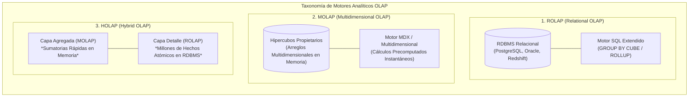
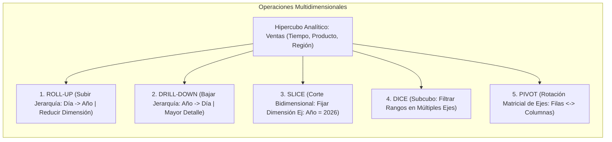
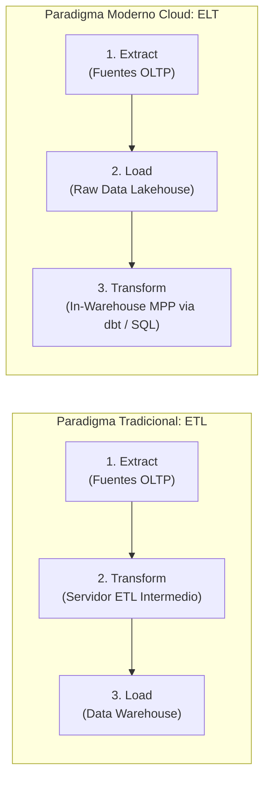
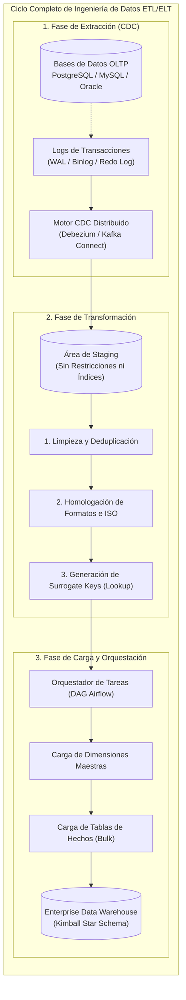

# Procesamiento Analítico OLAP y Pipelines ETL
**Cátedra:** Business Intelligence & Data Warehousing (ISWD743)  
**Institución:** Escuela Politécnica Nacional (EPN) — Facultad de Ingeniería de Sistemas  
**Nivel:** Pregrado Avanzado  

---

> [!info] 💡 ¿Cómo entender esto desde cero? (Guía para novatos de pregrado)
> Imagina la cocina de un gran restaurante de alta demanda en Quito.
> 
> Durante las horas pico del almuerzo, los meseros corren registrando pedidos individuales en tickets de comanda: *"Mesa 4: 1 locro de papa, 1 jugo de mora; Mesa 9: 2 secos de chivo"*. Cada pedido debe ser procesado de inmediato, sin errores y sin bloquear a los otros meseros. Eso es exactamente un sistema transaccional **OLTP** (*Online Transaction Processing*): miles de transacciones diminutas, concurrentes y de escritura rápida.
> 
> Ahora, imagina que a la medianoche el restaurante cierra. El chef ejecutivo y el director financiero se sientan en su despacho con los libros contables para responder preguntas estratégicas:
> *"¿Cuáles son los 5 platillos con mayor margen de contribución neta vendidos los viernes por la noche durante el último trimestre, comparando locales del norte vs. valles?"*
> 
> A ellos ya no les interesa el ticket de la Mesa 4 a las 13:05; necesitan calcular promedios, sumatorias y tendencias sobre cientos de miles de registros históricos. Eso es **OLAP** (*Online Analytical Processing*).
> 
> ¿Y cómo viajan los datos desde los miles de tickets arrugados de la cocina hasta la hoja de cálculo del financiero? Mediante un **Pipeline ETL / ELT** (*Extract, Transform, Load*): la cinta transportadora de alta ingeniería que extrae los datos de producción en tiempo real o por lotes, limpia errores e inconsistencias (elimina duplicados, homologa monedas, traduce formatos), genera códigos estandarizados y los deposita organizadamente en el Data Warehouse para que los motores OLAP respondan en fracciones de segundo.

---

## 1. Sistemas Transaccionales (OLTP) vs. Sistemas Analíticos (OLAP)

En la teoría de sistemas de información empresariales, la bifurcación entre **OLTP** y **OLAP** es una necesidad impuesta por las leyes del hardware, los patrones de acceso a disco y las restricciones de concurrencia.

```
                          PARADIGMAS DE PROCESAMIENTO
                                       |
             +-------------------------+-------------------------+
             |                                                   |
       Sistemas OLTP                                       Sistemas OLAP
(Online Transaction Processing)                     (Online Analytical Processing)
             |                                                   |
  * Enfoque: Operativo / Día a día                   * Enfoque: Estratégico / Decisional
  * Modelo: 3FN Normalizado                          * Modelo: Dimensional (Star / Snowflake)
  * Transacciones: Milisegundos (ACID)               * Consultas: Segundos a minutos (Lectura)
  * Lecturas/Escrituras: Alto volumen DML            * Lecturas/Escrituras: Bulk Loads masivos
  * Índices: Árboles B / B+                          * Índices: Bitmap, Zonemaps, Columnar
```

### 1.1. Comparativa Técnica Exhaustiva

| Parámetro de Evaluación | Sistemas Transaccionales (OLTP) | Sistemas Analíticos (OLAP) |
| :--- | :--- | :--- |
| **Propósito Principal** | Automatización del negocio operativo continuo (cajas, transacciones bancarias, inventario). | Soporte analítico para la toma de decisiones estratégicas, tácticas y operativas complejas. |
| **Diseño del Esquema** | **Altamente normalizado (3FN / BCNF)** para evitar anomalías de inserción, actualización y borrado. | **Desnormalizado dimensionalmente (Star / Snowflake)** para minimizar la cantidad de operaciones JOIN. |
| **Patrón de Operaciones** | Millones de sentencias atómicas `INSERT`, `UPDATE` y `DELETE` cortas y frecuentes. | Consultas masivas de solo lectura (`SELECT`) con agregaciones matemáticas intensivas (`SUM`, `AVG`, `COUNT`). |
| **Volumen por Consulta** | Decenas de bytes a kilobytes (una fila o pocas filas indexadas por clave primaria). | Gigabytes a terabytes (escaneo de millones de filas históricas en tablas de hechos). |
| **Concurrencia y Bloqueos** | Miles de usuarios concurrentes. Requiere **bloqueo a nivel de fila** (*row-level locks*) y transacciones ACID. | Decenas o cientos de analistas concurrentes. Sin bloqueos transaccionales; lectura concurrente sin cerrojos. |
| **Estructura de Índices** | **Árboles B / B+ Trees** optimizados para búsquedas exactas puntuales y rangos estrechos ($O(\log N)$). | **Índices Bitmap, proyecciones columnares y Zonemaps**, ideales para baja cardinalidad y filtros booleanos. |
| **Orientación Temporal** | Datos actuales en tiempo real ($t_{actual}$). Los estados anteriores se sobrescriben o purgan. | Histórico profundo (5 a 20 años de historia preservada mediante coordenadas temporales). |
| **Tolerancia al Retraso** | Cero tolerancia (tiempos de respuesta inferiores a $50 \text{ ms}$). | Tolerante (tiempos de respuesta de subsegundos a varios minutos según la complejidad analítica). |

---

## 2. Taxonomía y Arquitecturas OLAP: ROLAP, MOLAP y HOLAP

El procesamiento analítico multidimensional puede implementarse físicamente mediante distintas arquitecturas de almacenamiento y cómputo:



### 2.1. ROLAP (Relational OLAP)

En la arquitectura **ROLAP**, los datos residen en un motor de base de datos relacional tradicional (RDBMS) estructurado bajo un esquema dimensional en estrella o copo de nieve.

- **Mecanismo Interno:** El motor traduce las solicitudes analíticas multidimensionales en complejas sentencias SQL extendidas utilizando operadores analíticos estandarizados por ANSI SQL:1999 como `GROUP BY CUBE`, `GROUP BY ROLLUP` y funciones de ventana (*Window Functions*).
- **Ventajas:**
  - Capacidad de escalar a volúmenes masivos de datos (petabytes) apalancando motores MPP (*Massively Parallel Processing*) como Amazon Redshift, Google BigQuery, Snowflake o ClickHouse.
  - Aprovecha la infraestructura relacional, estándares SQL abiertos y esquemas de seguridad corporativos ya existentes.
- **Desventajas:**
  - Las consultas que demandan múltiples agregaciones al vuelo pueden experimentar cuellos de botella severos de I/O en disco y saturar la memoria RAM del motor relacional si no existen vistas materializadas.

### 2.2. MOLAP (Multidimensional OLAP)

En la arquitectura **MOLAP**, los datos no se guardan en tablas relacionales de filas y columnas, sino en **estructuras de matrices o arreglos multidimensionales densos y dispersos** (*Hypercubes* o *Data Cubes*) gestionados por motores propietarios especializados (p. ej., Microsoft Analysis Services multidimensional, IBM Cognos TM1 / Planning Analytics, Oracle Essbase).

- **Mecanismo Interno:** Todas las combinaciones posibles de agregación a lo largo de las jerarquías dimensionales son **precalculadas y comprimidas matemáticamente** durante un proceso de procesamiento por lotes (*Cube Processing / Processing Phase*).
- **Ventajas:**
  - Velocidad de respuesta de subsegundos ($O(1)$ mediante indexación directa por coordenadas matriciales), independientemente de la profundidad de agregación solicitada.
  - Soporte nativo para álgebra matricial avanzada, modelado financiero y lenguajes de consulta multidimensional como **MDX** (*Multi-Dimensional eXpressions*).
- **Desventajas:**
  - **Problema de la Explosión Combinatoria de Datos (*The Data Explosion Problem*):** A medida que aumentan el número de dimensiones ($n$) y sus niveles jerárquicos, el número teórico de celdas en el hipercubo crece exponencialmente:
    $$\text{Total Celdas} = \prod_{i=1}^{n} |D_i|$$
    donde gran parte del espacio matricial está vacío (*Data Sparsity*), consumiendo inmensas cantidades de memoria.
  - Tiempos de reprocesamiento del cubo excesivamente largos cuando se cargan nuevos datos operacionales.

### 2.3. HOLAP (Hybrid OLAP)

La arquitectura híbrida **HOLAP** sintetiza lo mejor de ambos mundos para eludir la explosión de almacenamiento de MOLAP y la lentitud de agregación atómica de ROLAP:

- **Estrategia Bi-Nivel:**
  1. **Nivel de Resúmenes y Agregaciones Frecuentes:** Se almacenan precalculadas en cubos **MOLAP** de alta velocidad en memoria.
  2. **Nivel de Detalle Transaccional Atómico:** Permanece almacenado en las tablas de hechos relacionales del sistema **ROLAP**.
- Cuando el usuario navega a través de agregaciones ejecutivas (p. ej., ventas anuales por país), el sistema responde desde el cubo MOLAP instantáneamente; si el usuario ejecuta un *Drill-Through* para inspeccionar la factura atómica individual, la consulta se enruta dinámicamente hacia la base de datos ROLAP.

---

## 3. Las Cinco Operaciones Fundamentales sobre el Hipercubo OLAP

Matemáticamente, un **Hipercubo de Datos** $\mathcal{C}$ se define como una estructura formal:

$$\mathcal{C} = \left\langle D_1, D_2, \dots, D_n, \mathcal{M} \right\rangle$$

donde cada $D_i$ es un conjunto finito de valores discretos pertenecientes a una dimensión particular, y $\mathcal{M}$ es el vector de medidas numéricas evaluadas en cada coordenada espacial $\vec{d} = (d_1, d_2, \dots, d_n)$ con $d_i \in D_i$.



### 3.1. Roll-up (Consolidación / Agregación Ascendente)
El **Roll-up** realiza una agregación matemática sobre los datos, ya sea ascendiendo a lo largo de una jerarquía dimensional conceptual predefinida o eliminando una dimensión completa del análisis.
- *Ejemplo Jerárquico:* De ventas por `Día`, consolidar a ventas por `Mes` o por `Año`.
- *Formalización Álgebra Relacional:* 
  $$\text{Roll-up}(\mathcal{C}) = \gamma_{h(D_i), \mathcal{M} = \sum(m)}(\mathcal{C})$$
  donde $h: D_i \to D_i'$ representa la función de mapeo jerárquico ascendente.

### 3.2. Drill-down (Desglose / Navegación Descendente)
Es la operación estrictamente inversa al Roll-up. Permite al analista transitar desde un nivel de abstracción alto y consolidado hacia un nivel de detalle más granular, desglosando la información a través de una jerarquía dimensional o introduciendo una dimensión adicional al plano de análisis.
- *Ejemplo Jerárquico:* De ventas anuales a nivel `País`, descender hacia ventas por `Provincia / Estado`, luego por `Ciudad` y finalmente por `Sucursal`.

### 3.3. Slice (Corte Bidimensional / Rebanada)
La operación **Slice** realiza una selección univariable estricta, fijando el valor de una dimensión específica en una coordenada constante para obtener un subconjunto bidimensional (o hiperplano de dimensionalidad $n-1$).
- *Ejemplo:* Filtrar el cubo multidimensional fijando estrictamente la dimensión $\text{Tiempo} = \text{'2026'}$. El resultado es una matriz bidimensional de $\text{Producto} \times \text{Región}$.
- *Fórmula:* 
  $$\sigma_{D_i = k}(\mathcal{C})$$

### 3.4. Dice (Subcubo / Segmentación Multivariable)
La operación **Dice** define un subcubo seleccionando rangos o subconjuntos específicos sobre **dos o más dimensiones simultáneamente**.
- *Ejemplo:* 
  $$\text{Tiempo} \in \{\text{'2025'}, \text{'2026'}\} \quad \land \quad \text{Región} \in \{\text{'Pichincha'}, \text{'Guayas'}\} \quad \land \quad \text{Producto} = \text{'Lácteos'}$$
- *Fórmula:*
  $$\sigma_{D_{i_1} \in V_1 \land D_{i_2} \in V_2 \land \dots \land D_{i_p} \in V_p}(\mathcal{C})$$

### 3.5. Pivot / Rotate (Rotación de Ejes Matriciales)
El **Pivot** no altera los datos numéricos calculados ni filtra registros; reorganiza la orientación espacial de los ejes dimensionales en la vista tabular o matricial.
- Transforma filas en columnas y viceversa (p. ej., intercambiar la dimensión `Región` que figuraba en el eje vertical de filas con la dimensión `Trimestre` que figuraba en el eje horizontal de columnas) para facilitar la detección visual de patrones comparativos.

---

### 3.6. Implementación de Operaciones OLAP mediante SQL Extendido

Los motores de bases de datos relacionales modernos implementan el álgebra de hipercubos a través de las extensiones `CUBE` y `ROLLUP`:

```sql
-- ============================================================================
-- DEMOSTRACIÓN ISWD743: Operadores Analíticos CUBE y ROLLUP en PostgreSQL
-- ============================================================================

-- 1. ROLLUP: Genera agregaciones jerárquicas acumuladas de izquierda a derecha.
-- Genera subtotales para: (Año, Mes, Categoría), (Año, Mes), (Año) y el Total Global ().
SELECT 
    d.calendar_year,
    d.calendar_month,
    p.category,
    SUM(f.units_sold) AS total_units,
    SUM(f.net_revenue) AS total_revenue
FROM fact_sales f
JOIN dim_date d ON f.date_key = d.date_key
JOIN dim_product p ON f.product_key = p.product_key
GROUP BY ROLLUP (d.calendar_year, d.calendar_month, p.category)
ORDER BY d.calendar_year, d.calendar_month, p.category;

-- 2. CUBE: Genera el conjunto potencia completo de todas las combinaciones 2^N.
-- Para 3 variables genera exactamente 2^3 = 8 agrupaciones distintas (Lattice of Cuboids).
SELECT 
    d.calendar_year,
    p.category,
    s.region,
    SUM(f.net_revenue) AS revenue,
    GROUPING(d.calendar_year) AS grp_year,
    GROUPING(p.category) AS grp_cat,
    GROUPING(s.region) AS grp_reg
FROM fact_sales f
JOIN dim_date d ON f.date_key = d.date_key
JOIN dim_product p ON f.product_key = p.product_key
JOIN dim_store s ON f.store_key = s.store_key
WHERE d.calendar_year IN (2025, 2026)
GROUP BY CUBE (d.calendar_year, p.category, s.region);
```

---

## 4. El Pipeline de Datos: ETL vs. ELT

El pipeline de datos es el sistema vascular del Business Intelligence. Históricamente dominado por el paradigma **ETL**, la evolución de los almacenes en la nube ha consolidado el paradigma moderno **ELT**.



### 4.1. ETL Clásico frente a ELT Moderno

- **ETL Tradicional (Extract, Transform, Load):**  
  Las transformaciones matemáticas, de limpieza y de negocio ocurren en un motor informático intermedio (como Informatica PowerCenter, IBM InfoSphere DataStage o Talend) **antes** de insertar los datos en el destino. Se diseñó cuando el almacenamiento y el poder de cómputo en el Data Warehouse eran caros y limitados.
- **ELT Moderno (Extract, Load, Transform):**  
  Los datos se extraen de las fuentes y se cargan directamente en crudo (*Raw Data*) en almacenes de datos distribuidos en la nube (Snowflake, BigQuery, Databricks, Redshift). Las transformaciones se ejecutan **in-situ** utilizando el inmenso poder de procesamiento paralelo masivo (**MPP**) del propio almacén de datos, coordinado mediante herramientas modernas como **dbt** (*Data Build Tool*).

---

## 5. Fases Críticas del Pipeline de Ingeniería de Datos



### 5.1. Fase de Extracción (Extraction) y Change Data Capture (CDC)

La extracción manual mediante `SELECT * FROM tabla` periódicos satura la red e impacta negativamente a la base de datos de producción. Por ende, la ingeniería moderna recurre al **Change Data Capture (CDC)**.

```
+----------------------------------------------------------------------------------------------------+
|                               MECANISMOS DE CHANGE DATA CAPTURE (CDC)                             |
+--------------------------+-------------------------------------------------------------------------+
| Basado en Marcas de      | Consulta `WHERE updated_at > :last_sync`.                               |
| Tiempo (Timestamps)      | Problema grave: NO detecta registros eliminados (`DELETE` físico).      |
+--------------------------+-------------------------------------------------------------------------+
| Basado en Triggers       | Triggers capturan cambios en tablas de auditoría.                       |
| de Base de Datos         | Problema grave: Sobrecarga el motor OLTP en cada escritura transaccional.|
+--------------------------+-------------------------------------------------------------------------+
| Basado en Logs de        | Lee de forma asíncrona el Write-Ahead Log (WAL), Binlog o Redo Log.     |
| Transacciones (Log-based)| Cero sobrecarga en el OLTP, captura `DELETEs`, latencia en milisegundos.|
+--------------------------+-------------------------------------------------------------------------+
```

> [!important] Estándar de la Industria: Log-Based CDC
> El estándar corporativo más robusto emplea plataformas como **Debezium** sobre **Apache Kafka**. Debezium lee los bytes del log de transacciones sin interactuar con el motor de ejecución SQL de la base de datos origen, capturando cada inserción, actualización y borrado con metadatos exactos de la transacción.

---

### 5.2. Fase de Transformación (Transformation)

En esta etapa se ejecutan cuatro operaciones algorítmicas indispensables:

1. **Limpieza y Filtrado de Datos (*Data Cleansing*):** Eliminación de anomalías, registros nulos inadmisibles, detección de valores atípicos (*outliers*) e imputación basada en reglas determinísticas.
2. **Homologación y Estandarización:** Normalización de formatos de fecha a estándares universales (**ISO 8601**: `YYYY-MM-DDThh:mm:ssZ`), conversión a mayúsculas de identificadores textuales, codificación a `UTF-8` y conversión uniforme de divisas a tipo de cambio de cierre diario.
3. **Deduplicación y Resolución de Entidades (*Entity Resolution / Record Linkage*):** Consolidación de registros que representan a la misma persona física o jurídica pero que contienen discrepancias fonéticas o de digitación (mediante algoritmos de similitud textual como la *Distancia de Levenshtein* o *Jaro-Winkler*).
4. **Generación de Claves Subrogadas (*Surrogate Key Generation*):** Cruce (*lookup*) contra las tablas de dimensiones vigentes para obtener la clave subrogada correspondiente (`surrogate_key`) antes de poblar la tabla de hechos. Si el registro de la dimensión no existe aún en el Data Warehouse, se dispara el protocolo de dimensiones de llegada tardía (*Late-Arriving Dimensions*).

---

### 5.3. Fase de Carga (Loading) y Dependencias Relacionales

> [!important] Principio Fundamental de Carga Dimensional
> En un Data Warehouse relacional, **jamás se debe cargar una tabla de hechos antes de haber actualizado y cargado completamente sus tablas dimensionales**. 
> Si la tabla de hechos intenta insertar un registro con una clave foránea que aún no existe en la dimensión correspondiente, se generará una violación de integridad referencial (`FOREIGN KEY VIOLATION`), abortando el proceso ETL completo.

#### 5.3.1. Dimensiones de Llegada Tardía (Late-Arriving Dimensions)
Ocurre cuando una venta u operación transaccional arriba al Data Warehouse antes de que el registro del cliente o producto haya sido extraído del sistema de origen.
- **Solución Estándar:** El pipeline ETL inserta un registro provisional (*placeholder*) en la tabla de dimensión con la clave natural recibida, asignando atributos de texto como `'Pendiente de Identificación'` y generando una `surrogate_key` válida. Cuando el registro completo de la dimensión llega en el siguiente ciclo, se actualizan sus atributos descriptivos mediante **SCD Tipo 1**.

---

## 6. Orquestación Moderna con Grafos Acíclicos Dirigidos (DAGs)

Los pipelines de producción no son scripts aislados ejecutados con el `cron` del sistema operativo. Se orquestan formalmente como **Grafos Acíclicos Dirigidos (DAGs)** que garantizan:
- **Idempotencia:** Ejecutar el pipeline múltiples veces para la misma fecha produce exactamente el mismo resultado sin duplicar datos.
- **Tolerancia a Fallos y Reintentos Automáticos:** Políticas de reintento exponencial ante caídas transitorias de red.
- **Gestión Estricta de Dependencias:** Tareas aguas abajo solo se ejecutan tras el éxito rotundo de las tareas predecesoras.

### 6.1. Ejemplo de Orquestación en Apache Airflow (Python)

```python
"""
============================================================================
CÁTEDRA: Business Intelligence & Data Warehousing (ISWD743) - EPN
ORQUESTACIÓN DE PIPELINE BI CON APACHE AIRFLOW
============================================================================
"""

from datetime import datetime, timedelta
from airflow import DAG
from airflow.operators.bash import BashOperator
from airflow.providers.postgres.operators.postgres import PostgresOperator
from airflow.operators.python import PythonOperator

default_args = {
    'owner': 'epn_bi_team',
    'depends_on_past': True,
    'start_date': datetime(2026, 1, 1),
    'email_on_failure': True,
    'email': ['alertas_bi@epn.edu.ec'],
    'retries': 3,
    'retry_delay': timedelta(minutes=5),
}

with DAG(
    dag_id='dag_etl_ventas_diarias',
    default_args=default_args,
    description='Pipeline ETL de Carga Diaria al Data Warehouse con Control de Grano',
    schedule_interval='0 2 * * *',  # Ejecución diaria a las 02:00 AM
    catchup=False,
    max_active_runs=1
) as dag:

    # 1. Extracción y Volcado a Staging (CDC / Batch)
    task_extract_to_staging = BashOperator(
        task_id='extract_oltp_to_staging',
        bash_command='python3 /opt/bi/scripts/extract_cdc.py --date "{{ ds }}"'
    )

    # 2. Carga y Actualización de Dimensiones Maestras (SCD Tipo 1 y 2)
    task_load_dim_date = PostgresOperator(
        task_id='load_dim_date',
        postgres_conn_id='dwh_postgres_conn',
        sql="CALL sp_load_dim_date('{{ ds }}');"
    )

    task_load_dim_customer = PostgresOperator(
        task_id='load_dim_customer_scd2',
        postgres_conn_id='dwh_postgres_conn',
        sql="CALL sp_process_dim_customer_scd2('{{ ds }}');"
    )

    task_load_dim_product = PostgresOperator(
        task_id='load_dim_product_scd2',
        postgres_conn_id='dwh_postgres_conn',
        sql="CALL sp_process_dim_product_scd2('{{ ds }}');"
    )

    # 3. Transformación y Carga Masiva de la Tabla de Hechos (Bulk Load)
    task_load_fact_sales = PostgresOperator(
        task_id='load_fact_sales',
        postgres_conn_id='dwh_postgres_conn',
        sql="""
            INSERT INTO fact_sales (date_key, product_key, customer_key, store_key, 
                                   invoice_number, units_sold, unit_price, 
                                   discount_amount, cost_amount, net_revenue, gross_margin)
            SELECT 
                d.date_key,
                p.product_key,
                c.customer_key,
                s.store_key,
                stg.invoice_number,
                stg.units,
                stg.price,
                stg.discount,
                stg.cost,
                (stg.units * stg.price) - stg.discount,
                ((stg.units * stg.price) - stg.discount) - stg.cost
            FROM stg_sales_daily stg
            JOIN dim_date d ON d.full_date = stg.sale_date
            JOIN dim_product p ON p.product_natural_id = stg.product_id AND p.is_current = TRUE
            JOIN dim_customer c ON c.customer_natural_id = stg.customer_id AND c.is_current = TRUE
            JOIN dim_store s ON s.store_natural_id = stg.store_id
            WHERE stg.ingestion_date = '{{ ds }}';
        """
    )

    # 4. Pruebas Automatizadas de Calidad de Datos (Data Quality Tests)
    task_quality_check = BashOperator(
        task_id='dbt_test_data_integrity',
        bash_command='dbt test --select fact_sales'
    )

    # Definición Estricta del Flujo de Dependencias (DAG)
    # Extraer -> Cargar Dimensiones en Paralelo -> Cargar Hechos -> Pruebas de Integridad
    task_extract_to_staging >> [task_load_dim_date, task_load_dim_customer, task_load_dim_product]
    [task_load_dim_date, task_load_dim_customer, task_load_dim_product] >> task_load_fact_sales
    task_load_fact_sales >> task_quality_check
```

---

## 7. Síntesis y Preguntas de Consolidación para el Estudiante

> [!tip] Conceptos Clave de Dominio Exigido
> 1. **Diferenciación OLTP vs OLAP:** Recuerda siempre: OLTP escribe rápido registros individuales atómicos (3FN); OLAP lee millones de registros históricos consolidados (Dimensional).
> 2. **Motores OLAP:** ROLAP escala infinitamente sobre SQL relacional pero exige cómputo; MOLAP precomputa agregaciones en matrices con respuesta $O(1)$ pero sufre de explosión combinatoria; HOLAP balancea agregados MOLAP con granularidad ROLAP.
> 3. **Operaciones del Hipercubo:** Identifica con precisión qué operación aplicar: Roll-up para resumir, Drill-down para entrar al detalle, Slice para cortar una dimensión, Dice para aislar un subcubo multidimensional, y Pivot para cambiar la perspectiva matricial.
> 4. **Modern Data Stack:** La transición de ETL a ELT traslada la transformación al interior del data warehouse distribuido, orquestando el linaje con grafos acíclicos dirigidos (DAGs) y herramientas como Airflow y dbt.

---
*Fin de la Nota Técnica ISWD743 — Facultad de Ingeniería de Sistemas, EPN.*
