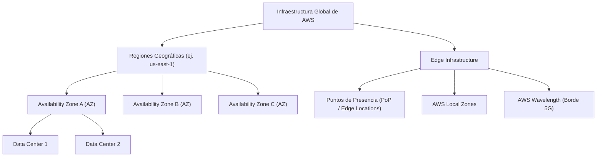

# Computación en la Nube (Cloud Computing)

La **computación en la nube** representa un cambio de paradigma en la provisión, consumo y gestión de recursos informáticos, transformando la infraestructura de tecnologías de la información desde un modelo de gasto de capital (**CapEx** - *Capital Expenditure*) hacia un modelo de gasto operativo (**OpEx** - *Operational Expenditure*) con economías de escala masivas.

---

## 1. Definición Formal (NIST SP 800-145)

Según la definición estándar del *National Institute of Standards and Technology* (**NIST**, publicación especial SP 800-145):

> [!abstract] Definición NIST SP 800-145
> *"La computación en la nube es un modelo que permite el acceso de red ubicuo, conveniente y bajo demanda a un conjunto compartido de recursos informáticos configurables (por ejemplo, redes, servidores, almacenamiento, aplicaciones y servicios) que pueden aprovisionarse y liberarse rápidamente con un esfuerzo de gestión mínimo o interacción con el proveedor de servicios."*

---

## 2. Las Cinco Características Esenciales del Cloud

Para que un entorno sea considerado formalmente computación en la nube según el estándar internacional, debe cumplir con cinco características fundamentales:

1. **Autoservicio bajo demanda (*On-demand self-service*)**:
   El consumidor puede aprovisionar capacidades informáticas de forma unilateral (tiempo de CPU, almacenamiento de red, bases de datos) según sus necesidades, de manera automatizada y sin requerir interacción humana con el personal del proveedor de servicios.

2. **Acceso amplio a la red (*Broad network access*)**:
   Las capacidades están disponibles a través de la red y se accede a ellas mediante mecanismos y protocolos estandarizados (HTTP/HTTPS, REST, SSH) que promueven el uso de plataformas cliente heterogéneas (laptops, teléfonos móviles, estaciones de trabajo, tabletas).

3. **Asignación común de recursos / Multi-tenancy (*Resource pooling*)**:
   Los recursos informáticos del proveedor se agrupan para dar servicio a múltiples consumidores mediante un modelo multi-inquilino (*multi-tenant*), con recursos físicos y virtuales asignados y reasignados dinámicamente según la demanda. El cliente típicamente tiene **independencia de la ubicación** física exacta, aunque puede especificar la ubicación a un nivel de abstracción superior (Región, Zona de Disponibilidad).

4. **Elasticidad rápida (*Rapid elasticity*)**:
   Las capacidades pueden aprovisionarse y liberarse de forma elástica —en algunos casos de manera automática mediante escalado horizontal o vertical— para adaptarse con precisión a los picos y caídas de la carga de trabajo. Para el consumidor, las capacidades aparentan ser ilimitadas y pueden adquirirse en cualquier cantidad y momento.

5. **Servicio medido (*Measured service / Pay-as-you-go*)**:
   Los sistemas en la nube controlan y optimizan automáticamente el uso de recursos aprovechando capacidades de medición apropiadas para el tipo de servicio (almacenamiento en GiB, cómputo en segundos/milisegundos, ancho de banda en GB transferidos, número de transacciones). El uso del recurso se monitorea, controla y reporta con total transparencia para el cliente y el proveedor.

---

## 3. Modelos de Servicio Cloud (Pila de Abstracción)

Los modelos de servicio definen la frontera de control, gestión y responsabilidad entre el cliente y el proveedor sobre los componentes de la pila tecnológica (Hardware, Red, Almacenamiento, Virtualización, SO, Middleware, Runtime, Datos y Aplicaciones).

```
+-------------------------------------------------------------------------+
|                  Nivel de Abstracción y Gestión del Servicio             |
+-------------------+-----------------------------------------------------+
| SaaS              | Aplicación final entregada y administrada por el CSP|
| FaaS (Serverless) | Código ejecutado por eventos; sin servidor visible  |
| PaaS              | Plataforma de desarrollo/ejecución (Runtime + SO)   |
| IaaS              | Infraestructura básica de cómputo, red y disco      |
| On-Premises       | Control total y responsabilidad del centro de datos |
+-------------------+-----------------------------------------------------+
```

### 3.1. IaaS (*Infrastructure as a Service*)
- **Alcance**: Provee acceso a recursos informáticos fundamentales: servidores virtuales o bare-metal, almacenamiento en bloque y componentes de red.
- **Responsabilidad del cliente**: Configuración y parcheo del sistema operativo, middleware, tiempos de ejecución, base de datos y lógica de la aplicación.
- **Servicios en AWS**: [[vpc|Amazon VPC]], Amazon EC2, [[ebs(network)|Amazon EBS]].

### 3.2. PaaS (*Platform as a Service*)
- **Alcance**: Proporciona un entorno preconfigurado para desplegar y gestionar aplicaciones sin preocuparse por la infraestructura subyacente (hipervisores, parches del SO, hardware).
- **Responsabilidad del cliente**: Despliegue de código, configuración de la aplicación y gestión de datos.
- **Servicios en AWS**: AWS Elastic Beanstalk, Amazon RDS (Relational Database Service).

### 3.3. SaaS (*Software as a Service*)
- **Alcance**: Entrega una aplicación completa y funcional accesible directamente a través de un navegador web o API. El proveedor gestiona el stack completo.
- **Responsabilidad del cliente**: Configuración de usuarios, gestión de permisos y consumo del servicio.
- **Servicios en AWS / Mercado**: AWS Organizations, Amazon QuickSight, Google Workspace, Microsoft 365.

### 3.4. FaaS / Serverless (*Function as a Service*)
- **Alcance**: El cómputo se descompone en funciones discretas sin estado (*stateless*) activadas por eventos. Facturación estrictamente basada en el tiempo de ejecución (milisegundos) y memoria consumida, sin cobro por inactividad.
- **Servicios en AWS**: AWS Lambda, AWS Fargate, Amazon API Gateway.

---

## 4. Diagrama Comparativo de Control de la Pila

```mermaid
flowchart LR
    subgraph OnPrem["On-Premises"]
        direction TB
        A1["Aplicación"] --- A2["Datos"] --- A3["Runtime"] --- A4["Middleware"] --- A5["S.O."] --- A6["Virtualización"] --- A7["Hardware/Red"]
    end

    subgraph IaaS["IaaS (ej. EC2, EBS)"]
        direction TB
        B1["Aplicación (Cliente)"] --- B2["Datos (Cliente)"] --- B3["Runtime (Cliente)"] --- B4["Middleware (Cliente)"] --- B5["S.O. (Cliente)"] --- B6["Virtualización (AWS)"] --- B7["Hardware/Red (AWS)"]
    end

    subgraph PaaS["PaaS (ej. RDS, Beanstalk)"]
        direction TB
        C1["Aplicación (Cliente)"] --- C2["Datos (Cliente)"] --- C3["Runtime (AWS)"] --- C4["Middleware (AWS)"] --- C5["S.O. (AWS)"] --- C6["Virtualización (AWS)"] --- C7["Hardware/Red (AWS)"]
    end

    subgraph SaaS["SaaS / Serverless"]
        direction TB
        D1["Aplicación / Config (AWS/Cliente)"] --- D2["Datos (Cliente)"] --- D3["Runtime (AWS)"] --- D4["Middleware (AWS)"] --- D5["S.O. (AWS)"] --- D6["Virtualización (AWS)"] --- D7["Hardware/Red (AWS)"]
    end
```



---

## 5. Modelos de Despliegue

| Modelo | Descripción | Ventajas Principales | Consideraciones de Ingeniería |
| :--- | :--- | :--- | :--- |
| **Nube Pública** | Infraestructura compartida propiedad del CSP (AWS, Azure, GCP) accesible vía Internet abierta. | Sin inversión inicial en hardware, escalabilidad casi infinita, resiliencia global. | Cumplimiento regulatorio de residencia del dato, latencia de tránsito. |
| **Nube Privada** | Infraestructura operada exclusivamente para una sola organización (on-premises o en datacenter dedicado). | Control total de seguridad, gobernanza estricta, cumplimiento específico. | Alto CapEx, mantenimiento integral, escalabilidad acotada al hardware físico. |
| **Nube Híbrida** | Integración orquestada entre un entorno local (privado) y una nube pública mediante enlaces dedicados o VPN. | Flexibilidad para mantener datos críticos on-premises y absorber picos de tráfico en la nube (*cloud bursting*). | Complejidad de red, sincronización de identidades y túneles ([[vpc|AWS Direct Connect / VPN]]). |
| **Multi-Nube** | Uso simultáneo de dos o más proveedores de nube pública para mitigar *vendor lock-in* y optimizar latencias/costes. | Redundancia contra caídas de proveedores, aprovechamiento de servicios especializados. | Sobrecarga operativa, divergencia de APIs y habilidades del equipo de ingeniería. |

---

## 6. Infraestructura Global de AWS

La infraestructura global de AWS está diseñada para ofrecer la máxima resiliencia, tolerancia a fallos y latencias mínimas a escala planetaria:



### 6.1. Regiones (*Regions*)
- Área geográfica física discreta en el mundo (por ejemplo: `us-east-1` en Virginia del Norte, `eu-west-1` en Irlanda).
- Cada Región está completamente aislada de las demás para evitar que un incidente catastrófico en una impacte a otra.
- **Criterios de selección de Región**:
  1. **Cumplimiento legal y soberanía de datos**: Requisitos regulatorios de permanencia física de los datos.
  2. **Latencia**: Proximidad a los usuarios finales.
  3. **Disponibilidad de servicios**: No todos los servicios o tipos de instancias están disponibles inmediatamente en todas las regiones.
  4. **Costos**: Los precios varían entre regiones debido a costos energéticos, impositivos y de infraestructura local.

### 6.2. Zonas de Disponibilidad (*Availability Zones - AZ*)
- Cada Región consta de múltiples AZs aisladas e independientes (mínimo 3 en las regiones modernas).
- Cada AZ está compuesta por uno o varios centros de datos físicos discretos, con suministro eléctrico independiente, sistemas de refrigeración redundantes y conectividad física segregada.
- Las AZs dentro de una misma Región están interconectadas mediante redes de fibra óptica privadas de muy baja latencia (<1-2 ms).
- **Diseño Multi-AZ**: Es la base para construir arquitecturas de alta disponibilidad (HA) y recuperación ante desastres (DR).

### 6.3. Centros de Datos (*Data Centers*)
- Instalaciones físicas seguras que albergan decenas de miles de servidores personalizados, bastidores (*racks*) y sistemas de red redundantes.

### 6.4. Puntos de Presencia (*Edge Locations / PoP*)
- Red distribuida globalmente de cientos de puntos de presencia utilizados por **Amazon CloudFront** (Content Delivery Network - CDN), **Amazon Route 53** (DNS Anycast) y **AWS Global Accelerator**.
- Permiten almacenar en caché contenido estático y dinámico cerca de los usuarios finales, reduciendo dramáticamente la latencia RTT (*Round-Trip Time*).

### 6.5. AWS Local Zones y AWS Wavelength
- **AWS Local Zones**: Extienden la infraestructura de cómputo, almacenamiento y base de datos a centros metropolitanos donde no existe una Región completa, para soportar aplicaciones que requieren latencias inferiores a 10 milisegundos (renderizado en tiempo real, juegos multijugador, trading financiero).
- **AWS Wavelength**: Aloja servicios de computación y almacenamiento de AWS en el borde de las redes 5G de operadores de telecomunicaciones, permitiendo que el tráfico de dispositivos móviles se procese sin salir de la red celular.

---

## 7. Marco de Buena Arquitectura de AWS (*Well-Architected Framework*)

El *AWS Well-Architected Framework* proporciona pautas y mejores prácticas de ingeniería estructuradas en **seis pilares fundamentales**:

> [!tip] Los Seis Pilares Arquitectónicos
> 1. **Excelencia Operativa (*Operational Excellence*)**: Capacidad para ejecutar y monitorear cargas de trabajo, ofrecer valor continuo y mejorar continuamente los procesos. Claves: Operaciones como código, anticipación de fallas, cambios reversibles pequeños y frecuentes.
> 2. **Seguridad (*Security*)**: Protección de información, sistemas y activos mediante evaluación y mitigación de riesgos. Claves: Principio de mínimo privilegio, trazabilidad integral ([[Acceso|IAM]]), seguridad en todas las capas y cifrado exhaustivo en tránsito y reposo.
> 3. **Fiabilidad (*Reliability*)**: Capacidad de una carga de trabajo para recuperarse de fallos de infraestructura y mitigar interrupciones automáticamente. Claves: Pruebas de procedimientos de recuperación, recuperación horizontal automática ante fallos ([[vpc|Multi-AZ]]), eliminación de puntos únicos de falla (*SPOF*).
> 4. **Eficiencia del Rendimiento (*Performance Efficiency*)**: Capacidad para usar los recursos informáticos de manera eficiente para cumplir con los requisitos del sistema y mantener esa eficiencia a medida que la demanda y las tecnologías evolucionan. Claves: Tecnologías avanzadas como servicio, alcance global en minutos, arquitecturas serverless.
> 5. **Optimización de Costos (*Cost Optimization*)**: Capacidad de ejecutar sistemas para entregar valor comercial al precio más bajo posible. Claves: Medición de eficiencia, adopción de modelos de consumo (*pay-as-you-go*), análisis y atribución de gastos.
> 6. **Sostenibilidad (*Sustainability*)**: Minimización del impacto ambiental de las cargas de trabajo en la nube. Claves: Maximización del uso de recursos, reducción de la energía requerida y optimización del ciclo de vida del almacenamiento.

---

## Notas relacionadas
- [[responsabilidad compartida]] - Modelo contractual y técnico de seguridad entre AWS y el cliente.
- [[vpc]] - Aislamiento de redes virtuales en AWS.
- [[ebs(network)]] - Almacenamiento en bloque persistente para cómputo EC2.
- [[EFS elastic file system]] - Almacenamiento de archivos elástico y distribuido multi-AZ.
- [[tipos de soporte aws]] - Modelos de atención y SLAs técnicos de AWS.
- [[Acceso]] - Identidad, autenticación y autorización con AWS IAM.
- [[sgsi]] - Sistema de Gestión de Seguridad de la Información.
