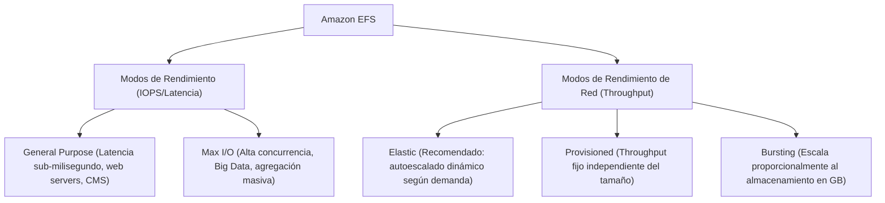
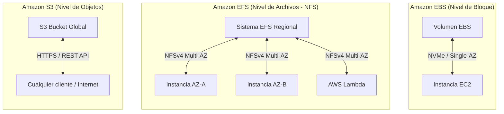
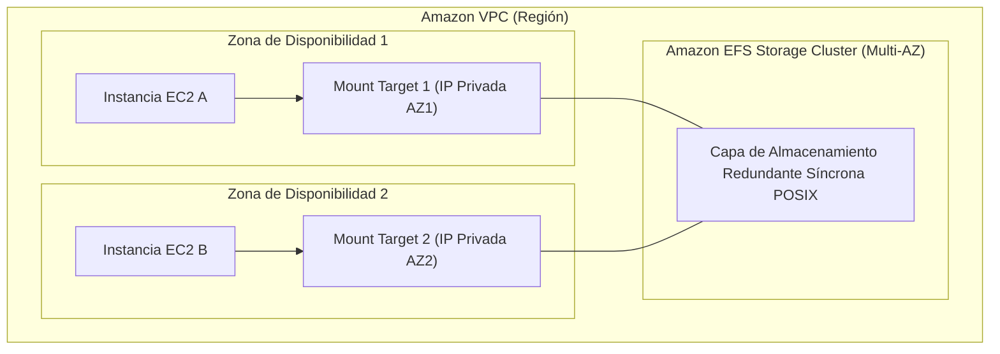

# Amazon Elastic File System (Amazon EFS)

**Amazon EFS** es un servicio de almacenamiento de archivos totalmente administrado, elástico, escalable y serverless diseñado para su uso con instancias Amazon EC2, contenedores ([[Cloud computing|Amazon ECS / Amazon EKS]]) y computación serverless (**AWS Lambda**). Opera bajo los protocolos de red **NFSv4.0 y NFSv4.1** (*Network File System*) y ofrece compatibilidad total con la semántica del estándar **POSIX** (*Portable Operating System Interface*).

---

## 1. Arquitectura y Características Fundamentales

A diferencia de los volúmenes [[ebs(network)|Amazon EBS]] que están confinados a una única Zona de Disponibilidad, **Amazon EFS es un servicio regional y nativamente Multi-AZ**:

- **Alta Disponibilidad y Resiliencia**: Los datos almacenados en EFS se replican síncronamente a través de múltiples Zonas de Disponibilidad dentro de la Región, tolerando la pérdida completa de una AZ sin degradación del servicio ni pérdida de datos.
- **Acceso Concurrente Masivo ($N:N$)**: Cientos o miles de instancias de cómputo distribuidas en múltiples AZs pueden montar y leer/escribir concurrentemente en el mismo sistema de archivos mediante **Mount Targets** (interfaces de red virtuales con IP privada desplegadas en cada subred de la [[vpc|VPC]]).
- **Elasticidad Serverless**: No requiere aprovisionar capacidad previa. El sistema de archivos crece y decrece de forma transparente y automática a medida que se añaden o eliminan archivos, pagando estrictamente por los bytes almacenados.
- **Sistemas Operativos Compatibles**: Diseñado nativamente para sistemas operativos basados en **Linux**. No es compatible de forma directa con sistemas Windows (para los cuales AWS provee la familia **Amazon FSx**).

---

## 2. Modos de Rendimiento y Modos de Throughput

### 2.1. Modos de Rendimiento (*Performance Modes*)
- **General Purpose (Propósito General - Por defecto)**:
  - Diseñado para cargas sensibles a la latencia.
  - Ofrece la menor latencia por operación de metadatos y acceso a archivos.
  - Casos de uso: Servidores web, sistemas de gestión de contenidos (WordPress, Drupal), directorios principales (`/home`), herramientas de desarrollo y pipelines de CI/CD.
- **Max I/O**:
  - Escala a niveles extremadamente altos de rendimiento e IOPS agregados.
  - Conlleva una latencia marginalmente superior por operación en comparación con el modo General Purpose.
  - Casos de uso: Procesamiento paralelo masivo (*Big Data*), análisis genómico, renderizado distribuido y simulaciones científicas.

### 2.2. Modos de Throughput (*Throughput Modes*)
- **Elastic (Recomendado)**:
  - AWS ajusta dinámicamente el ancho de banda del sistema de archivos en función de las demandas inmediatas de la carga de trabajo, sin necesidad de aprovisionamiento ni gestión de créditos. Factura por datos transferidos.
- **Provisioned**:
  - Permite asignar un ancho de banda específico garantizado (en MiB/s) desde el primer momento, independientemente del volumen total de datos almacenados en disco.
- **Bursting**:
  - El rendimiento base escala proporcionalmente al tamaño del sistema de archivos (50 KiB/s por GiB almacenado), con capacidad de utilizar créditos acumulados para soportar ráfagas de hasta 100 MiB/s o más.

---

## 3. Clases de Almacenamiento y Gestión de Ciclo de Vida (*Lifecycle Management*)

EFS incorpora mecanismos automáticos para reducir drásticamente los costos de almacenamiento (hasta un 92% de ahorro) mediante la transición transparente de archivos entre diferentes niveles de almacenamiento:

| Clase de Almacenamiento | Disponibilidad | Latencia de Acceso | Perfil de Costos | Caso de Uso |
| :--- | :--- | :--- | :--- | :--- |
| **EFS Standard** | Multi-AZ | Milisegundos | Tarifa estándar de almacenamiento. | Archivos de acceso frecuente y datos activos. |
| **EFS One Zone** | Single-AZ | Milisegundos | ~47% menor que EFS Standard. | Cargas de desarrollo o réplicas donde la redundancia Multi-AZ no es obligatoria. |
| **EFS Infrequent Access (EFS IA)** | Multi-AZ | Milisegundos bajos | Ahorro masivo en almacenamiento (~$0.016/GB/mes) + costo por GB leído. | Archivos no consultados en 7, 14, 30, 60 o 90 días. |
| **EFS Archive** | Multi-AZ | Decenas de ms | El costo más bajo de EFS para retención histórica. | Datos fríos que rara vez se consultan pero deben mantenerse en línea. |

> [!tip] Reglas de Ciclo de Vida Automatizadas
> - **Transición a IA/Archive**: EFS analiza automáticamente el último tiempo de acceso (`atime`). Si un archivo no se consulta durante la ventana configurada, se mueve silenciosamente a la clase IA o Archive sin alterar la ruta ni romper los puntos de montaje.
> - **Retorno Inteligente (*Intelligent Tiering*)**: Si un archivo en clase IA vuelve a ser consultado, EFS puede promoverlo automáticamente a la clase Standard para evitar costes adicionales de lectura recurrente.

---

## 4. Familia Amazon FSx: Sistemas de Archivos Especializados

Para cargas de trabajo que no operan bajo NFS estándar sobre Linux, AWS ofrece la familia **Amazon FSx**:

- **Amazon FSx for Windows File Server**:
  - Sistema de archivos totalmente nativo de Windows basado en el protocolo **SMB** (*Server Message Block*).
  - Integración completa con **Microsoft Active Directory**, listas de control de acceso NTFS (ACLs), instantáneas de instantáneas de volumen (VSS) y replicación DFS.
- **Amazon FSx for Lustre**:
  - Sistema de archivos optimizado para computación de alto rendimiento (**HPC** - *High Performance Computing*), entrenamiento de modelos de Machine Learning y procesamiento de video masivo.
  - Ofrece latencias de submilisegundos y cientos de gigabytes por segundo de throughput con millones de IOPS.
- **Amazon FSx for NetApp ONTAP** y **Amazon FSx for OpenZFS**:
  - Migración directa de cabinas de almacenamiento empresariales locales con características avanzadas de deduplicación y compresión.

---

## 5. Gran Comparativa Arquitectónica: EBS vs. EFS vs. S3

### Tabla Comparativa Integral de Almacenamiento en AWS

| Dimensión de Ingeniería | Amazon EBS | Amazon EFS | Amazon S3 |
| :--- | :--- | :--- | :--- |
| **Modelo de Datos** | **Bloque** (Sectores brutos de disco formateables). | **Archivos** (Árbol jerárquico de directorios y ficheros POSIX). | **Objetos** (Clave-Valor: Data + Metadata + Bucket). |
| **Protocolo de Comunicación** | NVMe / Bloque en red. | **NFSv4.0 / NFSv4.1**. | **HTTP / HTTPS (REST API)**. |
| **Alcance Geográfico** | **Single-AZ** (Confinado a una Zona de Disponibilidad). | **Multi-AZ Regional** (Replicado síncronamente en múltiples AZs). | **Multi-AZ Regional / Global** (Acceso público o privado en toda la Región). |
| **Concurrencia de Acceso** | Típicamente $1:1$ (Una instancia a la vez; Multi-Attach limitado a $16$ instancias en `io1`/`io2`). | **$N:N$ Masivo** (Miles de instancias, contenedores y lambdas en simultáneo). | **Ilimitada** (Cientos de miles de solicitudes HTTP concurrentes). |
| **Sistemas Operativos** | Linux, Windows, macOS (a través de EC2). | **Exclusivamente Linux** y servicios basados en Linux. | **Agnóstico del SO** (Cualquier cliente con soporte HTTP/HTTPS). |
| **Latencia** | Ultra baja (< 1 ms a pocos ms). | Baja (pocos ms). | Moderada (10 a 50 ms para primera lectura). |
| **Caso de Uso Primario** | Volúmenes de arranque del SO, bases de datos relacionales ([[ebs(network)|RDS/EC2]]). | Almacenamiento compartido, CMS (WordPress), directorios comunes, contenedores. | Data lakes, backup a largo plazo, hosting web estático, archivos multimedia. |

---

## 6. Diagrama de Implementación Multi-AZ con EFS

---

## Notas relacionadas
- [[Cloud computing]] - Modelos de servicio e infraestructura global de almacenamiento.
- [[responsabilidad compartida]] - Seguridad y políticas POSIX del sistema de archivos a cargo del cliente.
- [[vpc]] - Configuración de subredes y reglas de Security Group para puertos NFS (puerto TCP 2049).
- [[ebs(network)]] - Almacenamiento a nivel de bloque en single-AZ vs. archivos elásticos distribuidos.
- [[tipos de soporte aws]] - Soporte técnico en diagnósticos de conectividad y rendimiento de almacenamiento.
- [[Acceso]] - Políticas de recursos y control IAM para la autorización de montaje en EFS.
