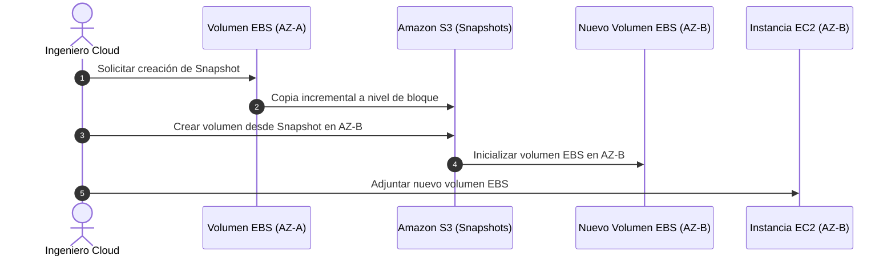
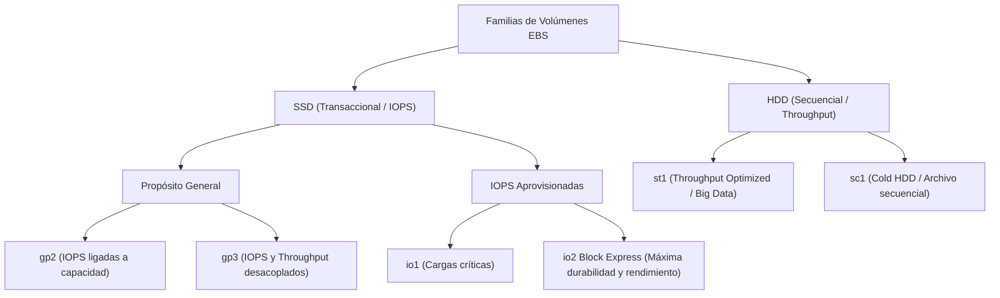

# Amazon Elastic Block Store (Amazon EBS)

**Amazon EBS** es un servicio que proporciona volúmenes de almacenamiento persistente a nivel de bloque (**Block-Level Storage**) para su uso con instancias Amazon EC2. En términos arquitectónicos, un volumen EBS se comporta de manera análoga a un disco duro físico o un volumen de una Red de Área de Almacenamiento (**SAN** - *Storage Area Network*), conectado a la instancia a través de la red de alta velocidad del centro de datos.

---

## 1. Naturaleza y Dependencia de la Zona de Disponibilidad (AZ)

A diferencia del almacenamiento de objetos ([[Cloud computing|Amazon S3]]) que posee alcance regional, un volumen EBS está **confinado estrictamente a una única Zona de Disponibilidad (AZ)**:

- **Replicación interna**: Dentro de su AZ, AWS replica automáticamente cada volumen EBS de forma síncrona en múltiples servidores físicos para prevenir pérdidas de datos por fallos de hardware aislados (ofreciendo una disponibilidad anual del 99.8% al 99.999% según el tipo de volumen).
- **Acoplamiento de AZ**: Una instancia EC2 ubicada en `us-east-1a` solo puede montar directamente volúmenes EBS creados en `us-east-1a`. No es posible adjuntar un volumen EBS de `us-east-1a` a una instancia que se ejecuta en `us-east-1b`.

### Procedimiento para Migrar o Clonar Volúmenes entre Zonas de Disponibilidad

Para trasladar datos de un volumen EBS a otra Zona de Disponibilidad o Región geográfica:

1. **Crear un Snapshot**: Se toma una captura de instantánea (*point-in-time*) del volumen EBS original. Los datos del snapshot se transfieren y almacenan de forma redundante en Amazon S3.
2. **Copiar Snapshot (Opcional si es entre Regiones)**: Si el destino es otra Región geográfica, se ejecuta una copia del snapshot hacia la Región de destino.
3. **Restaurar Volumen en la nueva AZ**: Desde el snapshot en S3, se aprovisiona un nuevo volumen EBS especificando la AZ destino deseada (`us-east-1b`).
4. **Adjuntar a la Instancia Destino**: El nuevo volumen queda disponible para montarse en la instancia EC2 de la nueva AZ.

---

## 2. Taxonomía y Comparativa Exhaustiva de Tipos de Volúmenes EBS

AWS divide los volúmenes EBS en dos grandes familias según su medio físico de almacenamiento: **Discos de Estado Sólido (SSD)** y **Discos Magnéticos (HDD)**.

### 2.1. Volúmenes de Estado Sólido (SSD)
Diseñados para cargas de trabajo transaccionales con lecturas y escrituras aleatorias pequeñas y frecuentes:

- **General Purpose SSD (`gp2`)**:
  - El rendimiento está vinculado matemáticamente a la capacidad aprovisionada: 3 IOPS por cada GiB de almacenamiento.
  - Cuenta con un sistema de créditos de ráfaga (*burst credits*) que permite alcanzar hasta 3,000 IOPS en volúmenes pequeños. Rango: 100 a 16,000 IOPS.
- **General Purpose SSD (`gp3`)**:
  - Estándar moderno de AWS. **Desacopla completamente el almacenamiento, los IOPS y el Throughput**.
  - Ofrece una línea base gratuita de **3,000 IOPS y 125 MiB/s** sin importar el tamaño del disco.
  - Permite escalar independientemente hasta 16,000 IOPS y 1,000 MiB/s a un costo hasta un 20% menor que `gp2`.
- **Provisioned IOPS SSD (`io1` / `io2 Block Express`)**:
  - Diseñados para bases de datos transaccionales masivas de misión crítica (SAP HANA, Oracle RAC, Microsoft SQL Server, PostgreSQL masivo).
  - `io2 Block Express` ofrece una latencia inferior al milisegundo (*sub-millisecond latency*), una durabilidad del **99.999%** (cinco nueves), hasta **256,000 IOPS** y un rendimiento máximo de **4,000 MiB/s** con una relación de hasta 1,000 IOPS por GiB.

### 2.2. Volúmenes de Disco Magnético (HDD)
Diseñados para cargas de trabajo secuenciales con bloques de datos grandes donde el costo por gigabyte es prioritario sobre la latencia:

- **Throughput Optimized HDD (`st1`)**:
  - Almacenamiento secuencial de bajo costo optimizado para streaming de datos, procesamiento ETL con Apache Spark/Hadoop y Data Warehousing. No puede utilizarse como volumen de arranque del SO.
- **Cold HDD (`sc1`)**:
  - La opción de almacenamiento EBS más económica. Diseñado para datos secuenciales fríos a los que se accede esporádicamente. No puede ser volumen de arranque.

### Tabla Comparativa de Rendimiento y Especificaciones

| Tipo de Volumen | Nombre de API | Tamaño Mín/Máx | Rendimiento Máximo (Throughput) | IOPS Máximos | Caso de Uso Primario |
| :--- | :--- | :--- | :--- | :--- | :--- |
| **General Purpose SSD** | `gp3` | 1 GiB - 16 TiB | 1,000 MiB/s | 16,000 IOPS | Volúmenes de arranque del SO, desarrollo, escritorios virtuales, bases de datos medianas. |
| **General Purpose SSD (Legado)** | `gp2` | 1 GiB - 16 TiB | 250 MiB/s | 16,000 IOPS | Sistemas existentes sin migrar a gp3 (3 IOPS/GiB). |
| **Provisioned IOPS SSD** | `io2` Block Express | 4 GiB - 64 TiB | 4,000 MiB/s | 256,000 IOPS | Bases de datos relacionales empresariales críticas y cargas I/O intensivas. |
| **Provisioned IOPS SSD** | `io1` | 4 GiB - 16 TiB | 1,000 MiB/s | 64,000 IOPS | Cargas transaccionales de alto rendimiento. |
| **Throughput Optimized HDD**| `st1` | 125 GiB - 16 TiB| 500 MiB/s | 500 IOPS | Big data, procesamiento de logs y flujos de datos continuos. |
| **Cold HDD** | `sc1` | 125 GiB - 16 TiB| 250 MiB/s | 250 IOPS | Almacenamiento histórico de menor costo para datos secuenciales fríos. |

---

## 3. Características Avanzadas de Ingeniería en EBS

### 3.1. Snapshots Incrementales en Amazon S3
- Las instantáneas de EBS se guardan en Amazon S3 de forma totalmente incremental: el primer snapshot almacena una copia completa de todos los bloques escritos; los snapshots posteriores **solo guardan los bloques que han cambiado** desde la instantánea anterior.
- **EBS Fast Snapshot Restore (FSR)**: Elimina el fenómeno de latencia inicial (*block pre-warming*) restaurando volúmenes con su rendimiento de I/O máximo de manera instantánea desde la creación.

### 3.2. EBS Multi-Attach
- Permite conectar un único volumen EBS a **múltiples instancias EC2 simultáneamente** (hasta 16 instancias) dentro de la misma Zona de Disponibilidad.
- **Requisito crítico**: Exclusivo para volúmenes `io1` e `io2`. Requiere un sistema de archivos de clúster con reconocimiento de concurrencia (como GFS2, OCFS2 o el gestor de almacenamiento de Oracle RAC) para evitar la sobreescritura y corrupción de bloques.

### 3.3. Cifrado Nativo con AWS KMS
- Cifrado transparente a nivel de bloque utilizando el estándar de la industria **AES-256**.
- Se integra con **AWS Key Management Service (KMS)**.
- Al cifrar un volumen EBS, se cifran automáticamente: los datos almacenados en reposo, los metadatos del disco, todo el tráfico de I/O en tránsito entre la instancia y el volumen, y **todas las instantáneas (*snapshots*) creadas a partir de él**.

### 3.4. Instancias Optimizadas para EBS (*EBS-Optimized Instances*)
- En instancias estándar, el tráfico de red de la aplicación y el tráfico de I/O hacia el volumen EBS comparten la misma interfaz de red, generando posible contención de recursos.
- Las instancias optimizadas para EBS utilizan una **conexión de red dedicada y aislada exclusivamente para el tráfico de EBS**, garantizando el rendimiento contratado de IOPS y ancho de banda sin fluctuaciones por ráfagas de red de la aplicación.

---

## Notas relacionadas
- [[Cloud computing]] - Conceptos de almacenamiento elástico e infraestructura global.
- [[responsabilidad compartida]] - Cifrado del dato y respaldo de snapshots bajo responsabilidad del cliente.
- [[vpc]] - Interconexión de red privada entre instancias y recursos.
- [[EFS elastic file system]] - Comparativa: Almacenamiento en bloque (EBS) vs. Almacenamiento de archivos distribuido (EFS).
- [[tipos de soporte aws]] - Soporte técnico y diagnóstico de volúmenes de almacenamiento.
- [[Acceso]] - Permisos IAM para operaciones `ec2:CreateSnapshot`, `ec2:AttachVolume`.
