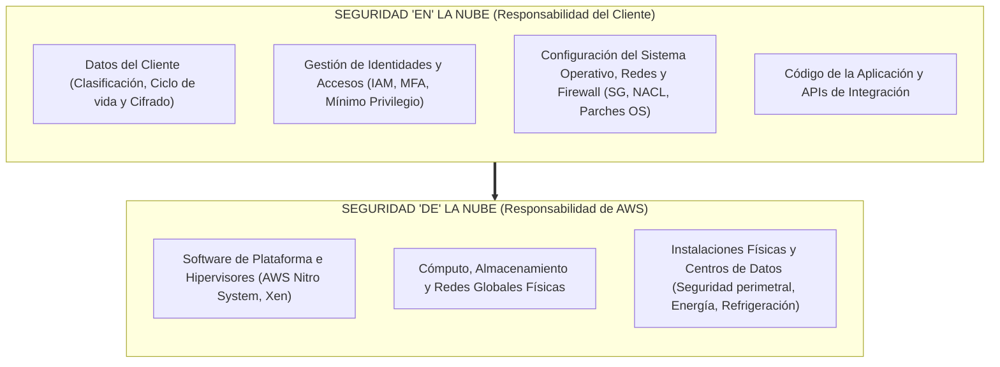
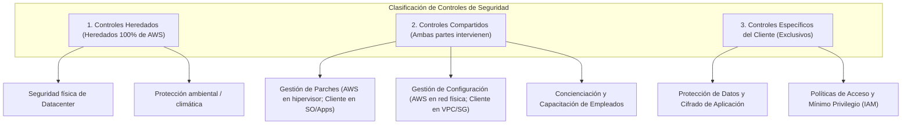

# Modelo de Responsabilidad Compartida (Shared Responsibility Model)

El **Modelo de Responsabilidad Compartida** de AWS es el marco arquitectónico y operativo fundamental que delimita con precisión matemática y contractual las obligaciones de seguridad y cumplimiento entre el proveedor de servicios en la nube (**AWS**) y el **Cliente**. 

> [!important] Principio Rector
> La adopción del cloud computing **no elimina la responsabilidad de seguridad del cliente**, sino que transforma su naturaleza: descarga la carga operativa de bajo nivel (mantenimiento físico de centros de datos, conmutación de red y virtualización) para permitir al cliente concentrarse en la protección de sus datos, identidades y lógica de negocio.

---

## 1. La Gran División: Seguridad "DE" la Nube vs. Seguridad "EN" la Nube

---

## 2. Seguridad "DE" la Nube (Responsabilidad de AWS)

AWS es responsable de proteger la infraestructura global física y lógica sobre la cual se ejecutan todos los servicios en la nube:

1. **Seguridad Física de las Instalaciones**:
   - Protección perimetral de los centros de datos (vallas de seguridad, patrullas, circuitos cerrados de televisión CCTV).
   - Acceso estrictamente controlado mediante autenticación biométrica multifactorial de dos pasos para personal autorizado.
   - Redundancia de suministros críticos: generadores diésel de respaldo, sistemas de alimentación ininterrumpida (UPS) y plantas de refrigeración líquida/aire.
   - Destrucción segura de medios de almacenamiento retirados (desmagnetización y trituración física conforme al estándar **NIST SP 800-88**).

2. **Infraestructura de Hardware y Red Troncal**:
   - Mantenimiento, diagnóstico y sustitución preventiva de servidores físicos, conmutadores (*switches*) y fibra óptica.
   - Protección contra ataques distribuidos de denegación de servicio (DDoS) en capas 3 y 4 del modelo OSI mediante infraestructura integrada (**AWS Shield Standard**).

3. **Capa de Virtualización e Hipervisor**:
   - Aislamiento estricto de memoria y CPU entre inquilinos (*tenants*).
   - Uso de la arquitectura moderna **AWS Nitro System** (tarjetas ASIC/PCIe personalizadas que descargan las funciones de red, almacenamiento y seguridad del procesador principal, eliminando el hipervisor tradicional y bloqueando el acceso administrativo directo de operadores humanos).

4. **Software Central de Servicios Administrados**:
   - Parcheo del kernel, actualizaciones de firmware y mantenimiento de bases de datos subyacentes en servicios PaaS y Serverless (como Amazon DynamoDB, Amazon S3 y [[EFS elastic file system|Amazon EFS]]).

---

## 3. Seguridad "EN" la Nube (Responsabilidad del Cliente)

El cliente retiene el control absoluto y la custodia sobre los recursos lógicos que despliega, así como las decisiones de configuración de seguridad:

1. **Gestión de Identidad y Control de Acceso ([[Acceso|AWS IAM]])**:
   - Configuración de usuarios, grupos y roles siguiendo el **principio de mínimo privilegio** (*Least Privilege*).
   - Implementación obligatoria de autenticación multifactor (**MFA**) en todas las identidades humanas (especialmente en el Usuario Raíz).
   - Rotación y revocación periódica de claves de acceso criptográficas (*Access Keys*).

2. **Configuración de Red y Seguridad Perimetral ([[vpc|Amazon VPC]])**:
   - Definición de topologías de subredes públicas y privadas.
   - Reglas de filtrado de tráfico entrante y saliente mediante **Security Groups** (firewall con estado a nivel de interfaz de red) y **Network ACLs** (firewall sin estado a nivel de subred).

3. **Gestión del Sistema Operativo y Software (en IaaS)**:
   - Aplicación de parches de seguridad del sistema operativo invitado (Linux, Windows Server) en instancias Amazon EC2.
   - Instalación, configuración y monitoreo de herramientas antivirus, anti-malware y agentes EDR (*Endpoint Detection and Response*).

4. **Cifrado y Protección Criptográfica de Datos**:
   - **Cifrado en reposo**: Habilitación de cifrado AES-256 para volúmenes [[ebs(network)|Amazon EBS]], sistemas de archivos [[EFS elastic file system|Amazon EFS]], buckets de Amazon S3 y bases de datos relacionales, integrándose con **AWS KMS** (*Key Management Service*) o **AWS CloudHSM**.
   - **Cifrado en tránsito**: Implementación de protocolos TLS 1.2/1.3 para comunicaciones HTTP y certificados SSL mediante **AWS Certificate Manager (ACM)**.

5. **Clasificación y Cumplimiento de Datos**:
   - Clasificación de los datos del cliente según su nivel de confidencialidad e impacto legal (PII, PCI-DSS, HIPAA, GDPR).

---

## 4. Matriz Comparativa por Modelo de Servicio

La delimitación de responsabilidades varía drásticamente según el nivel de abstracción del servicio utilizado:

| Dominio Tecnológico | IaaS (ej. EC2 + EBS) | PaaS (ej. RDS, Beanstalk) | Serverless / SaaS (ej. Lambda, S3, Orgs) |
| :--- | :--- | :--- | :--- |
| **Seguridad de Instalaciones y Datacenter** | AWS | AWS | AWS |
| **Hardware físico y Red Troncal** | AWS | AWS | AWS |
| **Hipervisor y Virtualización** | AWS | AWS | AWS |
| **Parcheo del Sistema Operativo** | **Cliente** | AWS | AWS |
| **Mantenimiento del Motor / Runtime** | **Cliente** | AWS | AWS |
| **Configuración de Red de la Instancia** | **Cliente** (SG, VPC, Enrutamiento) | **Compartido** (VPC, SG, Parámetros) | AWS (Infraestructura de red subyacente) |
| **Gestión de Identidades y Permisos (IAM)** | **Cliente** | **Cliente** | **Cliente** |
| **Gestión y Cifrado de Datos** | **Cliente** | **Cliente** | **Cliente** |

---

## 5. Controles Compartidos, Heredados y Específicos del Cliente

La arquitectura de gobernanza de AWS clasifica los controles de seguridad en tres categorías operativas:

> [!tip] Controles Compartidos Clave
> - **Gestión de parches (*Patch Management*)**: AWS es responsable de parchar y solucionar fallas dentro de la infraestructura y el hipervisor físico, mientras que el cliente es responsable de parchar su sistema operativo invitado y sus aplicaciones.
> - **Gestión de configuración (*Configuration Management*)**: AWS mantiene la configuración de sus dispositivos de infraestructura, mientras que el cliente es responsable de configurar sus propios sistemas operativos, bases de datos y firewalls de red.
> - **Capacitación en seguridad (*Awareness and Training*)**: AWS capacita a sus empleados internos, y el cliente debe capacitar a sus desarrolladores y operadores en prácticas seguras en la nube.

---

## 6. Auditoría, Evidencia y Cumplimiento Normativo

Para que un cliente pueda certificar el cumplimiento de estándares internacionales (ISO 27001, SOC 1/2/3, PCI-DSS Level 1, FedRAMP, HIPAA) ante auditores externos:

- **AWS Artifact**: Portal central de autoservicio que permite descargar bajo demanda los informes de auditoría SOC de AWS, certificaciones ISO y acuerdos de procesamiento de datos comerciales (BAA).
- **AWS Audit Manager**: Servicio que automatiza la recopilación continua de evidencia para evaluar si los controles del cliente cumplen con los marcos regulatorios.

---

## Notas relacionadas
- [[Cloud computing]] - Conceptos esenciales, modelos de despliegue y marcos de diseño.
- [[Acceso]] - Implementación del control de acceso, usuarios, roles y políticas IAM del cliente.
- [[vpc]] - Seguridad perimetral, subredes, tablas de enrutamiento, Security Groups y NACLs.
- [[ebs(network)]] - Seguridad y cifrado KMS a nivel de almacenamiento en bloque.
- [[EFS elastic file system]] - Permisos POSIX y cifrado para sistemas de archivos distribuidos.
- [[tipos de soporte aws]] - Soporte de ingeniería y Trusted Advisor para la postura de seguridad.
- [[sgsi]] - Sistema de Gestión de Seguridad de la Información según estándares de seguridad.
