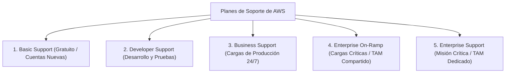
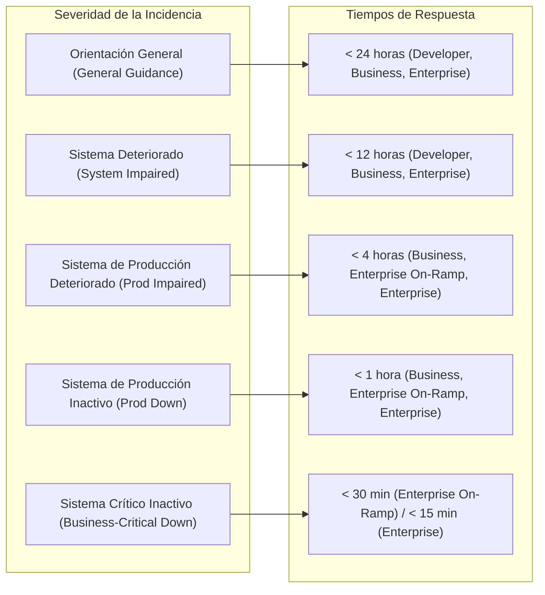

# Planes de Soporte de AWS (AWS Support Plans)

El soporte técnico en AWS es un componente estratégico del pilar de **Fiabilidad y Excelencia Operativa** del [[Cloud computing|AWS Well-Architected Framework]]. Permite a las organizaciones acceder a orientación arquitectónica experta, resolución proactiva de incidencias operativas y garantías contractuales de tiempo de primera respuesta mediante Acuerdos de Nivel de Servicio (**SLA** - *Service Level Agreement*).

---

## 1. Los Cinco Niveles de Soporte de AWS

AWS estructura su oferta de soporte técnico en cinco planes diseñados para cubrir desde la experimentación y el desarrollo académico hasta infraestructuras críticas corporativas:

### 1.1. AWS Basic Support
- **Público objetivo**: Todas las cuentas de AWS por defecto sin costo adicional.
- **Alcance**: 
  - Acceso 24/7 al servicio de atención al cliente (*Customer Service*) para incidencias relacionadas con facturación, pagos y cuotas de servicio.
  - Acceso irrestricto a la documentación técnica, guías de arquitectura, whitepapers y foros comunitarios de AWS.
  - Acceso a las **7 comprobaciones básicas de seguridad y límites de servicio** de **AWS Trusted Advisor**.
  - Acceso al panel de control de salud del sistema (**AWS Health Dashboard** y Personal Health Dashboard).

### 1.2. AWS Developer Support
- **Público objetivo**: Desarrolladores, estudiantes y organizaciones en fases tempranas de prueba o desarrollo (*non-production environments*).
- **Alcance**:
  - Orientación técnica sobre cómo utilizar servicios de AWS y mejores prácticas de integración.
  - Canales de comunicación: Correo electrónico y panel web (interacción con ingenieros asociados de soporte en la nube).
  - Horario de atención: **Horario laboral local de oficina (Business Hours)**.
  - Número de contactos autorizados: 1 contacto primario con casos ilimitados.

### 1.3. AWS Business Support
- **Público objetivo**: Organizaciones que ejecutan **cargas de trabajo en entornos de producción** activos.
- **Alcance**:
  - Soporte técnico **24/7 vía teléfono, chat interactivo y correo electrónico** por parte de ingenieros de soporte en la nube (*Cloud Support Engineers*).
  - Casos ilimitados abiertos por un número ilimitado de contactos autorizados en la cuenta.
  - Acceso al **catálogo completo de más de 100 comprobaciones de AWS Trusted Advisor** (optimización de costos, seguridad avanzada, tolerancia a fallas, rendimiento y cuotas).
  - Soporte de configuración y diagnóstico para software de terceros común (sistemas operativos, servidores web Apache/Nginx, bases de datos MySQL/PostgreSQL).

### 1.4. AWS Enterprise On-Ramp
- **Público objetivo**: Empresas con cargas de trabajo de producción críticas para el negocio que requieren tiempos de respuesta inmediatos y acompañamiento consultivo sin la escala total del plan Enterprise.
- **Alcance**:
  - Tiempos de respuesta acelerados: **menos de 30 minutos** para caídas de sistemas críticos para el negocio.
  - Acceso a un grupo común (*pool*) de **Technical Account Managers (TAM)**.
  - Una revisión de arquitectura consultiva al año (**AWS Well-Architected Review**).
  - Diagnóstico operativo y recomendaciones proactivas de costos.

### 1.5. AWS Enterprise Support
- **Público objetivo**: Grandes corporaciones e instituciones con cargas de trabajo de **misión crítica** donde cualquier minuto de inactividad representa un impacto financiero o reputacional severo.
- **Alcance**:
  - **Tiempo de respuesta garantizado inferior a 15 minutos** para incidentes donde el sistema crítico para el negocio está inactivo (*Business-critical system down*).
  - Asignación de un **Technical Account Manager (TAM) Dedicado**: un ingeniero senior exclusivo que actúa como defensor técnico del cliente dentro de AWS, coordinando escalaciones, revisiones preventivas de salud arquitectónica y planificación de capacidad.
  - **Infrastructure Event Management (IEM)**: Acompañamiento especializado de ingenieros de AWS durante lanzamientos de productos, eventos de ventas masivas (Black Friday, Cyber Monday) o migraciones masivas para asegurar que la arquitectura soporte el tráfico previsto.
  - Acceso a programas proactivos de entrenamiento y mesas de crisis (*Operations Reviews*).

---

## 2. Matriz Comparativa Exhaustiva de Planes de Soporte

| Dimensión Técnica | Basic | Developer | Business | Enterprise On-Ramp | Enterprise |
| :--- | :--- | :--- | :--- | :--- | :--- |
| **Costo Mensual** | **Gratuito ($0)** | Mayor entre **$29 USD** o 3% del gasto mensual en AWS. | Mayor entre **$100 USD** o escala decreciente (10% a 3% según volumen). | Mayor entre **$5,500 USD** o 10% del gasto mensual. | Mayor entre **$15,000 USD** o escala decreciente (10% a 3%). |
| **Horario y Canales de Atención Técnica** | No incluye soporte técnico a recursos. | Horario laboral local (vía Web/Email). | **24/7** (Teléfono, Chat y Web). | **24/7** (Teléfono, Chat y Web). | **24/7** (Teléfono, Chat y Web con puente de teleconferencia directo). |
| **Contactos Autorizados** | Ilimitados (Facturación). | 1 contacto primario. | Ilimitados. | Ilimitados. | Ilimitados. |
| **Rol del TAM (Technical Account Manager)** | No disponible. | No disponible. | No disponible. | Acceso a un grupo (*pool*) de TAMs. | **TAM Dedicado y Exclusivo**. |
| **AWS Trusted Advisor** | 7 verificaciones esenciales. | 7 verificaciones esenciales. | **Catálogo completo** (+100 verificaciones). | **Catálogo completo** (+100 verificaciones). | **Catálogo completo** (+100 verificaciones). |
| **Infrastructure Event Management (IEM)** | No disponible. | No disponible. | Disponible por tarifa adicional individual. | 1 evento IEM incluido por año. | **Eventos IEM ilimitados incluidos**. |

---

## 3. Matriz de Severidad y Tiempos de Primera Respuesta Técnica (SLA)

AWS clasifica los casos de soporte técnico en cuatro niveles formales de severidad, con tiempos máximos de respuesta según el plan contratado:

### Detalle de Tiempos de Respuesta por Nivel de Severidad

| Severidad de la Incidencia | Descripción del Impacto Técnico | Developer | Business | Enterprise On-Ramp | Enterprise |
| :--- | :--- | :--- | :--- | :--- | :--- |
| **Orientación General (*General guidance*)** | Consultas sobre cómo funciona un servicio, diseño básico o desarrollo no urgente. | **< 24 h** (horario laboral) | **< 24 h** | **< 24 h** | **< 24 h** |
| **Sistema Deteriorado (*System impaired*)** | Las funciones no críticas de la aplicación están experimentando un comportamiento anómalo o degradación leve. | **< 12 h** (horario laboral) | **< 12 h** | **< 12 h** | **< 12 h** |
| **Sistema de Producción Deteriorado (*Production system impaired*)** | Funciones críticas de una aplicación en producción están degradadas; la aplicación funciona pero con impacto parcial notable. | No disponible | **< 4 h** | **< 4 h** | **< 4 h** |
| **Sistema de Producción Inactivo (*Production system down*)** | La aplicación o el sistema principal en producción está totalmente inaccesible y no existe un plan de contingencia inmediato. | No disponible | **< 1 h** | **< 1 h** | **< 1 h** |
| **Sistema Crítico para el Negocio Inactivo (*Business-critical system down*)** | Falla masiva que paraliza completamente las operaciones centrales de la empresa con impacto comercial/financiero severo. | No disponible | No disponible | **< 30 min** | **< 15 min** |

---

## 4. Rol Estratégico del Technical Account Manager (TAM)

El **Technical Account Manager (TAM)** es un ingeniero y consultor sénior asignado en los planes Enterprise On-Ramp y Enterprise que aporta valor preventivo y estratégico:

- **Defensa Técnica Interna**: Coordina y escala incidencias con los equipos de ingeniería de producto de AWS a nivel mundial.
- **Revisiones Arquitectónicas**: Ejecuta revisiones periódicas basadas en el [[Cloud computing|AWS Well-Architected Framework]] para identificar vulnerabilidades de seguridad, cuellos de botella de rendimiento y oportunidades de ahorro de costos.
- **Planificación de Capacidad**: Garantiza que las cuentas del cliente dispongan de los aumentos de cuota de servicio necesarios antes de eventos comerciales críticos mediante el programa **IEM**.

---

## Notas relacionadas
- [[Cloud computing]] - Marco de Buena Arquitectura de AWS y principios de fiabilidad.
- [[responsabilidad compartida]] - Soporte técnico de AWS para la seguridad "DE" la nube vs. auditoría del cliente.
- [[vpc]] - Diagnóstico y soporte en arquitecturas de red complejas y túneles híbridos.
- [[ebs(network)]] - Optimización de rendimiento y resolución de problemas de I/O en almacenamiento en bloque.
- [[EFS elastic file system]] - Diagnósticos de rendimiento y cuotas de sistemas de archivos concurrentes.
- [[Acceso]] - Gestión de permisos IAM para la apertura y escalación de casos de soporte en AWS.
