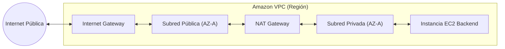
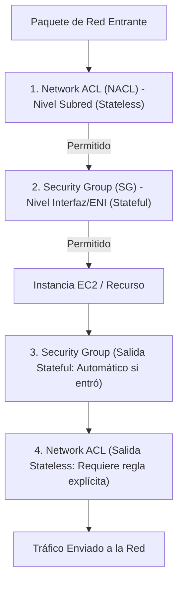
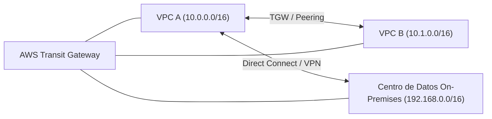
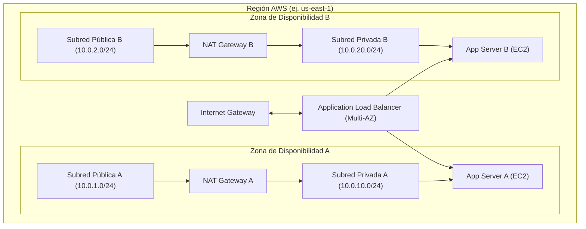

# Amazon Virtual Private Cloud (Amazon VPC)

**Amazon VPC** permite aprovisionar una sección lógicamente aislada de la nube de AWS donde los ingenieros pueden desplegar recursos informáticos en una red virtual definida por software (**SDN** - *Software-Defined Network*). Proporciona control total sobre el entorno de red virtual, incluida la selección de rangos de direcciones IP, creación de subredes, configuración de tablas de enrutamiento y pasarelas de red.

---

## 1. Direccionamiento y Subnetting en AWS

Una VPC abarca todas las Zonas de Disponibilidad (**AZ**) dentro de una Región de AWS específica. Al crear una VPC, se le asigna un bloque de enrutamiento entre dominios sin clases (**CIDR** - *Classless Inter-Domain Routing*).

- **Tamaño del bloque IPv4**: La máscara de subred permitida para una VPC está restringida entre `/16` (65,536 direcciones IP) y `/28` (16 direcciones IP).
- **Subredes**: Cada subred debe residir completamente dentro de una única Zona de Disponibilidad y no puede extenderse entre varias AZs.

### Las 5 Direcciones IP Reservadas por AWS en cada Subred

En cualquier bloque CIDR asignado a una subred IPv4 en AWS, **las primeras 4 direcciones IP y la última dirección IP están estrictamente reservadas** por la infraestructura y no pueden asignarse a ninguna interfaz de red elástica (ENI):

```
Ejemplo para una subred con bloque CIDR: 10.0.1.0/24 (Total 256 direcciones IP)
+---------------+-------------------------------------------------------------+
| Dirección IP  | Función Asignada en la Arquitectura de AWS                  |
+---------------+-------------------------------------------------------------+
| 10.0.1.0      | Dirección de Red (Network address).                         |
| 10.0.1.1      | Router virtual de la VPC (Gateway por defecto de la subred).|
| 10.0.1.2      | Servidor DNS de Amazon (VPC Router IP + 2 / Route 53).      |
| 10.0.1.3      | Reservada por AWS para uso futuro.                          |
| 10.0.1.255    | Dirección de difusión de red (Broadcast; no soportado en VPC)|
+---------------+-------------------------------------------------------------+
```

> [!warning] Cálculo de Direcciones IP Disponibles
> El número de direcciones IP utilizables para hosts en cualquier subred de AWS se rige por la fórmula:
> $$N_{\text{disponibles}} = 2^{(32 - \text{prefijo CIDR})} - 5$$
> Para una subred `/24`: $256 - 5 = 251$ IPs disponibles.  
> Para una subred `/28`: $16 - 5 = 11$ IPs disponibles.

---

## 2. Subredes Públicas vs. Subredes Privadas

El factor determinante que clasifica una subred como **pública** o **privada** no es una propiedad intrínseca de la subred, sino la configuración de su **Tabla de Enrutamiento (*Route Table*)**:

| Criterio | Subred Pública | Subred Privada |
| :--- | :--- | :--- |
| **Ruta por defecto (`0.0.0.0/0`)** | Apunta directamente a un **Internet Gateway (IGW)**. | Apunta a un **NAT Gateway**, una **NAT Instance** o carece de ruta a Internet. |
| **Asignación de IPs Públicas** | Las instancias pueden recibir IPs públicas IPv4 automáticas o Elastic IPs (EIP). | Las instancias solo tienen IPs privadas internas (`10.x.x.x`, `172.16-31.x.x`, `192.168.x.x`). |
| **Accesibilidad desde Internet** | Tráfico bidireccional directo (según reglas de SG y NACL). | Inaccesible directamente desde Internet público. |
| **Casos de uso típicos** | Balanceadores de carga externos (ALB/NLB), Bastion Hosts (Jumpboxes). | Bases de datos relacionales ([[ebs(network)|RDS/EC2]]), servidores de aplicaciones backend. |

---

## 3. Componentes Clave de Conectividad y Puertas de Enlace



### 3.1. Internet Gateway (IGW)
- Componente de software de red horizontalmente escalable, redundante y altamente disponible administrado por AWS.
- No introduce cuellos de botella de ancho de banda ni puntos únicos de falla (*no SPOF*).
- Realiza traducción de direcciones de red uno a uno (**1:1 NAT**) de manera estática entre las direcciones IP públicas asignadas y las IP privadas de las instancias.

### 3.2. NAT Gateway vs. NAT Instance
Para que las instancias alojadas en subredes privadas descarguen parches de software, actualizaciones del sistema operativo o invoquen APIs externas sin exponerse a conexiones entrantes no solicitadas, se utiliza un mecanismo de traducción de direcciones de red (NAT):

| Dimensión Técnica | AWS NAT Gateway (Administrado) | NAT Instance (EC2 Autogestionada) |
| :--- | :--- | :--- |
| **Alta Disponibilidad** | Altamente disponible de forma nativa dentro de su AZ (redundancia interna). | No redundante por defecto; requiere scripts personalizados de auto-recuperación y ASG. |
| **Ancho de Banda** | Escala automáticamente de 5 Gbps hasta 100 Gbps según la demanda. | Limitado por el ancho de banda de red asignado al tamaño de la instancia EC2. |
| **Mantenimiento y Parcheo** | Administrado totalmente por AWS (sin parcheo de SO por el cliente). | El cliente debe parchar el sistema operativo y gestionar iptables. |
| **Dirección IP** | Requiere una dirección Elastic IP (EIP) estática en su subred pública. | Requiere asociar una EIP y **deshabilitar la verificación de origen/destino** (*Source/Destination Check*). |
| **Costo** | Tarifa por hora de ejecución + tarifa por Gigabyte (GB) de datos procesados. | Costo regular de la instancia EC2 + cargos por transferencia de datos salientes. |

> [!tip] Arquitectura de Alta Disponibilidad para NAT Gateway
> El NAT Gateway es un servicio dependiente de la Zona de Disponibilidad. Para lograr una arquitectura de red tolerante a fallos en entornos de producción Multi-AZ, **debe desplegarse un NAT Gateway independiente en la subred pública de cada AZ**, enrutando las subredes privadas locales a su respectivo NAT Gateway.

### 3.3. Virtual Private Gateway (VGW) y Egress-Only Internet Gateway
- **Virtual Private Gateway (VGW)**: El concentrador virtual del lado de AWS que permite establecer túneles VPN IPsec y circuitos de AWS Direct Connect.
- **Egress-Only Internet Gateway (EIGW)**: Diseñado para IPv6. Dado que todas las direcciones IPv6 son públicamente enrutables, el EIGW permite a los recursos de la VPC iniciar comunicaciones salientes hacia Internet impidiendo que entidades externas inicien conexiones entrantes directas.

---

## 4. Tablas de Enrutamiento (*Route Tables*)

Una tabla de enrutamiento contiene un conjunto de reglas denominadas **rutas**, que determinan hacia dónde se dirige el tráfico de red procedente de una subred o puerta de enlace:

- Cada subred debe estar asociada obligatoriamente a una tabla de enrutamiento (asociación explícita o por defecto a la *Main Route Table*).
- **Ruta Local Inmutable**: Cada tabla de enrutamiento incluye automáticamente una ruta local que permite la comunicación entre todas las subredes de la misma VPC (por ejemplo: `10.0.0.0/16 -> local`). Esta ruta no puede eliminarse ni modificarse.
- **Regla de Coincidencia de Prefijo Más Largo (*Longest Prefix Match*)**: Si existen múltiples rutas que coinciden con una dirección de destino, el router de la VPC siempre selecciona la ruta más específica (la máscara de subred más larga).

---

## 5. Capas de Seguridad de Red: Security Groups vs. Network ACLs

AWS implementa un modelo de defensa en profundidad (*Defense in Depth*) combinando dos capas de filtrado perimetral:



### Tabla Comparativa Técnica: SG vs. NACL

| Propiedad | Security Groups (SG) | Network ACLs (NACL) |
| :--- | :--- | :--- |
| **Nivel de Operación** | Nivel de interfaz de red elástica (**ENI** / Instancia). | Nivel de límite de **Subred**. |
| **Manejo de Estado** | **Con Estado (*Stateful*)**: Si se permite el tráfico entrante, el tráfico de respuesta saliente se permite automáticamente sin importar las reglas de salida, y viceversa. | **Sin Estado (*Stateless*)**: Las solicitudes y las respuestas se evalúan de forma independiente. Si se permite tráfico entrante en el puerto 80, debe crearse una regla de salida para permitir el rango de **puertos efímeros** (1024-65535). |
| **Tipos de Reglas** | Solo reglas de **Permisión (*Allow*)**. No es posible definir reglas explícitas de denegación. Todo lo no permitido se deniega implícitamente. | Reglas de **Permisión (*Allow*) y Denegación (*Deny*)**. Permite bloquear direcciones IP o rangos CIDR específicos maliciosos. |
| **Orden de Evaluación** | Se evalúan **todas las reglas** antes de tomar una decisión de permitir el paquete. | Se procesan en **orden numérico estricto** (reglas numeradas de 1 a 32766). La primera coincidencia determina la acción (*First-Match*). Termina con regla `*` (*Deny All*). |
| **Modificación Dinámica** | Los cambios se aplican de forma inmediata a todas las instancias asociadas. | Los cambios se aplican de forma inmediata a todos los recursos dentro de la subred. |

---

## 6. Conectividad Híbrida y Redes Entre Nubes



### 6.1. VPC Peering
- Conexión de red directa punto a punto entre dos VPCs utilizando las direcciones IP privadas de AWS.
- Funciona entre diferentes cuentas de AWS y diferentes Regiones (*Inter-Region Peering*).
- **Limitaciones críticas de ingeniería**:
  - **No Transitividad**: Si la VPC A está emparejada con la VPC B, y la VPC B está emparejada con la VPC C, la VPC A **no puede comunicarse** con la VPC C a través de B. Deben crearse emparejamientos directos punto a punto ($N(N-1)/2$ conexiones para una malla completa).
  - **No Solapamiento de CIDRs**: Las VPCs no pueden tener bloques CIDR superpuestos.

### 6.2. AWS Transit Gateway (TGW)
- Actúa como un router virtual centralizado (*Hub-and-Spoke*) para interconectar miles de VPCs, cuentas de AWS y redes locales on-premises a través de una sola pasarela.
- **Soporta enrutamiento transitivo completo**, simplificando radicalmente las topologías de red complejas y eliminando la sobrecarga de gestión de mallas de VPC Peering.

### 6.3. AWS Site-to-Site VPN
- Establece conexiones seguras y cifradas mediante túneles **IPsec** sobre la Internet pública entre la red local y un Virtual Private Gateway (VGW) o Transit Gateway en AWS.
- Configura por defecto dos túneles redundantes activos para alta disponibilidad.
- Solución económica y de rápido despliegue, sujeta a la variabilidad de latencia de Internet.

### 6.4. AWS Direct Connect (DX)
- Enlace físico de telecomunicaciones dedicado y privado desde las instalaciones del cliente (o un centro de colocación DX) directamente a la red troncal de AWS.
- No transita por Internet pública. Proporciona ancho de banda consistente (opciones de 1 Gbps, 10 Gbps o 100 Gbps), menor latencia determinista y menores costos de transferencia de datos (*Data Egress*).

---

## 7. Diagrama de Arquitectura de Red Multi-AZ Completa



---

## Notas relacionadas
- [[Cloud computing]] - Fundamentos de infraestructura global y modelos de servicio.
- [[responsabilidad compartida]] - Configuración de red y seguridad perimetral a cargo del cliente.
- [[ebs(network)]] - Almacenamiento en bloque acoplado a instancias EC2 en subredes de VPC.
- [[EFS elastic file system]] - Montaje en red Multi-AZ dentro de subredes de VPC mediante Mount Targets.
- [[tipos de soporte aws]] - Soporte técnico para incidencias de red e interconexión.
- [[Acceso]] - Control de acceso y políticas IAM para la administración de VPC.
